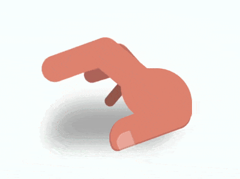

+++
title = '思考者的手'
date = 2018-09-11T17:47:43+08:00
image = '/test-hugo-deploy/img/thumbs/132.png'
summary = '#132'
+++



## 效果预览

点击链接可以在 Codepen 预览。

[https://codepen.io/comehope/pen/WgdVyx/](https://codepen.io/comehope/pen/WgdVyx/)

## 可交互视频

此视频是可以交互的，你可以随时暂停视频，编辑视频中的代码。

[https://scrimba.com/p/pEgDAM/c23zLuN](https://scrimba.com/p/pEgDAM/c23zLuN)

## 源代码下载

每日前端实战系列的全部源代码请从 github 下载：

[https://github.com/comehope/front-end-daily-challenges](https://github.com/comehope/front-end-daily-challenges)

## 代码解读

定义 dom，容器中的 5 个 `.finger` 元素代表 5 根手指，`.thumb` 元素代表大拇指，`.palm` 元素代表手掌：
```html
<div class="hand">
    <span class="finger thumb"></span>
    <span class="finger"></span>
    <span class="finger"></span>
    <span class="finger"></span>
    <span class="finger"></span>
    <span class="palm"></span>
</div>
```

居中显示：
```css
body {
    margin: 0;
    height: 100vh;
    display: flex;
    align-items: center;
    justify-content: center;
    background: radial-gradient(white, lightcyan);
}
```

定义容器尺寸，其中 `outline` 属性是辅助线：
```css
.hand {
    width: 16em;
    height: 8em;
    font-size: 10px;
    outline: 1px dashed black;
}
```

画出手掌：
```css
.hand {
    position: relative;
    color: darksalmon;
}

.palm {
    position: absolute;
    width: 8em;
    height: 6em;
    background-color: currentColor;
    border-radius: 1em 4em;
    right: 0;
}
```

画出大拇指的轮廓：
```css
.thumb {
    position: absolute;
    width: 9.6em;
    height: 3.2em;
    background-color: currentColor;
    border-radius: 3em 2em 2em 1em;
    right: 0;
    bottom: 1em;
    transform-origin: calc(100% - 2em) 2em;
    transform: rotate(-20deg);
    border-bottom: 0.2em solid rgba(0, 0, 0, 0.1);
    border-left: 0.2em solid rgba(0, 0, 0, 0.1);
}
```

画出大拇指上的指甲：
```css
.thumb::before {
    content: '';
    position: absolute;
    width: 1.9em;
    height: 1.9em;
    background-color: rgba(255, 255, 255, 0.3);
    border-radius: 60% 10% 10% 30%;
    bottom: -0.3em;
    left: 0.5em;
    border-right: 0.1em solid rgba(0, 0, 0, 0.1);
}
```

画出食指靠近手掌的后半部分：
```css
.finger:not(:first-child) {
    position: absolute;
    width: 6.4em;
    height: 3.5em;
    background-color: currentColor;
    right: 5.2em;
    bottom: 4em;
    transform-origin: 100% 2em;
    transform: rotate(10deg);
}
```

画出食指前端的前半部分：
```css
.finger:not(:first-child)::before {
    content: '';
    position: absolute;
    width: 9em;
    height: 3em;
    background-color: currentColor;
    right: 4.2em;
    top: 0.2em;
    border-radius: 2em;
    transform-origin: calc(100% - 2em) 2em;
    transform: rotate(-60deg);
}
```

为除大拇指以外其他 4 根手指设置下标变量，从食指到小指逐渐缩小并且颜色加深：
```css
.finger:not(:first-child) {
    --scale: calc(1 - (5 - var(--n)) * 0.2);
    transform: rotate(10deg) scale(var(--scale));
    filter: brightness(calc(100% - (5 - var(--n)) * 10%));
}

.finger:nth-child(2) { --n: 2; }
.finger:nth-child(3) { --n: 3; }
.finger:nth-child(4) { --n: 4; }
.finger:nth-child(5) { --n: 5; }
```

用伪元素画出手的阴影：
```css
.hand::before {
    content: '';
    position: absolute;
    width: 14em;
    height: 4.5em;
    background-color: black;
    border-radius: 4em 1em;
    top: 4em;
    filter: blur(1em) opacity(0.3);
}
```

增加手指敲击桌面的动画效果：
```css
.finger:not(:first-child) {
    animation: tap-upper 1.2s ease-in-out infinite;
    animation-delay: calc((var(--n) - 2) * 0.1s);
}

@keyframes tap-upper {
    0%, 50%, 100% {
        transform: rotate(10deg) scale(var(--scale));
    }

    40% {
        transform: rotate(50deg) scale(var(--scale));
    }
}
```

最后，不要忘记删掉辅助线。

大功告成！
