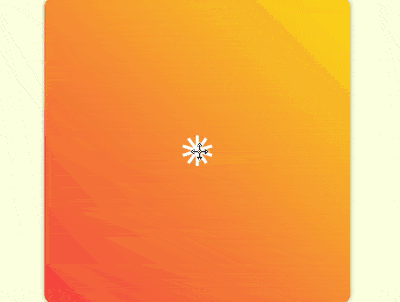

+++
title = 'GSAP 连续动画'
date = 2018-09-12T17:47:57+08:00
image = '/fe/img/thumbs/133.png'
summary = '#133'
+++



## 效果预览

点击链接可以在 Codepen 预览。

[https://codepen.io/comehope/pen/eLMKJG](https://codepen.io/comehope/pen/eLMKJG)

## 可交互视频

此视频是可以交互的，你可以随时暂停视频，编辑视频中的代码。

[https://scrimba.com/p/pEgDAM/cdDRmH9](https://scrimba.com/p/pEgDAM/cdDRmH9)

## 源代码下载

每日前端实战系列的全部源代码请从 github 下载：

[https://github.com/comehope/front-end-daily-challenges](https://github.com/comehope/front-end-daily-challenges)

## 代码解读

定义 dom，容器中包含 10 个 `div` 子元素，每个 `div` 中包含 1 个 `span` 元素：
```html
<figure class="container">
    <div><span></span></div>
    <div><span></span></div>
    <div><span></span></div>
    <div><span></span></div>
    <div><span></span></div>
    <div><span></span></div>
    <div><span></span></div>
    <div><span></span></div>
    <div><span></span></div>
    <div><span></span></div>
</figure>
```

居中显示：
```css
body {
    margin: 0;
    height: 100vh;
    display: flex;
    align-items: center;
    justify-content: center;
    background-color: lightyellow;
}
```

定义容器的尺寸和样式：
```css
.container {
    width: 400px;
    height: 400px;
    background: linear-gradient(45deg, tomato, gold);
    border-radius: 3%;
    box-shadow: 0 0 10px rgba(0, 0, 0, 0.3);
}
```

画出容器里的 1 个元素，它有一个外壳 `div`，里面是一个白色的小方块 `span`：
```css
.container {
    position: relative;
}

.container div {
    position: absolute;
    width: inherit;
    height: inherit;
    display: flex;
    align-items: center;
    justify-content: center;
}

.container div span {
    position: absolute;
    width: 40px;
    height: 40px;
    background-color: white;
}
```

为容器中的元素定义下标变量，并让元素的外壳依次旋转，围合成一个圆形，其中 `outline` 是辅助线：
```css
.container div {
    outline: 1px dashed black;
    transform: rotate(calc((var(--n) - 1) * 36deg));
}

.container div:nth-child(1) { --n: 1; }
.container div:nth-child(2) { --n: 2; }
.container div:nth-child(3) { --n: 3; }
.container div:nth-child(4) { --n: 4; }
.container div:nth-child(5) { --n: 5; }
.container div:nth-child(6) { --n: 6; }
.container div:nth-child(7) { --n: 7; }
.container div:nth-child(8) { --n: 8; }
.container div:nth-child(9) { --n: 9; }
.container div:nth-child(10) { --n: 10; }
```

至此，子元素绘制完成，接下来开始写动画脚本。
引入 GSAP 库：
```html
<script src="https://cdnjs.cloudflare.com/ajax/libs/gsap/2.0.2/TweenMax.min.js"></script>
```

定义一个变量，代表子元素选择器：
```javascript
let elements = '.container div span';
```

声明一个时间线对象：
```javascript
let animation = new TimelineMax();
```

先设定入场方式为由小（第1帧）变大（第2帧），其中并没有第 2 帧的代码，它是隐含在语义中的：
```javascript
animation.from(elements, 1, {scale: 0});
```

让子元素变成竖长条，向四周散开（第3帧）：
```javascript
animation.from(elements, 1, {scale: 0})
    .to(elements, 1, {y: '-100px', scaleX: 0.25});
```

让竖长条旋转着变成小方块（第4帧）：
```javascript
animation.from(elements, 1, {scale: 0})
    .to(elements, 1, {y: '-100px', scaleX: 0.25})
    .to(elements, 1, {scaleY: 0.25, rotation: 180});
```

让小方块变成横长条，围成一个圆形（第5帧）：
```javascript
animation.from(elements, 1, {scale: 0})
    .to(elements, 1, {y: '-100px', scaleX: 0.25})
    .to(elements, 1, {scaleY: 0.25, rotation: 180})
    .to(elements, 1, {scaleX: 1});
```

注意，因 scrimba 在录制过多帧时会崩溃，所以第 6 帧至第 11 帧没有在视频中体现。
让圆形向内收敛，同时线条变细（第6帧）：
```javascript
animation.from(elements, 1, {scale: 0})
    .to(elements, 1, {y: '-100px', scaleX: 0.25})
    .to(elements, 1, {scaleY: 0.25, rotation: 180})
    .to(elements, 1, {scaleX: 1})
    .to(elements, 1, {y: '-60px', scaleY: 0.1});
```

让线条向左摆动（第7帧）：
```javascript
animation.from(elements, 1, {scale: 0})
    .to(elements, 1, {y: '-100px', scaleX: 0.25})
    .to(elements, 1, {scaleY: 0.25, rotation: 180})
    .to(elements, 1, {scaleX: 1})
    .to(elements, 1, {y: '-60px', scaleY: 0.1})
    .to(elements, 1, {x: '-30px'});
```

再让线条向右摆动（第8帧）：
```javascript
animation.from(elements, 1, {scale: 0})
    .to(elements, 1, {y: '-100px', scaleX: 0.25})
    .to(elements, 1, {scaleY: 0.25, rotation: 180})
    .to(elements, 1, {scaleX: 1})
    .to(elements, 1, {y: '-60px', scaleY: 0.1})
    .to(elements, 1, {x: '-30px'})
    .to(elements, 1, {x: '30px'});
```

再把横线变为竖线，造型与第 3 帧相似，只是线更细，更向内收敛（第9帧）：
```javascript
animation.from(elements, 1, {scale: 0})
    .to(elements, 1, {y: '-100px', scaleX: 0.25})
    .to(elements, 1, {scaleY: 0.25, rotation: 180})
    .to(elements, 1, {scaleX: 1})
    .to(elements, 1, {y: '-60px', scaleY: 0.1})
    .to(elements, 1, {x: '-30px'})
    .to(elements, 1, {x: '30px'})
    .to(elements, 1, {x: '0', scaleX: 0.1, scaleY: 1});
```

再把竖线变为横线，造型与第 5 帧相似，但线短一些（第10帧）：
```javascript
animation.from(elements, 1, {scale: 0})
    .to(elements, 1, {y: '-100px', scaleX: 0.25})
    .to(elements, 1, {scaleY: 0.25, rotation: 180})
    .to(elements, 1, {scaleX: 1})
    .to(elements, 1, {y: '-60px', scaleY: 0.1})
    .to(elements, 1, {x: '-30px'})
    .to(elements, 1, {x: '30px'})
    .to(elements, 1, {x: '0', scaleX: 0.1, scaleY: 1})
    .to(elements, 1, {scaleX: 0.5, scaleY: 0.1})
```

横线稍向外扩散，变为圆点（第11帧）：
```javascript
animation.from(elements, 1, {scale: 0})
    .to(elements, 1, {y: '-100px', scaleX: 0.25})
    .to(elements, 1, {scaleY: 0.25, rotation: 180})
    .to(elements, 1, {scaleX: 1})
    .to(elements, 1, {y: '-60px', scaleY: 0.1})
    .to(elements, 1, {x: '-30px'})
    .to(elements, 1, {x: '30px'})
    .to(elements, 1, {x: '0', scaleX: 0.1, scaleY: 1})
    .to(elements, 1, {scaleX: 0.5, scaleY: 0.1})
    .to(elements, 1, {y: '-80px', scaleY: 0.5, borderRadius: '50%'});
```

让圆点变形为竖线，并向内收缩，这个变化的距离长，所以动画时间也要长一些（第12帧）：
```javascript
animation.from(elements, 1, {scale: 0})
    .to(elements, 1, {y: '-100px', scaleX: 0.25})
    .to(elements, 1, {scaleY: 0.25, rotation: 180})
    .to(elements, 1, {scaleX: 1})
    .to(elements, 1, {y: '-60px', scaleY: 0.1})
    .to(elements, 1, {x: '-30px'})
    .to(elements, 1, {x: '30px'})
    .to(elements, 1, {x: '0', scaleX: 0.1, scaleY: 1})
    .to(elements, 1, {scaleX: 0.5, scaleY: 0.1})
    .to(elements, 1, {y: '-80px', scaleY: 0.5, borderRadius: '50%'})
    .to(elements, 1, {y: '-10px', scaleX: 0.1, scaleY: 0.5, borderRadius: '0%', rotation: 0});
```

让竖线从中心向外快速扩散，扩散前稍停片刻，好像线条都被发射出一样（第13帧）：
```javascript
animation.from(elements, 1, {scale: 0})
    .to(elements, 1, {y: '-100px', scaleX: 0.25})
    .to(elements, 1, {scaleY: 0.25, rotation: 180})
    .to(elements, 1, {scaleX: 1})
    .to(elements, 1, {y: '-60px', scaleY: 0.1})
    .to(elements, 1, {x: '-30px'})
    .to(elements, 1, {x: '30px'})
    .to(elements, 1, {x: '0', scaleX: 0.1, scaleY: 1})
    .to(elements, 1, {scaleX: 0.5, scaleY: 0.1})
    .to(elements, 1, {y: '-80px', scaleY: 0.5, borderRadius: '50%'})
    .to(elements, 1, {y: '-10px', scaleX: 0.1, scaleY: 0.5, borderRadius: '0%', rotation: 0})
    .to(elements, 1, {y: '-300px', delay: 0.5});
```

用时间尺度缩放函数让动画播放速度加快一倍：
```javascript
animation.from(elements, 1, {scale: 0})
    .to(elements, 1, {y: '-100px', scaleX: 0.25})
    .to(elements, 1, {scaleY: 0.25, rotation: 180})
    .to(elements, 1, {scaleX: 1})
    .to(elements, 1, {y: '-60px', scaleY: 0.1})
    .to(elements, 1, {x: '-30px'})
    .to(elements, 1, {x: '30px'})
    .to(elements, 1, {x: '0', scaleX: 0.1, scaleY: 1})
    .to(elements, 1, {scaleX: 0.5, scaleY: 0.1})
    .to(elements, 1, {y: '-80px', scaleY: 0.5, borderRadius: '50%'})
    .to(elements, 1, {y: '-10px', scaleX: 0.1, scaleY: 0.5, borderRadius: '0%', rotation: 0})
    .to(elements, 1, {y: '-300px', delay: 0.5})
    .timeScale(2);
```

修改声明时间线的代码，使动画重复播放：
```javascript
let animation = new TimelineMax({repeat: -1, repeatDelay: 1});
```

至此，动画完成。
隐藏容器外的内容，并删掉辅助线；
```css
.container {
    overflow: hidden;
}

.container div {
    /* outline: 1px dashed black; */
}
```

最后，装饰一下页面的角落：
```css
body {
    overflow: hidden;
}

body::before,
body::after {
    content: '';
    position: absolute;
    width: 60vmin;
    height: 60vmin;
    border-radius: 50%;
    background: radial-gradient(
        transparent 25%,
        gold 25%, gold 50%,
        tomato 50%
    );
}

body::before {
    left: -30vmin;
    bottom: -30vmin;
}

body::after {
    right: -30vmin;
    top: -30vmin;
}
```

大功告成！
