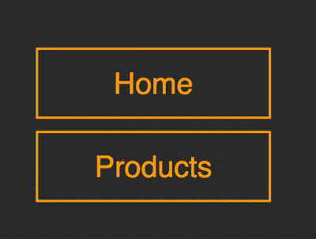

+++
title = '按钮右移悬停特效'
date = 2018-09-13T17:48:29+08:00
image = '/fe/img/thumbs/135.png'
summary = '#135'
+++



## 效果预览

点击链接可以在 Codepen 预览。

[https://codepen.io/comehope/pen/PdaNXw](https://codepen.io/comehope/pen/PdaNXw)

## 可交互视频

此视频是可以交互的，你可以随时暂停视频，编辑视频中的代码。

[https://scrimba.com/p/pEgDAM/c3MV9Sa](https://scrimba.com/p/pEgDAM/c3MV9Sa)

## 源代码下载

每日前端实战系列的全部源代码请从 github 下载：

[https://github.com/comehope/front-end-daily-challenges](https://github.com/comehope/front-end-daily-challenges)

## 代码解读

定义 dom，导航中包含一个无序列表，列表项中内嵌一个 `span`，文字写在 `span` 中：
```html
<nav>
    <ul>
        <li><span>home</span></li>
    </ul>
</nav>
```

居中显示：
```css
body {
    margin: 0;
    height: 100vh;
    display: flex;
    align-items: center;
    justify-content: center;
    background-color: #333;
}
```

隐藏列表项前端的引导符号：
```css
nav ul {
    padding: 0;
    list-style-type: none;
}
```

设置按钮的尺寸和颜色：
```css
nav li {
    width: 8em;
    height: 2em;
    font-size: 25px;
    color: orange;
}
```

设置文字样式，注意高度是 `120%`，`span` 比它父级的 `li` 要高一些：
```css
nav li span {
    position: relative;
    box-sizing: border-box;
    width: inherit;
    height: 120%;
    top: -10%;
    background-color: #333;
    border: 2px solid;
    font-family: sans-serif;
    text-transform: capitalize;
    display: flex;
    align-items: center;
    justify-content: center;
}
```

将 `span` 元素稍向右移：
```css
nav li span {
    transform: translateX(4px);
}
```

用列表项 `li` 的左边框画出 1 条竖线：
```css
nav li {
    box-sizing: border-box;
    border-left: 2px solid;
}
```

用列表项的伪元素再画出 2 条竖线，它们的高度依次降低，至此，按钮左侧一共有 3 条竖线：
```css
nav li {
    position: relative;
}

nav li::before,
nav li::after
 {
    content: '';
    position: absolute;
    width: inherit;
    border-left: 2px solid;
    z-index: -1;
}

nav li::before {
    height: 80%;
    top: 10%;
    left: -8px;
}

nav li::after {
    height: 60%;
    top: 20%;
    left: -14px;
}
```

将伪元素的 2 条竖线的颜色逐渐变暗，增加一点层次感：
```css
nav li::before {
    filter: brightness(0.8);
}

nav li::after {
    filter: brightness(0.6);
}
```

增加鼠标悬停效果，默认状态是按钮遮住 3 条竖线，当鼠标悬停时，按钮右移，露出 3 条竖线：
```css
nav li:hover span {
    transform: translateX(4px);
}

nav li span {
    /* transform: translateX(4px); */
    transform: translateX(-16px);
    transition: 0.3s;
}
```

因为按钮默认状态的位置是偏左的，为了抵销这个偏移量，让列表项稍向右移：
```css
nav ul {
    transform: translateX(16px);
}
```

在 dom 中再增加几个按钮：
```html
<nav>
    <ul>
        <li><span>home</span></li>
        <li><span>products</span></li>
        <li><span>services</span></li>
        <li><span>contact</span></li>
    </ul>
</nav>
```

设置一下按钮的间距：
```css
nav li {
    margin-top: 0.8em;
}
```

大功告成！
