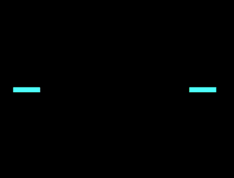

+++
title = '彩色横线 loader'
date = 2018-09-15T17:48:52+08:00
image = '/fe/img/thumbs/136.png'
summary = '#136'
+++



## 效果预览

点击链接可以在 Codepen 预览。

[https://codepen.io/comehope/pen/pOZKWJ](https://codepen.io/comehope/pen/pOZKWJ)

## 可交互视频

此视频是可以交互的，你可以随时暂停视频，编辑视频中的代码。

[https://scrimba.com/p/pEgDAM/cVB48Ur](https://scrimba.com/p/pEgDAM/cVB48Ur)

## 源代码下载

每日前端实战系列的全部源代码请从 github 下载：

[https://github.com/comehope/front-end-daily-challenges](https://github.com/comehope/front-end-daily-challenges)

## 代码解读

定义 dom，容器中包含 1 个 `span` 元素：
```html
<div class="loader">
    <span></span>
</div>
```

居中显示：
```css
body {
    margin: 0;
    height: 100vh;
    display: flex;
    align-items: center;
    justify-content: center;
    background-color: black;
}
```

定义容器尺寸：
```css
.loader {
    width: 40em;
    height: 1em;
    font-size: 10px;
}
```

设置容器中 `span` 的样式，是一个彩色细长条：
```css
.loader {
    position: relative;
}

.loader span {
    position: absolute;
    width: inherit;
    height: inherit;
    background-color: hsl(24, 100%, 65%);
}
```

引入 d3.js：
```html
<script src="https://d3js.org/d3.v5.min.js"></script>
```

删除掉 dom 中的 `span` 元素，改用 d3 创建，其中常量 `COUNT` 是细长条的数量，因为 `d3.range()` 生成的数据是从 0 开始的数列，所以把数据修正为以日常习惯的从 1 开始的数列：
```javascript
const COUNT = 1;

d3.select('.loader')
    .selectAll('span')
    .data(d3.range(COUNT).map(d => d + 1))
    .enter()
    .append('span')
```

删除掉 css 中设置 `span` 元素 `background-color` 属性的代码，改用 d3 设置：
```javascript
d3.select('.loader')
    .selectAll('span')
    .data(d3.range(COUNT).map(d => d + 1))
    .enter()
    .append('span')
    .style('background-color', `hsl(24, 100%, 65%)`)
```

把细长条的数量改为 2 个，颜色改为动态生成：
```javascript
const HUE_DEG = 12;
const COUNT = 2;

d3.select('.loader')
    /* ...略 */
    .style('background-color', (d) => `hsl(${d * HUE_DEG}, 100%, 65%)`)
```

再进一步，把颜色改为彩色条和黑色条间隔出现，请注意虽然在表达式中 hue 的值是按 12 递增，但实际看到的的效果是彩色长条间的 hue 相差 24，因为其中夹杂着黑色长条：
```javascript
d3.select('.loader')
    /* ...略 */
    .style('background-color', (d) => d % 2 !== 0
        ? `hsl(${d * HUE_DEG}, 100%, 65%)`
        : 'black');
```

此时，动态生成的 dom 结构为：
```html
<div class="container">
    <span style="background-color: rgb(255, 77, 77);"></span>
    <span style="background-color: black;">
</div>
```

引入 gsap 库：
```html
<script src="https://cdnjs.cloudflare.com/ajax/libs/gsap/2.0.2/TweenMax.min.js"></script>
```

增加长条由中心向两侧伸展的动画效果：
```javascript
let animation = new TimelineMax({repeat: -1});
animation.staggerFrom('.loader span', 0.5, {scaleX: 0}, 0.4)
```

最后，把长条的数量改为 30 个，它是用整圈色相环的 360 度除以 hue 间隔得到的：
```javascript
const COUNT = 360 / HUE_DEG;
```

大功告成！
