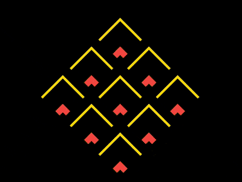

+++
title = '抽象水波'
date = 2018-09-17T17:49:09+08:00
image = '/test-hugo-deploy/img/thumbs/137.png'
summary = '#137'
+++



## 效果预览

点击链接可以在 Codepen 预览。

[https://codepen.io/comehope/pen/MqqqwG](https://codepen.io/comehope/pen/MqqqwG)

## 可交互视频

此视频是可以交互的，你可以随时暂停视频，编辑视频中的代码。

[https://scrimba.com/p/pEgDAM/cJBwwHn](https://scrimba.com/p/pEgDAM/cJBwwHn)

## 源代码下载

每日前端实战系列的全部源代码请从 github 下载：

[https://github.com/comehope/front-end-daily-challenges](https://github.com/comehope/front-end-daily-challenges)

## 代码解读

定义 dom，容器中包含 9 个元素：
```html
<div class="container">
    <span></span>
    <span></span>
    <span></span>
    <span></span>
    <span></span>
    <span></span>
    <span></span>
    <span></span>
    <span></span>
</div>
```

居中显示：
```css
body {
    margin: 0;
    height: 100vh;
    display: flex;
    align-items: center;
    justify-content: center;
    background-color: black;
}
```

定义容器尺寸：
```css
.container {
    width: 30em;
    height: 30em;
    font-size: 10px;
}
```

用 grid 布局把 9 个子元素排列成 3 * 3 的网格状：
```css
.container {
    display: grid;
    grid-template-columns: repeat(3, 1fr);
}
```

设置容器内子元素的样式，是通过伪元素来设置的：
```css
.container span {
    position: relative;
}

.container span::before,
.container span::after 
{
    content: '';
    position: absolute;
    box-sizing: border-box;
    border-style: none solid solid none;
    border-width: 1em;
    border-color: gold;
    width: 100%;
    height: 100%;
}
```

旋转容器，让它的尖端朝上：
```css
.container {
    transform: rotate(-135deg);
}
```

增加子元素尺寸由小到大变化的动画：
```css
.container span::before,
.container span::after 
{
    animation: 
        animate-scale 1.6s linear infinite;
}

@keyframes animate-scale {
    from {
        width: 1%;
        height: 1%;
    }

    to {
        width: 100%;
        height: 100%;
    }
}
```

增加子元素边框色变化的动画：
```css
.container span::before,
.container span::after 
{
    animation: 
        animate-border-color 1.6s linear infinite,
        animate-scale 1.6s linear infinite;
}

@keyframes animate-border-color {
    0%, 25% {
        border-color: tomato;
    }

    50%, 75% {
        border-color: gold;
    }

    100% {
        border-color: black;
    }
}
```

增加子元素边框宽度变化的动画：
```css
.container span::before,
.container span::after 
{
    animation: 
        animate-border-width 1.6s linear infinite,
        animate-border-color 1.6s linear infinite,
        animate-scale 1.6s linear infinite;
}
```

最后，让 `::after` 伪元素的动画时间慢半拍：
```css
.container span::after {
    animation-delay: -0.8s;
}

@keyframes animate-border-width {
    0%, 100%{
        border-width: 0.1em;
    }

    25% {
        border-width: 1.5em;
    }
}
```

大功告成！
