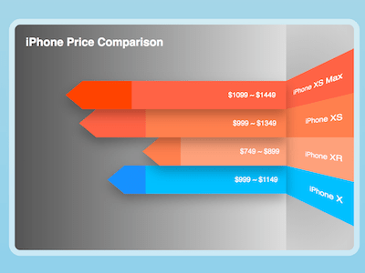

+++
title = 'iPhone 价格信息图'
date = 2018-09-19T17:49:23+08:00
image = '/test-hugo-deploy/img/thumbs/138.png'
summary = '#138'
+++



## 效果预览

点击链接可以在 Codepen 预览。

[https://codepen.io/comehope/pen/OorLGZ](https://codepen.io/comehope/pen/OorLGZ)

## 可交互视频

此视频是可以交互的，你可以随时暂停视频，编辑视频中的代码。

[https://scrimba.com/p/pEgDAM/cRB22cV](https://scrimba.com/p/pEgDAM/cRB22cV)

## 源代码下载

每日前端实战系列的全部源代码请从 github 下载：

[https://github.com/comehope/front-end-daily-challenges](https://github.com/comehope/front-end-daily-challenges)

## 代码解读

定义 dom，容器中包含 3 个元素，`h1` 是图表标题，`back` 表示背景墙，`side` 表示侧边墙，`back` 和 `side` 中都包含一个无序列表，背景墙展示价格，侧边墙展示名称：
```html
<div class="wall">
    <h1>iPhone Price Comparison</h1>
    <div class="back">
        <ul>
            <li class="xs-max"><span>$1099 ~ $1449</span></li>
            <li class="xs"><span>$999 ~ $1349</span></li>
            <li class="xr"><span>$749 ~ $899</span></li>
            <li class="x"><span>$999 ~ $1149</span></li>
        </ul>
    </div>
    <div class="side">
        <ul>
            <li class="xs-max">iPhone XS Max</li>
            <li class="xs">iPhone XS</li>
            <li class="xr">iPhone XR</li>
            <li class="x">iPhone X</li>
        </ul>
    </div>
</div>
```

居中显示：
```css
body {
    margin: 0;
    height: 100vh;
    display: flex;
    align-items: center;
    justify-content: center;
    background: linear-gradient(lightblue, skyblue);
}
```

定义容器尺寸：
```css
.wall {
    width: 60em;
    height: 40em;
    border: 1em solid rgba(255, 255, 255, 0.5);
    border-radius: 2em;
    font-size: 10px;
}
```

用 grid 布局，把容器分成 2 部分，左侧80%为背景墙，右侧20%为侧边墙：
```css
.wall {
    display: grid;
    grid-template-columns: 0 4fr 1fr;
}
```

分别设置背景墙和侧边墙的背景色：
```css
.back {
    background: linear-gradient(
        to right,
        #555,
        #ddd
    );
}

.side {
    background: 
        radial-gradient(
            at 0% 50%,
            /* tomato 25%,
            yellow 90% */
            rgba(0, 0, 0, 0.2) 25%,
            rgba(0, 0, 0, 0) 90%
        ),
        linear-gradient(
            to right,
            #ddd,
            #ccc
        )
}
```

用 flex 布局设置对齐方式，列表垂直居中，列表项向背景墙与侧边墙的交界处对齐：
```css
.back,
.side {
    display: flex;
    align-items: center;
}

.back {
    justify-content: flex-end;
}

ul {
    list-style-type: none;
    padding: 0;
}
```

设置标题样式：
```css
h1 {
    position: relative;
    width: 20em;
    margin: 1em;
    color: white;
    font-family: sans-serif;
}
```

设置列表项的高度和颜色：
```css
.back ul {
    width: 75%;
}

.side ul {
    width: 100%;
}

ul li {
    height: 5em;
    background-color: var(--c);
    width: 100%;
}

ul li:nth-child(1) {
    --c: tomato;
}

ul li:nth-child(2) {
    --c: coral;
}

ul li:nth-child(3) {
    --c: lightsalmon;
}

ul li:nth-child(4) {
    --c: deepskyblue;
}
```

至此，整体布局完成。接下来设置左侧背景墙的横条样式。
横条的宽度根据与商品的上限售价 `--high-price` 成正比，以最贵的售价 `--max-price` 作为全长，其他横条的宽度为上限售价与最高售价的百分比：
```css
ul {
    display: flex;
    flex-direction: column;
}

.back ul {
    align-items: flex-end;
}

ul {
    --max-price: 1449;
}

ul li.xs-max {
    --high-price: 1449;
}

ul li.xs {
    --high-price: 1349;
}

ul li.xr {
    --high-price: 899;
}

ul li.x {
    --high-price: 1149;
}

.back ul li {
    width: calc(var(--high-price) / var(--max-price) * 100%);
}
```

在横条中区分起售价 `--low-price` 的位置，比起售价高的区域填充更深的颜色：
```css
ul li.xs-max {
    --low-price: 1099;
    --c2: orangered;
}

ul li.xs {
    --low-price: 999;
    --c2: tomato;
}

ul li.xr {
    --low-price: 749;
    --c2: coral;
}

ul li.x {
    --low-price: 999;
    --c2: dodgerblue;
}

.back ul li {
    --percent: calc(var(--low-price) / var(--high-price) * 100%);
    background: linear-gradient(
        to left,
        var(--c) var(--percent),
        var(--c2) var(--percent)
    );
}
```

在横线的顶端画出一个向左的三角形：
```css
.back ul li {
    position: relative;
}

.back ul li::before {
    content: '';
    position: absolute;
    width: 0;
    height: 0;
    transform: translateX(-3em);
    border-right: 3em solid var(--c2);
    border-top: 2.5em solid transparent;
    border-bottom: 2.5em solid transparent;
}
```

设置价格文字样式：
```css
.back ul li span {
    position: absolute;
    width: 95%;
    text-align: right;
    color: white;
    font-size: 1.25em;
    line-height: 4em;
    font-family: sans-serif;
}
```

为各横条增加阴影，增强立体感：
```css
ul li.xs-max {
    z-index: 5;
}

ul li.xs {
    z-index: 4;
}

ul li.xr {
    z-index: 3;
}

ul li.x {
    z-index: 2;
}

.back ul li {
    filter: drop-shadow(0 1em 1em rgba(0, 0, 0, 0.3));
}
```

至此，背景墙的横条完成。接下来设置侧边墙的样式。
为了制造立体效果，需要设置侧边墙的景深，并使列表倾斜：
```css
.side {
    perspective: 1000px;
}

.side ul {
    transform-origin: left;
    transform: rotateY(-75deg) scaleX(3);
}
```

设置侧边墙的文字样式：
```css
.wall {
    overflow: hidden;
}

.side ul li {
    padding-right: 30%;
    text-align: right;
    color: white;
    font-family: sans-serif;
    line-height: 5em;
}
```

至此，静态视觉效果完成。接下来增加入场动画效果：
```css
ul li {
    animation: show 1s linear forwards;
    transform-origin: right;
    transform: scaleX(0);
}

@keyframes show {
    to {
        transform: scaleX(1);
    }
}

.back ul li {
    animation-delay: 1s;
}
```

大功告成！
