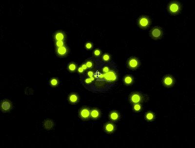

+++
title = '光斑粒子'
date = 2018-09-20T17:49:43+08:00
image = '/fe/img/thumbs/139.png'
summary = '#139'
+++



## 效果预览

点击链接可以在 Codepen 预览。

[https://codepen.io/comehope/pen/zJybdq](https://codepen.io/comehope/pen/zJybdq)

## 可交互视频

此视频是可以交互的，你可以随时暂停视频，编辑视频中的代码。

[https://scrimba.com/p/pEgDAM/cGV7phy](https://scrimba.com/p/pEgDAM/cGV7phy)

## 源代码下载

每日前端实战系列的全部源代码请从 github 下载：

[https://github.com/comehope/front-end-daily-challenges](https://github.com/comehope/front-end-daily-challenges)

# 代码解读

定义 dom，容器中包含 3 个子元素：
```html
<div class='container'>
    <span></span>
    <span></span>
    <span></span>
</div>
```

设置页面背景：
```css
body {
    margin: 0;
    width: 100vw;
    height: 100vh;
    background: radial-gradient(circle at center, #222, black 20%);
}
```

定义容器尺寸：
```css
.container {
    width: 100%;
    height: 100%;
}
```

设置光斑的样式，其中定义了偏亮和偏暗的 2 个颜色变量：
```css
.container {
    position: relative;
}

.container span {
    --bright-color: #d4ff00;
    --dark-color: #e1ff4d;
    position: absolute;
    width: 30px;
    height: 30px;
    margin-left: -15px;
    margin-top: -15px;
    background: radial-gradient(var(--bright-color), var(--dark-color));
    border-radius: 50%;
    box-shadow: 0 0 25px 3px var(--dark-color);
}
```

把光斑定位到页面中心：
```css
.container span {
    transform: translateX(50vw) translateY(50vh);
}
```

增加光斑从中心向四周扩散和收缩的动画效果：
```css
.container span {
    animation: animate 1.5s infinite alternate;
    animation-delay: calc(var(--n) * 0.015s);
}

@keyframes animate {
    80% {
        filter: opacity(1);
    }

    100% {
        transform: translateX(calc(var(--x) * 1vw)) translateY(calc(var(--y) * 1vh));
        filter: opacity(0);
    }
}
```

定义动画中用到的变量 `--x`、`--y` 和 `--n`：
```css
.container span:nth-child(1) {
    --x: 20;
    --y: 30;
    --n: 1;
    
}

.container span:nth-child(2) {
    --x: 60;
    --y: 80;
    --n: 2;
}

.container span:nth-child(3) {
    --x: 10;
    --y: 90;
    --n: 3;
}
```

设置容器的景深，使光斑的运动有从远到近的感觉：
```css
.container {
    perspective: 500px;
}

.container span {
    transform: translateX(50vw) translateY(50vh) translateZ(-1000px);
}
```

至此，少量元素的动画效果完成，接下来用 d3 批量创建 dom 元素和 css 变量。
引入 d3 库，同时删除 html 文件中的子元素和 css 文件中的子元素变量：
```html
<script src="https://d3js.org/d3.v5.min.js"></script>
```

定义光斑粒子数量：
```javascript
const COUNT = 3;
```

批量创建 dom 元素：
```javascript
d3.select('.container')
    .selectAll('span')
    .data(d3.range(COUNT))
    .enter()
    .append('span');
```

为 dom 元素设置 `--x`、`--y` 和 `--n` 的值，其中 `--x` 和 `--y` 是 1 到 99 的随机数：
```javascript
d3.select('.container')
    /* 略 */
    .style('--x', () => d3.randomUniform(1, 99)())
    .style('--y', () => d3.randomUniform(1, 99)())
    .style('--n', d => d);
```

再为 dom 元素设置 `--bright-color` 和 `--dark-color` 的值：
```javascript
d3.select('.container')
    /* 略 */
    .style('--dark-color', (d) => d3.color(`hsl(${70 + d * 0.1}, 100%, 50%)`))
    .style('--bright-color', (d) => d3.color(`hsl(${70 + d * 0.1}, 100%, 50%)`).brighter(0.15));
```

最后，把光斑粒子数量设置为 200 个：
```css
const COUNT = 200;
```

大功告成！
