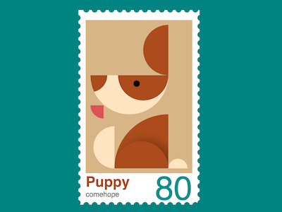

+++
title = '小狗邮票'
date = 2018-09-25T17:50:20+08:00
image = '/fe/img/thumbs/141.png'
summary = '#141'
+++



## 效果预览

点击链接可以在 Codepen 预览。

[https://codepen.io/comehope/pen/BOeEYV](https://codepen.io/comehope/pen/BOeEYV)

## 可交互视频

此视频是可以交互的，你可以随时暂停视频，编辑视频中的代码。

[https://scrimba.com/p/pEgDAM/cPQ3vcq](https://scrimba.com/p/pEgDAM/cPQ3vcq)

## 源代码下载

每日前端实战系列的全部源代码请从 github 下载：

[https://github.com/comehope/front-end-daily-challenges](https://github.com/comehope/front-end-daily-challenges)

## 代码解读

定义 dom，容器表示邮票：
```html
<div class="stamp">
</div>
```

居中显示：
```css
body {
    margin: 0;
    height: 100vh;
    display: flex;
    align-items: center;
    justify-content: center;
    background-color: teal;
}
```

设置容器尺寸：
```css
.stamp {
    position: relative;
    width: 40.5em;
    height: 71em;
    font-size: 6px;
    padding: 5em;
    background-color: white;
}
```

用重复背景绘制出邮票的齿孔：
```css
.stamp {
    display: flex;
    flex-direction: column;
    align-items: center;
    justify-content: center;
}

.stamp::after,
.stamp::before {
    content: '';
    width: 100%;
    height: 100%;
    position: absolute;
    background: radial-gradient(circle, teal 50%, transparent 50%),
    radial-gradient(circle, teal 50%, transparent 50%);
    background-size: 3.5em 3.5em;
}

.stamp::before {
    top: 1.5em;
    background-repeat: repeat-y;
    background-position: -4.5% 0, 104.5% 0;
}

.stamp::after {
    left: 1.5em;
    background-repeat: repeat-x;
    background-position: 0 -2.5%, 0 102.5%;
}
```

在 html 文件中增加小狗的 dom 元素，子元素分别表示耳朵、头部、眼睛、舌头、身体、尾巴和爪子：
```html
<div class="stamp">
    <div class="puppy">
        <span class="ear"></span>
        <span class="head"></span>
        <span class="eyes"></span>
        <span class="tongue"></span>
        <span class="body"></span>
        <span class="tail"></span>
        <span class="foot"></span>
    </div>
</div>
```

设置 grid 布局的行列尺寸：
```css
.puppy {
    display: grid;
    grid-template-columns: 10em 22.5em 8em;
    grid-template-rows: 21em 12.5em 3.75em 22.5em;
    background-color: tan;
    padding: 2em;
    margin-top: -1em;
}
```

画出小狗的头部，跨第1列和第2列、第2行和第3行，是一个半圆形：
```css
.head {
    grid-column: 1 / 3;
    grid-row: 2 / 4;
    border-bottom-left-radius: calc(12.5em + 3.75em);
    border-bottom-right-radius: calc(12.5em + 3.75em);
    background-color: bisque;
}
```

用伪元素画出鼻子，是一个扇形，多余的部分被隐藏了：
```css
.head {
    position: relative;
    overflow: hidden;
}

.head::before {
    content: '';
    position: absolute;
    width: 7em;
    height: 7em;
    border-bottom-right-radius: 100%;
    background-color: sienna;
}
```

画出半圆形的眼晕：
```css
.eyes {
    grid-column: 2;
    grid-row: 2;
    justify-self: end;
    position: relative;
    height: 10.5em;
    width: 21em;
    border-radius: 0 0 10.5em 10.5em;
    background-color: sienna;
}
```

用径向渐变画出眼珠：
```css
.eyes {
    background-image: radial-gradient(
        circle at 37% 33%,
        black 1.4em,
        transparent 1.4em
    );
}
```

画出半圆形的耳朵：
```css
.ear {
    grid-column: 2;
    grid-row: 1;
    justify-self: end;
    width: 10.5em;
    border-radius: 21em 0 0 21em;
    background-color: sienna;
}
```

画出扇形的舌头：
```css
.tongue {
    grid-column: 1;
    grid-row: 3;
    width: 5.5em;
    height: 5.5em;
    background-color: indianred;
    border-bottom-left-radius: 100%;
}
```

画出扇形的身体：
```css
.body {
    grid-column: 2;
    grid-row: 4;
    background-color: sienna;
    border-top-left-radius: 100%;
}
```

用伪元素，通过阴影画出中蹲着的腿：
```css
.body {
    position: relative;
    overflow: hidden;
}

.body::after {
    content: '';
    position: absolute;
    height: 50%;
    width: 100%;
    border-radius: 11.25em 11.25em 0 0;
    box-shadow: 2em 0 4em rgba(0, 0, 0, 0.3);
    bottom: 0;
}
```

画出半圆形的尾巴：
```css
.tail {
    grid-column: 1;
    grid-row: 4;
    justify-self: end;
    align-self: end;
    height: 17.5em;
    width: 8.75em;
    background-color: bisque;
    border-radius: 17.5em 0 0 17.5em;
}
```

画出半圆形的小爪子：
```css
.foot {
    grid-column: 3;
    grid-row: 4;
    align-self: end;
    height: 4em;
    background-color: bisque;
    border-radius: 4em 4em 0 0;
}
```

在 dom 中再增加一些文本，包括标题、作者和面值：
```html
<div class="stamp">
    <div class="puppy">
        <!-- 略 -->
    </div>
    <p class="text">
        <span class="title">Puppy</span>
        <span class="author">comehope</span>
        <span class="face-value">80</span>
    </p>
</div>
```

设置标题的文字样式：
```css
.text {
    position: relative;
    width: calc(100% + 2em * 2);
    height: 6em;
    font-family: sans-serif;
}

.text .title {
    position: absolute;
    font-size: 6em;
    font-weight: bold;
    color: sienna;
}
```

设置作者的文字样式：
```css
.text .author {
    position: absolute;
    font-size: 3em;
    bottom: -1.2em;
    color: dimgray;
}
```

设置面值的文字样式：
```css
.text .face-value {
    position: absolute;
    font-size: 14em;
    right: 0;
    line-height: 0.9em;
    color: darkcyan;
}
```

大功告成!
