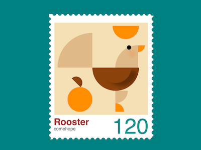

+++
title = '小公鸡邮票'
date = 2018-09-25T17:50:35+08:00
image = '/test-hugo-deploy/img/thumbs/142.png'
summary = '#142'
+++



## 效果预览

点击链接可以在 Codepen 预览。

[https://codepen.io/comehope/pen/mGZbmQ](https://codepen.io/comehope/pen/mGZbmQ)

## 可交互视频

此视频是可以交互的，你可以随时暂停视频，编辑视频中的代码。

[https://scrimba.com/p/pEgDAM/cWMPaha](https://scrimba.com/p/pEgDAM/cWMPaha)

## 源代码下载

每日前端实战系列的全部源代码请从 github 下载：

[https://github.com/comehope/front-end-daily-challenges](https://github.com/comehope/front-end-daily-challenges)

## 代码解读

定义 dom，容器表示邮票：
```html
<div class="stamp">
</div>
```

居中显示：
```css
body {
    margin: 0;
    height: 100vh;
    display: flex;
    align-items: center;
    justify-content: center;
    background-color: teal;
}
```

设置容器尺寸：
```css
.stamp {
    position: relative;
    width: 57em;
    height: 71em;
    font-size: 5px;
    padding: 5em;
    background-color: white;
}
```

用重复背景绘制出邮票的齿孔：
```css
.stamp {
    display: flex;
    flex-direction: column;
    align-items: center;
    justify-content: center;
}

.stamp::after,
.stamp::before {
    content: '';
    width: 100%;
    height: 100%;
    position: absolute;
    background: 
        radial-gradient(circle, teal 50%, transparent 50%),
        radial-gradient(circle, teal 50%, transparent 50%);
    background-size: 3.5em 3.5em;
}

.stamp::before {
    top: 1.5em;
    background-repeat: repeat-y;
    background-position: -3% 0, 103% 0;
}

.stamp::after {
    left: 1.5em;
    background-repeat: repeat-x;
    background-position: 0 -2.5%, 0 102.5%;
}
```

在 html 文件中增加小鸡的 dom 元素，子元素分别表示头部、喙、身体、尾巴、腿、爪子、太阳、桔子：
```html
<div class="stamp">
    <div class="rooster">
        <span class="head"></span>
        <span class="beak"></span>
        <span class="body"></span>
        <span class="tail"></span>
        <span class="leg"></span>
        <span class="foot"></span>
        <span class="sun"></span>
        <span class="orange-stuff"></span>
    </div>
</div>
```

设置 grid 布局的行列尺寸：
```css
.rooster {
    display: grid;
    grid-template-columns: 22.5em 13em 1.75em 14.5em 4.5em;
    grid-template-rows: 12.5em 14.5em 15em 8em 5.5em;
    background-color: wheat;
    padding: 2em;
    margin-top: -2em;
}
```

画出扇形的头部：
```css
.head {
    grid-column: 4;
    grid-row: 2;
    background-color: burlywood;
    border-top-left-radius: 100%;
}
```

画出小鸡的眼睛和脸上的红晕：
```css
.head {
    position: relative;
}

.head::after {
    content: '';
    position: absolute;
    width: 2.8em;
    height: 2.8em;
    border-radius: 50%;
    background-color: black;
    right: 30%;
    box-shadow: 2em 4em 4em rgba(255, 100, 0, 0.5);
}
```

画出扇形的喙：
```css
.beak {
    grid-column: 5;
    grid-row: 2;
    height: 4.5em;
    background-color: darkorange;
    border-bottom-right-radius: 100%;
}
```

画出半圆形的身体：
```css
.body {
    grid-column: 2 / 5;
    grid-row: 3;
    width: 30em;
    background-color: saddlebrown;
    border-radius: 0 0 15em 15em;
}
```

用伪元素，通过阴影画出翅膀：
```css
.body {
    position: relative;
    overflow: hidden;
}

.body::after {
    content: '';
    position: absolute;
    width: 20em;
    height: 10em;
    border-radius: inherit;
    box-shadow: 4em 2em 4em rgba(0, 0, 0, 0.3);
    left: calc((30em - 20em) / 2);
}
```

画出扇形的尾巴：
```css
.tail {
    grid-column: 1;
    grid-row: 1 / 3;
    height: 22.5em;
    background-color: burlywood;
    align-self: end;
    border-top-left-radius: 100%;
}
```

画出扇形的腿：
```css
.leg {
    grid-column: 4;
    grid-row: 4;
    width: 8em;
    background-color: burlywood;
    border-bottom-right-radius: 100%;
}
```

画出扇形的小爪子：
```css
.foot {
    grid-column: 4;
    grid-row: 5;
    width: 5.5em;
    background-color: darkorange;
    border-top-right-radius: 100%;
}
```

画出半圆形的太阳：
```css
.sun {
    grid-column: 3 / 5;
    grid-row: 1;
    width: 17em;
    --h: calc(17em / 2);
    height: var(--h);
    background-color: darkorange;
    border-radius: 0 0 var(--h) var(--h);
}
```

画出圆形的桔子和半圆形的叶片，注意此处叶片的画法与前面画半圆形的画法不同：
```css
.orange-stuff {
    grid-column: 1;
    grid-row: 3 / 6;
    width: 16em;
    height: 16em;
    background-color: darkorange;
    align-self: end;
    justify-self: end;
    border-radius: 50%;
    position: relative;
}

.orange-stuff::before {
    content: '';
    position: absolute;
    width: 8em;
    height: 8em;
    background: linear-gradient(45deg, transparent 50%, saddlebrown 50%);
    border-radius: 50%;
    top: -6.8em;
    left: 10%;
}
```

在 dom 中再增加一些文本，包括标题、作者和面值：
```html
<div class="stamp">
    <div class="puppy">
        <!-- 略 -->
    </div>
    <p class="text">
        <span class="title">Rooster</span>
        <span class="author">comehope</span>
        <span class="face-value">120</span>
    </p>
</div>
```

设置标题的文字样式：
```css
.text {
    position: relative;
    width: calc(100% + 2em * 2);
    height: 6em;
    font-family: sans-serif;
}

.text .title {
    position: absolute;
    font-size: 6em;
    font-weight: bold;
    color: brown;
}
```

设置作者的文字样式：
```css
.text .author {
    position: absolute;
    font-size: 3em;
    bottom: -1.2em;
    color: dimgray;
}
```

设置面值的文字样式：
```css
.text .face-value {
    position: absolute;
    font-size: 14em;
    right: 0;
    line-height: 0.9em;
    color: darkcyan;
}
```

大功告成!
