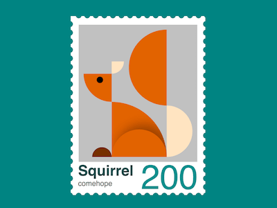

+++
title = '小松鼠邮票'
date = 2018-09-25T17:50:48+08:00
image = '/test-hugo-deploy/img/thumbs/143.png'
summary = '#143'
+++



## 效果预览

点击链接可以在 Codepen 预览。

[https://codepen.io/comehope/pen/YOoXpv](https://codepen.io/comehope/pen/YOoXpv)

## 可交互视频

此视频是可以交互的，你可以随时暂停视频，编辑视频中的代码。

[https://scrimba.com/p/pEgDAM/c7KdMt8](https://scrimba.com/p/pEgDAM/c7KdMt8)

## 源代码下载

每日前端实战系列的全部源代码请从 github 下载：

[https://github.com/comehope/front-end-daily-challenges](https://github.com/comehope/front-end-daily-challenges)

## 代码解读

定义 dom，容器表示邮票：
```html
<div class="stamp">
</div>
```

居中显示：
```css
body {
    margin: 0;
    height: 100vh;
    display: flex;
    align-items: center;
    justify-content: center;
    background-color: teal;
}
```

设置容器尺寸：
```css
.stamp {
    position: relative;
    width: 45em;
    height: 63em;
    font-size: 6px;
    padding: 5em;
    background-color: white;
}
```

用重复背景绘制出邮票的齿孔：
```css
.stamp {
    display: flex;
    flex-direction: column;
    align-items: center;
    justify-content: center;
}

.stamp::after,
.stamp::before {
    content: '';
    width: 100%;
    height: 100%;
    position: absolute;
    background: 
        radial-gradient(circle, teal 50%, transparent 50%),
        radial-gradient(circle, teal 50%, transparent 50%);
    background-size: 3.5em 3.5em;
}

.stamp::before {
    top: 1.5em;
    background-repeat: repeat-y;
    background-position: -4% 0, 104% 0;
}

.stamp::after {
    left: 1.5em;
    background-repeat: repeat-x;
    background-position: 0 -3%, 0 103%;
}
```

在 html 文件中增加小鸡的 dom 元素，子元素分别表示耳朵、头部、身体、尾巴下部、尾巴上部、腿、爪子：
```html
<div class="stamp">
    <div class="squirrel">
        <div class="ear"></div>
        <div class="head"></div>
        <div class="body"></div>
        <div class="tail-start"></div>
        <div class="tail-end"></div>
        <div class="leg"></div>
        <div class="foot"></div>
    </div>
</div>
```

设置 grid 布局的行列尺寸：
```css
.squirrel {
    display: grid;
    grid-template-columns: 11.5em 7em 15.5em 10.5em;
    grid-template-rows: 13em 5em 11.5em 22.5em;
    background-color: silver;
    padding: 2em;
    margin-top: -2em;
}
```

画出扇形的头部：
```css
.head {
    grid-column: 1;
    grid-row: 3;
    background-color: chocolate;
    border-bottom-left-radius: 100%;
}
```

用径向渐变画出眼睛：
```css
.head {
    background-image: radial-gradient(
        circle at 58% 22%,
        black 1.4em,
        transparent 1.4em
    );
}
```

画出扇形的耳朵：
```css
.ear {
    grid-column: 2;
    grid-row: 2;
    width: 5em;
    background-color: bisque;
    border-bottom-right-radius: 100%;
}
```

画出扇形的身体：
```css
.body {
    grid-column: 2 / 4;
    grid-row: 4;
    background-color: chocolate;
    border-top-right-radius: 100%;
    position: relative;
    overflow: hidden;
}
```

用伪元素，通过阴影画出蜷曲的腿：
```css
.body::before {
    content: '';
    position: absolute;
    width: 100%;
    height: 50%;
    box-shadow: 2em -2em 4em rgba(0, 0, 0, 0.3);
    bottom: 0;
    --w: calc((7em + 15.5em) / 2);
    border-top-left-radius: var(--w);
    border-top-right-radius: var(--w);
}
```

画出半圆形的小爪子：
```css
.foot {
    grid-column: 1;
    grid-row: 4;
    height: 4em;
    width: 8em;
    background-color: saddlebrown;
    justify-self: end;
    align-self: end;
    border-radius: 4em 4em 0 0;
    filter: brightness(0.8);
}
```

画出半圆形的尾巴下部：
```css
.tail-start {
    grid-column: 4;
    grid-row: 4;
    --h: calc(22.5em - 1.5em);
    height: var(--h);
    background-color: bisque;
    align-self: end;
    border-radius: 0 var(--h) var(--h) 0;
}
```

画出半圆形的尾巴上部：
```css
.tail-end {
    grid-column: 3;
    grid-row: 1 / 5;
    --h: calc(13em + 5em + 11.5em + 1.5em);
    height: var(--h);
    background-color: chocolate;
    border-radius: var(--h) 0 0 var(--h);
}
```

在 dom 中再增加一些文本，包括标题、作者和面值：
```html
<div class="stamp">
    <div class="puppy">
        <!-- 略 -->
    </div>
    <p class="text">
        <span class="title">Squirrel</span>
        <span class="author">comehope</span>
        <span class="face-value">200</span>
    </p>
</div>
```

设置标题的文字样式：
```css
.text {
    position: relative;
    width: calc(100% + 2em * 2);
    height: 6em;
    font-family: sans-serif;
}

.text .title {
    position: absolute;
    font-size: 6em;
    font-weight: bold;
    color: darkslategray;
}
```

设置作者的文字样式：
```css
.text .author {
    position: absolute;
    font-size: 3em;
    bottom: -1.2em;
    color: dimgray;
}
```

设置面值的文字样式：
```css
.text .face-value {
    position: absolute;
    font-size: 14em;
    right: 0;
    line-height: 0.9em;
    color: darkcyan;
}
```

大功告成!
