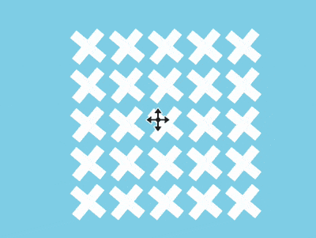

+++
title = '集体舞动画'
date = 2018-09-26T17:51:04+08:00
image = '/fe/img/thumbs/144.png'
summary = '#144'
+++



## 效果预览

点击链接可以在 Codepen 预览。

[https://codepen.io/comehope/pen/gdVObN](https://codepen.io/comehope/pen/gdVObN)

## 可交互视频

此视频是可以交互的，你可以随时暂停视频，编辑视频中的代码。

[https://scrimba.com/p/pEgDAM/caRLack](https://scrimba.com/p/pEgDAM/caRLack)

## 源代码下载

每日前端实战系列的全部源代码请从 github 下载：

[https://github.com/comehope/front-end-daily-challenges](https://github.com/comehope/front-end-daily-challenges)

## 代码解读

定义 dom，容器中包含 2 个子容器，`.horizontal` 代表水平的线段，`.vertical` 代表垂直的线段，每个子容器中包含 4 个子元素：
```html
<div class="container">
    <div class="horizontal">
        <span></span>
        <span></span>
        <span></span>
        <span></span>
    </div>
    <div class="vertical">
        <span></span>
        <span></span>
        <span></span>
        <span></span>
    </div>
</div>
```

居中显示：
```css
body {
    margin: 0;
    height: 100vh;
    display: flex;
    align-items: center;
    justify-content: center;
    background-color: skyblue;
}
```

设置容器尺寸，其中 `--side-length` 是方阵的每一边的元素数量：
```css
.container {
    /* --side-length: 2; */
    position: relative;
    width: calc(40px * calc(var(--side-length)));
    height: calc(40px * calc(var(--side-length)));
}
```

用 grid 布局排列子元素，4 个元素排列成 2 * 2 的方阵：
```css
.container .horizontal,
.container .vertical {
    position: absolute;
    top: 0;
    left: 0;
    display: grid;
    grid-template-columns: repeat(var(--side-length), 1fr);
}
```

设置子元素的样式，`.horizontal` 内的子元素是横条，`.vertical` 内的子元素是竖条：
```css
.container .horizontal span {
    width: 40px;
    height: 10px;
    background: #fff;
    margin: 15px 0;
}

.container .vertical span {
    width: 10px;
    height: 40px;
    background: #fff;
    margin: 0 15px;
}
```

至此，静态布局完成，接下来用 d3 批量处理子元素。
引入 d3 库：
```html
<script src="https://d3js.org/d3.v5.min.js"></script>
```

删除掉 html 文件中的子元素 dom 节点，删除掉 css 文件中声明的 css 变量。
定义方阵每一边的元素数量，并把这个数值赋给 css 变量：
```javascript
const SIDE_LENGTH = 2;

let container = d3.select('.container')
    .style('--side-length', SIDE_LENGTH);
```

定义一个添加 `span` 子元素的函数，分别添加横向和竖向的子元素：
```javascript
function appendSpan(selector) {
    container.select(selector)
    .selectAll('span')
    .data(d3.range(SIDE_LENGTH * SIDE_LENGTH))
    .enter()
    .append('span');
}

appendSpan('.horizontal');
appendSpan('.vertical');
```

此时，布局已改为动态的，可以通过修改 `SIDE_LENGTH` 的值来创建不同边长的方阵，比如以下语句将创建 5 * 5 的方阵：
```javascript
const SIDE_LENGTH = 5;
```

接下来用 GSAP 创建动画。（注：因 scrimba 在使用 gsap 时会崩溃，所以视频演示采用 css 动画，但 codepen 和 github 均采用 gsap 动画）
引入 GSAP 库：
```html
<script src="https://cdnjs.cloudflare.com/ajax/libs/gsap/2.0.2/TweenMax.min.js"></script>
```

声明动画变量 `animation`，声明代表 dom 元素的变量 `$horizontalSpan` 和 `$verticalSpan`：
```javascript
let animation = new TimelineMax({repeat: -1});
let $horizontalSpan = '.container .horizontal span';
let $verticalSpan = '.container .vertical span';
```

先创建横条的动画，共分成 4 步，每个 `to` 语句的最后一个参数是步骤的名称：
```javascript
animation.to($horizontalSpan, 1, {rotation: 45}, 'step1')
    .to($horizontalSpan, 1, {x: '-10px', y: '-10px'}, 'step2')
    .to($horizontalSpan, 1, {rotation: 0, x: '0', y: '0', scaleY: 2, scaleX: 0.5}, 'step3')
    .to($horizontalSpan, 1, {rotation: 90, scaleY: 1, scaleX: 1}, 'step4')
```

再创建竖条的动画，`to` 语句的步骤名称与横条的步骤名称相同，以便与横条保持动画同步：
```javascript
animation.to($verticalSpan, 1, {rotation: 45}, 'step1')
    .to($verticalSpan, 1, {x: '10px', y: '10px'}, 'step2')
    .to($verticalSpan, 1, {x: '0', y: '0', scaleX: 2, scaleY: 0.5}, 'step3')
    .to($verticalSpan, 1, {rotation: 90, scaleX: 1, scaleY: 1}, 'step4');
```

在动画的末尾用时间尺度缩放函数让动画播放速度加快一倍：
```javascript
animation.timeScale(2);
```

最后，把方阵的边长改为 10，方阵越大就越有气势：
```javascript
const SIDE_LENGTH = 10;
```

大功告成！
