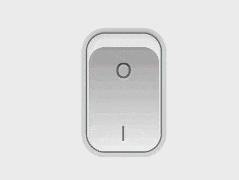

+++
title = '电源开关'
date = 2018-09-27T17:51:19+08:00
image = '/fe/img/thumbs/145.png'
summary = '#145'
+++



## 效果预览

点击链接可以在 Codepen 预览。

[https://codepen.io/comehope/pen/PdMyJd](https://codepen.io/comehope/pen/PdMyJd)

## 可交互视频

此视频是可以交互的，你可以随时暂停视频，编辑视频中的代码。

[https://scrimba.com/p/pEgDAM/c648Nu7](https://scrimba.com/p/pEgDAM/c648Nu7)

## 源代码下载

每日前端实战系列的全部源代码请从 github 下载：

[https://github.com/comehope/front-end-daily-challenges](https://github.com/comehope/front-end-daily-challenges)

## 代码解读

定义 dom，包含 3 个元素，分别代表 `input` 控件、开关和灯光：
```html
<input type="checkbox" class="toggle">
<div class="switch"></div>
<div class="light"></div>
```

居中显示：
```css
body {
    margin: 0;
    height: 100vh;
    display: flex;
    align-items: center;
    justify-content: center;
    background-color: #eee;
}
```

定义控件的样式，其中字号大小是变量，因为 `input` 控件的字号与正文字号不同，所以需要单独设置；把控件的设置为透明，使其不可见，但仍可与用户交互：
```css
body {
    font-size: var(--font-size);
}

:root {
    --font-size: 16px;
}

.toggle {
    position: absolute;
    font-size: var(--font-size); 
    width: 5em;
    height: 8em;
    margin: 0;
    filter: opacity(0);
    cursor: pointer;
    z-index: 2;
}
```

设置开关的轮廓：
```css
.switch {
    position: absolute;
    width: 5em;
    height: 8em;
    border-radius: 1.2em;
    background: linear-gradient(#d2d4d6, white);
}
```

用阴影使开关变得立体：
```css
.switch {
    box-shadow: 
        inset 0 -0.2em 0.4em rgba(212, 212, 212, 0.75), 
        inset 0 -0.8em 0 0.1em rgba(156, 156, 156, 0.85), 
        0 0 0 0.1em rgba(116, 116, 116, 0.8), 
        0 0.6em 0.6em rgba(41, 41, 41, 0.3), 
        0 0 0 0.4em #d4d7d8;
}
```

用伪元素设置 `on` 和 `off` 文本，目前是处于 `off` 状态：
```css
.toggle ~ .switch::before,
.toggle ~ .switch::after {
    position: absolute;
    width: 100%;
    text-align: center;
    font-size: 1.4em;
    font-family: sans-serif;
    text-transform: uppercase;
}

.toggle ~ .switch::before {
    content: '|';
    bottom: 1em;
    color: rgba(0, 0, 0, 0.5);
    text-shadow: 0 0.1em 0 rgba(255, 255, 255, 0.8);
}

.toggle ~ .switch::after {
    content: 'O';
    top: 0.6em;
    color: rgba(0, 0, 0, 0.45);
    text-shadow: 0 0.1em 0 rgba(255, 255, 255, 0.4);
}
```

把 `input` 控件设置为 `checked`状态，以便设置处于 `on` 状态的样式：
```html
<input type="checkbox" checked="checked" class="toggle">
```

设置处于 `on` 状态的开关样式：
```css
.toggle:checked ~ .switch {
    background: linear-gradient(#a1a2a3, #f0f0f0);
    box-shadow: 
        inset 0 0.2em 0.4em rgba(212, 205, 199, 0.75), 
        inset 0 0.8em 0 0.1em rgba(255, 255, 255, 0.77), 
        0 0 0 0.1em rgba(116, 116, 118, 0.8), 
        0 -0.2em 0.2em rgba(41, 41, 41, 0.18), 
        0 0 0 0.4em #d4d7d8;
}
```

设置处于 `on` 状态的文本样式：
```css
.toggle:checked ~ .switch::before {
    bottom: 0.3em;
    text-shadow: 0 0.1em 0 rgba(255, 255, 255, 0.5);
}

.toggle:checked ~ .switch::after {
    top: 1.2em;
    text-shadow: 0 0.1em 0 rgba(255, 255, 255, 0.15);
}
```

接下来设置灯光效果。
先设置处于 `off` 状态的黑暗效果：
```css
.toggle ~ .light {
    width: 100vw;
    height: 100vh;
    background-color: #0a0a16;
    z-index: 1;
    filter: opacity(0.7);
}
```

再设置处于 `on` 状态的明亮效果：
```css
.toggle:checked ~ .light {
    filter: opacity(0);
}
```

大功告成！
