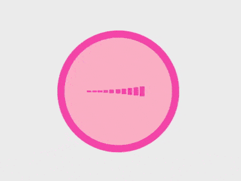

+++
title = '脉动 loader'
date = 2018-09-28T17:51:36+08:00
image = '/test-hugo-deploy/img/thumbs/146.png'
summary = '#146'
+++



## 效果预览

点击链接可以在 Codepen 预览。

[https://codepen.io/comehope/pen/wYvGwr](https://codepen.io/comehope/pen/wYvGwr)

## 可交互视频

此视频是可以交互的，你可以随时暂停视频，编辑视频中的代码。

[https://scrimba.com/p/pEgDAM/cnMgQTr](https://scrimba.com/p/pEgDAM/cnMgQTr)

## 源代码下载

每日前端实战系列的全部源代码请从 github 下载：

[https://github.com/comehope/front-end-daily-challenges](https://github.com/comehope/front-end-daily-challenges)

## 代码解读

定义 dom，容器中包含 10 个子元素：
```html
<div class="loader">
    <span></span>
    <span></span>
    <span></span>
    <span></span>
    <span></span>
    <span></span>
    <span></span>
    <span></span>
    <span></span>
    <span></span>
</div>
```

居中显示：
```css
body {
    margin: 0;
    height: 100vh;
    display: flex;
    align-items: center;
    justify-content: center;
    background: linear-gradient(#eee 70%, pink);
}
```

设置容器的样式，是粉色背景并描边的一个圆：
```css
.loader {
    width: 6em;
    height: 6em;
    padding: 3em;
    font-size: 10px;
    background-color: pink;
    border-radius: 50%;
    border: 0.8em solid hotpink;
}
```

设置子元素的布局方式为横向平铺：
```css
.loader {
    display: flex;
    align-items: center;
    justify-content: space-between;
}
```

设置子元素的样式：
```css
.loader > span {
    width: 0.5em;
    height: 50%;
    background-color: deeppink;
}
```

增加子元素的动画效果：
```css
.loader > span {
    transform: scaleY(0.05) translateX(-0.5em);
    animation: span-animate 1.5s infinite ease-in-out;
}

@keyframes span-animate {
    0%, 100% {
        transform: scaleY(0.05) translateX(-0.5em);
    }
    15% {
        transform: scaleY(1.2) translateX(1em);
    }
    90%, 100% {
        background-color: hotpink;
    }
}
```

设置子元素下标，让子元素依次播放动画：
```css
.loader > span {
    animation-delay: calc(var(--n) * 0.05s);
}

.loader > span:nth-child(1) { --n: 1; }
.loader > span:nth-child(2) { --n: 2; }
.loader > span:nth-child(3) { --n: 3; }
.loader > span:nth-child(4) { --n: 4; }
.loader > span:nth-child(5) { --n: 5; }
.loader > span:nth-child(6) { --n: 6; }
.loader > span:nth-child(7) { --n: 7; }
.loader > span:nth-child(8) { --n: 8; }
.loader > span:nth-child(9) { --n: 9; }
.loader > span:nth-child(10) { --n: 10; }
```

增加容器动画，加强脉动的效果：
```css
.loader {
    animation: loader-animate 1.5s infinite ease-in-out;
}

@keyframes loader-animate {
    45%, 55% {
        transform: scale(1.05);
    }
}
```

大功告成！
