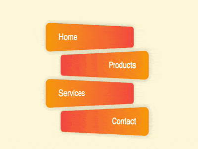

+++
title = '透视按钮'
date = 2018-09-29T17:51:55+08:00
image = '/fe/img/thumbs/147.png'
summary = '#147'
+++



## 效果预览

点击链接可以在 Codepen 预览。

[https://codepen.io/comehope/pen/qJEdKb](https://codepen.io/comehope/pen/qJEdKb)

## 可交互视频

此视频是可以交互的，你可以随时暂停视频，编辑视频中的代码。

[https://scrimba.com/p/pEgDAM/cEJRKud](https://scrimba.com/p/pEgDAM/cEJRKud)

## 源代码下载

每日前端实战系列的全部源代码请从 github 下载：

[https://github.com/comehope/front-end-daily-challenges](https://github.com/comehope/front-end-daily-challenges)

## 代码解读

定义 dom，容器是一个无序列表，包含 4 个元素，代表 4 个按钮：
```html
<ul>
    <li>home</li>
    <li>products</li>
    <li>services</li>
    <li>contact</li>
</ul>
```

居中显示：
```css
body {
    margin: 0;
    height: 100vh;
    display: flex;
    align-items: center;
    justify-content: center;
    background: cornsilk;
}
```

去掉列表项前面的符号：
```css
ul {
    padding: 0;
    list-style-type: none;
}
```

设置按钮的边框和背景的样式，背景采用渐变色，但渐变的方向依次交替：
```css
ul li {
    box-sizing: border-box;
    width: 15em;
    height: 3em;
    font-size: 20px;
    border-radius: 0.5em;
    margin: 0.5em;
    box-shadow: 0 0 1em rgba(0,0,0,0.2);
}

ul li:nth-child(odd) {
    background: linear-gradient(to right, orange, tomato);
}

ul li:nth-child(even) {
    background: linear-gradient(to left, orange, tomato);
}
```

设置按钮上文字的样式，依次交替居左或居右：
```css
ul li {
    color: white;
    font-family: sans-serif;
    text-transform: capitalize;
    line-height: 3em;
}

ul li:nth-child(odd) {
    text-align: left;
    padding-left: 10%;
}

ul li:nth-child(even) {
    text-align: right;
    padding-right: 10%;
}
```

设置按钮的透视效果，依次交替向左旋转和向右旋转，此时透视的距离是 `500px`，注意 perspective() 函数和  rotateY() 函数的顺序不能写反：
```css
ul li:nth-child(odd) {
    transform: perspective(500px) rotateY(45deg);
}

ul li:nth-child(even) {
    transform: perspective(500px) rotateY(-45deg);
}
```

为按钮增加悬停效果，使悬停时的透视距离变短为 `200px`，透视距离越短，旋转的幅度看起来就越大：
```css
ul li:nth-child(odd):hover {
    transform: perspective(200px) rotateY(45deg);
    padding-left: 5%;
}

ul li:nth-child(even):hover {
    transform: perspective(200px) rotateY(-45deg);
    padding-right: 5%;
}
```

最后，设置一个缓动时间，使效果转换变得平滑：
```css
ul li {
    transition: 0.3s;
    cursor: pointer;
}
```

大功告成！
