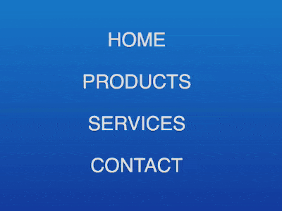

+++
title = '按钮悬停特效'
date = 2018-09-29T17:52:08+08:00
image = '/fe/img/thumbs/148.png'
summary = '#148'
+++



## 效果预览

点击链接可以在 Codepen 预览。

[https://codepen.io/comehope/pen/yRyOZr](https://codepen.io/comehope/pen/yRyOZr)

## 可交互视频

此视频是可以交互的，你可以随时暂停视频，编辑视频中的代码。

[https://scrimba.com/p/pEgDAM/cmWMQtz](https://scrimba.com/p/pEgDAM/cmWMQtz)

## 源代码下载

每日前端实战系列的全部源代码请从 github 下载：

[https://github.com/comehope/front-end-daily-challenges](https://github.com/comehope/front-end-daily-challenges)

## 代码解读

定义 dom，容器是一个无序列表，列表项代表按钮：
```html
<ul>
    <li>home</li>
</ul>
```

居中显示：
```css
body {
  margin: 0;
  height: 100vh;
  display: flex;
  align-items: center;
  justify-content: center;
  background: linear-gradient(deepskyblue, navy);
}
```

去掉列表项前面的符号：
```css
ul {
  padding: 0;
  list-style-type: none;
}
```

设置按钮的文字样式：
```css
ul li {
  color: #ddd;
  font-size: 25px;
  font-family: sans-serif;
  text-transform: uppercase;
}
```

用伪元素在按钮的左侧增加一个方块：
```css
ul li {
  position: relative;
}

ul li::before {
  content: '';
  position: absolute;
  width: 100%;
  height: 100%;
  background: tomato;
  left: -100%;
}
```

用伪元素在按钮的右侧增加一条下划线：
```css
ul li::after {
  content: '';
  position: absolute;
  width: 100%;
  height: 0.2em;
  background: tomato;
  bottom: 0;
  left: 100%;
}
```

接下来设置鼠标悬停效果。
当鼠标悬停时，左侧的方块移到文字所在位置：
```css
ul li::before {
  transition: 0.4s ease-out;
}

ul li:hover::before {
  left: 100%;
}
```

右侧的下划线移到文字所在位置，它的动画时间延迟到方块的动画快结束时再开始：
```css
ul li::after {
  transition: 0.3s 0.3s ease-out;
}

ul li:hover::after {
  left: 0%;
}
```

同时，提高文字的亮度：
```css
ul li {
  transition: 0.3s;
  cursor: pointer;
}

ul li:hover {
  color: #fff;
}
```

隐藏掉按钮外的部分，使方块和下划线在默认状态下都不可见，只有鼠标悬停时它们才从两侧入场：
```css
ul li {
  overflow: hidden;
}
```

最后，在 dom 中再增加几个按钮：
```html
<ul>
    <li>home</li>
    <li>products</li>
    <li>services</li>
    <li>contact</li>
</ul>
```

布局多个按钮：
```css
ul {
  display: flex;
  flex-direction: column;
  align-items: center;
}

ul li {
  margin: 0.5em;
}
```

大功告成！
