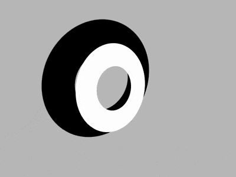

+++
title = '宝路薄荷糖'
date = 2018-09-30T17:52:24+08:00
image = '/test-hugo-deploy/img/thumbs/149.png'
summary = '#149'
+++



## 效果预览

点击链接可以在 Codepen 预览。

[https://codepen.io/comehope/pen/oagrvz](https://codepen.io/comehope/pen/oagrvz)

## 可交互视频

此视频是可以交互的，你可以随时暂停视频，编辑视频中的代码。

[https://scrimba.com/p/pEgDAM/cRbqJcD](https://scrimba.com/p/pEgDAM/cRbqJcD)

## 源代码下载

每日前端实战系列的全部源代码请从 github 下载：

[https://github.com/comehope/front-end-daily-challenges](https://github.com/comehope/front-end-daily-challenges)

## 代码解读

定义 dom，只有 1 个元素：
```html
<div class="spinner"></div>
```

居中显示：
```css
body {
    margin: 0;
    height: 100vh;
    display: flex;
    align-items: center;
    justify-content: center;
    background-color: silver;
}
```

定义容器尺寸：
```css
.spinner {
    width: 50vmin;
    height: 50vmin;
    position: relative;
}
```

用 `before` 伪元素画出 1 个像宝路薄荷糖状的黑色圆环：
```css
.spinner::before {
    content: '';
    position: absolute;
    box-sizing: border-box;
    width: inherit;
    height: inherit;
    border: 12.5vmin solid;
    border-radius: 50%;
}
```

接下来制作动画效果。
设置透视景深：
```css
body {
    perspective: 400px;
}
```

让圆环在 z 轴上运动：
```css
.spinner::before {
    animation: spin 1.5s ease-in-out infinite both reverse;
}

@keyframes spin {
    0%, 100% {
        transform: translateZ(10vmin);
    }

    60% {
        transform: translateZ(-10vmin);
    }
}
```

让圆环在 z 轴距离较大时稍稍倾斜：
```css
@keyframes spin {
    0%, 100% {
        transform: translateZ(10vmin) rotateX(25deg);
    }

    60% {
        transform: translateZ(-10vmin);
    }
}
```

增加缩放效果：
```css
@keyframes spin {
    0%, 100% {
        transform: translateZ(10vmin) rotateX(25deg);
    }

    33% {
        transform: translateZ(-10vmin) scale(0.4);
    }

    60% {
        transform: translateZ(-10vmin);
    }
}
```

用 `after` 伪元素再画出一个白色的圆环，并且让它的动画延迟动画总长的一半时间：
```css
.spinner::before,
.spinner::after {
    /*略*/
    animation: spin 1.5s ease-in-out infinite both reverse;
}

.spinner::after {
    border-color: white;
    animation-delay: -0.75s;
}
```

接下来制作容器的动画效果，为了不受子元素动画的影响，先暂时屏蔽伪元素的动画效果。
```css
.spinner::before,
.spinner::after {
    /* animation: spin 1.5s ease-in-out infinite both reverse; */
}
```

增加容器沿 x 轴旋转的动画效果，动画时间为子元素动画时间的2倍：
```css
.spinner {
    animation: wobble 3s ease-in-out infinite;
}

@keyframes wobble {
    0%, 100% {
        transform: rotateX(15deg);
    }
    
    50% {
        transform: rotateX(60deg);
    }
}
```

增加容器沿 y 轴旋转的动画效果：
```css
@keyframes wobble {
    0%, 100% {
        transform: rotateX(15deg) rotateY(60deg);
    }
    
    50% {
        transform: rotateX(60deg) rotateY(-60deg);
    }
}
```

增加容器整体旋转的动画效果：
```css
@keyframes wobble {
    0%, 100% {
        transform: rotateX(15deg) rotateY(60deg);
    }
    
    50% {
        transform: rotateX(60deg) rotateY(-60deg) rotate(180deg);
    }
}
```

打开子元素的动画效果，使子元素的动画效果和容器的动画效果叠加：
```css
.spinner::before,
.spinner::after {
    animation: spin 1.5s ease-in-out infinite both reverse;
}
```

最后，使子元素在 3d 空间上运动：
```css
.spinner {
    transform-style: preserve-3d;
}
```

大功告成！
