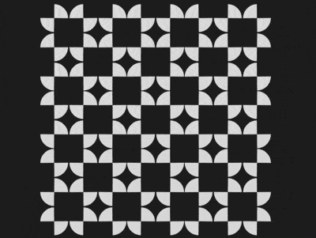

+++
title = '集体舞动画'
date = 2018-10-02T17:52:37+08:00
image = '/test-hugo-deploy/img/thumbs/150.png'
summary = '#150'
+++



## 效果预览

点击链接可以在 Codepen 预览。

[https://codepen.io/comehope/pen/yRYOwq](https://codepen.io/comehope/pen/yRYOwq)

## 可交互视频

此视频是可以交互的，你可以随时暂停视频，编辑视频中的代码。

[https://scrimba.com/p/pEgDAM/cBZ3Nt6](https://scrimba.com/p/pEgDAM/cBZ3Nt6)

## 源代码下载

每日前端实战系列的全部源代码请从 github 下载：

[https://github.com/comehope/front-end-daily-challenges](https://github.com/comehope/front-end-daily-challenges)

## 代码解读

定义 dom，容器中包含 1 个 `.square` 子容器，子容器中包含 4 个 `<span>`，每个 `<span>` 代表一个对角扇形：
```html
<figure class="container">
    <div class="square">
        <span></span>
        <span></span>
        <span></span>
        <span></span>
    </div>
</figure>
```

居中显示：
```css
body {
    margin: 0;
    height: 100vh;
    display: flex;
    align-items: center;
    justify-content: center;
    background-color: #222;
}
```

设置容器的尺寸单位，`1em` 等于 `8px`：
```css
.container {
    font-size: 8px;
}
```

子容器中的 4 个 `<span>` 不设宽高，只设边框，其中第 1 个和第 4 个 `<span>` 只取左右边框，第 2 个和第 3 个 `<span>` 只取上下边框：
```css
.square span {
    display: block;
    border: 2.5em solid transparent;
    color: #ddd;
}

.square span:nth-child(1),
.square span:nth-child(4) {
    border-left-color: currentColor;
    border-right-color: currentColor;
}

.square span:nth-child(2),
.square span:nth-child(3) {
    border-top-color: currentColor;
    border-bottom-color: currentColor;
}
```

把边框改为圆弧：
```css
.square span {
    border-radius: 50%;
}
```

在子容器中用 grid 布局把 4 个 `<span>` 设置为 2 * 2 的网格：
```css
.square {
    display: grid;
    grid-template-columns: repeat(2, 1fr);
    grid-gap: 0.2em;
    padding: 0.1em;
}
```

旋转 4 个 `<span>`，使它们围合成一个正方形，看起来像一个花朵，算式的结果是 45 度，写成这样是为了和接下来的动画的算式的形式保持一致：
```css
.square span {
    transform: rotate(calc(45deg + 90deg * 0));
}
```

增加让 `<span>` 旋转的动画，整个动画过程旋转 4 次，每次旋转 90 度，4 次旋转之后即返回原位：
```css
.square span {
    animation: rotation 2s ease-in-out infinite;
}

@keyframes rotation {
    0% { transform: rotate(calc(45deg + 90deg * 0)); }
    25% { transform: rotate(calc(45deg + 90deg * 1)); }
    50% { transform: rotate(calc(45deg + 90deg * 2)); }
    75% { transform: rotate(calc(45deg + 90deg * 3)); }
    100% { transform: rotate(calc(45deg + 90deg * 4)); }
}
```

使其中 2 个 `<span>` 朝相反的方向运动：
```css
.square span:nth-child(2),
.square span:nth-child(3) {
    animation-direction: reverse;
}
```

至此，一个 `.square` 子容器的动画已经完成，接下来制作 4 个 `.square` 的动画。
在 dom 中再增加 3 组 `.square` 子容器：
```html
<figure class="container">
    <div class="square">
        <span></span>
        <span></span>
        <span></span>
        <span></span>
    </div>
    <div class="square">
        <span></span>
        <span></span>
        <span></span>
        <span></span>
    </div>
    <div class="square">
        <span></span>
        <span></span>
        <span></span>
        <span></span>
    </div>
    <div class="square">
        <span></span>
        <span></span>
        <span></span>
        <span></span>
    </div>
</figure>
```

用 grid 布局把 4 个 `.square` 布局成网格状，变量 `--columns` 是网格的边长，即每边有 2 个 `.square` 子容器：
```css
.container {
    display: grid;
    --columns: 2;
    grid-template-columns: repeat(var(--columns), 1fr);
}
```

现在看起来好像是有几个黑色的小方块在不停地移动，当 dom 元素越多时，动画效果看起来就越壮观，就像集体舞一样，人越多越有气势。接下来用 d3 批量增加 dom 的元素。
引入 d3 库：
```html
<script src="https://d3js.org/d3.v5.min.js"></script>
```

声明一个 `COLUMNS` 常量，表示网格的边长：
```javascript
const COLUMNS = 2;
```

删除掉 html 文件中的 `.square` 子元素，改为用 d3 动态创建：
```javascript
d3.select('.container')
    .selectAll('div')
    .data(d3.range(COLUMNS * COLUMNS))
    .enter()
    .append('div')
    .attr('class', 'square');
```

继续用连缀语法增加 `<span>` 子元素：
```javascript
d3.select('.container')
    .selectAll('div')
    .data(d3.range(COLUMNS * COLUMNS))
    .enter()
    .append('div')
    .attr('class', 'square')
    .selectAll('span')
    .data(d3.range(4))
    .enter()
    .append('span');
```

删除掉 css 文件中的 `--columns` 变量声明，改为用 d3 动态声明：
```javascript
d3.select('.container')
    .style('--columns', COLUMNS)
    /*略*/
```

最后，把边长改为 4，即让 16 个 `.square` 一起动画：
```javascript
```

大功告成！
