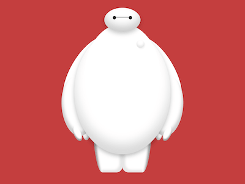

+++
title = '大白'
date = 2018-10-06T17:52:52+08:00
image = '/fe/img/thumbs/151.png'
summary = '#151'
+++



## 效果预览

点击链接可以在 Codepen 预览。

[https://codepen.io/comehope/pen/ReGRaO](https://codepen.io/comehope/pen/ReGRaO)

## 可交互视频

此视频是可以交互的，你可以随时暂停视频，编辑视频中的代码。

[https://scrimba.com/p/pEgDAM/cEJDKSg](https://scrimba.com/p/pEgDAM/cEJDKSg)

## 源代码下载

每日前端实战系列的全部源代码请从 github 下载：

[https://github.com/comehope/front-end-daily-challenges](https://github.com/comehope/front-end-daily-challenges)

## 代码解读

整个人物分为 3 部分：头、身体、腿，下面按照这个顺序分别画出，先画头部。
定义 dom，容器 `.baymax` 表示大白，`head` 表示头部：
```html
<div class="baymax">
    <div class="head">
        <div class="eyes"></div>
    </div>
</div>
```

居中显示：
```css
body {
    margin: 0;
    height: 100vh;
    display: flex;
    align-items: center;
    justify-content: center;
    background-color: rgba(176, 0, 0, 0.75);
}
```

定义容器尺寸和子元素对齐方式：
```css
.baymax {
    width: 30em;
    height: 41em;
    font-size: 10px;
    display: flex;
    justify-content: center;
    position: relative;
}
```

画出头部轮廓：
```css
.head {
    position: absolute;
    width: 9em;
    height: 6em;
    background-color: white;
    border-radius: 50%;
    box-shadow: 
        inset 0 -1.5em 3em rgba(0, 0, 0, 0.2),
        0 0.5em 1.5em rgba(0, 0, 0, 0.2);
}
```

画出双眼中间的线条：
```css
.head .eyes {
    position: absolute;
    width: 4.8em;
    height: 0.1em;
    background-color: #222;
    top: 2.3em;
    left: calc((9em - 4.8em) / 2);
}
```

画出双眼：
```css
.head .eyes::before,
.head .eyes::after {
    content: '';
    position: absolute;
    width: 0.8em;
    height: 0.9em;
    background-color: #222;
    border-radius: 50%;
    top: -0.3em;
}

.head .eyes::after {
    right: 0;
}
```

接下来画身体。
html 文件中增加身体的 dom 元素：
```html
<div class="baymax">
    <div class="head">
        <!-- 略 -->
    </div>
    <div class="body">
        <div class="chest">
            <span class="button"></span>
        </div>
        <div class="belly"></div>
        <div class="left arm">
            <div class="fingers"></div>
        </div>
        <div class="right arm">
            <div class="fingers"></div>
        </div>
    </div>
</div>
```

定义身体的宽度：
```css
.body {
    position: absolute;
    width: inherit;
}
```

画出胸部：
```css
.body .chest {
    position: absolute;
    width: 19em;
    height: 26em;
    background-color: white;
    top: 4em;
    left: calc((100% - 19em) / 2);
    border-radius: 50%;
    z-index: -1;
}
```

画出胸前的按钮：
```css
.body .chest .button {
    position: absolute;
    width: 2em;
    height: 2em;
    background-color: white;
    border-radius: 50%;
    top: 4em;
    right: 4em;
    box-shadow: 
        inset 0 -0.5em 0.8em rgba(0, 0, 0, 0.15),
        0.2em 0.3em 0.2em rgba(0, 0, 0, 0.05);
    filter: opacity(0.75);
}
```

画出肚皮：
```css
.body .belly {
    position: absolute;
    width: 24em;
    height: 31em;
    background-color: white;
    top: 5.5em;
    left: calc((100% - 24em) / 2);
    border-radius: 50%;
    z-index: -2;
    box-shadow: 
        inset 0 -2.5em 4em rgba(0, 0, 0, 0.15),
        0 0.5em 1.5em rgba(0, 0, 0, 0.25);
}
```

定义胳膊的高度起点：
```css
.body .arm {
    position: absolute;
    top: 7.5em;
}
```

胳膊分为肘以上的部分和肘以下的部分。
先设计这两段的共有属性：
```css
.body .arm::before,
.body .arm::after {
    content: '';
    position: absolute;
    background-color: white;
    border-radius: 50%;
    transform-origin: top;
    z-index: -3;
}
```

再用伪元素分别画出这两部分：
```css
.body .arm::before {
    width: 9em;
    height: 20em;
    left: 7em;
    transform: rotate(30deg);
}

.body .arm::after {
    width: 8em;
    height: 15em;
    left: -0.8em;
    top: 9.5em;
    transform: rotate(-5deg);
    box-shadow: inset 0.4em -1em 1em rgba(0, 0, 0, 0.2);
}
```

定义两根手指的共有属性：
```css
.body .arm .fingers::before,
.body .arm .fingers::after {
    content: '';
    position: absolute;
    width: 1.8em;
    height: 4em;
    background-color: white;
    border-radius: 50%;
    transform-origin: top;
}
```

用伪元素分别画出两根手指：
```css
.body .arm .fingers::before {
    top: 22em;
    left: 2em;
    transform: rotate(-25deg);
    box-shadow: inset 0.2em -0.4em 0.4em rgba(0, 0, 0, 0.4);
}

.body .arm .fingers::after {
    top: 21.5em;
    left: 4.8em;
    transform: rotate(-5deg);
    box-shadow: inset -0.2em -0.4em 0.8em rgba(0, 0, 0, 0.3);
    z-index: -3;
}
```

至此，完成了右胳膊。把右胳膊复制并水平翻转，即可得到左胳膊：
```css
.body .arm.left {
    transform: scaleX(-1);
    right: 0;
    z-index: -3;
}
```

接下来画腿部。
在 html 文件中增加腿的 dom 元素：
```html
<div class="baymax">
    <div class="head">
        <!-- 略 -->
    </div>
    <div class="body">
        <!-- 略 -->
    </div>
    <div class="left leg"></div>
    <div class="right leg"></div>
</div>
```

画出腿的内侧：
```css
.leg {
    position: absolute;
    width: 5em;
    height: 16em;
    bottom: 0;
    background-color: white;
    border-bottom-right-radius: 1.5em;
    left: 10em;
    box-shadow: inset -0.7em -0.6em 0.7em rgba(0, 0, 0, 0.1);
    z-index: -3;
}
```

画出腿的外侧：
```css
.leg::before {
    content: '';
    position: absolute;
    width: 2.5em;
    height: inherit;
    background-color: white;
    border-bottom-left-radius: 100%;
    left: -2.5em;
    box-shadow: inset 0.7em 1.5em 0.7em rgba(0, 0, 0, 0.4);
}
```

至此，完成了右腿。把右腿复制并水平翻转，即可得到左腿：
```css
.leg.left {
    transform-origin: right;
    transform: scaleX(-1);
}
```

大功告成！
