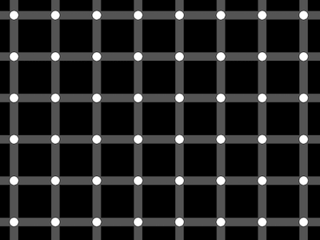

+++
title = '黑色圆点错觉'
date = 2018-10-07T17:53:09+08:00
image = '/fe/img/thumbs/152.png'
summary = '#152'
+++



## 效果预览

点击链接可以在 Codepen 预览。

[https://codepen.io/comehope/pen/gBwzKR](https://codepen.io/comehope/pen/gBwzKR)

## 可交互视频

此视频是可以交互的，你可以随时暂停视频，编辑视频中的代码。

[https://scrimba.com/p/pEgDAM/ca82VAM](https://scrimba.com/p/pEgDAM/ca82VAM)

## 源代码下载

每日前端实战系列的全部源代码请从 github 下载：

[https://github.com/comehope/front-end-daily-challenges](https://github.com/comehope/front-end-daily-challenges)

## 代码解读

此项目无用户自定义的 dom 元素，利用系统默认的 `<body>` 元素作为容器。

定义页面尺寸，背景设置为黑色：
```css
body {
    margin: 0;
    width: 100vw;
    height: 100vh;
    background-color: black;
}
```

用线性渐变画出一横一竖二条灰色的细线：
```css
body {
    margin: 0;
    width: 100vw;
    height: 100vh;
    background-color: black;
    background-image: 
        linear-gradient(
            to bottom,
            #555 2vmin,
            transparent 2vmin
        ),
        linear-gradient(
            to right,
            #555 2vmin,
            transparent 2vmin
        );
}
```

用径向渐变在左上角画一个白色的圆点：
```css
body {
    margin: 0;
    width: 100vw;
    height: 100vh;
    background-color: black;
    background-image: 
        radial-gradient(
            circle at 1vmin 1vmin,
            white 1vmin,
            transparent 1vmin
        ),
        linear-gradient(
            to bottom,
            #555 2vmin,
            transparent 2vmin
        ),
        linear-gradient(
            to right,
            #555 2vmin,
            transparent 2vmin
        );
}
```

平铺背景：
```css
body {
    margin: 0;
    width: 100vw;
    height: 100vh;
    background-color: black;
    background-image: 
        radial-gradient(
            circle at 1vmin 1vmin,
            white 1vmin,
            transparent 1vmin
        ),
        linear-gradient(
            to bottom,
            #555 2vmin,
            transparent 2vmin
        ),
        linear-gradient(
            to right,
            #555 2vmin,
            transparent 2vmin
        );
    background-size: 10vmin 10vmin;
}
```

为避免圆点紧贴在左侧和顶部，为背景增加一点偏移量：
```css
body {
    margin: 0;
    width: 100vw;
    height: 100vh;
    background-color: black;
    background-image: 
        radial-gradient(
            circle at 1vmin 1vmin,
            white 1vmin,
            transparent 1vmin
        ),
        linear-gradient(
            to bottom,
            #555 2vmin,
            transparent 2vmin
        ),
        linear-gradient(
            to right,
            #555 2vmin,
            transparent 2vmin
        );
    background-size: 10vmin 10vmin;
    background-position: 5vmin 5vmin;
}
```

现在，如果视线在页面中移动，就会看到黑色小圆点，这实际上是错觉。

大功告成！
