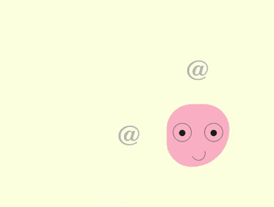

+++
title = '表情 Tooltip'
date = 2018-10-11T17:53:24+08:00
image = '/fe/img/thumbs/153.png'
summary = '#153'
+++



## 效果预览

点击链接可以在 Codepen 预览。

[https://codepen.io/comehope/pen/rqyoYY](https://codepen.io/comehope/pen/rqyoYY)

## 可交互视频

此视频是可以交互的，你可以随时暂停视频，编辑视频中的代码。

[https://scrimba.com/p/pEgDAM/c6p2Es2](https://scrimba.com/p/pEgDAM/c6p2Es2)

## 源代码下载

每日前端实战系列的全部源代码请从 github 下载：

[https://github.com/comehope/front-end-daily-challenges](https://github.com/comehope/front-end-daily-challenges)

## 代码解读

定义 dom，容器中包含一个名为 `.emoji` 的子容器，代表一个头像，它的子元素 `eye left`、`eye right`、`mouth` 分别代表左眼、右眼和嘴巴：
```html
<section class="container">
    <div class="emoji">
        <span class="eye left"></span>
        <span class="eye right"></span>
        <span class="mouth"></span>
    </div>
</section>
```

居中显示：
```css
body {
    margin: 0;
    height: 100vh;
    display: flex;
    align-items: center;
    justify-content: center;
    background-color: lightyellow;
}
```

定义容器尺寸和子元素对齐方式：
```css
.container {
    position: relative;
    width: 20em;
    height: 20em;
    font-size: 10px;
    display: flex;
    align-items: center;
    justify-content: center;
}
```

定义头像的轮廓：
```css
.emoji {
    position: relative;
    box-sizing: border-box;
    width: 10em;
    height: 10em;
    background-color: pink;
    border-radius: 50% 50% 75% 50%;
}
```

定义头像眼睛的轮廓：
```css
.emoji .eye {
    position: absolute;
    box-sizing: border-box;
    width: 3em;
    height: 3em;
    border: 0.1em solid gray;
    border-radius: 50%;
    top: 3em;
}

.emoji .eye.left {
    left: 1em;
}

.emoji .eye.right {
    right: 1em;
}
```

画出眼珠：
```css
.emoji .eye.left::before,
.emoji .eye.right::before {
    content: '';
    position: absolute;
    width: 1em;
    height: 1em;
    background-color: #222;
    border-radius: 50%;
    top: 1em;
    left: calc((100% - 1em) / 2);
}
```

画出微笑的嘴：
```css
.emoji .mouth {
    position: absolute;
    width: 2em;
    height: 2em;
    border: 0.1em solid;
    bottom: 1em;
    left: 40%;
    border-radius: 50%;
    border-color: transparent gray gray transparent;
    transform: rotate(20deg);
}
```

接下来制作眼珠转向 4 个方向的效果。
用 2 个变量分别表示眼珠的定位位置：
```css
.emoji .eye {
    --top: 1em;
    --left: calc((100% - 1em) / 2);
}

.emoji .eye.left::before,
.emoji .eye.right::before {
    top: var(--top);
    left: var(--left);
}
```

设置眼珠在 4 个方向的定位位置：
```css
.emoji.top .eye {
    --top: 0;
}

.emoji.bottom .eye {
    --top: 1.8em;
}

.emoji.left .eye {
    --left: 0;
}

.emoji.right .eye {
    --left: 1.8em;
}
```

此时，如果为 dom 元素 `.emoji` 增加 `top`、`bottom`、`left`、`right` 4 个样式中的任何一个样式，眼珠就会转向特定的方向。

在 dom 中增加 4 个元素，每个元素的内容是一个 @ 字符：
```html
<section class="container">
    <div class="emoji">
        <!-- 略 -->
    </div>
    
    <span class="tip top">@</span>
    <span class="tip left">@</span>
    <span class="tip right">@</span>
    <span class="tip bottom">@</span>
</section>
```

把 4 个元素布局在头像周围：
```css
.tip {
    position: absolute;
    cursor: pointer;
    font-size: 4.5em;
    color: silver;
    font-family: sans-serif;
    font-weight: 100;
}

.tip.top {
    top: -15%;
}

.tip.bottom {
    bottom: -15%;
}

.tip.left {
    left: -15%;
}

.tip.right {
    right: -15%;
}
```

写一段脚本，增加一点交互效果。当鼠标悬停在 4 个方向的 @ 上时，使眼珠朝相应的方向转去。这里的 `DIRECTION` 常量存储了 4 个方向，`EVENTS` 常量存储了 2 个鼠标事件，`$` 常量包装了根据类名获取 dom 元素的操作：
```javascript
const DIRECTIONS = ['top', 'bottom', 'left', 'right']
const EVENTS = ['mouseover', 'mouseout']
const $ = (className) => document.getElementsByClassName(className)[0]

DIRECTIONS.forEach(direction => 
    EVENTS.forEach((e) => 
        $(`tip ${direction}`).addEventListener(e, () =>
            $('emoji').classList.toggle(direction)
        )
    )
)
```

为眼珠设置缓动时间，使动画平滑：
```css
.emoji .eye.left::before,
.emoji .eye.right::before {
    transition: 0.3s;
}
```

接下来制作 tooltip 提示框。
为 4 个 @ 符号的 dom 增加 `data-tip` 属性，其内容就是 tooltip 信息：
```html
<section class="container">
    <div class="emoji">
        <!-- 略 -->
    </div>
    
    <span class="tip top" data-tip="look up">@</span>
    <span class="tip bottom" data-tip="look down">@</span>
    <span class="tip left" data-tip="look to the left">@</span>
    <span class="tip right" data-tip="look to the right">@</span>
</section>
```

用 `::before` 伪元素展示提示信息，样式为黑底白字：
```css
.tip::before {
    content: attr(data-tip);
    position: absolute;
    font-size: 0.3em;
    font-family: sans-serif;
    width: 10em;
    text-align: center;
    background-color: #222;
    color: white;
    padding: 0.5em;
    border-radius: 0.2em;
    box-shadow: 0 0.1em 0.3em rgba(0, 0, 0, 0.3);
}
```

把顶部的提示框定位到顶部 @ 符号的上方正中：
```css
.tip.top::before {
    top: 0;
    left: 50%;
    transform: translate(-50%, calc(-100% - 0.6em));
}
```

类似地，把其他 3 个提示框也定位到 @ 符号的旁边：
```css
.tip.bottom::before {
    bottom: 0;
    left: 50%;
    transform: translate(-50%, calc(100% + 0.6em));
}

.tip.left::before {
    left: 0;
    top: 50%;
    transform: translate(calc(-100% - 0.6em), -50%);
}

.tip.right::before {
    right: 0;
    top: 50%;
    transform: translate(calc(100% + 0.6em), -50%);
}
```

用 `::after` 伪元素在顶部提示框下面画出一个倒三角形：
```css
.tip::after {
    content: '';
    position: absolute;
    font-size: 0.3em;
    width: 0;
    height: 0;
    color: #222;
    border: 0.6em solid transparent;
}

.tip.top::after {
    border-bottom-width: 0;
    border-top-color: currentColor;
    top: -0.6em;
    left: 50%;
    transform: translate(-50%, 0);
}
```

类似地，在其他 3 个提示框旁边画出三角形：
```css
.tip.bottom::after {
    border-top-width: 0;
    border-bottom-color: currentColor;
    bottom: -0.6em;
    left: 50%;
    transform: translate(-50%, 0);
}

.tip.left::after {
    border-right-width: 0;
    border-left-color: currentColor;
    left: -0.6em;
    top: 50%;
    transform: translate(0, -50%);
}

.tip.right::after {
    border-left-width: 0;
    border-right-color: currentColor;
    right: -0.6em;
    top: 50%;
    transform: translate(0, -50%);
}
```

最后，隐藏提示框，使提示框只在鼠标悬停时出现：
```css
.tip::before,
.tip::after {
    visibility: hidden;
    filter: opacity(0);
    transition: 0.3s;
}

.tip:hover::before,
.tip:hover::after {
    visibility: visible;
    filter: opacity(1);
}
```

大功告成！
