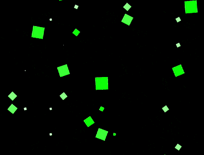

+++
title = '眼冒金星'
date = 2018-10-12T17:53:37+08:00
image = '/fe/img/thumbs/154.png'
summary = '#154'
+++



## 效果预览

点击链接可以在 Codepen 预览。

[https://codepen.io/comehope/pen/OBgBJJ](https://codepen.io/comehope/pen/OBgBJJ)

## 可交互视频

此视频是可以交互的，你可以随时暂停视频，编辑视频中的代码。

[https://scrimba.com/p/pEgDAM/c83BKt3](https://scrimba.com/p/pEgDAM/c83BKt3)

## 源代码下载

每日前端实战系列的全部源代码请从 github 下载：

[https://github.com/comehope/front-end-daily-challenges](https://github.com/comehope/front-end-daily-challenges)

## 代码解读

定义 dom，容器中包含 9 个子元素：
```html
<div class='container'>
    <span></span>
    <span></span>
    <span></span>
    <span></span>
    <span></span>
    <span></span>
    <span></span>
    <span></span>
    <span></span>
</div>
```

居中显示：
```css
body {
    margin: 0;
    height: 100vh;
    display: flex;
    align-items: center;
    justify-content: center;
    background-color: black;
}
```

设置容器中子元素的布局方式，形成一个 3 * 3 的网格，其中 `--columns` 是网格每一边上的子元素数量：
```css
.container {
    display: grid;
    --columns: 3;
    grid-template-columns: repeat(var(--columns), 1fr);
}
```

定义子元素样式：
```css
.container span {
    width: 25px;
    height: 25px;
    color: lime;
    background-color: currentColor;
}
```

增加子元素的动画效果，总动画时长是 5 秒，其中第 1 秒（0% ~ 20%）有动画，其余 4 秒（20% ~ 100%）静止：
```css
.container span {
    transform: scale(0);
    animation: spin 5s linear infinite;
}

@keyframes spin {
    0% {
        transform: rotate(0deg) scale(1);
    }

    5%, 15% {
        transform: rotate(90deg) scale(0);
        background: white;
    }

    17.5% {
        transform: rotate(180deg) scale(1);
        background-color: currentColor;
    }

    20%, 100% {
        transform: rotate(90deg) scale(0);
    }
}
```

设置动画延时，使各子元素的动画随机延时 4 秒之内的任意时间：
```css
.container span {
    animation-delay: calc(var(--delay) * 1s);
}

.container span:nth-child(1) { --delay: 0.8 }
.container span:nth-child(2) { --delay: 0.2 }
.container span:nth-child(3) { --delay: 1.9 }
.container span:nth-child(4) { --delay: 3.9 }
.container span:nth-child(5) { --delay: 2.8 }
.container span:nth-child(6) { --delay: 3.5 }
.container span:nth-child(7) { --delay: 1.5 }
.container span:nth-child(8) { --delay: 2.3 }
.container span:nth-child(9) { --delay: 1.7 }
```css

至此，静态效果完成，接下来批量处理 dom 元素。
引入 d3 库：
```html
<script src="https://d3js.org/d3.v5.min.js"></script>
```

删除掉 css 文件中的 `--columns` 变量声明，用 d3 为变量赋值：
```javascript
const COLUMNS = 3;

d3.select('.container')
    .style('--columns', COLUMNS);
```

删除掉 html 文件中的 `<span>` 子元素，用 d3 动态生成：
```javascript
d3.select('.container')
    .style('--columns', COLUMNS)
    .selectAll('span')
    .data(d3.range(COLUMNS * COLUMNS))
    .enter()
    .append('span');
```

删除掉 css 文件中的 `--delay` 变量声明，用 d3 为变量生成随机数：
```javascript
d3.select('.container')
    .style('--columns', COLUMNS)
    .selectAll('span')
    .data(d3.range(COLUMNS * COLUMNS))
    .enter()
    .append('span')
    .style('--delay', () => Math.random() * 4);
```

最后，把边长改为 15，生成更多的子元素，加强视觉效果：
```javascript
const COLUMNS = 15;
```

大功告成！
