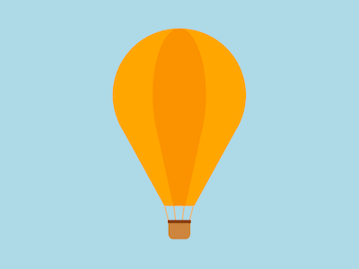

+++
title = '热气球'
date = 2018-10-13T17:53:55+08:00
image = '/fe/img/thumbs/155.png'
summary = '#155'
+++



## 效果预览

点击链接可以在 Codepen 预览。

[https://codepen.io/comehope/pen/KGveaN](https://codepen.io/comehope/pen/KGveaN)

## 可交互视频

此视频是可以交互的，你可以随时暂停视频，编辑视频中的代码。

[https://scrimba.com/p/pEgDAM/cgdaPsr](https://scrimba.com/p/pEgDAM/cgdaPsr)

## 源代码下载

每日前端实战系列的全部源代码请从 github 下载：

[https://github.com/comehope/front-end-daily-challenges](https://github.com/comehope/front-end-daily-challenges)

## 代码解读

定义 dom，容器中有 2 个子元素，`.envelope` 代表伞盖，`.basket` 代表吊篮：
```html
<figure class="balloon">
    <div class="envelope">
        <span></span>
        <span></span>
    </div>
    <div class="basket">
        <span></span>
        <span></span>
        <span></span>
        <span></span>
    </div>
</figure>
```

居中显示：
```css
body {
    margin: 0;
    height: 100vh;
    display: flex;
    align-items: center;
    justify-content: center;
	background: linear-gradient(deepskyblue, skyblue, lightblue 20%);
}
```

定义容器的尺寸，子元素 `.envelope` 和 `.basket` 纵向居中布局：
```css
.balloon {
    width: 12em;
    height: 19em;
    font-size: 16px;
    display: flex;
    flex-direction: column;
    align-items: center;
}
```

先画伞盖。
定义伞盖的尺寸：
```css
.envelope {
    position: relative;
    width: inherit;
    height: 16em;
}
```

伞盖的形状是上端为球形，下端为圆锥形，在二维平面中，圆锥在平面的投影为等腰三角形，所以我们先在上部画一个圆，再在下部画一个三角形。
先画上部的圆：
```css
.envelope span {
    position: absolute;
    width: inherit;
    height: 12em;
    border-radius: 50%;
    color: orange;
    background-color: currentColor;
}
```

再用伪元素画出下部的等腰三角形：
```css
.envelope span::before {
    content: '';
    position: absolute;
    width: 0;
    height: 0;
    border-width: 10em 5.5em 0 5.5em;
    border-style: solid;
    border-color: currentColor transparent transparent transparent;
    left: calc(50% - 5.5em);
    top: 8.45em;
}
```

`.envelope` 下共有 2 个 `<span>` 元素，让第 2 个 `<span>` 变形、变色，使伞盖形成竖条纹的花纹：
```css
.envelope span:nth-child(2) {
    transform: scaleX(0.4);
    filter: brightness(0.85) contrast(1.4);
}
```

隐藏 `.envelope` 容器外的部分，削掉三角形最下面的尖角：
```css
.envelope {   
    overflow: hidden;
}
```

至此，伞盖完成，接下来画吊篮。
定义吊篮的尺寸：
```css
.basket {
    position: relative;
    width: 2em;
    height: 3em;
}
```

用 `::before` 伪元素画出篮子：
```css
.basket::before {
    content: '';
    position: absolute;
    width: inherit;
    height: 1.6em;
    background-color: peru;
    bottom: 0;
    border-radius: 0 0 0.5em 0.5em;
}
```

用 `::after` 伪元素画出篮子的顶边：
```css
.basket::after {
    content: '';
    position: absolute;
    width: 105%;
    height: 0.3em;
    background-color: saddlebrown;
    left: calc((100% - 105%) / 2);
    top: 1.3em;
    border-radius: 0.3em;
}
```

`.basket` 下共有 4 个 `<span>` 元素，代表 4 根缆绳，设置它们的样式为竖细线：
```css
.basket span {
    position: absolute;
    width: 0.1em;
    height: 1.5em;
    background-color: burlywood;
}
```

定位缆绳，并倾斜不同的角度：
```css
.basket span {
    left: calc((var(--n) - 1) * 0.6em);
    transform-origin: bottom;
    transform: rotate(calc(var(--r) * 7deg));
}

.basket span:nth-child(1) { --n: 1; --r: -2; }
.basket span:nth-child(2) { --n: 2; --r: -1; }
.basket span:nth-child(3) { --n: 3; --r: 1; }
.basket span:nth-child(4) { --n: 4; --r: 2; }
```

最后，增加热气球微微浮动的动画效果：
```css
.balloon {
    animation: drift 2s infinite alternate;
}

@keyframes drift {
    to {
        transform: translateY(-5%);
    }
}
```

大功告成！
