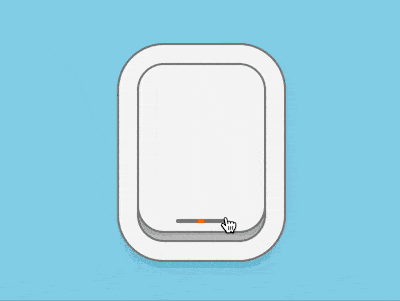

+++
title = '飞机舷窗 Toggle'
date = 2018-10-15T17:54:10+08:00
image = '/test-hugo-deploy/img/thumbs/156.png'
summary = '#156'
+++



## 效果预览

点击链接可以在 Codepen 预览。

[https://codepen.io/comehope/pen/jeaOrw](https://codepen.io/comehope/pen/jeaOrw)

## 可交互视频

此视频是可以交互的，你可以随时暂停视频，编辑视频中的代码。

[https://scrimba.com/p/pEgDAM/cdZVGSD](https://scrimba.com/p/pEgDAM/cdZVGSD)

## 源代码下载

每日前端实战系列的全部源代码请从 github 下载：

[https://github.com/comehope/front-end-daily-challenges](https://github.com/comehope/front-end-daily-challenges)

## 代码解读

定义 dom，`.windows` 容器表示舷窗，它的子元素 `.curtain` 表示窗帘：
```html
<figure class="window">
    <div class="curtain"></div>
</figure>
```

居中显示：
```css
body {
    margin: 0;
    height: 100vh;
    display: flex;
    align-items: center;
    justify-content: center;
    background-color: skyblue;
}
```

设置舷窗的尺寸，因为后面还会用到字号，所以字号用变量定义：
```css
:root {
    --font-size: 10px;
}

.window {
    position: relative;
    box-sizing: border-box;
    width: 25em;
    height: 35em;
    font-size: var(--font-size);
    background-color: #d9d9d9;
}
```

用阴影画出厚窗框：
```css
.window {
    border-radius: 5em;
    box-shadow: 
        inset 0 0 8em rgba(0, 0, 0, 0.2),
        0 0 0 0.4em #808080,
        0 0 0 4em whitesmoke,
        0 0 0 4.4em #808080,
        0 2em 4em 4em rgba(0, 0, 0, 0.1);
}
```

设置窗帘样式，和窗口尺寸一样，但不拉到底：
```css
.window .curtain {
    position: absolute;
    width: inherit;
    height: inherit;
    border-radius: 5em;
    box-shadow:
        0 0 0 0.5em #808080,
        0 0 3em rgba(0, 0, 0, 0.4);
    background-color: whitesmoke;
    left: 0;
    top: -5%;
}
```

用伪元素在窗帘上画出指示灯，当窗帘关闭时亮红色光：
```css
.window .curtain::before {
    content: '';
    position: absolute;
    width: 40%;
    height: 0.8em;
    background-color: #808080;
    left: 30%;
    bottom: 1.6em;
    border-radius: 0.4em;
}

.window .curtain::after {
    content: '';
    position: absolute;
    width: 1.6em;
    height: 0.8em;
    background-image: radial-gradient(orange, orangered);
    bottom: 1.6em;
    border-radius: 0.4em;
    left: calc((100% - 1.6em) / 2);
}
```

以上是舷窗关闭时的样子，接下来绘制舷窗打开时的效果。
先在 dom 中添加一个 `checkbox`，当它被 `checked` 时即表示舷窗被打开：
```html
<input type="checkbox" class="toggle">
<figure class="window">
    <div class="handle"></div>
</figure>
```

隐藏 `checkbox`，用 `opacity(0)` 可以使元素在不可见的状态下仍可交互，把它的尺寸设置得到舷窗一样大，并且图层在舷窗之上，得到的效果就是点击舷窗时实际是点击了 `checkbox`：
```css
.toggle {
    position: absolute;
    filter: opacity(0);
    width: 25em;
    height: 35em;
    font-size: var(--font-size);
    cursor: pointer;
    z-index: 2;
}
```

当舷窗打开时，`.curtain` 要向上移动，并且指示灯亮绿色光：
```css
.window .curtain {
    transition: 0.5s ease-in-out;
}

.toggle:checked ~ .window .curtain {
    top: -90%;
}

.toggle:checked ~ .window .curtain::after {
    background-image: radial-gradient(lightgreen, limegreen);
}
```

隐藏超出窗户的部分：
```css
.window {
    overflow: hidden;
}
```

接下来绘制舷窗外的风景。
在 dom 中增加表示云朵的 `.clouds` 元素，其中的 5 个 `<span>` 子元素分别表示 1 朵白云：
```html
<input type="checkbox" class="toggle">
<figure class="window">
    <div class="curtain"></div>
    <div class="clouds">
        <span></span>
        <span></span>
        <span></span>
        <span></span>
        <span></span>
    </div>
</figure>
```

用云朵容器画出窗外的蓝天：
```css
.window .clouds {
    position: relative;
    width: 20em;
    height: 30em;
    background-color: deepskyblue;
    box-shadow: 0 0 0 0.4em #808080;
    left: calc((100% - 20em) / 2);
    top: calc((100% - 30em) / 2);
    border-radius: 7em;
}
```

每朵云由 3 部分组成，先画面积最大的部分：
```css
.clouds span {
    position: absolute;
    width: 10em;
    height: 4em;
    background-color: white;
    top: 20%;
    border-radius: 4em;
}
```

再用伪元素画 2 个突起的圆弧：
```css
.clouds span::before,
.clouds span::after {
    content: '';
    position: absolute;
    width: 4em;
    height: 4em;
    background-color: white;
    border-radius: 50%;
}

.clouds span::before {
    top: -2em;
    left: 2em;
}

.clouds span::after {
    top: -1em;
    right: 1em;
}
```

增加云朵飘动的动画效果：
```css
.clouds span {
    animation: move 4s linear infinite;
}

@keyframes move {
    from {
        left: -150%;
    }

    to {
        left: 150%;
    }
}
```

使每朵云的大小、位置有一些变化：
```css
.clouds span:nth-child(2) {
    top: 40%;
    animation-delay: -1s;
}

.clouds span:nth-child(3) {
    top: 60%;
    animation-delay: -0.5s;
}

.clouds span:nth-child(4) {
    top: 20%;
    transform: scale(2);
    animation-delay: -1.5s;
}

.clouds span:nth-child(5) {
    top: 70%;
    transform: scale(1.5);
    animation-delay: -3s;
}
```

最后，隐藏容器外的内容：
```css
.window .clouds {
    overflow: hidden;
}
```

大功告成！
