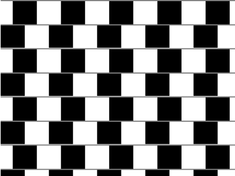

+++
title = '棋盘错觉'
date = 2018-10-17T17:54:26+08:00
image = '/fe/img/thumbs/157.png'
summary = '#157'
+++



## 效果预览

点击链接可以在 Codepen 预览。

[https://codepen.io/comehope/pen/VEyoGj](https://codepen.io/comehope/pen/VEyoGj)

## 可交互视频

此视频是可以交互的，你可以随时暂停视频，编辑视频中的代码。

[https://scrimba.com/p/pEgDAM/cppKmsd](https://scrimba.com/p/pEgDAM/cppKmsd)

## 源代码下载

每日前端实战系列的全部源代码请从 github 下载：

[https://github.com/comehope/front-end-daily-challenges](https://github.com/comehope/front-end-daily-challenges)

## 代码解读

定义 dom，容器中包含 10 个子元素，每个子元素表示一行：
```html
<div class="container">
    <span></span>
    <span></span>
    <span></span>
    <span></span>
    <span></span>
    <span></span>
    <span></span>
    <span></span>
    <span></span>
    <span></span>
</div>
```

居中显示：
```css
body {
    margin: 0;
    height: 100vh;
    display: flex;
    align-items: center;
    justify-content: center;
}
```

定义容器尺寸，用 `vmin` 单位，并让子元素竖向排列：
```css
.container {
    width: 100vmin;
    height: 100vmin;
    display: flex;
    flex-direction: column;
}
```

设置子元素的背景图案为间隔的黑白色块，顶部有一条细线：
```css
.container span {
    width: inherit;
    height: 10vmin;
    background: 
        linear-gradient(
            gray, gray 0.5vmin,
            transparent 0.5vmin, transparent
        ),
        repeating-linear-gradient(
            to right,
            black, black 10vmin,
            transparent 10vmin, transparent 20vmin
        )
}
```

在容器底部补一条细线：
```css
.container {
    border-bottom: 0.5vmin solid gray;
}
```

增加动画效果，让奇数行的背景向右移动半个色块的位置，移动之后看起来好像奇数行右宽左窄，偶数行左宽右窄，这是一种错觉：
```css
.container span:nth-child(odd) {
    animation: move 5s linear infinite;
}

@keyframes move {
    0%, 55%, 100% {
        background-position: 0 0;
    }

    5%, 50% {
        background-position: 5vmin 0;
    }
}
```

让偶数行的背景也移动起来，产生相反方向的错觉：
```css
.container span:nth-child(even) {
    animation: move 5s linear infinite reverse;
}
```

大功告成！
