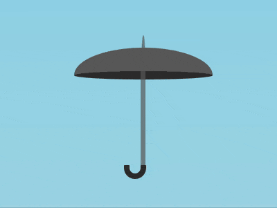

+++
title = '雨伞 Toggle'
date = 2018-10-18T17:54:45+08:00
image = '/test-hugo-deploy/img/thumbs/158.png'
summary = '#158'
+++



## 效果预览

点击链接可以在 Codepen 预览。

[https://codepen.io/comehope/pen/pxLbjv](https://codepen.io/comehope/pen/pxLbjv)

## 可交互视频

此视频是可以交互的，你可以随时暂停视频，编辑视频中的代码。

[https://scrimba.com/p/pEgDAM/cMV8euJ](https://scrimba.com/p/pEgDAM/cMV8euJ)

## 源代码下载

每日前端实战系列的全部源代码请从 github 下载：

[https://github.com/comehope/front-end-daily-challenges](https://github.com/comehope/front-end-daily-challenges)

## 代码解读

定义 dom，容器 `.umbralla` 中包含 2 个元素，`.canopy` 代表伞盖，`.shaft` 伞柄：
```html
<figure class="umbralla">
    <div class="canopy"></div>
    <div class="shaft"></div>
</figure>
```

居中显示：
```css
body {
    margin: 0;
    height: 100vh;
    display: flex;
    align-items: center;
    justify-content: center;
    background: linear-gradient(skyblue, lightblue);
}
```

设置伪元素的共有属性：
```css
.umbrella *::before,
.umbrella *::after {
    content: '';
    position: absolute;
}
```

先画出雨伞打开的样子。
设置容器尺寸，其中 `font-size` 的属性值后面还要用到，所以定义了一个变量：
```css
:root {
    --font-size: 10px;
}

.umbrella {
    position: relative;
    width: 25em;
    height: 26em;
    font-size: var(--font-size);
}
```

定义伞盖的尺寸：
```css
.umbrella .canopy {
    position: absolute;
    width: inherit;
    height: 5.5em;
    top: 2.5em;
}
```

用 `::before` 伪元素画出伞盖的上半部分，方法先画一个半圆，然后在垂直方向上压缩它：
```css
.umbrella .canopy::before {
    width: inherit;
    height: 12.5em;
    background: rgb(100, 100, 100);
    border-radius: 12.5em 12.5em 0 0;
    transform: scaleY(0.4);
    top: -4em;
}
```

用 `::after` 伪元素画出伞盖的下半部分：
```css
.umbrella .canopy::after {
    width: inherit;
    height: 1.5em;
    background-color: #333;
    top: 4em;
    border-radius: 50%;
}
```

画出伞柄的长杆：
```css
.umbrella .shaft {
    position: absolute;
    width: 0.8em;
    height: 18em;
    background-color: rgba(100, 100, 100, 0.7);
    top: 5.5em;
    left: calc((100% - 0.8em) / 2);
}
```

用伪元素画出伞杆顶部露出伞盖的尖头，方法和画伞盖上半部分类似，先画出半圆，然后在水平方向上压缩它：
```css
.umbrella .shaft::before {
    width: 6em;
    height: 3em;
    background-color: rgba(100, 100, 100, 0.7);
    left: calc((100% - 6em) / 2);
    top: -5.5em;
    border-radius: 6em 6em 0 0;
    transform: scaleX(0.1);
}
```

画出雨伞的钩形把手：
```css
.umbrella .shaft::after {
    box-sizing: border-box;
    width: 4em;
    height: 2.5em;
    border: 1em solid #333;
    top: 100%;
    left: calc(50% - 4em + 1em / 2);
    border-radius: 0 0 2.5em 2.5em;
    border-top: none;
}
```

至此，完成了雨伞打开的样子，接下来通过变形画出雨伞合上时的样子。
先把伞盖的合上，方法是在水平方向上压缩，在垂直方向上拉伸：
```css
.umbrella .canopy {
    transform-origin: top;
    transform: scale(0.08, 4);
}
```

隐藏伞盖的下半部分：
```css
.umbrella .canopy::after {
    transform: scaleY(0);
}
```

让伞倾斜，因为竖着的伞有点呆板，所以增加一点变化：
```css
.umbrella {
    transform: rotate(-30deg);
}
```

至此，雨伞合上时的样子也完成了，接下来要把它变为 toggle 控件了。
在 dom 中增加一个 `checkbox` 控件：
```html
<input type="checkbox" class="toggle">
<figure class="umbrella">
    <!-- 略 -->
</figure>
```

设置控件与雨伞一样大，并置于雨伞图层的上层：
```css
.toggle {
    position: absolute;
    filter: opacity(0);
    width: 25em;
    height: 26em;
    font-size: var(--font-size);
    cursor: pointer;
    z-index: 2;
}
```

`checkbox` 控件的未选中状态对应雨伞合上时的样子，也就是目前雨伞的样子，所以只要指定控件被选中状态对应的雨伞打开时的样子就可以了。因为合上雨伞是对几个元素进行变形得到的，所以转换到雨伞打开状态就是取消变形。
先让伞正过来：
```css
.toggle:checked ~ .umbrella {
    transform: rotate(0deg);
}
```

然后把伞盖打开：
```css
.toggle:checked ~ .umbrella .canopy {
    transform: scale(1, 1);
}
```

再显示出伞盖的下半部分：
```css
.toggle:checked ~ .umbrella .canopy::after {
    transform: scaleY(1);
}
```

最后，设置以上几个元素的缓动效果：
```css
.umbrella,
.umbrella .canopy,
.umbrella .canopy::after {
    transition: 0.3s cubic-bezier(0.5, -0.25, 0.5, 1.25);
}
```

大功告成！
