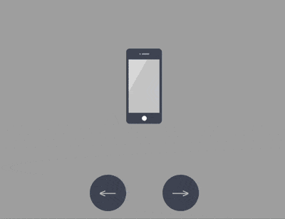

+++
title = '苹果设备'
date = 2018-10-21T17:55:00+08:00
image = '/test-hugo-deploy/img/thumbs/159.png'
summary = '#159'
+++



## 效果预览

点击链接可以在 Codepen 预览。

[https://codepen.io/comehope/pen/gBKWdW](https://codepen.io/comehope/pen/gBKWdW)

## 可交互视频

此视频是可以交互的，你可以随时暂停视频，编辑视频中的代码。

第 1 部分：
[https://scrimba.com/p/pEgDAM/cazRgcL](https://scrimba.com/p/pEgDAM/cazRgcL)

第 2 部分：
[https://scrimba.com/p/pEgDAM/ceDK7cB](https://scrimba.com/p/pEgDAM/ceDK7cB)

## 源代码下载

每日前端实战系列的全部源代码请从 github 下载：

[https://github.com/comehope/front-end-daily-challenges](https://github.com/comehope/front-end-daily-challenges)

## 代码解读

定义 dom，包含 5 个子元素，分别代表 iphone, mini, ipad, macbook, imac 这 5 种设备：
```html
<div class="container">
    <div class="device iphone"></div>
    <div class="device mini"></div>
    <div class="device ipad"></div>
    <div class="device macbook"></div>
    <div class="device imac"></div>
</div>
```

居中显示：
```css
body {
    margin: 0;
    height: 100vh;
    display: flex;
    align-items: center;
    justify-content: center;
    background-color: #aaa;
}
```

设置容器中子元素的布局方式：
```css
.container {
    position: relative;
    display: flex;
    flex-direction: column;
    align-items: center;
}
```

设置设备的共有属性，线性渐变图案将作为屏幕的背景：
```css
.device {
    box-sizing: border-box;
    position: relative;
    display: flex;
    justify-content: center;
    background: linear-gradient(120deg, #ddd 30%, #ccc 30%);
}

.device::before,
.device::after {
    content: '';
    position: absolute;
}
```

iphone, mini, ipad 的造型相似，都有顶部摄像头和传感器开口和底部按钮，所以这些共有属性可以一起设置，用 `::before` 伪元素画出顶部细节，`::after` 伪元素画出底部按钮：
```css
.iphone::before,
.mini::before,
.ipad::before {
    width: 2px;
    height: 2px;
    border-style: solid;
    border-color: #a5adbe;
    border-width: 0 12px 0 2px;
}

.iphone::after,
.mini::after,
.ipad::after {
    width: 8px;
    height: 8px;
    background-color: white;
    border-radius: 50%;
}
```

接下来逐个画出设备。先画出 iphone 的轮廓：
```css
.iphone {
    width: 59px;
    height: 124px;
    border: #484f5e solid;
    border-width: 18px 4px;
    border-radius: 6px;
}
```

定位 iphone 的顶部和底部细节：
```css
.iphone::before {
    top: -10px;
}

.iphone::after {
    bottom: -13px;
}
```

类似地，画出 mini：
```css
.mini {
    width: 93px;
    height: 138px;
    border: #484f5e solid;
    border-width: 14px 5px;
    border-radius: 10px;
}

.mini::before {
    top: -8px;
}

.mini::after {
    bottom: -11px;
}
```

再画出 ipad：
```css
.ipad {
    width: 134px;
    height: 176px;
    border: #484f5e solid;
    border-width: 18px 13px;
    border-radius: 12px;
}

.ipad::before {
    top: -10px;
}

.ipad::after {
    bottom: -13px;
}
```

接下来画 macbook，先画屏幕：
```css
.macbook {
    width: 234px;
    height: 155px;
    border: 8px solid #484f5e;
    border-radius: 7px 7px 0 0;
}
```

用 `::before` 伪元素画出摄像头：
```css
.macbook::before {
    width: 294px;
    height: 14px;
    background-color: #e8ebf0;
    top: calc(100% + 8px);
    border-radius: 0 0 14px 14px;
}
```

用 `::after` 伪元素画出主机：
```css
.macbook::after {
    width: 3px;
    height: 3px;
    background-color: #a5adbe;
    top: -6px;
    border-radius: 50%;
}
```

接下来画 imac，先画屏幕，屏幕的左、上、右的黑色边框没有用 `border` 属性画，是因为 `border` 会在端点处遗留一个斜角，所以改用 `box-shadow` 实现：
```css
.imac {
    width: 360px;
    height: 215px;
    border-radius: 10px;
    box-shadow: 
        inset 0 14px #484f5e,
        inset 14px 0 #484f5e,
        inset -14px 0 #484f5e;
    border-bottom: 33px solid #e8ebf1;
    transform: translateY(14px);
}
```

用 `::before` 伪元素画出梯形的底座：
```css
.imac::before {
    width: 90px;
    height: 0;
    top: calc(100% + 33px);
    border: solid transparent;
    border-bottom-color: #e2e4e8;
    border-width: 0 10px 47px 10px;
}
```

用 `::after` 伪元素画出顶部的摄像头和屏幕底部的按钮，注意按钮是用 `box-shadow` 实现的：
```css
.imac::after {
    width: 4px;
    height: 4px;
    background-color: #a5adbe;
    top: 5px;
    border-radius: 50%;
    box-shadow: 0 191px 0 4px #464e5d;
}
```

至此，设备全部绘制完成。
删除除 iphone 之外的其他设备的 dom 元素，只保留 1 个 dom 元素，后面的动画效果都在这个 dom 元素上变化：
```html
<div class="container">
        <div class="device iphone"></div>
        <!-- <div class="device mini"></div>
        <div class="device ipad"></div>
        <div class="device macbook"></div>
        <div class="device imac"></div> -->
    </div>
```

设置容器尺寸，子元素垂直居中，设备的高度占容器高度的 75%：
```css
.container {
    width: 360px;
    height: 350px;
    justify-content: center;
}

.device {
    transform: translateY(-25%);
}
```


在 dom 中增加 2 个按钮元素，分别用 `.left` 和 `.right` 表示：
```html
<div class="container">
    <div class="device iphone"></div>
    <div class="buttons">
        <span class="left"></span>
        <span class="right"></span>
    </div>
</div>
```

定位按钮的位置：
```css
.buttons {
    position: absolute;
    width: inherit;
    font-size: 30px;
    height: 2em;
    bottom: 0;
    display: flex;
    justify-content: space-around;
}

.buttons > * {
    position: relative;
    width: 4em;
}
```

按钮为向左和向右的箭头：
```css
.buttons > *::before {
    position: absolute;
}

.buttons .left::before {
    content: '←';
    right: 0;
}

.buttons .right::before {
    content: '→';
}
```

设置按钮样式为圆形：
```css
.buttons > *t::before {
    position: absolute;
    width: 2em;
    height: 2em;
    background-color: #484f5e;
    color: silver;
    text-align: center;
    line-height: 2em;
    border-radius: 1em;
    cursor: pointer;
}
```

增加鼠标悬停效果：
```css
.buttons > *::before {
    transition: 0.2s;
}

.buttons .left:hover::before {
    width: 4em;
    content: '⟵';
}

.buttons .right:hover::before {
    width: 4em;
    content: '⟶';
}
```

增加按钮点击效果：
```css
.buttons > *:active {
    transform: scale(0.9);
    filter: brightness(0.8);
}
```

至此，按钮制作完毕，接下来创建交互脚本。

定义一个获取元素的函数 `$`：
```javascript
const $ = (className) => document.getElementsByClassName(className)[0]
```

定义一个存放设备名称的数组：
```javascript
let devices = ['iphone', 'mini', 'ipad', 'macbook', 'imac']
```

定义点击行为对数据的加工方法，当点击左侧按钮时，把数组最左边的 1 个元素移到最右边，相反地，当点击右侧按钮时，把数组最右边的 1 个元素移到最左边，这样就可以从 2 个方向循环遍历数组了：
```javascript
let loop = {
    'left': () => devices.unshift(devices.pop()),
    'right': () => devices.push(devices.shift())
}
```

定义点击事件，根据数组的变化切换设备：
```javascript
Array.from($('buttons').children).forEach(element =>
    element.addEventListener('click', function(e) {
        loop[e.target.className]()
        $('device').className = 'device ' + devices[0]
    })
)
```

最后，设置设备切换的缓动效果：
```css
.device,
.device::before,
.device::after {
    transition: 0.4s cubic-bezier(0.5, 1.7, 0.5, 1.2);
}
```

大功告成！
