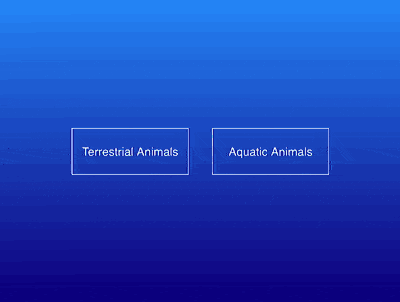

+++
title = '打开弹窗的交互动画'
date = 2018-10-23T17:55:17+08:00
image = '/test-hugo-deploy/img/thumbs/160.png'
summary = '#160'
+++



## 效果预览

点击链接可以在 Codepen 预览。

[https://codepen.io/comehope/pen/GYXvez](https://codepen.io/comehope/pen/GYXvez)

## 可交互视频

此视频是可以交互的，你可以随时暂停视频，编辑视频中的代码。

[https://scrimba.com/p/pEgDAM/cNzVnAL](https://scrimba.com/p/pEgDAM/cNzVnAL)

## 源代码下载

每日前端实战系列的全部源代码请从 github 下载：

[https://github.com/comehope/front-end-daily-challenges](https://github.com/comehope/front-end-daily-challenges)

## 代码解读

定义 dom，一个名为 `.main` 的容器中包含 1 个链接：
```html
<div class="main">
    <a href="#" class="open-popup">open popup</a>
</div>
```

设置页面的基本属性：无边距、全高、忽略溢出：
```css
body {
    margin: 0;
    height: 100vh;
    overflow: hidden;
}
```

设置主界面的背景和其中按钮的布局方式：
```css
.main {
    height: inherit;
    background: linear-gradient(dodgerblue, darkblue);
    display: flex;
    align-items: center;
    justify-content: center;
}
```

设置按钮样式：
```css
.open-popup {
    box-sizing: border-box;
    color: white;
    font-size: 16px;
    font-family: sans-serif;
    width: 10em;
    height: 4em;
    border: 1px solid;
    text-align: center;
    line-height: 4em;
    text-decoration: none;
    text-transform: capitalize;
}
```

设置按钮悬停效果：
```css
.open-popup:hover {
    border-width: 2px;
}
```

至此，主界面完成，接下来制作弹窗。
在 dom 中增加的 `.popup` 小节表示弹窗内容，其中的 `<a>` 是返回按钮，`<p>` 是具体内容，这里我们把内容简化为一些陆生动物的 unicode 字符，为了能够触发这个弹窗，设置 `.popup` 的 `id` 为 `terrestrial`，并在 `.main` 的 `<a>` 链接中指向它：
```html
<div class="main">
    <a href="#terrestrial" class="open-popup">terrestrial animals</a>
</div>
<section id="terrestrial" class="popup">
    <a href="#" class="back">&lt; back</a>
    <p>🦓🦒🐅🐆🐘🦏🐃🦌🐐🐫</p>
</section>
```

设置弹窗的尺寸，它将覆盖刚才的 `.main` 的内容：
```css
.popup {
    position: absolute;
    top: 0;
    width: 100%;
    height: inherit;
    display: flex;
    flex-direction: column;
    justify-content: start;
}
```

设置返回按钮的样式：
```css
.popup .back {
    font-size: 20px;
    font-family: sans-serif;
    text-align: center;
    height: 2em;
    line-height: 2em;
    background-color: #ddd;
    color: black;
    text-decoration: none;
}

.popup .back:visited {
    color: black;
}

.popup .back:hover {
    background-color: #eee;
}
```

设置内容的样式：
```css
.popup p {
    font-size: 100px;
    text-align: center;
    margin: 0.1em 0.05em;
}
```

设置弹窗内容默认是不显示的，只有点击主界面的链接时才显示：
```css
.popup {
    display: none;
}

.popup:target {
    display: flex;
}
```

至此，弹窗完成，但弹窗中的内容是重叠在主界面上面的，接下来制作从主界面到弹窗的动画效果。
动画效果包含 3 个步骤：页面中间的一条直线从左端横穿到右端，页面中间大幕向上下两端拉开，最后内容淡入，下面的制作过程依次是第 3 个步骤、第 2 个步骤、第 1 个步骤。
先让弹窗内容淡入：
```css
.popup > * {
    filter: opacity(0);
    animation: fade 0.5s ease-in forwards;
}

@keyframes fade{
    to {
        filter: opacity(1);
    }
}
```

用伪元素 `::before` 制作一个白色背景，从页面中间向上下两端展开：
```css
.popup::before {
    content: '';
    position: absolute;
    box-sizing: border-box;
    width: 100%;
    height: 0;
    top: 50%;
    background-color: white;
    animation: open-animate 0.5s cubic-bezier(0.8, 0.2, 0, 1.2) forwards;
}

@keyframes open-animate {
    to {
        height: 100vh;
        top: 0;
    }
}
```

设置弹窗淡入动画的延时时长，形成先大幕拉开再显示内容的效果：
```css
.popup > * {
    animation-delay: 0.5s;
}
```

用伪元素 `::after` 制作一条横线，从页面左端横穿到右端：
```css
.popup::after {
    content: '';
    position: absolute;
    width: 0;
    height: 2px;
    background-color: white;
    top: calc((100% - 2px) / 2);
    left: 0;
    animation: line-animate 0.5s cubic-bezier(0.8, 0.2, 0, 1.2);
}

@keyframes line-animate {
    50%, 100% {
        width: 100%;
    }
}
```

再设置弹窗淡入动画和大幕拉开动画的延时时长，让动画效果依次执行：
```css
.popup > * {
    animation-delay: 1s;
}

.popup::before {
    animation-delay: 0.5s;
}
```

至此，整个动画效果完成。
在 dom 再中增加一组水生动物的内容，以及打开它的链接：
```html
<div class="main">
    <a href="#terrestrial" class="open-popup">terrestrial animals</a>
    <a href="#aquatic" class="open-popup">aquatic animals</a>
</div>
<section id="terrestrial" class="popup">
    <a href="#" class="back">&lt; back</a>
    <p>🦓🦒🐅🐆🐘🦏🐃🦌🐐🐫</p>
</section>
<section id="aquatic" class="popup">
    <a href="#" class="back">&lt; back</a>
    <p>🐋🐳🐬🐟🐠🐡🐙🦑🦐🦀</p>
</section>
```

最后，设置一下主界面上按钮的间距：
```css
.open-popup {
    margin: 1em;
}
```

大功告成！
