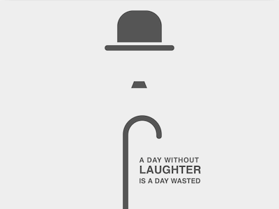

+++
title = '卓别林'
date = 2018-10-24T17:55:41+08:00
image = '/fe/img/thumbs/161.png'
summary = '#161'
+++



## 效果预览

点击链接可以在 Codepen 预览。

[https://codepen.io/comehope/pen/WaaBNV](https://codepen.io/comehope/pen/WaaBNV)

## 可交互视频

此视频是可以交互的，你可以随时暂停视频，编辑视频中的代码。

[https://scrimba.com/p/pEgDAM/c3DQeC7](https://scrimba.com/p/pEgDAM/c3DQeC7)

## 源代码下载

每日前端实战系列的全部源代码请从 github 下载：

[https://github.com/comehope/front-end-daily-challenges](https://github.com/comehope/front-end-daily-challenges)

## 代码解读

定义 dom，容器中包含的 3 个元素分别代表帽子、胡须和手杖：
```html
<figure class="chaplin">
    <span class="hat"></span>
    <span class="beard"></span>
    <span class="stick"></span>
</figure>
```

居中显示：
```css
body {
    margin: 0;
    height: 100vh;
    display: flex;
    align-items: center;
    justify-content: center;
}
```

定义容器尺寸，并设置子元素水平居中：
```css
.chaplin {
    width: 40em;
    height: 30em;
    font-size: 10px;
    background-color: #eee;
    box-shadow: 0 0 3em rgba(0, 0, 0, 0.2);
    display: flex;
    flex-direction: column;
    align-items: center;
}
```

定义默认颜色，后面用 `currentColor` 引用此颜色：
```css
.chaplin {
    color: #555;
}
```

画出帽子的轮廓：
```css
.chaplin {
    position: relative;
}

.hat {
    position: absolute;
    width: 6.4em;
    height: 4.6em;
    background-color: currentColor;
    border-radius: 2.3em 2.3em 0 0;
    top: 1.4em;
}
```

用伪元素画出帽沿：
```css
.hat::before {
    content: '';
    position: absolute;
    width: 10em;
    height: 0.8em;
    background-color: currentColor;
    border-radius: 0.4em;
    top: calc(100% + 0.4em);
    left: calc((100% - 10em) / 2);
}
```

画出胡子：
```css
.beard {
    position: absolute;
    width: 1.5em;
    height: 0;
    top: 11.6em;
    border: solid transparent;
    border-width: 0 0.4em 1em 0.4em;
    border-bottom-color: currentColor;
}
```

画出手杖的杖杆：
```css
.stick {
    position: absolute;
    width: 0.8em;
    height: 10.5em;
    background-color: currentColor;
    bottom: 0;
}
```

用 `::before` 伪元素画出手杖的握柄：
```css
.stick::before {
    content: '';
    position: absolute;
    box-sizing: border-box;
    width: 5.6em;
    height: 3em;
    border: 0.8em solid;
    border-radius: 5.6em 5.6em 0 0;
    border-bottom: none;
    top: -3em;
}
```

用 `::after` 伪元素修饰握柄的端点，使其圆润自然：
```css
.stick::after {
    content: '';
    position: absolute;
    width: 0.8em;
    height: 0.8em;
    background-color: currentColor;
    border-radius: 50%;
    left: calc(5.6em - 0.8em);
    top: -0.4em;
}
```

使手杖水平居中：
```css
.stick {
    left: calc((100% - (5.6em - 0.8em)) / 2);
}
```

至此，抽象的卓别林形象完成，接下来排版一句他的名言。
在 dom 中增加一个 `.quote` 元素，并把一句话分为 3 段：
```html
<figure class="chaplin">
    <span class="hat"></span>
    <span class="beard"></span>
    <span class="stick"></span>
    <p class="quote">
        <span>a day without</span>
        <span>laughter</span>
        <span>is a day wasted</span>
    </p>
</figure>
```

定位文字，并竖排 3 段文字：
```css
.quote {
    position: absolute;
    left: 50%;
    bottom: 2.5em;
    font-family: sans-serif;
    text-transform: uppercase;
    font-weight: bold;
    display: flex;
    flex-direction: column;
}
```


```css
.quote span:nth-child(1) {
    letter-spacing: 0.05em;
}

.quote span:nth-child(2) {
    font-size: 1.6em;
}
```

大功告成！
