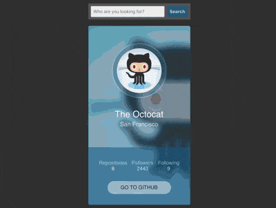

+++
title = 'Github 用户卡片'
date = 2018-11-19T17:55:57+08:00
image = '/fe/img/thumbs/162.png'
summary = '#162'
+++



## 效果预览

点击链接可以在 Codepen 预览。

[https://codepen.io/comehope/pen/oQGqaG](https://codepen.io/comehope/pen/oQGqaG)

## 可交互视频

此视频是可以交互的，你可以随时暂停视频，编辑视频中的代码。

第 1 部分：
[https://scrimba.com/p/pEgDAM/cEPkVUg](https://scrimba.com/p/pEgDAM/cEPkVUg)

第 2 部分：
[https://scrimba.com/p/pEgDAM/crp63TR](https://scrimba.com/p/pEgDAM/crp63TR)

（因为 scrimba 不支持 web animation api，第 2 部分末尾的动画效果在视频中看不到，请参考 codepen）

## 源代码下载

每日前端实战系列的全部源代码请从 github 下载：

[https://github.com/comehope/front-end-daily-challenges](https://github.com/comehope/front-end-daily-challenges)


## 代码解读

这是一个读取 github 用户的应用，在搜索框内输入用户名，点击搜索后，就会通过 github 的 open api 取得用户信息，填写到下方的卡片中。

整个应用分成 3 个步骤开发：静态的页面布局、从 open api 读取数据并绑定到页面中、增加动画效果。

### 一、页面布局

定义 dom，整体结构分成上部的表单和下部的用户卡片：
```html
<div class="app">
    <form>
        <!-- 暂略 -->
    </form>
    <div class="profile">
        <!-- 暂略 -->
    </div>
</div>
```

居中显示：
```css
body {
    margin: 0;
    height: 100vh;
    display: flex;
    align-items: center;
    justify-content: center;
    background-color: #383838;
}
```

定义应用容器的尺寸：
```css
.app {
    width: 320px;
    height: 630px;
    font-family: sans-serif;
    position: relative;
}
```

这是表单的 dom 结构，2 个表单控件分别是文本输入框 `#username` 和搜索按钮 `#search`，因为后面的脚本要引用这 2 个控件，所以为它们定义了 id 属性，接下来在 css 中也使用 id 选择器：
```html
<form>
    <input placeholder="Who are you looking for?" id="username">
    <input type="button" value="Search" id="search">
</form>
```

令 2 个表单控件横向排列：
```css
form {
    height: 50px;
    background-color: rgba(255, 255, 255, 0.2);
    border-radius: 2px;
    box-sizing: border-box;
    padding: 8px;
    display: flex;
}
```

分别设置 2 个表单控件的样式：
```css
input {
    border: none;
    font-size: 14px;
    outline: none;
    border-radius: inherit;
    padding: 0 8px;
}
  
#username {
    flex-grow: 1;
    background-color: rgba(255, 255, 255, 0.9);
    color: #42454e;
}
  
#search {
    background-color: rgba(0, 97, 145, 0.75);
    color: rgba(255, 255, 255, 0.8);
    font-weight: bold;
    margin-left: 8px;
    cursor: pointer;
}
```

为按钮增加悬停和点击的交互效果：
```css
#search:hover {
    background-color: rgba(0, 97, 145, 0.45);
}

#search:active {
    transform: scale(0.98);
    background-color: rgba(0, 97, 145, 0.75);
}
```

至此，表单布局完成，接下来做用户卡片布局。
用户卡片的 dom 结构如下，卡片分成上半部分 `.header` 和下半部分 `.footer`，上半部分包括头像 `.avatar`、名字 `.name` 和位置 `.location`，下半部分包括一组详细的数据 `.details` 和一个跳到 github 的链接 `.to-github`：
```html
<div class="profile">
    <div class="header">
        <div class="avatar"></div>
        <h2 class="name">Octocat</h2>
        <h3 class="location">San Francisco</h3>
    </div>
    <div class="footer">
        <ul class="details">
            <li>Repositories<span>111</span></li>
            <li>Followers<br><span>222</span></li>
            <li>Following<br><span>333</span></li>
        </ul>
        <a href="#" class="to-github">go to github</a>
    </div>
</div>
```

令卡片的上半部分和下半部分竖向排列，并分别设置两部分的高度，大约是上半部分占卡片高度的三分之二，下半部分占卡片高度的三分之一，此时可以看出卡片的轮廓了：
```css
.profile {
    width: 320px;
    position: absolute;
    margin: 20px 0 0 0;
    display: flex;
    flex-direction: column;
    border-radius: 5px;
}

.header {
    height: 380px;
    background-color: rgba(0, 97, 145, 0.45);
}

.footer {
    height: 180px;
    background-color: rgba(0, 97, 145, 0.75);
}
```

令卡片上半部分的子元素竖向排列：
```css
.header {
    display: flex;
    flex-direction: column;
    align-items: center;
}
```

设置头像图片，样式为描边的圆形，因为头像图片在后面还会用到，所以把它存储到变量 `--avatar` 中：
```css
.profile {
    --avatar: url('https://avatars3.githubusercontent.com/u/583231?v=4');
}

.avatar {
    width: 140px;
    height: 140px;
    background-image: var(--avatar);
    margin: 70px 0 0 0;
    background-position: center;
    background-size: cover;
    border-radius: 50%;
    box-shadow: 
        0 0 0 0.8em rgba(0, 0, 0, 0.2),
        0 0 0 1em rgba(161, 220, 255, 0.35);
}
```

设置名字和位置信息的样式，文字为白色：
```css
.name {
    margin: 50px 0 0 0;
    color: white;
    font-size: 28px;
    font-weight: normal;
    text-shadow: 0 1px 2px rgba(0, 0, 0, 0.15);
}

.location {
    margin: 5px 0 0 0;
    color: rgba(255, 255, 255, 0.75);
    font-weight: normal;
}
```

至此，上半部分的布局完成，接下来布局下半部分。
令下半部分的子元素竖向排列：
```css
.footer {
    display: flex;
    flex-direction: column;
    align-items: center;
}
```

横向排列三组数据，每项之间加入细分隔线：
```css
.details {
    list-style-type: none;
    padding: 0;
    display: flex;
    margin: 40px 0 0 0;
}

.details li {
    color: rgba(255, 255, 255, 0.6);
    text-align: center;
    padding: 0 6px;
}

.details li span {
    display: block;
    color: rgba(255, 255, 255, 0.8);
}

.details li:not(:first-child) {
    border-left: 2px solid rgba(255, 255, 255, 0.15);
}
```

设置跳转到 github 的链接样式和悬停效果：
```css
.to-github {
    width: 200px;
    height: 40px;
    background-color: rgba(255, 255, 255, 0.5);
    text-align: center;
    line-height: 40px;
    color: rgba(0, 0, 0, 0.75);
    text-decoration: none;
    text-transform: uppercase;
    border-radius: 20px;
    transition: 0.3s;
}

.to-github:hover {
    background-color: rgba(255, 255, 255, 0.8);
}
```

至此，下半部分布局完成。
接下来用伪元素把头像图片作为整体背景：
```css
.profile {
    position: relative;
    overflow: hidden;
}

.profile::before {
    content: '';
    position: absolute;
    width: calc(100% + 20px * 2);
    height: calc(100% + 20px * 2);
    background-image: var(--avatar);
    background-size: cover;
    z-index: -1;
    margin: -20px;
    filter: blur(10px);
}
```

到这里，整体的静态布局就完成了。

### 二、绑定数据

为了绑定数据，我们引入一个羽量级的模板库：
```html
<script src="https://blueimp.github.io/JavaScript-Templates/js/tmpl.min.js"></script>
```

把卡片 `.profile` 包含的 dom 结构改写为 html 模板 `#template`，其中的 `o` 代表绑定的数据数据对象：
```html
<script type="text/x-tmpl" id="template">
    <div class="header">
        <div class="avatar"></div>
        <h2 class="name"></h2>
        <h3 class="location"></h3>
    </div>
    <div class="footer">
        <ul class="details">
            <li>Repositories<span></span></li>
            <li>Followers<br><span></span></li>
            <li>Following<br><span></span></li>
        </ul>
        <a href="" class="to-github">go to github</a>
    </div>
</script>
```

声明一个假数据对象 `mockData`，它的数据结构与 github open api 的数据结构是一致的：
```javascript
let mockData = {
    "avatar_url": "https://avatars3.githubusercontent.com/u/583231?v=4",
    "name": "The Octocat",
    "location": "San Francisco",
    "public_repos": 111,
    "followers": 222,
    "following": 333,
    "html_url": "https://github.com/octocat",
}
```

定义一个把数据绑定到 html 模板的函数 `render(container, data)`，第 1 个参数 `container` 表示 dom 容器，模板内容将填充在此容器中；第 2 个参数是数据对象。在页面载入时调用 `render()` 方法，把 `mockData` 作为参数传入，此时看到的效果和纯静态的效果一致，但用户卡片已经改为动态创建了：
```javascript
window.onload = render(document.getElementsByClassName('profile')[0], mockData)

function render(container, data) {
    container.innerHTML = tmpl('template', data)
    container.style.setProperty('--avatar', `url(${data.avatar_url})`)
}
```

定义一个从 github open api 读取用户信息的方法 `getData(username)`，然后调用 `render()` 方法把用户信息绑定到 html 模板。同时，把 `window.onload` 绑定的事件改为调用 `getData()` 方法，此时看到的效果仍和纯静态的效果一致，但数据已经变成动态读取了：
```javascript
window.onload = getData('octocat')

function getData(username) {
    let apiUrl = `https://api.github.com/users/${username}`
    fetch(apiUrl)
        .then((response) => response.json())
        .then((data) => render(document.getElementsByClassName('profile')[0], data))
}
```

为表单的 `search` 按钮绑定点击事件，实现搜索功能。可以查一下自己的 github 帐号试试看：
```javascript
document.getElementById('search').addEventListener('click', () => {
    let username = document.getElementById('username').value.replace(/[ ]/g, '')
    if (username == '') {
        return
    }
    getData(username)
})
```

### 三、增加动画效果

为了能让用户感受到每次搜索后数据的变化过程，我们增加一点动画效果。创建一个 `update(data)` 函数来处理动画和渲染逻辑，同时把 `getData()` 函数的最后一步改为调用 `update()` 函数：
```javascript
function getData(username) {
    let apiUrl = `https://api.github.com/users/${username}`
    fetch(apiUrl)
        .then((response) => response.json())
        // .then((data) => render(document.getElementsByClassName('profile')[0], data))
        .then(update)
}

function update(data) {
    let current = document.getElementsByClassName('profile')[0]
    render(current, data)
}
```

当页面首次载入时，不需要动画，直接渲染默认的用户信息即可。变量 `isInitial` 表示本次调用是否是在初始化页面时调用的，若是，就直接渲染。若不是，下面会执行动画效果。
```javascript
function update(data) {
    let current = document.getElementsByClassName('profile')[0]
    let isInitial = (current.innerHTML == '')

    if (isInitial) {
        render(current, data)
        return
    }
}
```

动画的过程是：创建一张新卡片，把数据绑定到新卡片上，然后把当前卡片移出视图，再把新卡片移入视图。下面的变量 `next` 代表新创建的卡片，把它定位到当前卡片的右侧：
```javascript
function update(data) {
    let current = document.getElementsByClassName('profile')[0]
    let isInitial = (current.innerHTML == '')

    if (isInitial) {
        render(current, data)
        return
    }

    let next = document.createElement('div')
    next.className = 'profile'
    next.style.left = '100%'
    render(next, data)
    current.after(next)
}
```

因为动画分成 2 个动作——当前卡片移出和新卡片移入，所以我们定义 2 个动画效果，变量 `animationOut` 代表移出动画的参数，变量 `animationIn` 代表移入动画的参数。其中，`keyframes` 属性值相当于写 css 动画时用 `@keyframes` 定义的关键帧，`options` 属性值相当于写 css 动画时 `animation` 语句后面的参数，新卡片移入动画有半秒钟的延时。
```javascript
function update(data) {
    let current = document.getElementsByClassName('profile')[0]
    let isInitial = (current.innerHTML == '')

    if (isInitial) {
        render(current, data)
        return
    }

    let next = document.createElement('div')
    next.className = 'profile'
    next.style.left = '100%'
    render(next, data)
    current.after(next)

    let animationOut = {
        keyframes: [
            {left: '0', opacity: 1, offset: 0},
            {left: '-100%', opacity: 0, offset: 1}
        ],
        options: {
            duration: 500,
            fill: 'forwards'
        }
    }

    let animationIn = {
        keyframes: [
            {left: '100%', opacity: 0, offset: 0},
            {left: '0', opacity: 1, offset: 1}
        ],
        options: {
            duration: 500,
            fill: 'forwards',
            delay: 500
        }
    }
}
```

因为动画需异步执行，即在当前卡片移出的动画结束后再执行新卡片移入的动画，所以我们令当前卡片移出的动画结束后触发 `onfinish` 事件，然后再执行新卡片移入的动画，同时把旧卡片删除掉：
```javascript
function update(data) {
    let current = document.getElementsByClassName('profile')[0]
    let isInitial = (current.innerHTML == '')

    if (isInitial) {
        render(current, data)
        return
    }

    let next = document.createElement('div')
    next.className = 'profile'
    next.style.left = '100%'
    render(next, data)
    current.after(next)

    let animationOut = {
        keyframes: [
            {left: '0', opacity: 1, offset: 0},
            {left: '-100%', opacity: 0, offset: 1}
        ],
        options: {
            duration: 500,
            fill: 'forwards'
        }
    }

    let animationIn = {
        keyframes: [
            {left: '100%', opacity: 0, offset: 0},
            {left: '0', opacity: 1, offset: 1}
        ],
        options: {
            duration: 500,
            fill: 'forwards',
            delay: 500
        }
    }

    let animate = current.animate(animationOut.keyframes, animationOut.options)
    animate.onfinish = function() {
        current.remove()
        next.animate(animationIn.keyframes, animationIn.options)
    }
}
```

最后，限定动画效果仅在 `.app` 容器中展现：
```css
.app {
    overflow: hidden;
}
```

大功告成！
