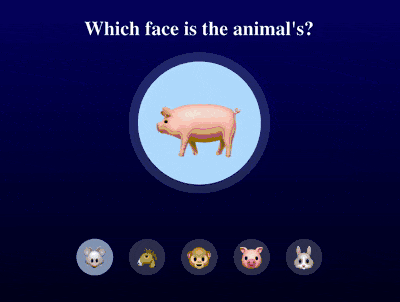
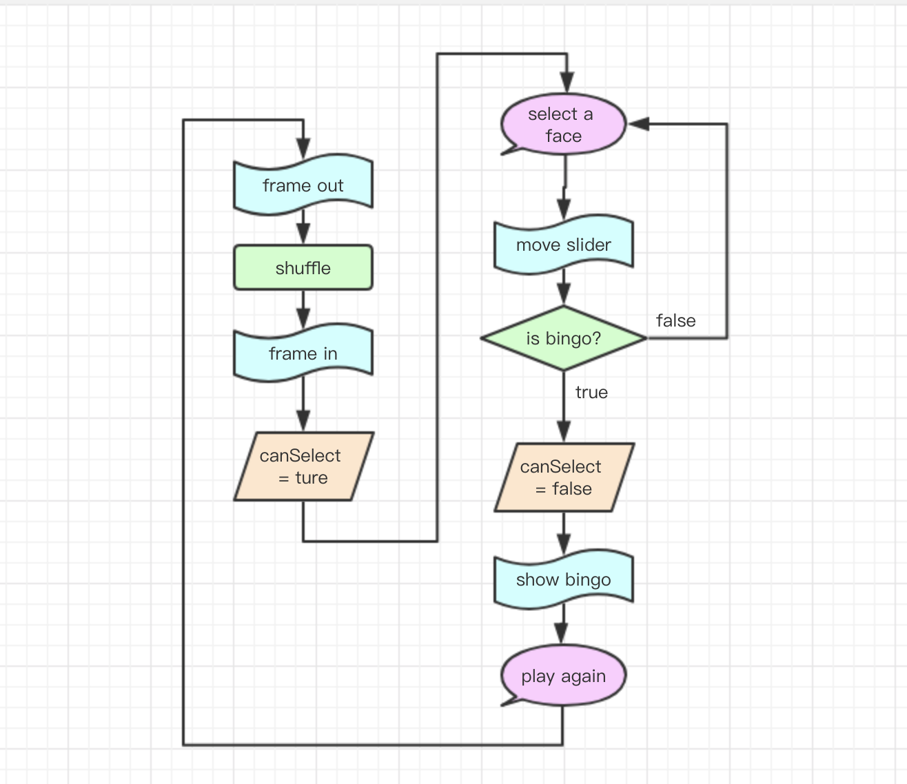

+++
title = '多选一场景的交互游戏'
date = 2018-11-30T17:56:17+08:00
image = '/fe/img/thumbs/163.png'
summary = '#163'
+++



## 效果预览

点击链接可以在 Codepen 预览。

[https://codepen.io/comehope/pen/LXMzRX](https://codepen.io/comehope/pen/LXMzRX)

## 可交互视频

此视频是可以交互的，你可以随时暂停视频，编辑视频中的代码。

第 1 部分：
[https://scrimba.com/p/pEgDAM/cQK3bSp](https://scrimba.com/p/pEgDAM/cQK3bSp)

第 2 部分：
[https://scrimba.com/p/pEgDAM/cNJWncR](https://scrimba.com/p/pEgDAM/cNJWncR)

第 3 部分：
[https://scrimba.com/p/pEgDAM/cvgP8td](https://scrimba.com/p/pEgDAM/cvgP8td)

## 源代码下载

每日前端实战系列的全部源代码请从 github 下载：

[https://github.com/comehope/front-end-daily-challenges](https://github.com/comehope/front-end-daily-challenges)

## 代码解读

多选一的场景是很常见的，浏览器自带的 `<input type="radio">` 控件就适用于这样的场景。本项目将设计一个多选一的交互场景，用 css 进行页面布局、用 gsap 制作动画效果、用原生 js 编写程序逻辑。

这个游戏的逻辑很简单，在页面上部展示出一个动物的全身像，请用户在下面的小图片中选择这个动物对应的头像，如果选对了，就可以再玩一次。

整个游戏分成 3 个步骤开发：静态的页面布局、程序逻辑和动画效果。

### 一、页面布局

定义 dom 结构，容器中包含标题 `h1`、全身像 `.whole-body`、当选择正确时的提示语 `.bingo`、“再玩一次”按钮 `.again`、一组选择按钮 `.selector`。`.selector` 中包含 5 个展示头像的 `.face` 和 1 个标明当前被选中头像的 `.slider`。全身像和头像没有使用图片，都用 unicode 字符代替：
```html
<div class="app">
        <h1>Which face is the animal's?</h1>
        <div class="whole-body">🐄</div>
        <div class="bingo">
            Bingo!
            <span class="again">Play Again</span>
        </div>
        <div class="selector">
            <span class="slider"></span>

            <span class="face">🐭</span>    
            <span class="face">🐶</span>
            <span class="face">🐷</span>
            <span class="face">🐮</span>
            <span class="face">🐯</span>
        </div>
    </div>
```

居中显示：
```css
body {
    margin: 0;
    height: 100vh;
    display: flex;
    align-items: center;
    justify-content: center;
    background: linear-gradient(darkblue, black);
}
```

定义容器中子元素的按纵向布局，水平居中：
```css
.app {
    height: 420px;
    display: flex;
    flex-direction: column;
    align-items: center;
    justify-content: space-between;
}
```

标题是白色文字：
```css
h1 {
    margin: 0;
    color: white;
}
```

全身像为大尺寸的圆形，利用阴影画一个半透明的粗边框：
```css
.whole-body {
    width: 200px;
    height: 200px;
    background-color: rgb(180, 220, 255);
    border-radius: 50%;
    font-size: 140px;
    text-align: center;
    line-height: 210px;
    margin-top: 20px;
    box-shadow: 0 0 0 15px rgba(180, 220, 255, 0.2);
    user-select: none;
}
```

选择正确时的提示语为白色：
```css
.bingo {
    color: white;
    font-size: 30px;
    font-family: sans-serif;
    margin-top: 20px;
}
```

“再玩一次”按钮的字体稍小，在鼠标悬停和点击时有交互效果：
```css
.again {
    display: inline-block;
    font-size: 20px;
    background-color: white;
    color: darkblue;
    padding: 5px;
    border-radius: 5px;
    box-shadow: 5px 5px 2px rgba(0, 0, 0, 0.4);
    user-select: none;
}

.again:hover {
    background-color: rgba(255, 255, 255, 0.8);
    cursor: pointer;
}

.again:active {
    transform: translate(2px, 2px);
    box-shadow: 2px 2px 2px rgba(0, 0, 0, 0.4);
}
```

5 个头像为小尺寸的圆形，横向排列，半透明背景：
```css
.selector {
    display: flex;
}

.face {
    width: 60px;
    height: 60px;
    background-color: rgba(255, 255, 255, 0.2);
    border-radius: 50%;
    font-size: 40px;
    text-align: center;
    line-height: 70px;
    cursor: pointer;
    user-select: none;
}

.face:not(:last-child) {
    margin-right: 25px;
}
```

在被选中的头像下面叠加一个同尺寸的浅蓝色色块：
```css
.selector {
    position: relative;
}

.slider {
    position: absolute;
    width: 60px;
    height: 60px;
    background-color: rgba(180, 220, 255, 0.6);
    border-radius: 50%;
    z-index: -1;
}
```

至此，页面布局完成。

### 二、程序逻辑

引入 lodash 工具库，后面会用到 lodash 提供的一些数组函数：
```html
<script src="https://cdnjs.cloudflare.com/ajax/libs/lodash.js/4.17.11/lodash.min.js"></script>
```

在写程序逻辑之前，我们先定义 2 个常量。
第一个常量是存储动物头像和全身像的数据对象 `animals`，它的每个属性是 1 种动物，key 是头像，value 是全身像：
```javascript
const animals = {
    '🐭': '🐁',
    '🐶': '🐕',
    '🐷': '🐖',
    '🐮': '🐄',
    '🐯': '🐅',
    '🐔': '🐓',
    '🐵': '🐒',
    '🐲': '🐉',
    '🐴': '🐎',
    '🐰': '🐇',
}
```

第二个常量是存储 dom 元素引用的数据对象 `dom`，它的每个属性是一个 dom 元素，key 值与 class 类名保持一致，分别是代表全身像的 `dom.wholeBody`、代表选择正确时的提示信息 `dom.bingo`、代表“再玩一次”按钮的 `dom.bingo`、代表头像列表的 `dom.faces`、代表头像下面的滑块 `dom.slider`：
```javascript
const dom = {
    wholeBody: document.querySelector('.whole-body'),
    bingo: document.querySelector('.bingo'),
    again: document.querySelector('.again'),
    faces: Array.from(document.querySelectorAll('.face')),
    slider: document.querySelector('.slider'),
}
```

接下来定义整体的逻辑结构，当页面加载完成之后执行 `init()` 函数，`init()` 函数会对整个游戏做些初始化的工作 ———— 令头像 `dom.faces` 被点击时调用 `select()` 函数，令“再玩一次”按钮 `dom.again` 被点击时调用 `newGame()` 函数 ———— 最后调用 `newGame()` 函数开始一局新游戏：
```javascript
function newGame() {
    //...
}

function select() {
    //...
}

function init() {
    dom.faces.forEach(face => {
        face.addEventListener('click', select)
    })
    dom.again.addEventListener('click', newGame)
    newGame()
}

window.onload = init
```

在 `newGame()` 函数中调用 `shuffle()` 函数。`shuffle()` 函数的作用是随机地从 `animals` 数组中选出 5 个动物，把它们的头像显示在 `dom.faces` 中，再从中选出 1 个动物，把它的全身像显示在 `dom.wholeBody` 中。变量 `options` 代表被选出的 5 个动物，变量 `answer` 代表显示全身像的动物，因为后面还会用到 `options` 和 `answer`，所以把它们定义为全局变量。经过 `_.entries()` 函数的处理，`options` 数组的元素和 `answer` 的数据结构变为包含 2 个元素的数组 `[key, value]` 形式，其中第 `[0]` 个元素是头像，第 `[1]` 个元素是全身像：
```javascript
let options = []
let answer = {}

function newGame() {
    shuffle()
}

function shuffle() {
    options = _.slice(_.shuffle(_.entries(animals)), -5)
    answer = _.sample(_.slice(options, -4))

    dom.faces.forEach((face, i) => {
        face.innerText = options[i][0]
    })
    dom.wholeBody.innerText = answer[1]
}
```

现在，每点击一次 `Play Again` 按钮，就会洗牌、更新图片。
接下来处理滑块。在 `select()` 函数中，首先把滑块 `dom.slider` 移动到被点击的头像位置：
```javascript
function select(e) {
    let position = _.findIndex(options, (o) => o[0] == e.target.innerText)
    dom.slider.style.left = (25 + 60) * position + 'px'
}
```

然后判断当前头像对应的全身像和页面上方全身像是否一致，若一致，就显示提示语 `dom.bingo`。在此之前，要把提示语隐藏掉：
```javascript
function newGame() {
    dom.bingo.style.visibility = 'hidden'
    shuffle()
}

function select(e) {
    let position = _.findIndex(options, (o) => o[0] == e.target.innerText)
    dom.slider.style.left = (25 + 60) * position + 'px'

    if (animals[e.target.innerText] == answer[1]) {
        dom.bingo.style.visibility = 'visible'
    }
}
```

现在，游戏开局时是没有提示语的，只有选对了头像，才会出提示语。
不过出现了一个bug，就是当重开新局时，滑块还停留在上一局的位置，我们要改成开局时把滑块 `dom.slider` 移到头像列表的最左侧：
```javascript
function newGame() {
    dom.bingo.style.visibility = 'hidden'
    shuffle()
    dom.slider.style.left = '0px'
}
```

现在，整个程序流程已经可以跑通了：页面加载后即开始一局游戏，任意选择头像，在选择了正确的头像时出现 `Bingo!` 字样，点击 `Play Again` 按钮可以开始下一局游戏。
不过，在逻辑上还有一点小瑕疵。当用户已经选择了正确的头像，显示出提示语之后，不应该还能点选其他头像。为此，我们引入一个全局变量 `canSelect`，它是一个布尔值，表示当前是否可以选择头像，初始值是 `false`，在 `newGame()` 函数的最后一步，它的值被设置为 `true`，在 `select()` 函数中首先判断 `canSelect` 的值，只有当值为 `true` 时，才能继续执行事件处理的后续程序，当用户选择了正确的头像时，`canSelect` 被设置为 `false`，表示这一局游戏结束了。
```javascript
let canSelect = false

function newGame() {
    dom.bingo.style.visibility = 'hidden'
    shuffle()
    dom.slider.style.left = '0px'
    canSelect = true
}

async function select(e) {
    if (!canSelect) return;

    let position = _.findIndex(options, (o) => o[0] == e.target.innerText)
    await animation.moveSlider(position)
    
    if (animals[e.target.innerText] == answer[1]) {
        canSelect = false
        await animation.showBingo()
    }
}
```

至此的全部脚本如下：
```javascript
const animals = {
    '🐭': '🐁',
    '🐶': '🐕',
    '🐷': '🐖',
    '🐮': '🐄',
    '🐯': '🐅',
    '🐔': '🐓',
    '🐵': '🐒',
    '🐲': '🐉',
    '🐴': '🐎',
    '🐰': '🐇',
}

const dom = {
    wholeBody: document.querySelector('.whole-body'),
    bingo: document.querySelector('.bingo'),
    again: document.querySelector('.again'),
    faces: Array.from(document.querySelectorAll('.face')),
    slider: document.querySelector('.slider'),
}

let options = []
let answer = {}
let canSelect = false

function newGame() {
    dom.bingo.style.visibility = 'hidden'
    shuffle()
    dom.slider.style.left = '0px'
    canSelect = true
}

function shuffle() {
    options = _.slice(_.shuffle(_.entries(animals)), -5)
    answer = _.sample(_.slice(options, -4))

    dom.faces.forEach((face, i) => {
        face.innerText = options[i][0]
    })
    dom.wholeBody.innerText = answer[1]
}

function select(e) {
    if (!canSelect) return;
    let position = _.findIndex(options, x => x[0] == e.target.innerText)
    dom.slider.style.left = (25 + 60) * position + 'px'
    
    if (animals[e.target.innerText] == answer[1]) {
        canSelect = false
        dom.bingo.style.visibility = 'visible'
    }
}

function init() {
    dom.faces.forEach(face => {
        face.addEventListener('click', select)
    })
    dom.again.addEventListener('click', newGame)
    newGame()
}

window.onload = init
```

### 三、动画效果

游戏中共有 4 个动画效果，分别是移动滑块 `dom.slider`、显示提示语 `dom.bingo`、动物（包括头像列表和全身像）出场、动物入场。为了集中管理动画效果，我们定义一个全局常量 `animation`，它有 4 个属性，每个属性是一个函数，实现一个动画效果，结构如下：
```javascript
const animation = {
    moveSlider: () => {
        //移动滑块...
    },
    showBingo: () => {
        //显示提示语...
    },
    frameOut: () => {
        //动物出场...
    },
    frameIn: () => {
        //动物入场...
    },
}
```

其实这 4 个动画的运行时机已经体现在 `newGame()` 函数和 `select()` 函数中了：
```javascript
function newGame() {
    dom.bingo.style.visibility = 'hidden' //此处改为 动物出场 动画
    shuffle()
    dom.slider.style.left = '0px' //此处改为 动物入场 动画
}

function select(e) {
    let position = _.findIndex(options, (o) => o[0] == e.target.innerText)
    dom.slider.style.left = (25 + 60) * position + 'px' //此处改为 移动滑块 动画

    if (animals[e.target.innerText] == answer[1]) {
        dom.bingo.style.visibility = 'visible' //此处改为 显示提示语 动画
    }
}
```

所以，我们就可以把这 4 行代码转移到 `animation` 中，其中 `moveSlider()` 还增加了一个指明要移动到什么位置的 `position` 参数：
```javascript
const animation = {
    moveSlider: (position) => {
        dom.slider.style.left = (25 + 60) * position + 'px'
    },
    showBingo: () => {
        dom.bingo.style.visibility = 'visible'
    },
    frameOut: () => {
        dom.bingo.style.visibility = 'hidden'
    },
    frameIn: () => {
        dom.slider.style.left = '0px'
    },
}
```

同时，`newGame()` 函数和 `select()` 函数改为调用 `animation`：
```javascript
function newGame() {
    animation.frameOut()
    shuffle()
    animation.frameIn()
}

function select(e) {
    let position = _.findIndex(options, (o) => o[0] == e.target.innerText)
    animation.moveSlider(position)
    
    if (animals[e.target.innerText] == answer[1]) {
        animation.showBingo()
    }
}
```

经过上面的整理，接下来的动画代码就可以集中写在 `animation` 对象里了。
本项目的动画效果用 [gsap](https://greensock.com/gsap) 实现，gsap 动画在以前的 [133#项目](https://segmentfault.com/a/1190000016362691)、[134#项目](https://segmentfault.com/a/1190000016377676)、[143#项目](https://segmentfault.com/a/1190000016521212) 都用到了，大家可参考这些项目了解 gsap 的使用方法。

引入 gsap 动画库：
```html
<script src="https://cdnjs.cloudflare.com/ajax/libs/gsap/2.0.2/TweenMax.min.js"></script>
```

先编写移动滑块的动画 `moveSlider`，让滑块先缩小，然后移动到目的地，再放大：
```javascript
const animation = {
    moveSlider: () => {
        new TimelineMax()
            .to(dom.slider, 1, {scale: 0.3})
            .to(dom.slider, 1, {left: (25 + 60) * position + 'px'})
            .to(dom.slider, 1, {scale: 1})
            .timeScale(5)
    },
    //...
}
```

再编写显示提示语的动画 `showBingo`，显示出 `dom.bingo` 之后，让它左右晃动一下：
```javascript
const animation = {
    //...
    showBingo: () => {
        new TimelineMax()
            .to(dom.bingo, 0, {visibility: 'visible'})
            .to(dom.bingo, 1, {rotation: -5})
            .to(dom.bingo, 1, {rotation: 5})
            .to(dom.bingo, 1, {rotation: 0})
            .timeScale(8)
    },
    //...
}
```

再编写动物出场的动画，隐藏提示语 `dom.bingo` 之后，再同时把滑块 `dom.slider`、头像列表 `dom.faces`、全身像 `dom.wholeBody` 同时缩小到消失：
```javascript
const animation = {
    //...
    frameOut: () => {
        new TimelineMax()
            .to(dom.bingo, 0, {visibility: 'hidden'})
            .to(dom.slider, 1, {scale: 0}, 't1')
            .staggerTo(dom.faces, 1, {scale: 0}, 0.25, 't1')
            .to(dom.wholeBody, 1, {scale: 0}, 't1')
            .timeScale(5)
    },
    //...
}
```

再编写动物入场的动画，把滑块移到头像列表最左侧之后，再把刚才出场动画缩小到消失的那些元素放大到正常尺寸：
```javascript
const animation = {
    //...
    frameIn: () => {
        new TimelineMax()
            .to(dom.slider, 0, {left: '0px'})
            .to(dom.wholeBody, 2, {scale: 1, delay: 1})
            .staggerTo(dom.faces, 1, {scale: 1}, 0.25)
            .to(dom.slider, 1, {scale: 1})
            .timeScale(5)
    },
}
```

现在运行一下程序，已经有动画效果了，但是会觉得有些不协调，那是因为动画有一定的运行时长，多个动画连续运行时应该有先后顺序，比如应该先出场再入场、先移动滑块再显示提示语，但现在它们都是同时运行的。为了让它们能顺序执行，我们用 async/await 来改造，先让动画函数返回 promise 对象，以 `moveSlider` 为例，它被改成这样：
```javascript
const animation = {
    moveSlider: () => {
        return new Promise(resolve => {
            new TimelineMax()
                .to(dom.slider, 1, {scale: 0.3})
                .to(dom.slider, 1, {left: (25 + 60) * position + 'px'})
                .to(dom.slider, 1, {scale: 1})
                .timeScale(5)
                .eventCallback('onComplete', resolve)
        })
    },
    //...
}
```

然后把 `select()` 函数改造成 async 函数：
```javascript
async function select(e) {
    let position = _.findIndex(options, (o) => o[0] == e.target.innerText)
    await animation.moveSlider(position)
    
    if (animals[e.target.innerText] == answer[1]) {
        animation.showBingo()
    }
}
```

到这里，整个游戏的动画效果就完成了。至此的全部脚本如下：
```javascript
const animals = {
    //略，与增加动画前相同
}

const dom = {
    //略，与增加动画前相同
}

const animation = {
    frameOut: () => {
        return new Promise(resolve => {
            new TimelineMax()
                .to(dom.bingo, 0, {visibility: 'hidden'})
                .to(dom.slider, 1, {scale: 0}, 't1')
                .staggerTo(dom.faces, 1, {scale: 0}, 0.25, 't1')
                .to(dom.wholeBody, 1, {scale: 0}, 't1')
                .timeScale(5)
                .eventCallback('onComplete', resolve)
        })
    },
    frameIn: () => {
        return new Promise(resolve => {
            new TimelineMax()
                .to(dom.slider, 0, {left: '0px'})
                .to(dom.wholeBody, 2, {scale: 1, delay: 1})
                .staggerTo(dom.faces, 1, {scale: 1}, 0.25)
                .to(dom.slider, 1, {scale: 1})
                .timeScale(5)
                .eventCallback('onComplete', resolve)
        })
    },
    moveSlider: (position) => {
        return new Promise(resolve => {
            new TimelineMax()
                .to(dom.slider, 1, {scale: 0.3})
                .to(dom.slider, 1, {left: (25 + 60) * position + 'px'})
                .to(dom.slider, 1, {scale: 1})
                .timeScale(5)
                .eventCallback('onComplete', resolve)
        })
    },
    showBingo: () => {
        return new Promise(resolve => {
            new TimelineMax()
                .to(dom.bingo, 0, {visibility: 'visible'})
                .to(dom.bingo, 1, {rotation: -5})
                .to(dom.bingo, 1, {rotation: 5})
                .to(dom.bingo, 1, {rotation: 0})
                .timeScale(8)
                .eventCallback('onComplete', resolve)
        })
    },
}

let options = []
let answer = {}

async function newGame() {
    await animation.frameOut()
    shuffle()
    await animation.frameIn()
}

function shuffle() {
    //略，与增加动画前相同
}

async function select(e) {
    let position = _.findIndex(options, (o) => o[0] == e.target.innerText)
    await animation.moveSlider(position)
    
    if (animals[e.target.innerText] == answer[1]) {
        await animation.showBingo()
    }
}

function init() {
    //略，与增加动画前相同
}

window.onload = init
```

最后，附上程序流程图，方便大家理解。



大功告成！
