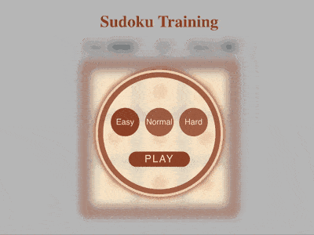
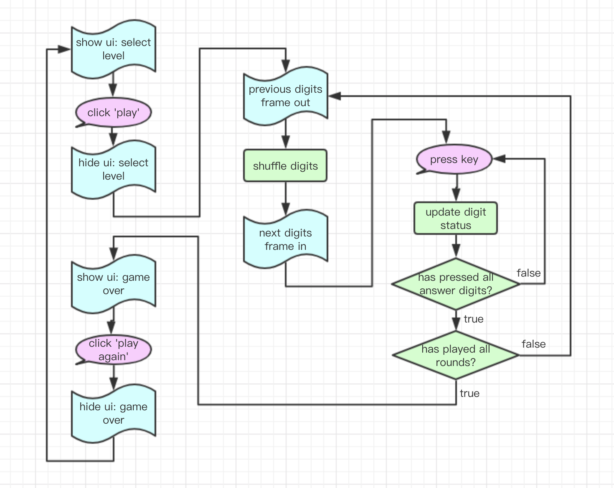

+++
title = '数独训练游戏'
date = 2018-12-09T20:33:47+08:00
categories = ['开发实战']
subtitle = '开发实战 第164号作品'
image = '/test-hugo-deploy/img/thumbs/164.png'
summary = '#164 用于训练快速发现宫内缺哪几个数字'
+++



## 效果预览

点击链接可以在 Codepen 预览。

[https://codepen.io/comehope/pen/mQYobz](https://codepen.io/comehope/pen/mQYobz)

## 可交互视频

此视频是可以交互的，你可以随时暂停视频，编辑视频中的代码。

第 1 部分：
[https://scrimba.com/p/pEgDAM/c7Q86ug](https://scrimba.com/p/pEgDAM/c7Q86ug)

第 2 部分：
[https://scrimba.com/p/pEgDAM/ckgBNAD](https://scrimba.com/p/pEgDAM/ckgBNAD)

第 3 部分：
[https://scrimba.com/p/pEgDAM/cG7bWc8](https://scrimba.com/p/pEgDAM/cG7bWc8)

第 4 部分：
[https://scrimba.com/p/pEgDAM/cez34fp](https://scrimba.com/p/pEgDAM/cez34fp)

## 源代码下载

每日前端实战系列的全部源代码请从 github 下载：

[https://github.com/comehope/front-end-daily-challenges](https://github.com/comehope/front-end-daily-challenges)

## 代码解读

解数独的一项基本功是能迅速判断一行、一列或一个九宫格中缺少哪几个数字，本项目就是一个训练判断九宫格中缺少哪个数字的小游戏。游戏的流程是：先选择游戏难度，有 Easy、Normal、Hard 三档，分别对应着九宫格中缺少 1 个、2 个、3 个数字。开始游戏后，用键盘输入九宫格中缺少的数字，如果全答出来了，就会进入下一局，一共 5 局，5 局结束之后这一次游戏就结束了。在游戏过程中，九宫格的左上角会计时，右上角会计分。

整个游戏分成 4 个步骤开发：静态页面布局、程序逻辑、计分计时和动画效果。

一、页面布局

定义 dom 结构，`.app` 是整个应用的容器，`h1` 是游戏标题，`.game` 是游戏的主界面。`.game` 中的子元素包括 `.message` 和 `.digits`，`.message` 用来提示游戏时间 `.time`、游戏的局数 `.round`、得分 `.score`，`.digits` 里是 9 个数字：
```html
<div class="app">
    <h1>Sudoku Training</h1>
    <div class="game">
        <div class="message">
            <p>
                Time:
                <span class="time">00:00</span>
            </p>
            <p class="round">1/5</p>
            <p>
                Score:
                <span class="score">100</span>
            </p>
        </div>
        <div class="digits">
            <span>1</span>
            <span>2</span>
            <span>3</span>
            <span>4</span>
            <span>5</span>
            <span>6</span>
            <span>7</span>
            <span>8</span>
            <span>9</span>
        </div>
    </div>
</div>
```

居中显示：
```css
body {
    margin: 0;
    height: 100vh;
    display: flex;
    align-items: center;
    justify-content: center;
    background: silver;
    overflow: hidden;
}
```

定义应用的宽度，子元素纵向布局：
```css
.app {
    width: 300px;
    display: flex;
    flex-direction: column;
    align-items: center;
    justify-content: space-between;
    user-select: none;
}
```

标题为棕色字：
```css
h1 {
    margin: 0;
    color: sienna;
}
```

提示信息是横向布局，重点内容加粗：
```css
.game .message {
    width: inherit;
    display: flex;
    justify-content: space-between;
    font-size: 1.2em;
    font-family: sans-serif;
}

.game .message span {
    font-weight: bold;
}
```

九宫格用 grid 布局，外框棕色，格子用杏白色背景：
```css
.game .digits {
    box-sizing: border-box;
    width: 300px;
    height: 300px;
    padding: 10px;
    border: 10px solid sienna;
    display: grid;
    grid-template-columns: repeat(3, 1fr);
    grid-gap: 10px;
}

.game .digits span {
    width: 80px;
    height: 80px;
    background-color: blanchedalmond;
    font-size: 30px;
    font-family: sans-serif;
    text-align: center;
    line-height: 2.5em;
    color: sienna;
    position: relative;
}
```

至此，游戏区域布局完成，接下来布局选择游戏难度的界面。
在 html 文件中增加 `.select-level` dom 结构，它包含一个难度列表 `levels` 和一个开始游戏的按钮 `.play`，游戏难度分为 `.easy`、`.normal` 和 `.hard` 三个级别：
```html
<div class="app">
    <h1>Sudoku Training</h1>
    <div class="game">
        <!-- 略 -->
    </div>
    <div class="select-level">
        <div class="levels">
            <input type="radio" name="level" id="easy" value="easy" checked="checked">
            <label for="easy">Easy</label>

            <input type="radio" name="level" id="normal" value="normal">
            <label for="normal">Normal</label>

            <input type="radio" name="level" id="hard" value="hard">
            <label for="hard">Hard</label>
        </div>
        <div class="play">Play</div>
    </div>
</div>
```

为选择游戏难度容器画一个圆形的外框，子元素纵向布局：
```css
.select-level {
    z-index: 2;
    box-sizing: border-box;
    width: 240px;
    height: 240px;
    border: 10px solid rgba(160, 82, 45, 0.8);
    border-radius: 50%;
    box-shadow: 
        0 0 0 0.3em rgba(255, 235, 205, 0.8),
        0 0 1em 0.5em rgba(160, 82, 45, 0.8);
    display: flex;
    flex-direction: column;
    align-items: center;
    font-family: sans-serif;
}
```

布局 3 个难度选项，横向排列：
```css
.select-level .levels {
    margin-top: 60px;
    width: 190px;
    display: flex;
    justify-content: space-between;
}
```

把 `input` 控件隐藏起来，只显示它们对应的 `label`：
```css
.select-level .levels {
    position: relative;
}

.select-level input[type=radio] {
    visibility: hidden;
    position: absolute;
    left: 0;
}
```

设置 `label` 的样式，为圆形按钮：
```css
.select-level label {
    width: 56px;
    height: 56px;
    background-color: rgba(160, 82, 45, 0.8);
    border-radius: 50%;
    text-align: center;
    line-height: 56px;
    color: blanchedalmond;
    cursor: pointer;
}
```

当某个 `label` 对应的 `input` 被选中时，令 `label` 背景色加深，以示区别：
```css
.select-level input[type=radio]:checked + label {
    background-color: sienna;
}
```

设置开始游戏按钮 `.play` 的样式，以及交互效果：
```css
.select-level .play {
    width: 120px;
    height: 30px;
    background-color: sienna;
    color: blanchedalmond;
    text-align: center;
    line-height: 30px;
    border-radius: 30px;
    text-transform: uppercase;
    cursor: pointer;
    margin-top: 30px;
    font-size: 20px;
    letter-spacing: 2px;
}

.select-level .play:hover {
    background-color: saddlebrown;
}

.select-level .play:active {
    transform: translate(2px, 2px);
}
```

至此，选择游戏难度的界面布局完成，接下来布局游戏结束界面。
游戏结束区 `.game-over` 包含一个 `h2` 标题，二行显示最终结果的段落 `p` 和一个再玩一次的按钮 `.again`。最终结果包括最终耗时 `.final-time` 和最终得分 `.final-score`：
```html
<div class="app">
        <h1>Sudoku Training</h1>
        <div class="game">
            <!-- 略 -->
        </div>
        <div class="select-level">
            <!-- 略 -->
        </div>
        <div class="game-over">
            <h2>Game Over</h2>
            <p>
                Time:
                <span class="final-time">00:00</span>
            </p>
            <p>
                Score:
                <span class="final-score">3000</span>
            </p>
            <div class="again">Play Again</div>
        </div>
    </div>
```

因为游戏结束界面和选择游戏难度界面的布局相似，所以借用 `.select-level` 的代码：
```css
.select-level,
.game-over {
    z-index: 2;
    box-sizing: border-box;
    width: 240px;
    height: 240px;
    border: 10px solid rgba(160, 82, 45, 0.8);
    border-radius: 50%;
    box-shadow: 
        0 0 0 0.3em rgba(255, 235, 205, 0.8),
        0 0 1em 0.5em rgba(160, 82, 45, 0.8);
    display: flex;
    flex-direction: column;
    align-items: center;
    font-family: sans-serif;
}
```

标题和最终结果都用棕色字：
```css
.game-over h2 {
    margin-top: 40px;
    color: sienna;
}

.game-over p {
    margin: 3px;
    font-size: 20px;
    color: sienna;
}
```

“再玩一次”按钮 `.again` 的样式与开始游戏 `.play` 的样式相似，所以也借用 `.play` 的代码：
```css
.select-level .play,
.game-over .again {
    width: 120px;
    height: 30px;
    background-color: sienna;
    color: blanchedalmond;
    text-align: center;
    line-height: 30px;
    border-radius: 30px;
    text-transform: uppercase;
    cursor: pointer;
}

.select-level .play {
    margin-top: 30px;
    font-size: 20px;
    letter-spacing: 2px;
}

.select-level .play:hover,
.game-over .again:hover {
    background-color: saddlebrown;
}

.select-level .play:active,
.game-over .again:active {
    transform: translate(2px, 2px);
}

.game-over .again {
    margin-top: 10px;
}
```

把选择游戏难度界面 `.select-level` 和游戏结束界面 `.game-over` 定位到游戏容器的中间位置：
```css
.app {
    position: relative;
}

.select-level,
.game-over {
    position: absolute;
    bottom: 40px;
}
```

至此，游戏界面 `.game`、选择游戏难度界面 `.select-level` 和游戏结束界面 `.game-over` 均已布局完成。接下来为动态程序做些准备工作。
把选择游戏难度界面 `.select-level` 和游戏结束界面 `.game-over` 隐藏起来，当需要它们呈现时，会在脚本中设置它们的 `visibility` 属性：
```css
.select-level,
.game-over {
    visibility: hidden;
}
```

游戏中，当选择游戏难度界面 `.select-level` 和游戏结束界面 `.game-over` 出现时，应该令游戏界面 `.game` 变模糊，并且加一个缓动时间，`.game.stop` 会在脚本中调用：
```css
.game {
    transition: 0.3s;
}

.game.stop {
    filter: blur(10px);
}
```

游戏中，当填错了数字时，要把错误的数字描一个红边；当填对了数字时，把数字的背景色改为巧克力色。`.game .digits span.wrong` 和 `.game .digits span.correct` 会在脚本中调用：
```css
.game .digits span.wrong {
    border: 2px solid crimson;
}

.game .digits span.correct {
    background-color: chocolate;
    color: gold;
}
```

至此，完成全部布局和样式设计。

二、程序逻辑

引入 lodash 工具库，后面会用到 lodash 提供的一些数组函数：
```html
<script src="https://cdnjs.cloudflare.com/ajax/libs/lodash.js/4.17.11/lodash.min.js"></script>
```

在写程序逻辑之前，先定义几个存储业务数据的常量。`ALL_DIGITS` 存储了全部备选的数字，也就是从 1 到 9；`ANSWER_COUNT` 存储的是不同难度要回答的数字个数，easy 难度要回答 1 个数字，normal 难度要回答 2 个数字，hard 难度要回答 3 个数字；`ROUND_COUNT` 存储的是每次游戏的局数，默认是 5 局；`SCORE_RULE` 存储的是答对和答错时分数的变化，答对加 100 分，答错扣 10 分。定义这些常量的好处是避免在程序中出现魔法数字，提高程序可读性：
```javascript
const ALL_DIGITS = ['1','2','3','4','5','6','7','8','9']
const ANSWER_COUNT = {EASY: 1, NORMAL: 2, HARD: 3}
const ROUND_COUNT = 5
const SCORE_RULE = {CORRECT: 100, WRONG: -10}
```

再定义一个 dom 对象，用于引用 dom 元素，它的每个属性是一个 dom 元素，key 值与 class 类名保持一致。其中大部分 dom 元素是一个 element 对象，只有 `dom.digits` 和 `dom.levels` 是包含多个 element 对象的数组；另外 `dom.level` 用于获取被选中的难度，因为它的值随用户选择而变化，所以用函数来返回实时结果：
```javascript
const $ = (selector) => document.querySelectorAll(selector)
const dom = {
    game: $('.game')[0],
    digits: Array.from($('.game .digits span')),
    time: $('.game .time')[0],
    round: $('.game .round')[0],
    score: $('.game .score')[0],
    selectLevel: $('.select-level')[0],
    level: () => {return $('input[type=radio]:checked')[0]},
    play: $('.select-level .play')[0],
    gameOver: $('.game-over')[0],
    again: $('.game-over .again')[0],
    finalTime: $('.game-over .final-time')[0],
    finalScore: $('.game-over .final-score')[0],
}
```

在游戏过程中需要根据游戏进展随时修改 dom 元素的内容，这些修改过程我们也把它们先定义在 `render` 对象中，这样程序主逻辑就不用关心具体的 dom 操作了。`render` 对象的每个属性是一个 dom 操作，结构如下：
```javascript
const render = {
    initDigits: () => {},
    updateDigitStatus: () => {},
    updateTime: () => {},
    updateScore: () => {},
    updateRound: () => {},
    updateFinal: () => {},
}
```

下面我们把这些 dom 操作逐个写下来。
`render.initDigits` 用来初始化九宫格。它接收一个文本数组，根据不同的难度级别，数组的长度可能是 8 个（easy 难度）、7 个（normal 难度）或 6 个（hard 难度），先把它补全为长度为 9 个数组，数量不足的元素补空字符，然后把它们随机分配到九宫格中：
```javascript
const render = {
    initDigits: (texts) => {
        allTexts = texts.concat(_.fill(Array(ALL_DIGITS.length - texts.length), ''))
        _.shuffle(dom.digits).forEach((digit, i) => {
            digit.innerText = allTexts[i]
            digit.className = ''
        })
    },
    //...
}
```

`render.updateDigitStatus` 用来更新九宫格中单个格子的状态。它接收 2 个参数，`text`
 是格子里的数字，`isAnswer` 指明这个数字是不是答案。格子的默认样式是浅色背景深色文字，如果传入的数字不是答案，也就是答错了，会为格子加上 `wrong` 样式，格子被描红边；如果传入的数字是答案，也就是答对了，会在一个空格子里展示这个数字，并为格子加上 `correct` 样式，格子的样式会改为深色背景浅色文字：
```javascript
const render = {
    //...
    updateDigitStatus: (text, isAnswer) => {
        if (isAnswer) {
            let digit = _.find(dom.digits, x => (x.innerText == ''))
            digit.innerText = text
            digit.className = 'correct'
        }
        else {
            _.find(dom.digits, x => (x.innerText == text)).className = 'wrong'
        }
    },
    //...
}
```

`render.updateTime` 用来更新时间，`render.updateScore` 用来更新得分：
```javascript
const render = {
    //...
    updateTime: (value) => {
        dom.time.innerText = value.toString()
    },
    updateScore: (value) => {
        dom.score.innerText = value.toString()
    },
    //...
}
```

`render.updateRound` 用来更新当前局数，显示为 “n/m” 的格式：
```javascript
const render = {
    //...
    updateRound: (currentRound) => {
        dom.round.innerText = [
            currentRound.toString(),
            '/',
            ROUND_COUNT.toString(),
        ].join('')
    },
    //...
}
```

`render.updateFinal` 用来更新游戏结束界面里的最终成绩：
```javascript
const render = {
    //...
    updateFinal: () => {
        dom.finalTime.innerText = dom.time.innerText
        dom.finalScore.innerText = dom.score.innerText
    },
}
```

接下来定义程序整体的逻辑结构。当页面加载完成之后执行 `init()` 函数，`init()` 函数会对整个游戏做些初始化的工作 ———— 令开始游戏按钮 `dom.play` 被点击时调用 `startGame()` 函数，令再玩一次按钮 `dom.again` 被点击时调用 `playAgain()` 函数，令按下键盘时触发事件处理程序 `pressKey()` ———— 最后调用 `newGame()` 函数开始新游戏：
```javascript
window.onload = init

function init() {
    dom.play.addEventListener('click', startGame)
    dom.again.addEventListener('click', playAgain)
    window.addEventListener('keyup', pressKey)

    newGame()
}

function newGame() {
    //...
}

function startGame() {
    //...
}

function playAgain() {
    //...
}

function pressKey() {
    //...
}
```

当游戏开始时，令游戏界面变模糊，呼出选择游戏难度的界面：
```javascript
function newGame() {
    dom.game.classList.add('stop')
    dom.selectLevel.style.visibility = 'visible'
}
```

当选择了游戏难度，点击开始游戏按钮 `dom.play` 时，隐藏掉选择游戏难度的界面，游戏界面恢复正常，然后把根据用户选择的游戏难度计算出的答案数字个数存储到全局变量 `answerCount` 中，调用 `newRound()` 开始一局游戏：
```javascript
let answerCount

function startGame() {
    dom.game.classList.remove('stop')
    dom.selectLevel.style.visibility = 'hidden'

    answerCount = ANSWER_COUNT[dom.level().value.toUpperCase()]
    newRound()
}
```

当一局游戏开始时，打乱所有候选数字，生成一个全局数组变量 `digits`，`digits` 的每个元素包含 3 个属性，`text` 属性表示数字文本，`isAnswer` 属性表示该数字是否为答案，`isPressed` 表示该数字是否被按下过，`isPressed` 的初始值均为 `false`，紧接着把 `digits` 渲染到九宫格中：
```javascript
let digits

function newRound() {
    digits = _.shuffle(ALL_DIGITS).map((x, i) => {
        return {
            text: x,
            isAnwser: (i < answerCount),
            isPressed: false
        }
    })
    render.initDigits(_.filter(digits, x => !x.isAnwser).map(x => x.text))
}
```

当用户按下键盘时，若按的键不是候选文本，就忽略这次按键事件。通过按键的文本在 `digits` 数组中找到对应的元素 `digit`，判断该键是否被按过，若被按过，也退出事件处理。接下来，就是针对没按过的键，在对应的 `digit` 对象上标明该键已按过，并且更新这个键的显示状态，如果用户按下的不是答案数字，就把该数字所在的格子描红，如果用户按下的是答案数字，就突出显示这个数字：
```javascript
function pressKey(e) {
    if (!ALL_DIGITS.includes(e.key)) return;

    let digit = _.find(digits, x => (x.text == e.key))
    if (digit.isPressed) return;

    digit.isPressed = true
    render.updateDigitStatus(digit.text, digit.isAnwser)
}
```

当用户已经按下了所有的答案数字，这一局就结束了，开始新一局：
```javascript
function pressKey(e) {
    if (!ALL_DIGITS.includes(e.key)) return;

    let digit = _.find(digits, x => (x.text == e.key))
    if (digit.isPressed) return;

    digit.isPressed = true
    render.updateDigitStatus(digit.text, digit.isAnwser)

    //判断用户是否已经按下所有的答案数字
    let hasPressedAllAnswerDigits = (_.filter(digits, (x) => (x.isAnwser && x.isPressed)).length == answerCount)
    if (!hasPressedAllAnswerDigits) return;

    newRound()
}
```

增加一个记录当前局数的全局变量 `round`，在游戏开始时它的初始值为 0，每局游戏开始时，它的值就加1，并更新游戏界面中的局数 `dom.round`：
```javascript
let round

function newGame() {
    round = 0 //初始化局数

    dom.game.classList.add('stop')
    dom.selectLevel.style.visibility = 'visible'
}

function startGame() {
    render.updateRound(1) //初始化页面中的局数
    
    dom.game.classList.remove('stop')
    dom.selectLevel.style.visibility = 'hidden'

    answerCount = ANSWER_COUNT[dom.level().value.toUpperCase()]
    newRound()
}

function newRound() {
    digits = _.shuffle(ALL_DIGITS).map((x, i) => {
        return {
            text: x,
            isAnwser: (i < answerCount),
            isPressed: false
        }
    })
    render.initDigits(_.filter(digits, x => !x.isAnwser).map(x => x.text))

    //每局开始时为局数加 1
    round++
    render.updateRound(round)
}
```

当前局数 `round` 增加到常量 `ROUND_COUNT` 定义的游戏总局数，本次游戏结束，调用 `gameOver()` 函数，否则调用 `newRound()` 函数开始新一局：
```javascript
function pressKey(e) {
    if (!ALL_DIGITS.includes(e.key)) return;

    let digit = _.find(digits, x => (x.text == e.key))
    if (digit.isPressed) return;

    digit.isPressed = true
    render.updateDigitStatus(digit.text, digit.isAnwser)

    let hasPressedAllAnswerDigits = (_.filter(digits, (x) => (x.isAnwser && x.isPressed)).length == answerCount)
    if (!hasPressedAllAnswerDigits) return;
    
    //判断是否玩够了总局数
    let hasPlayedAllRounds = (round == ROUND_COUNT)
    if (hasPlayedAllRounds) {
        gameOver()
    } else {
        newRound()
    }
}
```

游戏结束时，令游戏界面变模糊，调出游戏结束界面，显示最终成绩：
```javascript
function gameOver() {
    render.updateFinal()
    
    dom.game.classList.add('stop')
    dom.gameOver.style.visibility = 'visible'
}
```

在游戏结束界面，用户可以点击再玩一次按钮 `dom.again`，若点击了此按钮，就把游戏结束界面隐藏起来，开始一局新游戏，这就回到 `newGame()` 的流程了：
```javascript
function playAgain() {
    dom.game.classList.remove('stop')
    dom.gameOver.style.visibility = 'hidden'

    newGame()
}
```

至此，整个游戏的流程已经跑通了，此时的脚本如下：
```javascript
const ALL_DIGITS = ['1','2','3','4','5','6','7','8','9']
const ANSWER_COUNT = {EASY: 1, NORMAL: 2, HARD: 3}
const ROUND_COUNT = 3
const SCORE_RULE = {CORRECT: 100, WRONG: -10}

const $ = (selector) => document.querySelectorAll(selector)
const dom = {
    game: $('.game')[0],
    digits: Array.from($('.game .digits span')),
    time: $('.game .time')[0],
    round: $('.game .round')[0],
    score: $('.game .score')[0],
    selectLevel: $('.select-level')[0],
    level: () => {return $('input[type=radio]:checked')[0]},
    play: $('.select-level .play')[0],
    gameOver: $('.game-over')[0],
    again: $('.game-over .again')[0],
    finalTime: $('.game-over .final-time')[0],
    finalScore: $('.game-over .final-score')[0],
}

const render = {
    initDigits: (texts) => {
        allTexts = texts.concat(_.fill(Array(ALL_DIGITS.length - texts.length), ''))
        _.shuffle(dom.digits).forEach((digit, i) => {
            digit.innerText = allTexts[i]
            digit.className = ''
        })
    },
    updateDigitStatus: (text, isAnswer) => {
        if (isAnswer) {
            let digit = _.find(dom.digits, x => (x.innerText == ''))
            digit.innerText = text
            digit.className = 'correct'
        }
        else {
            _.find(dom.digits, x => (x.innerText == text)).className = 'wrong'
        }
    },
    updateTime: (value) => {
        dom.time.innerText = value.toString()
    },
    updateScore: (value) => {
        dom.score.innerText = value.toString()
    },
    updateRound: (currentRound) => {
        dom.round.innerText = [
            currentRound.toString(),
            '/',
            ROUND_COUNT.toString(),
        ].join('')
    },
    updateFinal: () => {
        dom.finalTime.innerText = dom.time.innerText
        dom.finalScore.innerText = dom.score.innerText
    },
}

let answerCount, digits, round

window.onload = init

function init() {
    dom.play.addEventListener('click', startGame)
    dom.again.addEventListener('click', playAgain)
    window.addEventListener('keyup', pressKey)

    newGame()
}

function newGame() {
    round = 0

    dom.game.classList.add('stop')
    dom.selectLevel.style.visibility = 'visible'
}

function startGame() {
    render.updateRound(1)
    
    dom.game.classList.remove('stop')
    dom.selectLevel.style.visibility = 'hidden'

    answerCount = ANSWER_COUNT[dom.level().value.toUpperCase()]
    newRound()
}

function newRound() {
    digits = _.shuffle(ALL_DIGITS).map((x, i) => {
        return {
            text: x,
            isAnwser: (i < answerCount),
            isPressed: false
        }
    })
    render.initDigits(_.filter(digits, x => !x.isAnwser).map(x => x.text))

    round++
    render.updateRound(round)
}

function gameOver() {
    render.updateFinal()
    
    dom.game.classList.add('stop')
    dom.gameOver.style.visibility = 'visible'
}

function playAgain() {
    dom.game.classList.remove('stop')
    dom.gameOver.style.visibility = 'hidden'

    newGame()
}

function pressKey(e) {
    if (!ALL_DIGITS.includes(e.key)) return;

    let digit = _.find(digits, x => (x.text == e.key))
    if (digit.isPressed) return;

    digit.isPressed = true
    render.updateDigitStatus(digit.text, digit.isAnwser)

    let hasPressedAllAnswerDigits = (_.filter(digits, (x) => (x.isAnwser && x.isPressed)).length == answerCount)
    if (!hasPressedAllAnswerDigits) return;
    
    let hasPlayedAllRounds = (round == ROUND_COUNT)
    if (hasPlayedAllRounds) {
        gameOver()
    } else {
        newRound()
    }
}
```

三、计分和计时

接下来处理得分和时间，先处理得分。
首先声明一个用于存储得分的全局变量 `score`，在新游戏开始之前设置它的初始值为 `0`，在游戏开始时初始化页面中的得分：
```javascript
let score

function newGame() {
    round = 0
    score = 0 //初始化得分

    dom.game.classList.add('stop')
    dom.selectLevel.style.visibility = 'visible'
}

function startGame() {
    render.updateRound(1)
    render.updateScore(0) //初始化页面中的得分

    dom.game.classList.remove('stop')
    dom.selectLevel.style.visibility = 'hidden'

    answerCount = ANSWER_COUNT[dom.level().value.toUpperCase()]
    newRound()
}
```

在用户按键事件中根据按下的键是否为答案记录不同的分值：
```javascript
function pressKey(e) {
    if (!ALL_DIGITS.includes(e.key)) return;

    let digit = _.find(digits, x => (x.text == e.key))
    if (digit.isPressed) return;

    digit.isPressed = true
    render.updateDigitStatus(digit.text, digit.isAnwser)

    //累积得分
    score += digit.isAnwser ? SCORE_RULE.CORRECT : SCORE_RULE.WRONG
    render.updateScore(score)

    let hasPressedAllAnswerDigits = (_.filter(digits, (x) => (x.isAnwser && x.isPressed)).length == answerCount)
    if (!hasPressedAllAnswerDigits) return;
    
    let hasPlayedAllRounds = (round == ROUND_COUNT)
    if (hasPlayedAllRounds) {
        gameOver()
    } else {
        newRound()
    }
}
```

接下来处理时间。先创建一个计时器类 `Timer`，它的参数是一个用于把时间渲染到页面上的函数，另外 `Timer` 有 `start()` 和 `stop()` 2 个方法用于开启和停止计时器，计时器每秒会执行一次 `tickTock()` 函数：
```javascript
function Timer(render) {
    this.render = render
    this.t = {},
    this.start = () => {
        this.t = setInterval(this.tickTock, 1000);
    }
    this.stop = () => {
        clearInterval(this.t)
    }
}
```

定义一个记录时间的变量 `time`，它的初始值为 `0` 分 `0` 秒，在 `tickTock()` 函数中把秒数加1，并调用渲染函数把当前时间写到页面中：
```javascript
function Timer(render) {
    this.render = render
    this.t = {}
    this.time = {
        minute: 0,
        second: 0,
    }
    this.tickTock = () => {
        this.time.second ++;
        if (this.time.second == 60) {
            this.time.minute ++
            this.time.second = 0
        }

        render([
            this.time.minute.toString().padStart(2, '0'),
            ':',
            this.time.second.toString().padStart(2, '0'),
        ].join(''))
    }
    this.start = () => {
        this.t = setInterval(this.tickTock, 1000)
    }
    this.stop = () => {
        clearInterval(this.t)
    }
}
```

在开始游戏时初始化页面中的时间：
```javascript
function startGame() {
    render.updateRound(1)
    render.updateScore(0)
    render.updateTime('00:00') //初始化页面中的时间

    dom.game.classList.remove('stop')
    dom.selectLevel.style.visibility = 'hidden'

    answerCount = ANSWER_COUNT[dom.level().value.toUpperCase()]
    newRound()
}
```

定义一个存储定时器的全局变量 `timer`，在创建游戏时初始化定时器，在游戏开始时启动计时器，在游戏结束时停止计时器：
```javascript
let timer

function newGame() {
    round = 0
    score = 0
    timer = new Timer(render.updateTime) //创建定时器

    dom.game.classList.add('stop')
    dom.selectLevel.style.visibility = 'visible'
}

function startGame() {
    render.updateRound(1)
    render.updateScore(0)
    render.updateTime('00:00')

    dom.game.classList.remove('stop')
    dom.selectLevel.style.visibility = 'hidden'

    answerCount = ANSWER_COUNT[dom.level().value.toUpperCase()]
    newRound()
    timer.start()  //开始计时
}

function gameOver() {
    timer.stop()  //停止计时
    render.updateFinal()
    
    dom.game.classList.add('stop')
    dom.gameOver.style.visibility = 'visible'
}
```

至此，时钟已经可以运行了，在游戏开始时从 0 分 0 秒开始计时，在游戏结束时停止计时。
最后一个环节，当游戏结束之后，不应再响应用户的按键事件。为此，我们定义一个标明是否可按键的变量 `canPress`，在创建新游戏时它的状态是不可按，游戏开始之后变为可按，游戏结束之后再变为不可按：
```javascript
let canPress

function newGame() {
    round = 0
    score = 0
    time = {
        minute: 0,
        second: 0
    }
    timer = new Timer()
    canPress = false  //初始化是否可按键的标志

    dom.game.classList.add('stop')
    dom.selectLevel.style.visibility = 'visible'
}

function startGame() {
    render.updateRound(1)
    render.updateScore(0)
    render.updateTime(0, 0)

    dom.game.classList.remove('stop')
    dom.selectLevel.style.visibility = 'hidden'

    answerCount = ANSWER_COUNT[dom.level().value.toUpperCase()]
    newRound()
    timer.start(tickTock)
    canPress = true //游戏开始后，可以按键
}

function gameOver() {
    canPress = false //游戏结束后，不可以再按键
    timer.stop()
    render.updateFinal()
    
    dom.game.classList.add('stop')
    dom.gameOver.style.visibility = 'visible'
}
```

在按键事件处理程序中，首先判断是否允许按键，若不允许，就退出事件处理程序：
```javascript
function pressKey(e) {
    if (!canPress) return; //判断是否允许按键
    if (!ALL_DIGITS.includes(e.key)) return;

    let digit = _.find(digits, x => (x.text == e.key))
    if (digit.isPressed) return;

    digit.isPressed = true
    render.updateDigitStatus(digit.text, digit.isAnwser)

    score += digit.isAnwser ? SCORE_RULE.CORRECT : SCORE_RULE.WRONG
    render.updateScore(score)

    let hasPressedAllAnswerDigits = (_.filter(digits, (x) => (x.isAnwser && x.isPressed)).length == answerCount)
    if (hasPressedAllAnswerDigits) {
        newRound()
    }
}
```

至此，计分计时设计完毕，此时的脚本如下：
```javascript
const ALL_DIGITS = ['1','2','3','4','5','6','7','8','9']
const ANSWER_COUNT = {EASY: 1, NORMAL: 2, HARD: 3}
const ROUND_COUNT = 3
const SCORE_RULE = {CORRECT: 100, WRONG: -10}

const $ = (selector) => document.querySelectorAll(selector)
const dom = {
    //略，与此前代码相同
}

const render = {
    //略，与此前代码相同
}

let answerCount, digits, round, score, timer, canPress

window.onload = init

function init() {
    //略，与此前代码相同
}

function newGame() {
    round = 0
    score = 0
    timer = new Timer(render.updateTime)
    canPress = false

    dom.game.classList.add('stop')
    dom.selectLevel.style.visibility = 'visible'
}

function startGame() {
    render.updateRound(1)
    render.updateScore(0)
    render.updateTime(0, 0)

    dom.game.classList.remove('stop')
    dom.selectLevel.style.visibility = 'hidden'

    answerCount = ANSWER_COUNT[dom.level().value.toUpperCase()]
    newRound()
    timer.start()
    canPress = true
}

function newRound() {
    //略，与此前代码相同
}

function gameOver() {
    canPress = false
    timer.stop()
    render.updateFinal()
    
    dom.game.classList.add('stop')
    dom.gameOver.style.visibility = 'visible'
}

function playAgain() {
    //略，与此前代码相同
}

function pressKey(e) {
    if (!canPress) return;
    if (!ALL_DIGITS.includes(e.key)) return;

    let digit = _.find(digits, x => (x.text == e.key))
    if (digit.isPressed) return;

    digit.isPressed = true
    render.updateDigitStatus(digit.text, digit.isAnwser)

    score += digit.isAnwser ? SCORE_RULE.CORRECT : SCORE_RULE.WRONG
    render.updateScore(score)

    let hasPressedAllAnswerDigits = (_.filter(digits, (x) => (x.isAnwser && x.isPressed)).length == answerCount)
    if (!hasPressedAllAnswerDigits) return;
    
    let hasPlayedAllRounds = (round == ROUND_COUNT)
    if (hasPlayedAllRounds) {
        gameOver()
    } else {
        newRound()
    }
}
```

四、动画效果

引入 gsap 动画库：
```html
<script src="https://cdnjs.cloudflare.com/ajax/libs/gsap/2.0.2/TweenMax.min.js"></script>
```

游戏中一共有 6 个动画效果，分别是九宫格的出场与入场、选择游戏难度界面的显示与隐藏、游戏结束界面的显示与隐藏。为了集中管理动画效果，我们定义一个全局常量 `animation`，它的每个属性是一个函数，实现一个动画效果，结构如下，注意因为选择游戏难度界面和游戏结束界面的样式相似，所以它们共享了相同的动画效果，在调用函数时要传入一个参数 `element` 指定动画的 dom 对象：
```javascript
const animation = {
    digitsFrameOut: () => {
        //九宫格出场
    },
    digitsFrameIn: () => {
        //九宫格入场
    },
    showUI: (element) => {
        //显示选择游戏难度界面和游戏结束界面
    },
    frameOut: (element) => {
        //隐藏选择游戏难度界面和游戏结束界面
    },
}
```

确定下这几个动画的时机：
```javascript
function newGame() {
    round = 0
    score = 0
    timer = new Timer(render.updateTime)
    canPress = false

    //选择游戏难度界面 - 显示
    dom.game.classList.add('stop')
    dom.selectLevel.style.visibility = 'visible'
}

function startGame() {
    render.updateRound(1)
    render.updateScore(0)
    render.updateTime('00:00')

    //选择游戏难度界面 - 隐藏
    dom.game.classList.remove('stop')
    dom.selectLevel.style.visibility = 'hidden'

    answerCount = ANSWER_COUNT[dom.level().value.toUpperCase()]
    newRound()
    timer.start()
    canPress = true
}

function newRound() {
    //九宫格 - 出场

    digits = _.shuffle(ALL_DIGITS).map((x, i) => {
        return {
            text: x,
            isAnwser: (i < answerCount),
            isPressed: false
        }
    })
    render.initDigits(_.filter(digits, x => !x.isAnwser).map(x => x.text))

    //九宫格 - 入场

    round++
    render.updateRound(round)
}

function gameOver() {
    canPress = false
    timer.stop()
    render.updateFinal()
    
    //游戏结束界面 - 显示
    dom.game.classList.add('stop')
    dom.gameOver.style.visibility = 'visible'
}

function playAgain() {
    //游戏结束界面 - 隐藏
    dom.game.classList.remove('stop')
    dom.gameOver.style.visibility = 'hidden'

    newGame()
}
```

把目前动画时机所在位置的代码移到 `animation` 对象中，九宫格出场和入场的动画目前是空的：
```javascript
const animation = {
    digitsFrameOut: () => {
        //九宫格出场
    },
    digitsFrameIn: () => {
        //九宫格入场
    },
    showUI: (element) => {
        //显示选择游戏难度界面和游戏结束界面
        dom.game.classList.add('stop')
        element.style.visibility = 'visible'
    },
    hideUI: (element) => {
        //隐藏选择游戏难度界面和游戏结束界面
        dom.game.classList.remove('stop')
        element.style.visibility = 'hidden'
    },
}
```

在动画时机的位置调用 `animation` 对应的动画函数，因为动画是有执行时长的，下一个动画要等到上一个动画结束之后再开始，所以我们采用了 async/await 的语法，让相邻的动画顺序执行：
```javascript
async function newGame() {
    round = 0
    score = 0
    timer = new Timer(render.updateTime)
    canPress = false

    // 选择游戏难度界面 - 显示
    await animation.showUI(dom.selectLevel)
}

async function startGame() {
    render.updateRound(1)
    render.updateScore(0)
    render.updateTime('00:00')

    // 选择游戏难度界面 - 隐藏
    await animation.hideUI(dom.selectLevel)

    answerCount = ANSWER_COUNT[dom.level().value.toUpperCase()]
    newRound()
    timer.start()
    canPress = true
}

async function newRound() {
    //九宫格 - 出场
    await animation.digitsFrameOut()

    digits = _.shuffle(ALL_DIGITS).map((x, i) => {
        return {
            text: x,
            isAnwser: (i < answerCount),
            isPressed: false
        }
    })
    render.initDigits(_.filter(digits, x => !x.isAnwser).map(x => x.text))

    //九宫格 - 入场
    await animation.digitsFrameIn()

    round++
    render.updateRound(round)
}

async function gameOver() {
    canPress = false
    timer.stop()
    render.updateFinal()
    
    // 游戏结束界面 - 显示
    await animation.showUI(dom.gameOver)
}

async function playAgain() {
    // 游戏结束界面 - 隐藏
    await animation.hideUI(dom.gameOver)

    newGame()
}
```

接下来就开始设计动画效果。
`animation.digitsFrameOut` 是九宫格的出场动画，各格子分别旋转着消失。注意，为了与 async/await 语法配合，我们让函数返回了一个 Promise 对象：
```javascript
const animation = {
    digitsFrameOut: () => {
        return new Promise(resolve => {
            new TimelineMax()
                .staggerTo(dom.digits, 0, {rotation: 0})
                .staggerTo(dom.digits, 1, {rotation: 360, scale: 0, delay: 0.5})
                .timeScale(2)
                .eventCallback('onComplete', resolve)
        })
    },
    //...
}
```

`animation.digitsFrameIn` 是九宫格的入场动画，它的动画效果是各格子旋转着出现，而且各格子的出现时间稍有延迟：
```javascript
const animation = {
    //...
    digitsFrameIn: () => {
        return new Promise(resolve => {
            new TimelineMax()
                .staggerTo(dom.digits, 0, {rotation: 0})
                .staggerTo(dom.digits, 1, {rotation: 360, scale: 1}, 0.1)
                .timeScale(2)
                .eventCallback('onComplete', resolve)
        })
    },
    //...
}
```

`animation.showUI` 是显示择游戏难度界面和游戏结束界面的动画，它的效果是从高处落下，并在底部小幅反弹，模拟物体跌落的效果：
```javascript
const animation = {
    //...
    showUI: (element) => {
        dom.game.classList.add('stop')
        return new Promise(resolve => {
            new TimelineMax()
                .to(element, 0, {visibility: 'visible', x: 0})
                .from(element, 1, {y: '-300px', ease: Elastic.easeOut.config(1, 0.3)})
                .timeScale(1)
                .eventCallback('onComplete', resolve)
        })
    },
    //...
}
```

`animation.hideUI` 是隐藏选择游戏难度界面和游戏结束界面的动画，它从正常位置向右移出画面：
```javascript
const animation = {
    //...
    hideUI: (element) => {
        dom.game.classList.remove('stop')
        return new Promise(resolve => {
            new TimelineMax()
                .to(element, 1, {x: '300px', ease: Power4.easeIn})
                .to(element, 0, {visibility: 'hidden'})
                .timeScale(2)
                .eventCallback('onComplete', resolve)
        })
    },
}
```

至此，整个游戏的动画效果就完成了，全部代码如下：
```javascript
const ALL_DIGITS = ['1','2','3','4','5','6','7','8','9']
const ANSWER_COUNT = {EASY: 1, NORMAL: 2, HARD: 3}
const ROUND_COUNT = 3
const SCORE_RULE = {CORRECT: 100, WRONG: -10}

const $ = (selector) => document.querySelectorAll(selector)
const dom = {
    //略，与增加动画前相同
}

const render = {
    //略，与增加动画前相同
}

const animation = {
    digitsFrameOut: () => {
        return new Promise(resolve => {
            new TimelineMax()
                .staggerTo(dom.digits, 0, {rotation: 0})
                .staggerTo(dom.digits, 1, {rotation: 360, scale: 0, delay: 0.5})
                .timeScale(2)
                .eventCallback('onComplete', resolve)
        })
    },
    digitsFrameIn: () => {
        return new Promise(resolve => {
            new TimelineMax()
                .staggerTo(dom.digits, 0, {rotation: 0})
                .staggerTo(dom.digits, 1, {rotation: 360, scale: 1}, 0.1)
                .timeScale(2)
                .eventCallback('onComplete', resolve)
        })
    },
    showUI: (element) => {
        dom.game.classList.add('stop')
        return new Promise(resolve => {
            new TimelineMax()
                .to(element, 0, {visibility: 'visible', x: 0})
                .from(element, 1, {y: '-300px', ease: Elastic.easeOut.config(1, 0.3)})
                .timeScale(1)
                .eventCallback('onComplete', resolve)
        })
    },
    hideUI: (element) => {
        dom.game.classList.remove('stop')
        return new Promise(resolve => {
            new TimelineMax()
                .to(element, 1, {x: '300px', ease: Power4.easeIn})
                .to(element, 0, {visibility: 'hidden'})
                .timeScale(2)
                .eventCallback('onComplete', resolve)
        })
    },
}

let answerCount, digits, round, score, timer, canPress

window.onload = init

function init() {
    //略，与增加动画前相同
}

async function newGame() {
    round = 0
    score = 0
    timer = new Timer(render.updateTime)
    canPress = false

    await animation.showUI(dom.selectLevel)
}

async function startGame() {
    render.updateRound(1)
    render.updateScore(0)
    render.updateTime('00:00')

    await animation.hideUI(dom.selectLevel)

    answerCount = ANSWER_COUNT[dom.level().value.toUpperCase()]
    newRound()
    timer.start()
    canPress = true
}

async function newRound() {
    await animation.digitsFrameOut()

    digits = _.shuffle(ALL_DIGITS).map((x, i) => {
        return {
            text: x,
            isAnwser: (i < answerCount),
            isPressed: false
        }
    })
    render.initDigits(_.filter(digits, x => !x.isAnwser).map(x => x.text))

    await animation.digitsFrameIn()

    round++
    render.updateRound(round)
}

async function gameOver() {
    canPress = false
    timer.stop()
    render.updateFinal()
    
    await animation.showUI(dom.gameOver)
}

async function playAgain() {
    await animation.hideUI(dom.gameOver)

    newGame()
}

function pressKey(e) {
    //略，与增加动画前相同
}

function tickTock() {
    //略，与增加动画前相同
}
```

大功告成！

最后，附上交互流程图，方便大家理解：



