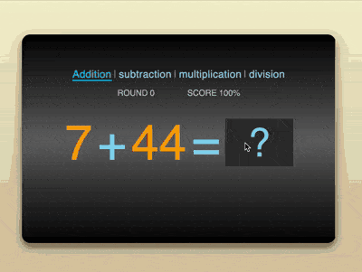

+++
title = '算术训练程序'
date = 2018-12-27T19:58:24+08:00
categories = ['开发实战']
subtitle = '开发实战 第165号作品'
image = '/test-hugo-deploy/img/thumbs/165.png'
summary = '#165 用于训练口算两位数四则运算'
+++



## 效果预览

点击链接可以在 Codepen 预览。

[https://codepen.io/comehope/pen/dwzRyQ](https://codepen.io/comehope/pen/dwzRyQ)

## 可交互视频

此视频是可以交互的，你可以随时暂停视频，编辑视频中的代码。

第 1 部分：
[https://scrimba.com/p/pEgDAM/ca6wWSk](https://scrimba.com/p/pEgDAM/ca6wWSk)

第 2 部分：
[https://scrimba.com/p/pEgDAM/c7Zy2AZ](https://scrimba.com/p/pEgDAM/c7Zy2AZ)

第 3 部分：
[https://scrimba.com/p/pEgDAM/c9R2Gsy](https://scrimba.com/p/pEgDAM/c9R2Gsy)

## 源代码下载

每日前端实战系列的全部源代码请从 github 下载：

[https://github.com/comehope/front-end-daily-challenges](https://github.com/comehope/front-end-daily-challenges)

## 代码解读

本项目可以训练加、减、乘、除四则运算。比如训练加法时，界面给出 2 个数值表示 2 个加数，小朋友心算出结果后大声说出，然后点击“？”按钮查看结果，根据对照的结果，如果计算正确（或错误），就点击绿勾（或红叉），然后再开始下一道测验。界面中还会显示已经做过几道题，正确率是多少。为了增强趣味性，加入了音效，答对时会响起小猫甜美的叫声，答错时响起的是小猫失望的叫声。

页面用纯 css 布局，程序逻辑用 vue 框架编写，用 howler.js 库播放音效。整个应用分成 4 个步骤实现：静态页面布局、加法的程序逻辑、四则运算的程序逻辑、音效处理。

### 一、页面布局

先创建 dom 结构，整个文档分成 4 部分，`.choose-type` 是一组多选一按钮，用于选择四则运算的类型，`.score` 是成绩统计数据，`.expression` 是一个算式，它也是游戏的主体部分，`.judgment` 用于判断答题是否正确：
```html
<div id="app">
    <div class="choose-type"></div>
    <div class="score"></div>
    <div class="expression"></div>
    <div class="judgment"></div>
</div>
```

`.choose-type` 一共包含 4 个 `input[type=radio]` 控件，命名为 `arithmetic-type`，加、减、乘、除 4 种运算类型的值分别为 1、2、3、4，每个控件后跟随一个对应的`label`，最终我们将把 `input` 控件隐藏起来，而让用户操作 `label`。
```html
<div id="app">
    <div class="choose-type">
        <div class="choose-type">
        <input type="radio" id="addition" name="arithmetic-type" value="1">
        <label for="addition">addition</label>
        <input type="radio" id="subtraction" name="arithmetic-type" value="2">
        <label for="subtraction">subtraction</label>
        <input type="radio" id="multiplication" name="arithmetic-type" value="3">
        <label for="multiplication">multiplication</label>
        <input type="radio" id="division" name="arithmetic-type" value="4">
        <label for="division">division</label>
    </div>
    <!-- 略 -->
</div>
```

`.score` 包含 2 个数据，一个是已经做过的题目数，一个是正确率：
```html
<div id="app">
    <!-- 略 -->
    <div class="score">
        <span>ROUND 15</span>
        <span>SCORE 88%</span>
    </div>
    <!-- 略 -->
</div>
```

`.expression` 把一个表达式的各部分拆开，以便能修饰表达式各部分的样式。`.number` 表示等式左边的 2 个运算数，`.operation` 表示运算符和等号，`.show` 是一个问号，同时它也是一个按钮，当心算出结果后，点击它，就显示出 `.result` 元素，展示运算结果：
```html
<div id="app">
    <!-- 略 -->
    <div class="expression">
        <span class="number">10</span>
        <span class="operation">+</span>
        <span class="number">20</span>
        <span class="operation">=</span>
        <span class="button show">?</span>
        <span class="result">30</span>
    </div>
    <!-- 略 -->
</div>
```

`.judgment` 包含 2 个按钮，分别是表示正确的绿勾和表示错误的红叉，显示在结果的下方：
```html
<div id="app">
    <!-- 略 -->
    <div class="judgment">
        <span class="button right">✔</span>
        <span class="button wrong">✘</span>
    </div>
</div>
```

至此，完整的 dom 结构如下：
```html
<div id="app">
    <div class="choose-type">
        <input type="radio" id="addition" name="arithmetic-type" value="1">
        <label for="addition">addition</label>
        <input type="radio" id="subtraction" name="arithmetic-type" value="2">
        <label for="subtraction">subtraction</label>
        <input type="radio" id="multiplication" name="arithmetic-type" value="3">
        <label for="multiplication">multiplication</label>
        <input type="radio" id="division" name="arithmetic-type" value="4">
        <label for="division">division</label>
    </div>
    <div class="score">
        <span>ROUND 15</span>
        <span>SCORE 88%</span>
    </div>
    <div class="expression">
        <span class="number">10</span>
        <span class="operation">+</span>
        <span class="number">20</span>
        <span class="operation">=</span>
        <span class="button show">?</span>
        <span class="result">30</span>
    </div>
    <div class="judgment">
        <span class="button right">✔</span>
        <span class="button wrong">✘</span>
    </div>
</div>
```

接下来用 css 布局。
居中显示：
```css
body{
	margin: 0;
	height: 100vh;
	display: flex;
	align-items: center;
	justify-content: center;
	background: linear-gradient(lightyellow, tan);
}
```

设置应用的容器样式，黑色渐变背景，子元素纵向排列，尺寸用相对单位 `vw` 和 `em`，以便在窗口缩放后能自适应新窗口尺寸：
```css
#app {
    width: 66vmin;
    display: flex;
    flex-direction: column;
    align-items: center;
    box-shadow: 0 1em 4em rgba(0, 0, 0, 0.5);
	border-radius: 2em;
	padding: 8em 5em;
    background: linear-gradient(black, dimgray, black);
    font-family: sans-serif;
    font-size: 1vw;
    user-select: none;
}
```

布局 `.choose-type` 区域。隐藏 `input` 控件，设置 `label` 为天蓝色：
```css
.choose-type input[name=arithmetic-type] {
	position: absolute;
	visibility: hidden;
}

.choose-type label {
    font-size: 2.5em;
    color: skyblue;
    margin: 0.3em;
	letter-spacing: 0.02em;
}
```

在 `label` 之间加入分隔线：
```css
.choose-type label {
    position: relative;
}

.choose-type label:not(:first-of-type)::before {
	content: '|';
	position: absolute;
	color: skyblue;
	left: -0.5em;
	filter: opacity(0.6);
}
```

设置 `label` 在鼠标悬停时变色，当 `input` 控件被选中时对应的 `label` 会变色、首字母变大写并显示下划线，为了使视觉效果切换平滑，设置了缓动时间。这里没有使用 `text-decoration: underline` 设置下划线，是因为用 `border` 才有缓动效果：
```css
.choose-type label {
    transition: 0.3s;
}

.choose-type label:hover {
	color: deepskyblue;
	cursor: pointer;
}

.choose-type input[name=arithmetic-type]:checked + label {
	text-transform: capitalize;
	color: deepskyblue;
	border-style: solid;
	border-width: 0 0 0.1em 0;
}
```

`.score` 区域用银色字，2 组数据之间留出一些间隔：
```css
.score{
    font-size: 2em;
    color: silver;
    margin: 1em 0 2em 0;
    width: 45%;
	display: flex;
	justify-content: space-between;
}
```

`.expression` 区域用大字号，各元素用不同的颜色区分：
```css
.expression {
	font-size: 12em;
	display: flex;
	align-items: center;
}

.expression span {
	margin: 0 0.05em;
}

.expression .number{
	color: orange;
}

.expression .operation{
	color: skyblue;
}

.expression .result{
	color: gold;
}
```

`.show` 是等号右边的问号，它同时也是一个按钮，在这里把按钮的样式 `.button` 独立出来，因为后面还会用到 `.button` 样式：
```css
.expression .show {
	color: skyblue;
	font-size: 0.8em;
	line-height: 1em;
	width: 1.5em;
	text-align: center;
}

.button {
	background-color: #222;
	border: 1px solid #555;
	padding: 0.1em;
}

.button:hover {
	background-color: #333;
	cursor: pointer;
}

.button:active {
	background-color: #222;
}
```

设置 `.judgment` 区域 2 个按钮的样式，它们还共享了 `.button` 样式：
```css
.judgment {
	font-size: 8em;
	align-self: flex-end;
}

.judgment .wrong {
	color: orangered;
}

.judgment .right {
	color: lightgreen;
}
```

至此，静态页面布局完成，完整的 css 代码如下：
```css
body{
	margin: 0;
	height: 100vh;
	display: flex;
	align-items: center;
	justify-content: center;
	background: linear-gradient(lightyellow, tan);
}

#app {
    width: 66vw;
    display: flex;
    flex-direction: column;
    align-items: center;
    box-shadow: 0 1em 4em rgba(0, 0, 0, 0.5);
	border-radius: 2em;
	padding: 8em 5em;
    background: linear-gradient(black, dimgray, black);
    font-family: sans-serif;
    font-size: 1vw;
    user-select: none;
}

.choose-type input[name=arithmetic-type] {
	position: absolute;
	visibility: hidden;
}

.choose-type label {
    font-size: 2.5em;
    color: skyblue;
    margin: 0.3em;
	letter-spacing: 0.02em;
    position: relative;
    transition: 0.3s;
}

.choose-type label:not(:first-of-type)::before {
	content: '|';
	position: absolute;
	color: skyblue;
	left: -0.5em;
	filter: opacity(0.6);
}

.choose-type label:hover {
	color: deepskyblue;
	cursor: pointer;
}

.choose-type input[name=arithmetic-type]:checked + label {
	text-transform: capitalize;
    color: deepskyblue;
	border-style: solid;
	border-width: 0 0 0.1em 0;
}

.score{
    font-size: 2em;
    color: silver;
    margin: 1em 0 2em 0;
    width: 45%;
	display: flex;
	justify-content: space-between;
}

.expression {
	font-size: 12em;
	display: flex;
	align-items: center;
}

.expression span {
	margin: 0 0.05em;
}

.expression .number{
	color: orange;
}

.expression .operation{
	color: skyblue;
}

.expression .result{
	color: gold;
}

.expression .show {
	color: skyblue;
	font-size: 0.8em;
	line-height: 1em;
	width: 1.5em;
	text-align: center;
}

.judgment {
	font-size: 8em;
	align-self: flex-end;
}

.judgment .wrong {
	color: orangered;
}

.judgment .right {
	color: lightgreen;
}

.button {
	background-color: #222;
	border: 1px solid #555;
	padding: 0.1em;
}

.button:hover {
	background-color: #333;
	cursor: pointer;
}

.button:active {
	background-color: #222;
}
```

### 二、加法的程序逻辑

我们先用加法把流程跑通，再把加法扩展为四则运算。

引入 vue 框架：
```html
<script src="https://cdnjs.cloudflare.com/ajax/libs/vue/2.5.21/vue.min.js"></script>
```

创建一个 Vue 对象：
```javascript
let vm = new Vue({
    el: '#app',
})
```

定义数据，`round` 存储题目数，`round.all` 表示总共答过了多少道题，`round.right` 表示答对了多少道题；`numbers` 数组包含 2 个元素，用于存储等式左边的 2 个运算数，用数组是为了便于后面使用解构语法：
```javascript
let vm = new Vue({
    ///...略
    data: {
        round: {all: 0, right: 0},
        numbers: [0, 0],
    }
    ///...略
})
```

定义计算属性，`operation` 是操作符，目前是加号，`result` 是计算结果，等于 2 个运算数相加，`score` 是正确率，开始做第一题时正确率显示为 100%，后续根据实际答对的题数计算正确率：
```javascript
let vm = new Vue({
    ///...略
    computed: {
        operation: function() {
            return '+'
        },
        result: function() {
            return this.numbers[0] + this.numbers[1]
        },
        score: function() {
            return this.round.all == 1
                ? 100
                : Math.round(this.round.right / (this.round.all - 1) * 100)
        }
    },
    ///...略
})
```

把数据绑定到 html 模板中：
```html
<div id="app">
    <!-- 略 -->
    <div class="score">
        <span>ROUND {{round.all - 1}}</span>
        <span>SCORE {{score}}%</span>
    </div>
    <div class="expression">
        <span class="number">{{numbers[0]}}</span>
        <span class="operation">{{operation}}</span>
        <span class="number">{{numbers[1]}}</span>
        <span class="operation">=</span>
        <span class="button show">?</span>
        <span class="result">{{result}}</span>
    </div>
    <!-- 略 -->
</div>
```

至此，页面中的数据都是动态获取的了。

等式右边的问号和结果不应同时显示出来，在用户思考时应显示问号，思考结束后应隐藏问号显示结果。为此，增加一个 `isThinking` 变量，用于标志用户所处的状态，默认为 `true`，即进入游戏时，用户开始思考第 1 道题目：
```javascript
let vm = new Vue({
    ///...略
    data: {
        round: {all: 0, right: 0},
        numbers: [0, 0],
        isThinking: true,
    },
    ///...略
})
```

把 `isThinking` 绑定到 html 模板中，用户思考时只显示问号 `.show`，否则显示结果 `.result` 和判断结果正确与否的按钮 `.judgment`，此处请注意，对于占据同一个视觉位置的元素，用 `v-show=false`，即 `display: none` 隐藏，对于占据独立视觉位置的元素，用 `visibility: hidden` 隐藏：
```html
<div id="app">
    <!-- 略 -->
    <div class="expression">
        <!-- 略 -->
        <span class="button show" v-show="isThinking">?</span>
        <span class="result" v-show="!isThinking">{{result}}</span>
    </div>
    <div class="judgment" :style="{visibility: isThinking ? 'hidden' : 'visible'}">
        <!-- 略 -->
    </div>
</div>
```

接下来生成随机运算数。创建一个 `next()` 方法用于开始下一个题目，那么在页面载入后就应执行这个方法初始化第 1 道题目：
```javascript
let vm = new Vue({
    ///...略
    methods: {
        next: function() {

        },
    },
})

window.onload = vm.next
```

`next()` 方法一方面要负责初始化运算数，还要把答过的题目数加1，这里独立出来一个 `newRound()` 方法是为了方便后面复用它：
```javascript
let vm = new Vue({
    ///...略
    methods: {
        newRound: function() {
            this.numbers = this.getNumbers()
            this.isThinking = true
        },
        next: function() {
            this.newRound()
            this.round.all++
        },
    },
})
```

`getNumbers()` 方法用于生成 2 个随机数，它调用 `getRandomNumber()` 方法来生成一个随机数，其中 `level` 参数表示随机数的取值范围，`level` 为 1 时，生成的随机数介于 1 ~ 9 之间，`level` 为 2 时，生成的随机数介于 10 ~ 99 之间。为了增加一点加法的难度，我们把 `level` 设置为 2：
```javascript
let vm = new Vue({
    ///...略
    methods: {
        getRandomNumber: function(level) {
            let min = Math.pow(10, level - 1)
            let max = Math.pow(10, level)
            return min + Math.floor(Math.random() * (max - min))
        },
        getNumbers: function() {
            let level = 2
            let a = this.getRandomNumber(level)
            let b = this.getRandomNumber(level)
            return [a, b]
        },
        newRound: function() {
            this.numbers = this.getNumbers()
            this.isThinking = true
        },
        next: function() {
            this.newRound()
            this.round.all++
        },
    },
})
```

此时，每刷新一次页面，运算数就会跟着刷新，因为每次页面加载都会运行 `vm.next()` 方法生成新的随机数。
接下来我们来处理按钮事件，页面中一共有 3 个按钮：问号按钮 `.show` 被点击后应显示结果；绿勾按钮 `.right` 被点击后应给答对题的数目加 1，然后进入下一道题；红叉按钮 `.wrong` 被点击后直接进入下一道题，所以我们在程序中增加 3 个方法，`getResult()`、`answerRight()`、`answerWrong` 分别对应上面的 3 个点击事件：
```javascript
let vm = new Vue({
    ///...略
    methods: {
        ///...略
        getResult: function() {
            this.isThinking = false
        },
        answerRight: function() {
            this.round.right++
            this.next()
        },
        answerWrong: function() {
            this.next()
        },
    },
})
```

把事件绑定到 html 模板：
```html
<div id="app">
    <!-- 略 -->
    <div class="expression">
        <!-- 略 -->
        <span class="button show" v-show="isThinking" @click="getResult">?</span>
        <!-- 略 -->
    </div>
    <div class="judgment" :style="{visibility: isThinking ? 'hidden' : 'visible'}">
        <span class="button right" @click="answerRight">✔</span>
        <span class="button wrong" @click="answerWrong">✘</span>
    </div>
</div>
```

至此，加法程序就全部完成了，可以一道又一道题一直做下去。
此时的 html 代码如下：
```html
<div id="app">
    <div class="choose-type">
        <!-- 没有改变 -->
    </div>
    <div class="score">
        <span>ROUND {{round.all - 1}}</span>
        <span>SCORE {{score}}%</span>
    </div>
    <div class="expression">
        <span class="number">{{numbers[0]}}</span>
        <span class="operation">{{operation}}</span>
        <span class="number">{{numbers[1]}}</span>
        <span class="operation">=</span>
        <span class="button show" v-show="isThinking" @click="getResult">?</span>
        <span class="result" v-show="!isThinking">{{result}}</span>
    </div>
    <div class="judgment" :style="{visibility: isThinking ? 'hidden' : 'visible'}">
        <span class="button right" @click="answerRight">✔</span>
        <span class="button wrong" @click="answerWrong">✘</span>
    </div>
</div>
```

此时的 javascript 代码如下：
```javascript
let vm = new Vue({
    el: '#app',

    data: {
        round: {all: 0, right: 0},
        numbers: [0, 0],
        isThinking: true,
    },

    computed: {
        operation: function() {
            return '+'
        },
        result: function() {
            return this.numbers[0] + this.numbers[1]
        },
        score: function() {
            return this.round.all == 1
                ? 100
                : Math.round(this.round.right / (this.round.all - 1) * 100)
        }
    },
    
    methods: {
        getRandomNumber: function(level) {
            let min = Math.pow(10, level - 1)
            let max = Math.pow(10, level)
            return min + Math.floor(Math.random() * (max - min))
        },
        getNumbers: function() {
            let level = 2
            let a = this.getRandomNumber(level)
            let b = this.getRandomNumber(level)
            return [a, b]
        },
        newRound: function() {
            this.numbers = this.getNumbers()
            this.isThinking = true
        },
        next: function() {
            this.newRound()
            this.round.all++
        },
        getResult: function() {
            this.isThinking = false
        },
        answerRight: function() {
            this.round.right++
            this.next()
        },
        answerWrong: function() {
            this.next()
        },
    },
})

window.onload = vm.next
```

### 三、四则运算的程序逻辑

我们先来评估一下四种运算在这个程序里会在哪些方面有差异。首先，运算符不同，加、减、乘、除的运算符分别是“+”、“-”、“×”、“÷”；第二是运算函数不同，这个不用多说。根据这 2 点，我们定义一个枚举对象 `ARITHMETIC_TYPE`，用它存储四种运算的差异，每个枚举对象有 2 个属性，`operation` 代表操作符，`f()` 函数是运算逻辑。另外，我们再声明一个变量 `arithmeticType`，用于存储用户当前选择的运算类型：
```javascript
let vm = new Vue({
    ///...略
    data: {
        ///...略
        ARITHMETIC_TYPE: {
			ADDITION: 1,
			SUBTRACTION: 2,
			MULTIPLICATION: 3,
			DIVISION: 4,
			properties: {
				1: {operation: '+', f: ([x, y]) => x + y},
				2: {operation: '-', f: ([x, y]) => x - y},
				3: {operation: '×', f: ([x, y]) => x * y},
				4: {operation: '÷', f: ([x, y]) => x / y}
			}
        },
        arithmeticType: 1,
    },
})
```

改造计算属性中关于运算符和计算结果的函数：
```javascript
let vm = new Vue({
    ///...略
    computed: {
        ///...略
        operation: function() {
            // return '+'
            return this.ARITHMETIC_TYPE.properties[this.arithmeticType].operation
        },
        result: function() {
            // return this.numbers[0] + this.numbers[1]
            return this.ARITHMETIC_TYPE.properties[this.arithmeticType].f(this.numbers)
        },
        ///...略
    },
})
```

因为上面 2 个计算属性都用到了 `arithmeticType` 变量，所以当用户选择运算类型时，这 2 个计算属性的值会自动更新。另外，为了让 ui 逻辑更严密，我们令 `arithmeticType` 的值改变时，开始一个新题目：
```javascript
let vm = new Vue({
    ///...略
    watch: {
        arithmeticType: function() {
            this.newRound()
        }
    }
})
```

然后，把 `arithmeticType` 变量绑定到 html 模板中的 `input` 控件上：
```html
<div id="app">
    <div class="choose-type">
        <input type="radio" id="addition" name="arithmetic-type" value="1" v-model="arithmeticType">
        <label for="addition">addition</label>
        <input type="radio" id="subtraction" name="arithmetic-type" value="2" v-model="arithmeticType">
        <label for="subtraction">subtraction</label>
        <input type="radio" id="multiplication" name="arithmetic-type" value="3" v-model="arithmeticType">
        <label for="multiplication">multiplication</label>
        <input type="radio" id="division" name="arithmetic-type" value="4" v-model="arithmeticType">
        <label for="division">division</label>
    </div>
    <!-- 略 -->
</div>
```

至此，当选择不同的运算类型时，表达式的运算符和计算结果都会自动更新为匹配的值，比如选择乘法时，运算符就变为乘号，运算结果为 2 个运算数的乘积。
不过，此时的最明显的问题是，除法的运算数因为是随机生成的，商经常是无限小数，为了更合理，我们规定这里的除法只做整除运算。再延伸一下，对于减法，为了避免差为负数，也规定被减数不小于减数。
解决这个问题的办法是在 `ARITHMETIC_TYPE` 枚举中添加一个 `gen()` 函数，用于存储生成运算数的逻辑，`gen()` 函数接收一个包含 2 个随机数的数组作为参数，对于加法和乘法，直接返回数组本身，减法的 `gen()` 函数为 `gen: ([a, b]) => a >= b ? [a, b] : [b, a]`，除法的 `gen()` 函数为 `gen: ([a, b]) => [a * b, b]`，经过如此处理的运算数，就可以实现上面规定的逻辑了。改造后的 `ARITHMETIC_TYPE` 如下：
```javascript
let vm = new Vue({
    ///...略
    data: {
        ///...略
        ARITHMETIC_TYPE: {
			ADDITION: 1,
			SUBTRACTION: 2,
			MULTIPLICATION: 3,
			DIVISION: 4,
			pproperties: {
				1: {operation: '+', f: (arr) => arr, gen: ([a, b]) => [a, b]},
				2: {operation: '-', f: ([x, y]) => x - y, gen: ([a, b]) => a >= b ? [a, b] : [b, a]},
				3: {operation: '×', f: (arr) => arr, gen: ([a, b]) => [a, b]},
				4: {operation: '÷', f: ([x, y]) => x / y, gen: ([a, b]) => [a * b, b]}
			}
        },
        ///...略
    },
    ///...略
})
```

然后，在 `getNumbers()` 中调用 `gen()` 方法：
```javascript
let vm = new Vue({
    ///...略
    methods: {
        ///...略
        getNumbers: function() {
            let level = 2
            let a = this.getRandomNumber(2)
            let b = this.getRandomNumber(2)
            // return [a, b]
            return this.ARITHMETIC_TYPE.properties[this.arithmeticType].gen([a, b])
        },
        ///...略
    },
    ///...略
})
```

至此，减法可以保证差不为负数，除法也可以保证商是整数了。
接下来，我们来配置训练难度。对大多数人来说，2 个二位数的加减法不是很难，但是 2 个二位数的乘除法的难度就大多了。在生成随机数时，因为定义了 `level=2`，所以取值范围固定是 11 ~ 99，我们希望能够灵活配置每个运算数的取值范围，为此，我们需要再为 `ARITHMETIC_TYPE` 枚举中增加一个 `level` 属性，用于表示随机数的取值范围，它是一个包含 2 个元素的数组，分别表示 2 个运算数的取值范围，改造后的 `ARITHMETIC_TYPE` 如下：
```javascript
let vm = new Vue({
    ///...略
    data: {
        ///...略
        ARITHMETIC_TYPE: {
			ADDITION: 1,
			SUBTRACTION: 2,
			MULTIPLICATION: 3,
			DIVISION: 4,
			properties: {
				1: {operation: '+', f: ([x, y]) => x + y, gen: (arr) => arr, level: [3, 2]},
				2: {operation: '-', f: ([x, y]) => x - y, gen: ([a, b]) => a >= b ? [a, b] : [b, a], level: [3, 2]},
				3: {operation: '×', f: ([x, y]) => x * y, gen: (arr) => arr, level: [2, 1]},
				4: {operation: '÷', f: ([x, y]) => x / y, gen: ([a, b]) => [a * b, b], level: [2, 1]}
			}
        },
        ///...略
    },
    ///...略
})
```

然后，把 `getNumbers()` 函数的 `level` 变量的值改为从枚举 `ARITHMETIC_TYPE` 中取值：
```javascript
let vm = new Vue({
    ///...略
    methods: {
        getNumbers: function() {
            let level = this.ARITHMETIC_TYPE.properties[this.arithmeticType].level
            let a = this.getRandomNumber(level[0])
            let b = this.getRandomNumber(level[1])
            return this.ARITHMETIC_TYPE.properties[this.arithmeticType].gen([a, b])
        },
        ///...略
    },
    ///...略
})
```

现在运行程序可以看到，加减法的 2 个运算数分别是 3 位数和 2 位数，而乘除法的 2 个运算数则分别是 2 位数和 1 位数，你也可以根据自己的需要来调整训练难度。
至此，四则运算的程序逻辑全部完成，此时的 javascript 代码如下：
```javascript
let vm = new Vue({
    el: '#app',

    data: {
        round: {all: 0, right: 0},
        numbers: [0, 0],
        isThinking: true,
        ARITHMETIC_TYPE: {
			ADDITION: 1,
			SUBTRACTION: 2,
			MULTIPLICATION: 3,
			DIVISION: 4,
			properties: {
				1: {operation: '+', f: ([x, y]) => x + y, gen: (arr) => arr, level: 2},
				2: {operation: '-', f: ([x, y]) => x - y, gen: ([a, b]) => a >= b ? [a, b] : [b, a], level: 2},
				3: {operation: '×', f: ([x, y]) => x * y, gen: (arr) => arr, level: 1},
				4: {operation: '÷', f: ([x, y]) => x / y, gen: ([a, b]) => [a * b, b], level: 1}
			}
        },
        arithmeticType: 1,
    },

    computed: {
        operation: function() {
            return this.ARITHMETIC_TYPE.properties[this.arithmeticType].operation
        },
        result: function() {
            return this.ARITHMETIC_TYPE.properties[this.arithmeticType].f(this.numbers)
        },
        score: function() {
            return this.round.all == 1
                ? 100
                : Math.round(this.round.right / (this.round.all - 1) * 100)
        }
    },
    
    methods: {
        getRandomNumber: function(level) {
            let min = Math.pow(10, level - 1)
            let max = Math.pow(10, level)
            return min + Math.floor(Math.random() * (max - min))
        },
        getNumbers: function() {
            let level = this.ARITHMETIC_TYPE.properties[this.arithmeticType].level
            let a = this.getRandomNumber(level[0])
            let b = this.getRandomNumber(level[1])
            return this.ARITHMETIC_TYPE.properties[this.arithmeticType].gen([a, b])
        },
        newRound: function() {
            this.numbers = this.getNumbers()
            this.isThinking = true
        },
        next: function() {
            this.newRound()
            this.round.all++
        },
        getResult: function() {
            this.isThinking = false
        },
        answerRight: function() {
            this.round.right++
            this.next()
        },
        answerWrong: function() {
            this.next()
        },
    },

    watch: {
        arithmeticType: function() {
            this.newRound()
        }
    }
})

window.onload = vm.next
```

### 四、音效处理

引入 howler 库：
```html
<script src="https://cdnjs.cloudflare.com/ajax/libs/howler/2.1.1/howler.min.js"></script>
```

声明变量 `sound`，它有 2 个属性 `right` 和 `wrong`，分别代表回答正确和错误时的音效，属性值是一个 `Howl` 对象，在构造函数中指定音频文件的 url：
```javascript
let vm = new Vue({
    ///...略
    data: {
        ///...略
        sound: {
			right: new Howl({src: ['https://freesound.org/data/previews/203/203121_777645-lq.mp3']}),
			wrong: new Howl({src: ['https://freesound.org/data/previews/415/415209_5121236-lq.mp3']})
		},
    },
    ///...略
})
```

在 `answerRight()` 方法和 `answerWrong()` 方法中分别调用播放声音的 `play()` 方法即可：
```javascript
let vm = new Vue({
    ///...略
    methods: {
        ///...略
        answerRight: function() {
            this.round.right++
            this.sound.right.play()
            this.next()
        },
        answerWrong: function() {
            this.sound.wrong.play()
            this.next()
        },
    ///...略
})
```

现在，当点击绿勾时，就会响起小猫甜美的叫声；当点击红叉时，响起的是小猫失望的叫声。
至此，程序全部开发完成，最终的 javascript 代码如下：
```javascript
let vm = new Vue({
    el: '#app',

    data: {
        round: {all: 0, right: 0},
        numbers: [0, 0],
        isThinking: true,
        ARITHMETIC_TYPE: {
			ADDITION: 1,
			SUBTRACTION: 2,
			MULTIPLICATION: 3,
			DIVISION: 4,
			properties: {
				1: {operation: '+', f: ([x, y]) => x + y, gen: (arr) => arr, level: [3, 2]},
				2: {operation: '-', f: ([x, y]) => x - y, gen: ([a, b]) => a >= b ? [a, b] : [b, a], level: [3, 2]},
				3: {operation: '×', f: ([x, y]) => x * y, gen: (arr) => arr, level: [2, 1]},
				4: {operation: '÷', f: ([x, y]) => x / y, gen: ([a, b]) => [a * b, b], level: [2, 1]}
			}
        },
        arithmeticType: 1,
        sound: {
			right: new Howl({src: ['https://freesound.org/data/previews/203/203121_777645-lq.mp3']}),
			wrong: new Howl({src: ['https://freesound.org/data/previews/415/415209_5121236-lq.mp3']})
		},
    },

    computed: {
        operation: function() {
            return this.ARITHMETIC_TYPE.properties[this.arithmeticType].operation
        },
        result: function() {
            return this.ARITHMETIC_TYPE.properties[this.arithmeticType].f(this.numbers)
        },
        score: function() {
            return this.round.all == 1
                ? 100
                : Math.round(this.round.right / (this.round.all - 1) * 100)
        }
    },
    
    methods: {
        getRandomNumber: function(level) {
            let min = Math.pow(10, level - 1)
            let max = Math.pow(10, level)
            return min + Math.floor(Math.random() * (max - min))
        },
        getNumbers: function() {
            let level = this.ARITHMETIC_TYPE.properties[this.arithmeticType].level
            let a = this.getRandomNumber(level[0])
            let b = this.getRandomNumber(level[1])
            return this.ARITHMETIC_TYPE.properties[this.arithmeticType].gen([a, b])
        },
        newRound: function() {
            this.numbers = this.getNumbers()
            this.isThinking = true
        },
        next: function() {
            this.newRound()
            this.round.all++
        },
        getResult: function() {
            this.isThinking = false
        },
        answerRight: function() {
            this.round.right++
            this.sound.right.play()
            this.next()
        },
        answerWrong: function() {
            this.sound.wrong.play()
            this.next()
        },
    },

    watch: {
        arithmeticType: function() {
            this.newRound()
        }
    }
})

window.onload = vm.next
```

大功告成！
