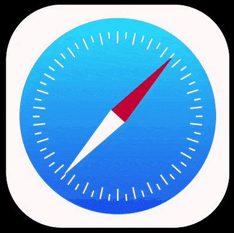

+++
title = 'Safari Logo'
date = 2019-05-17T17:56:48+08:00
image = '/fe/img/thumbs/166.png'
summary = '#166'
+++



## 效果预览

点击链接可以在 Codepen 预览。

[https://codepen.io/comehope/pen/rgmPLR](https://codepen.io/comehope/pen/rgmPLR)

## 可交互视频

此视频是可以交互的，你可以随时暂停视频，编辑视频中的代码。

请用 chrome, safari, edge 打开观看。

[https://scrimba.com/p/pEgDAM/c2LBPPtg](https://scrimba.com/p/pEgDAM/c2LBPPtg)

## 源代码下载

每日前端实战系列的全部源代码请从 github 下载：

[https://github.com/comehope/front-end-daily-challenges](https://github.com/comehope/front-end-daily-challenges)

## 代码解读

### 容器基本属性

Safari 浏览器的 LOGO 是一个指南针的形状，它的主要元素有 2 个，一个是围绕在表盘周围的刻度线，一个是中间的指针。所以我们定义 dom 结构如下，其中 `.marks` 代表刻度线，`.pointer` 代表指针。`.marks` 中有 4 个 `<span>` 元素，它们代表刻度线，实际的刻度线有几十条，这里只定义 4 条，目的是便于书写样式，等样式写好后，接下来会用 JavaScript 批量生成刻度线：

```html
<figure class="safari">
    <div class="marks">
        <span></span>
        <span></span>
        <span></span>
        <span></span>
    </div>
    <div class="pointer"></div>
</figure>
```

让作品显示在页面正中，页面背景为黑色：

```css
body {
    margin: 0;
    height: 100vh;
    display: flex;
    align-items: center;
    justify-content: center;
    background-color: black;
}
```

LOGO 容器是一个白色的圆角正方形。作品将使用 `em` 作为长度单位，如果想修改 LOGO 的尺寸，只要修改这里的 `font-size` 属性就可以了。用 `flex` 布局令其中的子元素 `.marks` 和 `.pointer` 都居中显示：

```css
.safari {
    font-size: 10px;
    width: 15em;
    height: 15em;
    background-color: snow;
    border-radius: 25%;
    padding: 1em;
    display: flex;
    align-items: center;
    justify-content: center;
}
```

### 绘制刻度线

先绘制出刻度线所在的表盘，用线性渐变填充上蓝色渐变色：

```css
.marks {
    width: inherit;
    height: inherit;
    background-image: linear-gradient(
        hsl(191, 98%, 55%),
        hsl(220, 88%, 53%)
    );
    border-radius: 50%;
}
```

再绘制出刻度线。围绕着一个圆周绘图的技巧是先令一组元素逐个旋转较小的角度（用 `rotate()` 函数实现），再让这些元素向旋转的方向移动（用 `translate()` 函数实现）。这里用变量 `--rotate-deg` 存储旋转的角度：

```css
.marks {
    display: flex;
    align-items: center;
    justify-content: center;
}

.marks span {
    position: absolute;
    width: 0.1em;
    height: 0.9em;
    background-color: snow;
    transform: rotate(var(--rotate-deg)) translateY(6em);
}

.marks span:nth-child(1) {--rotate-deg: 0deg;}
.marks span:nth-child(2) {--rotate-deg: 90deg;}
.marks span:nth-child(3) {--rotate-deg: 180deg;}
.marks span:nth-child(4) {--rotate-deg: 270deg;}
```

现在可以看到 4 条刻度线分别定位到表盘的上、下、左、右的边缘位置了。

### 用 Javascript 批量生成刻度线

因为刻度线有很多条，为了减少代码量，我们用 JavaScript 来批量创建刻度线。

在此之前，先删除掉 html 中的声明 `<span>` 元素的 4 行代码：

```html
<figure class="safari">
    <div class="marks">
        <!-- <span></span>
        <span></span>
        <span></span>
        <span></span> -->
    </div>
    <div class="pointer"></div>
</figure>
```

再删除 css 中设置刻度线角度的代码：

```css
/* .marks span:nth-child(1) {--rotate-deg: 0deg;}
.marks span:nth-child(2) {--rotate-deg: 90deg;}
.marks span:nth-child(3) {--rotate-deg: 180deg;}
.marks span:nth-child(4) {--rotate-deg: 270deg;} */
```

然后用 js 来批量创建 60 条刻度线：

```js
const MARKS_COUNT = 60

Array(MARKS_COUNT).fill('').forEach((x, i) => {
    let span = document.createElement('span')
    span.style.setProperty('--rotate-deg', i * 360 / MARKS_COUNT + 'deg')
    document.querySelector('.marks').appendChild(span)
})
```

这里稍复杂的是表达式 `i * 360 / MARKS_COUNT + 'deg'`，其中 `360 / MARKS_COUNT ` 是把一个圆周的 360 度分成若干份（也就是刻度线数量那么多的份数）之后每一份的角度，再用每一份的下标值 `i` 去乘它，就得到每条刻度线应旋转的角度了。

接下来设置刻度线的细节，令刻度线长短交错。代表刻度线长度的变量是 `--h`，长线长 `0.9em`，短线长 `0.5em`，为了让刻度线对齐，再用变量 `--y` 存储偏移量，令长线偏移 `6em`，短线偏移 `6.2em`。同时修改 `height` 属性和 `translateY()` 函数，让它们引用这 2 个变量的值。因为刻度线长短交错，所以用 `:nth-child(odd)` 和 `:nth-child(even)` 来设置 2 组不同的参数值：

```css
.marks span {
    height: var(--h);
    transform: rotate(var(--rotate-deg)) translateY(var(--y));
}

.marks span:nth-child(odd) {--h: 0.9em; --y: 6em;}
.marks span:nth-child(even) {--h: 0.5em; --y: 6.2em;}
```

至此，刻度线绘制完成。

### 绘制指针

指针是由 2 个三角形组成的，对于这种成对的元素，通常都用伪元素绘制。先确定一下指针的尺寸，用 `flex` 令它的子元素（也就是 2 个伪元素）纵向排列：

```css
.pointer {
    position: absolute;
    width: 1.4em;
    height: 12em;
    display: flex;
    flex-direction: column;
}
```

绘制三角形的技巧是令容器的尺寸为 `0` 宽 `0` 高，然后用 3 条边框构成三角形，要是看不懂这段代码的话，动手试试就明白了。这里也定义了一个变量 `--c`，用于存储 2 个三角形的颜色，分别是红色和白色：

```css
.pointer::before,
.pointer::after {
    content: '';
    border-bottom: 6em solid var(--c);
    border-left: 0.7em solid transparent;
    border-right: 0.7em solid transparent;
}

.pointer::after {
    transform: rotate(180deg);
}

.pointer::before {--c: crimson;}
.pointer::after {--c: snow;}
```

到这里，指针绘制完成，整个 LOGO 的形状也已经完成了。

最后，加一点动画效果，让指针像指南针那样转动。原理很简单，就是让指针在 `30` 度到 `50` 度之间来回摆动：

```css
.pointer {
    transform: rotate(30deg);
    animation: rotate 1s ease-in-out infinite alternate;
}

@keyframes rotate {
    to {
        transform: rotate(50deg);
    }
}
```

大功告成！
