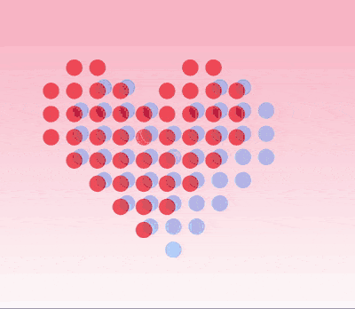

+++
title = '两颗爱心'
date = 2019-05-20T17:57:07+08:00
image = '/test-hugo-deploy/img/thumbs/167.png'
summary = '#167'
+++



## 效果预览

点击链接可以在 Codepen 预览。

[https://codepen.io/comehope/pen/KLvENb](https://codepen.io/comehope/pen/KLvENb)

## 可交互视频

此视频是可以交互的，你可以随时暂停视频，编辑视频中的代码。

[https://scrimba.com/p/pEgDAM/cJ8vrMt2](https://scrimba.com/p/pEgDAM/cJ8vrMt2)

## 源代码下载

每日前端实战系列的全部源代码请从 github 下载：

[https://github.com/comehope/front-end-daily-challenges](https://github.com/comehope/front-end-daily-challenges)

## 代码解读

### 一、绘制一个圆点

定义 dom 结构，只有一个 dom 元素，名为 `.heart`：

```html
<figure class="heart"></figure>
```

让元素居中显示，设置页面背景色为浅粉红渐变色：

```css
body {
    margin: 0;
    height: 100vh;
    display: flex;
    align-items: center;
    justify-content: center;
    background: linear-gradient(lightpink, white);
}
```

画出一个红色圆点：

```css
.heart {
    font-size: 30px;
    width: 1em;
    height: 1em;
    background-color: red;
    border-radius: 50%;
```

### 二、制作一个点阵图形和它的投影

我们要制作一个点阵图形，这个手法在[第 67 号作品](https://segmentfault.com/a/1190000015444368)中曾有应用。原理是利用 box-shadow 的特性，如果你已经了解了这个手法，可以直接滚屏到下一节，如果还不了解，做下面这几个小实验就明白了。

给 `.heart` 设置下面的阴影，则在红色圆点的右侧会出现一个等大的黑点：

```css
.heart {
    box-shadow:
        1.1em 0;
}
```

继续在红点左侧画一个黑点：

```css
.heart {
    box-shadow:
        1.1em 0,
        -1.1em 0;
}
```

再继续，在红点的下方画一个黑点：

```css
.heart {
    box-shadow:
        1.1em 0,
        -1.1em 0,
        0 1.1em;
}
```

再在红点的上方画一个黑点：

```css
.heart {
    box-shadow:
        1.1em 0,
        -1.1em 0,
        0 1.1em,
        0 -1.1em;
}
```

现在你可以看到，4 个黑点组成一个十字形，而红点在这个十字形交叉点的位置。这个技巧就是把屏幕当作一个以红点为原点的平面坐标系，水平方向右侧为正，垂直方向下方为正，与浏览器的坐标体系一致。每一个阴影属性值就可以绘制出一个圆点，因为 `box-shadow` 可以接收多个属性性，所以就可以用多个圆点来画点阵图了。

为了让代码更直观，我们可以把代码的布局安排得和图案的形状一样，下面 `box-shadow` 的 4 个属性值用来画出一个十字形：

```css
.heart {
    box-shadow: 
                    0 -1.1em,


        -1.1em 0,               1.1em 0,


                    0 1.1em;
}
```

因为没有给阴影指定颜色，所以它默认是黑色，要把它改成红色，并不需要在 `box-shadow` 赋值，基于 CSS 的继承原理，直接给元素指定一个颜色，阴影就采用相同的颜色了：

```css
.heart {
    color: red;
    background-color: currentColor;
}
```

大红太艳了，让它的颜色谈一点：

```css
.heart {
    color: hsla(0, 100%, 50%, 0.6);
}
```

接下来再用一个技巧，用 `drop-shadow()` 把整个图案再复制出一份：

```css
.heart {
    filter: drop-shadow(3.3em 2.2em dodgerblue);
}
```

三、绘制心形图案

有了上面的知识储备，绘制心形就只是一个工夫活了，花一点时间在纸上画一画，数一数，就可以创作点阵图形了。这里用到的心形是 9 * 8 点阵的：

```css
.heart {
    --heart-shape: 
                    -3.3em -3.3em, -2.2em -3.3em,                                          2.2em -3.3em, 3.3em -3.3em,


    -4.4em -2.2em, -3.3em -2.2em, -2.2em -2.2em, -1.1em -2.2em,             1.1em -2.2em, 2.2em -2.2em, 3.3em -2.2em, 4.4em -2.2em,


    -4.4em -1.1em, -3.3em -1.1em, -2.2em -1.1em, -1.1em -1.1em, 0em -1.1em, 1.1em -1.1em, 2.2em -1.1em, 3.3em -1.1em, 4.4em -1.1em,


    
    -4.4em 0em,    -3.3em 0em,    -2.2em 0em,    -1.1em 0em,    0em 0em,    1.1em 0em,    2.2em 0em,    3.3em 0em,    4.4em 0em,


    
                    -3.3em 1.1em,  -2.2em 1.1em,  -1.1em 1.1em,  0em 1.1em,  1.1em 1.1em,  2.2em 1.1em,  3.3em 1.1em,


                                    -2.2em 2.2em,  -1.1em 2.2em,  0em 2.2em,  1.1em 2.2em,  2.2em 2.2em,


                                                    -1.1em 3.3em,  0em 3.3em,  1.1em 3.3em,


                                                                0em 4.4em;
    box-shadow: var(--heart-shape);
}
```

哈哈，这一大片代码真是让人头晕啊，但是如果是在编辑器里看，它就是一个心形呢，像这样：

[图]

至此，我们得到了一颗红心和一颗蓝心。

四、设计动画效果

定义 2 组关键帧，分别用于红心和蓝心，红心的帧效果就是 `box-shadow` 属性的代码，蓝心的帧效果则是 `drop-shadow()` 的代码：

```css
.heart {
    /* box-shadow: var(--heart-shape); */
    /* color: hsla(0, 100%, 50%, 0.6); */
    /* filter: drop-shadow(3.3em 2.2em dodgerblue); */
}

@keyframes heart-one {
    to {
        box-shadow: var(--heart-shape);
        color: hsla(0, 100%, 50%, 0.6);
    }
}

@keyframes heart-two {
    to {
        filter: drop-shadow(3.3em 2.2em dodgerblue);
    }
}
```

最后，定义动画属性，注意蓝心有 `0.3s` 的延迟：

```css
.heart {
    animation: 
        heart-one 1s infinite alternate cubic-bezier(0.5, 1.7, 0.5, 1.5),
        heart-two 1s 0.3s infinite alternate cubic-bezier(0.5, 1.7, 0.25, 1);
}
```

大功告成！
