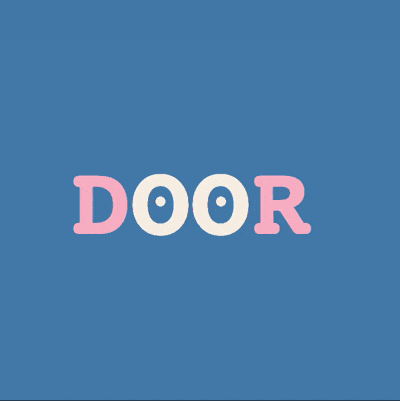

+++
title = '切换单词的交互动画'
date = 2019-05-23T19:43:55+08:00
categories = ['开发实战']
subtitle = '开发实战 第168号作品'
image = '/fe/img/thumbs/168.png'
summary = '#168 把英语单词里的“OO”拟人化为两只眼睛，利用 Web Animation API 实现动画效果'
+++



## 效果预览

点击链接可以在 Codepen 预览。

[https://codepen.io/comehope/pen/byabeG](https://codepen.io/comehope/pen/byabeG)

## 可交互视频

此视频是可以交互的，你可以随时暂停视频，编辑视频中的代码。

[https://scrimba.com/p/pEgDAM/cevPbkfB](https://scrimba.com/p/pEgDAM/cevPbkfB)

（因为 scrimba 不支持 web animation api，所以动画效果在视频播放过程中看不到，不过你可以随时暂停视频，手工刷新预览窗口查看动画效果）

## 源代码下载

每日前端实战系列的全部源代码请从 github 下载：

[https://github.com/comehope/front-end-daily-challenges](https://github.com/comehope/front-end-daily-challenges)

## 代码解读

本作品用于展示若干包含字母组合 `OO` 的单词，每点击一下，`OO` 就眨眨眼，同时更换一个单词。

整体开发过程分成 4 步，第 1 步用 CSS 实现页面的静态布局，后面 3 步用 JS 实现动画和业务逻辑。第 2 步实现单词中间字母 `OO` 的眨眼效果，第 3 步实现随机取单词的逻辑，第 4 步实现字符的切换动画。

眨眼动画和字符切换动画都是用 Web Animation API 实现的。虽然用 JS 写动画比用 CSS 要麻烦一些，但 API 提供了一些事件 handler，在字符切换动画中就是利用事件机制来精确控制动画和在动画过程中加入业务逻辑的。

下面开始编码。

### 一、静态布局：dom，css

dom 结构很简单，一个名为 `.word` 的 `<p>` 元素中包含了 4 个 `<span>` 子元素，每个子元素容纳一个字符：

```html
<p class="word">
    <span>b</span>
    <span>o</span>
    <span>o</span>
    <span>k</span>
</p>
```

令页面中的元素居中，设置页面背景色为青蓝色：

```css
body {
    margin: 0;
    height: 100vh;
    display: flex;
    align-items: center;
    justify-content: center;
    background-color: steelblue;
}
```

设置单词的样式，麻布色，大字号，大写：

```css
.word {
    font-size: 100px;
    color: linen;
    font-family: monospace;
    font-weight: bold;
    display: flex;
    text-transform: uppercase;
    cursor: pointer;
    user-select: none;
}
```

让单词两端的 2 个字符变为粉色：

```css
.word span:first-child,
.word span:last-child {
    color: pink;
}
```

用径向渐变给单词中间的 `OO` 加上眼珠：

```css
.word span:not(:first-child):not(:last-child) {
    background-image: radial-gradient(
        circle at center,
        linen 0.05em,
        transparent 0.05em
    );
}
```

至此，静态布局完成。

### 二、眨眼动画

为 `.word` 元素创建一个单击事件函数，每当点击发生时，就先让中间的 `OO` 眨眼，然后获得下一个要显示的单词，再把当前的单词换成新的单词：

```js
document.querySelector('.word').onclick = function() {
    //第1步：眨眼动画
    //第2步：获得下一个单词
    //第3步：字符切换动画
}
```

先来实现第1步-眨眼动画。在此之前了解一下 Web Animation API 的语法，下面是一个简单的示例：

```js
let keyframes = [
    {transform: 'scaleY(1)'},
    {transform: 'scaleY(0.1)'},
]
let options = {
    duration: 200,
    iterations: 2,
}
element.animate(keyframes, options)
```

`animate()` 方法接收 2 个参数，第 1 个参数是一个数组，用于定义关键帧；第 2 个参数是一个对象，用于定义动画属性，它们分别对应着 CSS 中的 `@keyframes` 语句和 `animation` 属性。上面的 JS 代码等价于以下 CSS 代码：

```css
@keyframes anim {
    from {
        transform: scaleY(1);
    }

    to {
        transform: scaleY(0);
    }
}

.element {
    animation-name: anim;
    animation-duration: 200ms;
    animation-iteration-count: 2;
}
```

好了，我们来正式写眨眼动画：

```js
function blinkEyes() {
    let eyes = document.querySelectorAll('.word span:not(:first-child):not(:last-child)')
    let keyframes = [
        {transform: 'scaleY(1)', offset: 0},
        {transform: 'scaleY(0.1)', offset: 0.25},
        {transform: 'scaleY(1)', offset: 0.5},
        {transform: 'scaleY(1)', offset: 1},
    ]
    let options = {
        duration: 200,
        iterations: 2,
    }
    eyes.forEach(eye => eye.animate(keyframes, options))
}
```

上面代码中的 `offset` 是 `@keyframes` 中为每一帧指定的百分比值。这段动画的意思是每次动画眨眼 2 次，每次眨眼用时 200ms，这 200ms 的前 50% 时间（即前 100ms）做眨眼动作，后 50% 时间等待，这样设计的目的是在 2 次眨眼之间插入 100ms 的间隔。

然后，在点击事件里调用上面的方法：

```js
document.querySelector('.word').onclick = function() {
    //第1步：眨眼动画
    blinkEyes()

    //第2步：获得下一个单词
    //第3步：字符切换动画
}
```

至此，当用鼠标点击文字时，`OO` 就会眨动。

### 三、获得下一个单词

接下来写一点业务逻辑，用于随机取出一个单词。

引入 lodash 库：

```html
<script src="https://cdnjs.cloudflare.com/ajax/libs/lodash.js/4.17.11/lodash.min.js"></script>
```

定义一个名为 `Word` 的类：

```js
function Word() {
    const WORDS = ['book', 'boot', 'cook', 'cool', 'door', 'food', 'fool', 'foot', 'good', 'look', 'loop', 'moon', 'noon', 'pool', 'poor', 'room', 'roof','root', 'soon', 'tool', 'wood', 'zoom',]
    let current = 'book'
    this.getNext = () => {return current = _(WORDS).without(current).sample()}
}
```

`Word` 类有一个名为 `getNext()` 的方法，用于从预设的数组中随机取出一个单词，可以用下面的代码测试一下效果，会输出类似 `food` 这样的单词：

```js
let word = new Word()
console.log(word.getNext())
```

因为接下来的动画只涉及单词左右两侧的字母，所以在 `getNext()` 方法中再把两端的字符拆出来，返回一个对象：

```js
function Word() {
    const WORDS = ['book', 'boot', 'cook', 'cool', 'door', 'food', 'fool', 'foot', 'good', 'look', 'loop', 'moon', 'noon', 'pool', 'poor', 'room', 'roof','root', 'soon', 'tool', 'wood', 'zoom',]
    let current = 'book'
    this.getNext = () => {
        current = _(WORDS).without(current).sample()
        return {
            first: current.slice(0, 1),
            last: current.slice(-1)
        }
    }
}
```

再测试一下效果，输出结果会变为类似 `{first: "f", last: "d"}` 的对象。

在点击事件中调用上面的函数，把结果存入一个名为 `chars` 的变量中：

```js
let word = new Word()

document.querySelector('.word').onclick = function() {
    //step 1: eyes blink animation
    blinkEyes()

    //第2步：获得下一个单词
    let chars = word.getNext()

    //第3步：字符切换动画
}
```

### 四、字符切换动画

该制作字符切换动画了。

函数的声明如下，函数名为 `switchChar`，它接收 2 个参数，第 1 个参数表示对哪个字符执行动画，值为 `first` 或 `last`，第 2 个参数是将被替换成的新字符：
```js
function switchChar(which, char) {}
```

这样来调用：
```js
switchChar('first', 'f')
```

先实现更换逻辑，不包含动画效果：
```js
function switchChar(which, char) {
    let letter = {
        first: {
            dom: document.querySelector('.word span:first-child'),
        },
        last: {
            dom: document.querySelector('.word span:last-child'),
        }
    }[which]

    letter.dom.textContent = char
}
```

在点击事件中调用 `switchChar` 函数：

```js
document.querySelector('.word').onclick = function() {
    //step 1: eyes blink animation
    blinkEyes()

    //第2步：获得下一个单词
    let chars = word.getNext()

    //第3步：字符切换动画
    Object.keys(chars).forEach(key => switchChar(key, chars[key]))
}
```

现在运行程序的话，在每次点击之后，单词两侧的字符都会更新。

接下来写动画效果，方法和写眨眼动画类似。这里有两点要说明，一是因为有 `first`、`last` 2 个字符、又有入场、出场 2 个动画，所以实际上一共实现了 4 个动画效果；二是动画的流程是先让旧字符出场，再让新字符入场，而更换字符的操作放置在这 2 个动画中间，这是用动画 API 的 `onfinish` 事件实现的：

```js
function switchChar(which, char) {
    let letter = {
        first: {
            dom: document.querySelector('.word span:first-child'),
            to: '-0.5em',
            from: '0.8em',
        },
        last: {
            dom: document.querySelector('.word span:last-child'),
            to: '0.5em',
            from: '-0.8em',
        }
    }[which]

    let keyframes = {
        out: [
            {transform: `translateX(0)`, filter: 'opacity(1)'},
            {transform: `translateX(${letter.to})`, filter: 'opacity(0)'},
        ],
        in: [
            {transform: `translateX(${letter.from})`, filter: 'opacity(0)'},
            {transform: `translateX(0)`, filter: 'opacity(1)'},
        ]
    }

    let options = {
        duration: 500,
        fill: 'forwards',
        easing: 'cubic-bezier(0.5, 1.5, 0.5, 1.5)'
    }

    letter.dom
        .animate(keyframes.out, options)
        .onfinish = function() {
            letter.dom.animate(keyframes.in, options)
            letter.dom.textContent = char
        }
}
```

至此，全部编码完成。解读 JS 代码和解读 CSS 代码不一样，因为不是每一行代码都有视觉效果，很难用语言描述。如果你有不理解的地方，一定是我没有讲清楚，那么请你多看几遍视频，仔细体会。

在前端每日实战的[第 162 号作品](/post/x7166/)中也曾使用过 Web Animation API，但那个作品的业务逻辑比这个要复杂，你在理解了这个作品之后若还想再挑战一下，可以再去参考它。

大功告成！
