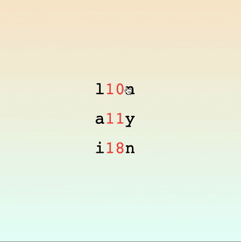

+++
title = '“数略词”交互动画'
date = 2019-06-13T18:26:30+08:00
categories = ['开发实战']
subtitle = '开发实战 第169号作品'
image = '/fe/img/thumbs/169.png'
summary = '#169 演示长单词是如何转换为“数略词”的'
+++



## 效果预览

点击链接可以预览。

[https://codepen.io/comehope/pen/byvRxB](https://codepen.io/comehope/pen/byvRxB)

## 可交互视频

此视频是可以交互的，你可以随时暂停视频，编辑视频中的代码。

视频1: [https://scrimba.com/p/pEgDAM/cR4gpGsa](https://scrimba.com/p/pEgDAM/cR4gpGsa)
视频2: [https://scrimba.com/p/pEgDAM/czNp3MUZ](https://scrimba.com/p/pEgDAM/czNp3MUZ)

## 源代码下载

每日前端实战系列的全部源代码请从 github 下载：

[https://github.com/comehope/front-end-daily-challenges](https://github.com/comehope/front-end-daily-challenges)

## 代码解读

大家是否见过 “i18n”、“a11y” 这样的英文单词？它们其实是一些单词的缩写，“i18n” 代表的是 “internationalization”（国际化），“a11y” 代表的是 “accessibility”（可访问性），因为包含的字母太多了，所以缩写时只保留头尾的字母，再把余下的字符个数写在中间，这种写法称为“Numeronym”，我把它翻译成“数略词”。据说最长的单词是 “pneumonoultramicroscopicsilicovolcanoconiosis”，由 45 个字母组成，意思是一种肺部疾病。

本项目将制作一个交互动画效果，令其在单词原词和“数略词”之间切换。整个项目分成二个步骤开发，第一步先实现一个固定单词的交互动画，第二步改写为能自动处理任意的单词，然后扩展应用到多个单词上。

一、一个固定单词的交互动画

dom 结构如下，最外侧的容器名为 `.container`，其中包含一个名为 `.word` 的 `<div>` 元素，它代表一个单词，它的子元素是 4 个 `<p>` 元素，分别代表单词的第1个字母、中间字符的个数（`.middle.short`）、中间的若干字符（`.middle.long`）、单词的最后1个字母。因为动画时将交替显示“中间字符的个数”和“中间的若干字符”，所以为它们设置了特殊类名，以便在随后的 css 代码中引用它们，当要同时选择它们时，就用它们共同的类名 `middle`，当要分别选择时，就指定它们各自的类名 `short` 和 `long`：

```html
<div class="container">
    <div class="word">
        <p>i</p>
        <p class="middle short">
            <span>18</span>
        </p>
        <p class="middle long">
            <span>nternationalizatio</span>
        </p>
        <p>n</p>
    </div>
</div>
```

令容器居于页面正中：

```css
body {
    margin: 0;
    height: 100vh;
    display: flex;
    align-items: center;
    justify-content: center;
    background-image: linear-gradient(bisque, lightcyan);
}
```

让 4 个 `<p>` 标签包含的文字横向排列在容器中部：

```css
.container {
    width: 100%;
}

.word {
    font-size: 35px;
    font-family: monospace;
    display: flex;
    justify-content: center;
}
```

把 2 个中间的 `<p>` 元素的文字上色，突出显示它们：

```css
.middle {
    color: tomato;
}
```

接下来制作交互动画效果。

先把中间的若干字符隐藏起来，只显示中间字符的个数，在 html 代码中找到 `.middle.long` 元素，为它增加一个 `hide` 样式类：

```html
<p class="middle long hide">
```

在 css 中将 `.middle.hide` 元素的宽度设置为 `0`，并且不显示超出容器的部分：

```css
.middle {
    overflow: hidden;
}

.middle.hide {
    width: 0;
}
```

令鼠标悬停在单词上时，鼠标指针变成一只手，提示用户此时可以点击：

```css
.word:hover {
    cursor: pointer;
}
```

为 `.word` 元素增加鼠标点击事件，当单词被点击时，2 个中间元素分别切换 `hide` 类，交替显示两者中的一个元素，这些代码写在一个名为 `initWordElement()` 的方法中。在页面载入时将执行 `init()` 方法，再在其中调用 `initWordElement()` 方法。没有让 `window.onload` 直接执行 `initWordElement()` 方法，而是通过 `init()` 来调用，是因为在页面初始化阶段还会要做一些其他操作，后面还会逐渐充实 `init()` 方法：

```js
window.onload = init

function init() {
    let el = document.querySelector('.word')
    initWordElement(el)
}

function initWordElement(el) {
    let middles = el.querySelectorAll('.middle')
    el.onclick = () => middles.forEach(m => m.classList.toggle('hide'))
}
```

现在，在页面上多次点击单词，能看到单词的中间部分不断切换了，不过这时还没有动画效果，接下来为切换增加缓动效果。

先为中间的 2 个元素设置宽度，这 2 个值是手工测量得到的，这不是最终的写法，后面我们会改成用脚本自动测量得到元素的宽度，不过因为现在我们要解决的是动画效果，所以先临时硬编码一下：

加缓动：
```css
.middle {
    transition: 1s;
}

.middle.short {width: 42px;}
.middle.long {width: 378px;}
```

设置缓时长为 1 秒：

```css
.middle {
    transition: 1s;
}
```

现在，点击单词时的切换效果，已经有了动画过程，接下来细化动画效果。

切换可以理解由 2 个动作组成：一个中间元素消失，另一个中间元素出现，通过增加缓动延时来实现这个效果：

```css
.middle {
    transition: 1s;
    transition-delay: 1s;
}

.middle.hide {
    transition: 1s;
}
```

现在，当改变元素宽度时，是以元素的左侧为起点改变宽度的，不够漂亮，我们把它改成以中间为中点改变宽度，这样当元素变宽时，就向两侧延伸，当元素变窄时，就向中间收缩：

```css
.middle {
    position: relative;
}

.middle span {
    position: absolute;
    transform: translateX(0);
    transition: 1s;
    transition-delay: 1s;
}

.middle.hide span {
    transform: translateX(-50%);
    transition: 1s;
}
```

接下来修改缓动时长，由 `1s` 缩短为 `0.5s`，也就是令动画速度加快一倍。为了能方便调试和维护，我们把时长的值定义为变量 `--t`：

```css
.word {
    --t: 0.5s;
}

.middle {
    transition: var(--t);
    transition-delay: var(--t);
}

.middle span {
    transition: var(--t);
    transition-delay: var(--t);
}

.middle.hide {
    transition: var(--t);
}

.middle.hide span {
    transition: var(--t);
}
```

至此，动画效果制作完成。

二、扩展应用到多个单词

“数略词”有很多，为了能够一次展示多个单词，我们将对现有的程序进行扩展。

先引入 lodash 库，我们将利用它提供的一个模板函数来处理 html 模板：

```html
<script src="https://cdnjs.cloudflare.com/ajax/libs/lodash.js/4.17.11/lodash.min.js"></script>
```

扩展 dom 结构，`.container` 容器中将包含不止一个 `.word` 元素，而是多个 `.word` 元素了。

创建一个 html 模板，它的内容是 `.word` 元素的代码，其中的第一个字母、中间字符个数、中间的若干字符、最后一个字母，这些内容在模板中分别用变量 `first`、`middleLength`、`middle`、`last` 表示：

```html
<script type="text/x-templ" id="template">
    <p><%= first %></p>
    <p class="middle short">
        <span><%= middleLength %></span>
    </p>
    <p class="middle long hide">
        <span><%= middle %></span>
    </p>
    <p><%= last %></p>
</script>
```

而原 `.container` 元素中的内容都要删除掉，以便动态填充：

```html
<div class="container"></div>
```

写一个名为 `getWordObject()` 的获取单词对象的函数，输入是一个单词，如“internationalization”，输出是一个对象，这个对象的属性与 html 模板中的变量相对应：

```js
function getWordObject(w) {
    return {
        first: w.slice(0, 1),
        last: w.slice(-1),
        middle: w.slice(1, -1),
        middleLength: w.slice(1, -1).length,
    }
}
```

接下来写一个名为 `createWordElement()` 的方法，用于创建一个 `.word` 元素，在这个方法中使用了 lodash 的 `_.template()` 模板函数。该方法的输入是一个单词，将传递给 `getWordObject()` 函数：

```js
function createWordElement(word) {
    const TEMPLATE = document.querySelector('#template').innerHTML

    let el = document.createElement('div')
    el.className = 'word'
    el.innerHTML = _.template(TEMPLATE)(getWordObject(word))

    return el
}
```

在负责页面初始化的 `init()` 方法中调用 `createWordElement()` 方法，整个流程改为先创建一个元素，然后把该元素添加到 `.container` 容器中，再初始化这个元素：

```js
function init() {
    let word = 'internationalization'
    let el = createWordElement(word)
    document.querySelector('.container').appendChild(el)
    initWordElement(el)
}
```

现在，运行一下页面，虽然运行效果没有任何变化，但是 css 的属性、页面元素都已经变成动态生成的了。如果把 `init()` 方法中的 `word` 变量值改为其他单词，如 “accessibility”，页面中就会显示 “a11y”
了。

不过，在单词变为 “a11y” 之后，中间元素占据的宽度就不正确了，这是因为此前中间元素的宽度是硬编码的，需要把它们改为用脚本赋值。先删除掉 css 中的这 2 行代码：

```css
/* .middle.short {width: 42px;}
.middle.long {width: 378px;} */
```

然后为 `.middle` 元素设置宽度属性，属性值是名为 `--w` 的变量：

```css
.middle {
    width: var(--w);
}
```

然后在 `initWordElement()` 方法中增加一行，为变量 `--w` 赋值：

```js
function initWordElement(el) {
    let middles = el.querySelectorAll('.middle')

    middles.forEach(m => 
        m.style.setProperty('--w', 
            window.getComputedStyle(m.querySelector('span')).width))

    el.onclick = () => middles.forEach(m => m.classList.toggle('hide'))
}
```

好了，现在不论把单词换成什么，都能合适地展现了，至此，单个单词的动态改造就完成了。

接下来请孙大圣拔下几根毫毛，帮我们把一个单词变成多个单词吧。

修改 init() 方法，删除掉 `word` 变量，定义一个名为 `WORDS` 的数组，遍历这个数组，为数组中的每个单词创建一个 `.word` 元素：

```js
function init() {
    const WORDS = [
        'localization',
        'accessibility',
        'internationalization',
        'supercalifragilisticexpialidocious', 
        'pneumonoultramicroscopicsilicovolcanoconiosis'
    ]

    WORDS.forEach(word => {
        let el = createWordElement(word)
        document.querySelector('.container').appendChild(el)
        initWordElement(el)
    })
}
```

现在，页面上已经有 5 个单词了，点击那个 “p43s” 看看世界上最长的单词吧。

最后，因为 `<p>` 元素的外边距较大，把它调整得小一点，让纵向的几个单词排列得紧凑一点：

```css
.word p {
    margin: 0.3em 0;
}
```

大功告成！
