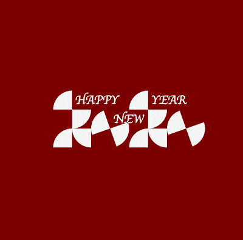
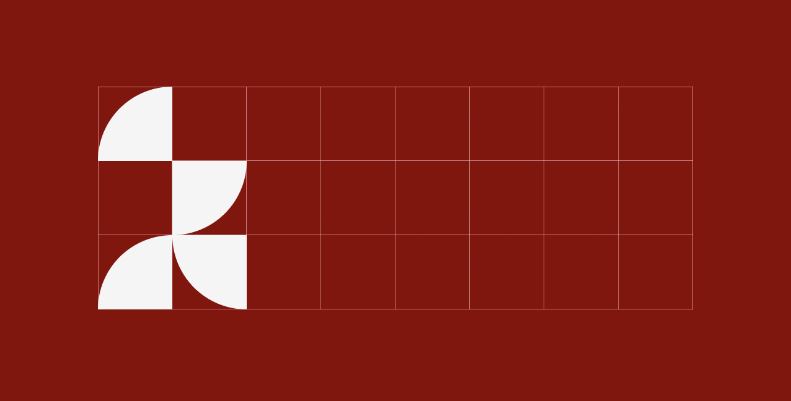

+++
title = '2020 新年快乐'
date = 2020-01-01T17:57:30+08:00
image = '/fe/img/thumbs/170.png'
summary = '#170'
+++



## 效果预览

按下右侧的“点击预览”按钮可以在当前页面预览，点击链接可以全屏预览。

[https://codepen.io/comehope/pen/jOEGzZx](https://codepen.io/comehope/pen/jOEGzZx)

## 代码解读

### 一、基本的 dom 结构和页面背景

dom 结构的最外层用 `<figure>` 元素，表示这是一个图片：
```html
<figure></figure>
```

页面用深红色背景，并采用 grid 布局：
```css
body {
    margin: 0;
    height: 100vh;
    display: flex;
    align-items: center;
    justify-content: center;
    background-color: darkred;
}

figure {
    display: grid;
    grid-template-columns: repeat(8, 1em);
    grid-template-rows: repeat(3, 1em);
    font-size: 60px;
    color: whitesmoke;
}
```

grid 布局比定位布局的语义化更好，同样的布局效果，grid 布局的代码量比定位布局的代码量明显减少。此项目创建了一个 3 行 8 列的网格，为了能明显看出网格线，我们增加一些辅助线，这些辅助线会在作品完成后被删除掉：

```css
figure {
    background-image: 
        linear-gradient(to bottom, transparent 0%, transparent 99%, pink 100%),
        linear-gradient(to right, transparent 0%, transparent 99%, pink 100%),
        linear-gradient(to top, transparent 0%, transparent 99%, pink 100%),
        linear-gradient(to left, transparent 0%, transparent 99%, pink 100%);
    background-size: 1em 1em;
    background-repeat: repeat, repeat, repeat-x, repeat-y;
}
```

效果如下图：


### 二、绘制数字 2

在 dom 中增加有关数字 2 的元素，数字 2 被分成了 4 部分：

```html
<figure>
    <span class="two part1"></span>
    <span class="two part2"></span>
    <span class="two part3"></span>
    <span class="two part4"></span>
</figure>
```

把这 4 部分分别放置在网格的相应位置上，`grid-area` 的属性 x/y 分别表示顶部网格线编号和左侧网格线编号，网格线是从 1 开始编号的，以 `.part4` 为例，它的顶部网格线是从上数的第3条，左侧网格是从左数的第2条，所以它的属性值是 `3/2`：

```css
.two {
    background-color: currentColor;
}

.two.part1 {grid-area: 1/1;}
.two.part2 {grid-area: 2/2;}
.two.part3 {grid-area: 3/1;}
.two.part4 {grid-area: 3/2;}
```

效果如下图：


接下来把各部分的形状都改为扇形，`border-radius` 属性有 4 个值，分别代表左上、右上、右下、左下的圆角值，以 `.part4` 为例，它是左下角为圆角的扇形，所以它的属性值是 `0 0 0 100%`：

```css
.two.part1 {grid-area: 1/1; border-radius: 100% 0 0 0;}
.two.part2 {grid-area: 2/2; border-radius: 0 0 100% 0;}
.two.part3 {grid-area: 3/1; border-radius: 100% 0 0 0;}
.two.part4 {grid-area: 3/2; border-radius: 0 0 0 100%;}
```

效果如下图：



这时一个数字 2 已经绘制出来了，另一个数字 2 不需要增加 dom 元素，只要把第 1 个元素复制一下就可以了，这里使用的是 `drop-shadow()` 函数，它的 2 个参数分别代表复制后的偏移量，此处的参数值为 `4em 0`，即水平方向向右平移 4em，垂直方向不变：

```css
.two {
    filter: drop-shadow(4em 0);
}
```

效果如下图：


至此，2个数字 2 就都画出来了。

### 三、绘制数字 0

在 dom 中增加有关数字 0 的元素，和数字 2 不同，每一个数字 0 只需要 1 个 dom 元素，所以 2 个数字 0 需要 2 个 dom 元素：

```html
<figure>
    <span class="two part1"></span>
    <span class="two part2"></span>
    <span class="two part3"></span>
    <span class="two part4"></span>
    <span class="zero copy-1"></span>
    <span class="zero copy-2"></span>
</figure>
```

在网格中分别定位 2 个数字 0，仍使用 `grid-area` 参数，但它们的属性值为 4 个数字，后 2 个数字分别代表底部网格线编号和右侧网格线编号，可知每个 0 占据 2 * 2 的网格区域：

```css
.zero.copy-1 {grid-area: 2/3/4/5;}
.zero.copy-2 {grid-area: 2/7/4/9;}
```

画出数字 0 的大致轮廓，这里是利用边框属性绘制的，元素本身宽高为 0，但是有 1em 的边框，其中上、下边框是白色，左、右边框是透明色，注意，在 CSS 中边框并不一定以线条的形式存在，在此处每条边框都是三角形：

```css
.zero {
    width: 0;
    height: 0;
    border: 1em solid;
    border-color: currentColor transparent;
}
```

效果如下图：


增加圆角效果：

```css
.zero {
    border-radius: 50%;
}
```

效果如下图：


再倾斜 45 度：

```css
.zero {
    transform: rotate(-45deg);
}
```

效果如下图：


至此，2 个数字 0 也都画出来了。

### 四、增加 Happy New Year 文本

在 dom 中增加有关文本的元素，一共 3 个单词，分别用 3 个元素表示：

```html
<figure>
    <span class="two part1"></span>
    <span class="two part2"></span>
    <span class="two part3"></span>
    <span class="two part4"></span>
    <span class="zero copy-1"></span>
    <span class="zero copy-2"></span>
    <span class="text happy">happy</span>
    <span class="text new">new</span>
    <span class="text year">year</span>
</figure>
```

效果如下图，可以看到这 3 个单词都重叠在第1行的第2个网格中，这是因为在 grid 布局下会自动把未指定 `grid-area` 属性的元素排放在未被占用的网格中：


接下来为 3 个文本元素设置它们的网格位置：

```css
.text.happy {grid-area: 1/2;}
.text.new {grid-area: 2/4;}
.text.year {grid-area: 1/6;}
```

效果如下图：


接下来设置文字的样式，把文字都改为大写字母，加粗，字体用花式字体，为避免与左侧的图案靠得太紧，再把文字左侧增加一点内边距：

```css
.text {
    text-transform: uppercase;
    font-size: 0.66em;
    line-height: 1.5em;
    font-weight: bold;
    font-family: cursive;
    padding-left: 0.25em;
}
```

效果如下图：


至此，文字绘制完成。

### 五、增加动画效果

因为数字 0 造型太抽象，所以我们让数字 0 转动起来，动画很简单，就是以 4 秒每圈的速度不断地转啊转，因为数字 0 此前设置了旋转 45 度，所以动画的 `to` 关键帧要加上 45 度，另外旋转的度数是负值，表示逆时针旋转：

```css
.zero {
    animation: round 4s linear infinite;
}

@keyframes round {
    to {
        transform: rotate(calc(-45deg + -1turn));
    }
}
```

效果如下图：


不过我们看到左侧的数字 0 在转动时遮挡住了文字“new”，为了避免遮挡，我们用色彩混合模式来解决，这样当数字 0 和文字“new”重叠时，重叠的部分会变为黑色：

```css
.text {
    mix-blend-mode: difference;
}
```

效果如下图：


至此，整个作品全部完成了，最后把辅助线删除掉：

```css
figure {
    /*background-image: 
        linear-gradient(to bottom, transparent 0%, transparent 99%, pink 100%),
        linear-gradient(to right, transparent 0%, transparent 99%, pink 100%),
        linear-gradient(to top, transparent 0%, transparent 99%, pink 100%),
        linear-gradient(to left, transparent 0%, transparent 99%, pink 100%);
    background-size: 1em 1em;
    background-repeat: repeat, repeat, repeat-x, repeat-y;*/
}
```

效果如下图：


完整的 CSS 代码如下：

```css
body {
    margin: 0;
    height: 100vh;
    display: flex;
    align-items: center;
    justify-content: center;
    background-color: darkred;
}

figure {
    display: grid;
    grid-template-columns: repeat(8, 1em);
    grid-template-rows: repeat(3, 1em);
    font-size: 60px;
    color: whitesmoke;
}

.two {
    background-color: currentColor;
    filter: drop-shadow(4em 0);
}

.two.part1 {grid-area: 1/1; border-radius: 100% 0 0 0;}
.two.part2 {grid-area: 2/2; border-radius: 0 0 100% 0;}
.two.part3 {grid-area: 3/1; border-radius: 100% 0 0 0;}
.two.part4 {grid-area: 3/2; border-radius: 0 0 0 100%;}

.zero.copy-1 {grid-area: 2/3/4/5;}
.zero.copy-2 {grid-area: 2/7/4/9;}

.zero {
    width: 0;
    height: 0;
    border: 1em solid;
    border-color: currentColor transparent;
    border-radius: 50%;
    transform: rotate(-45deg);
    animation: round 4s linear infinite;
}

@keyframes round {
    to {
        transform: rotate(calc(-45deg + -1turn));
    }
}

.text.happy {grid-area: 1/2;}
.text.new {grid-area: 2/4;}
.text.year {grid-area: 1/6;}

.text {
    text-transform: uppercase;
    font-size: 0.66em;
    line-height: 1.5em;
    font-weight: bold;
    font-family: cursive;
    padding-left: 0.25em;
    mix-blend-mode: difference;
}
```

大功告成！

