+++
title = '雪花'
date = 2020-01-06T17:57:54+08:00
image = '/fe/img/thumbs/171.png'
summary = '#171'
+++


## 效果预览

点击链接可以在 Codepen 预览。

[https://codepen.io/comehope/pen/LYEeRBb](https://codepen.io/comehope/pen/LYEeRBb)

## 源代码下载

每日前端实战系列的全部源代码请从 github 下载：

[https://github.com/comehope/front-end-daily-challenges](https://github.com/comehope/front-end-daily-challenges)

## 代码解读

一、DOM 结构、页面背景和容器尺寸：

最外层容器是一个名为 `.snowflake` 的 `<figure>` 元素，内含 6 个 `<div>` 元素，分别代表雪花的6个花瓣，每个 `<div>` 中又包含 5 个 `<span>` 元素，每个 `<span>` 代表雪花上的冰凌。

```html
<figure class="snowflake">
    <div>
        <span></span>
        <span></span>
        <span></span>
        <span></span>
        <span></span>
    </div>
    <div>
        <span></span>
        <span></span>
        <span></span>
        <span></span>
        <span></span>
    </div>
    <div>
        <span></span>
        <span></span>
        <span></span>
        <span></span>
        <span></span>
    </div>
    <div>
        <span></span>
        <span></span>
        <span></span>
        <span></span>
        <span></span>
    </div>
    <div>
        <span></span>
        <span></span>
        <span></span>
        <span></span>
        <span></span>
    </div>
    <div>
        <span></span>
        <span></span>
        <span></span>
        <span></span>
        <span></span>
    </div>
</figure>
```

页面背景取黑色，雪花取白色，并为容器画出黄色的轮廓作为辅助线，雪花图案将绘制在这个黄色虚线框内：

```css
body {
    margin: 0;
    height: 100vh;
    display: flex;
    align-items: center;
    justify-content: center;
    background-color: black;
    overflow: hidden;
}

.snowflake {
    font-size: 100px;
    color: snow;
    width: 4em;
    height: 4em;
    outline: 1px dashed yellow;
}
```

效果如下图：

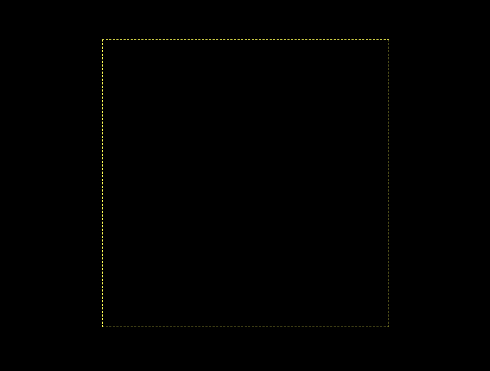

二、绘制出6个花瓣

先绘制出1个花瓣中间的竖线：

```css
div {
    width: 0.1em;
    height: 2em;
    background-color: currentColor;
    border-radius: 0.05em;
}
```

效果如下图：

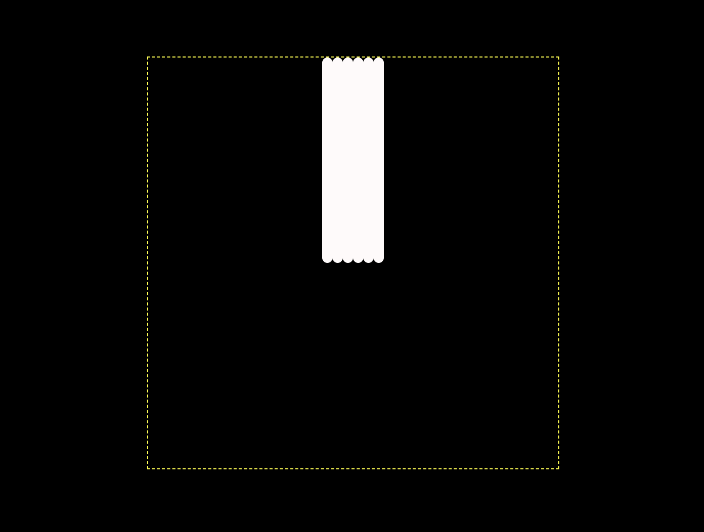

发现6个花瓣的竖线重叠在一起了，把它们合并到一起，看起来就像只有1条竖线：

div {
    position: absolute;
}

效果如下图：

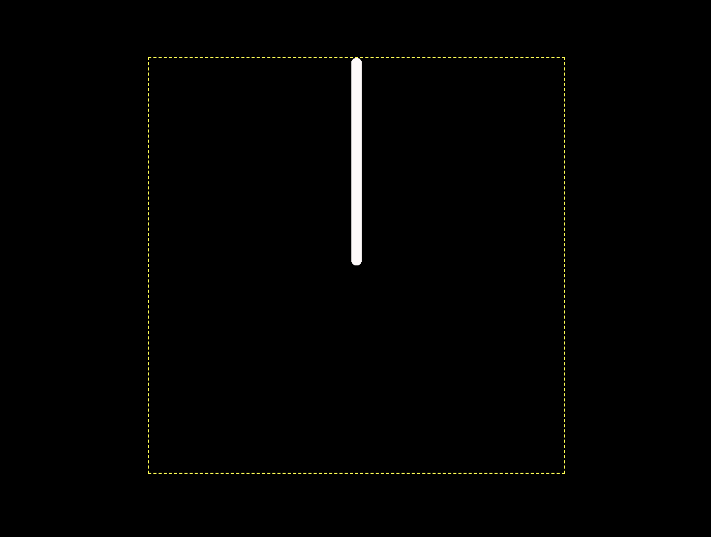

分别旋转每个花瓣，一共6个花瓣，所以各花瓣的旋转角度均相差60度：

```css
div {
    transform-origin: bottom;
    transform: rotate(calc((var(--n)  - 1)* 60deg));
}

div:nth-child(1) {--n: 1;}
div:nth-child(2) {--n: 2;}
div:nth-child(3) {--n: 3;}
div:nth-child(4) {--n: 4;}
div:nth-child(5) {--n: 5;}
div:nth-child(6) {--n: 6;}
```

效果如下图：

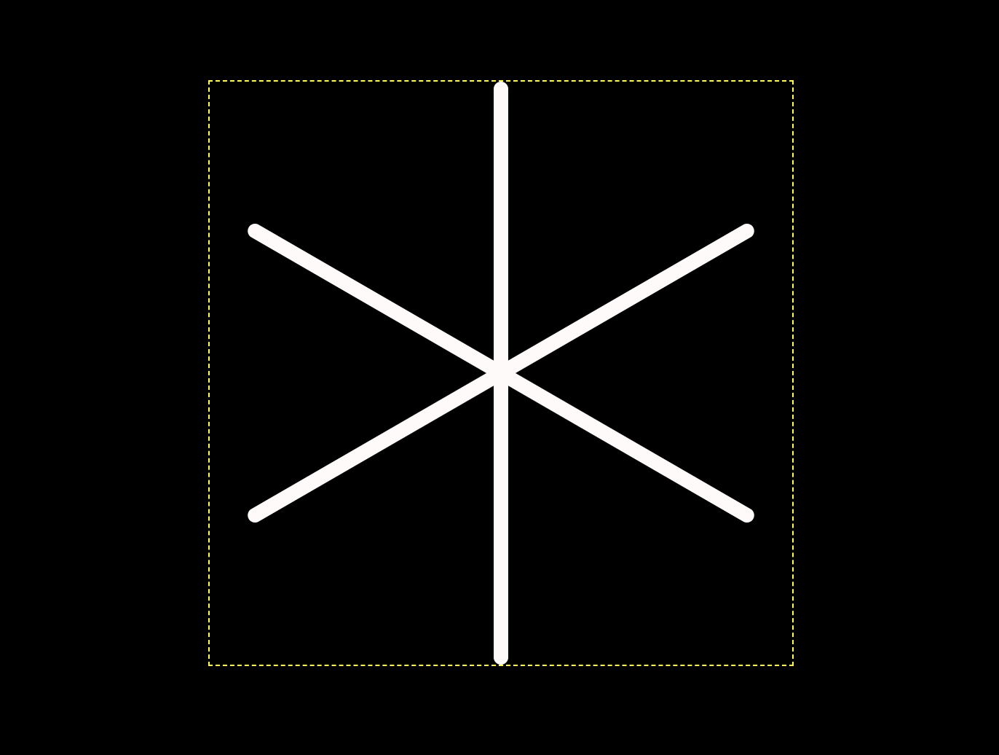

三、绘制花瓣上的冰凌

接下来修饰花瓣，绘制花瓣上的冰凌。

先来出顶端的圆点，用 `<div>` 里的第1个 `<span>` 元素实现：

```css
div {
    display: flex;
    flex-direction: column;
    align-items: center;
}

div span:nth-child(1) {
    width: 0.2em;
    height: 0.2em;
    background-color: currentColor;
    border-radius: 50%;
}
```

效果如下图：

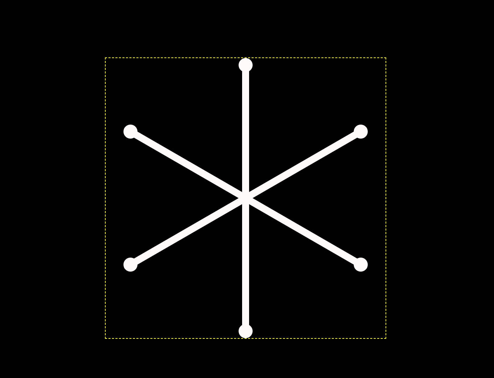

然后增加离圆点最近的折线，用第 2 个 `<span>` 元素画出，这是用一个正方形4条边框中的2条实现的：

```css
div span:nth-child(2) {
    width: 0.5em;
    height: 0.5em;
    border: 0.1em solid;
    border-width: 0.1em;
    border-style: none solid solid none;
    border-radius: 0.05em;
}
```

效果如下图：

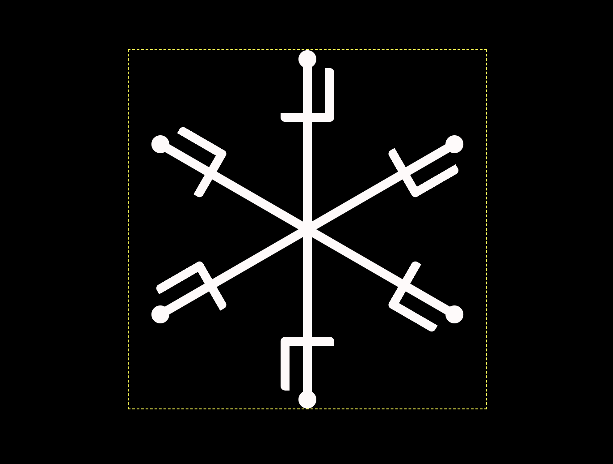

把折线旋转45度，让它的尖部和竖线重合：

```css
div span:nth-child(2) {
    transform: rotate(45deg);
}
```

效果如下图：

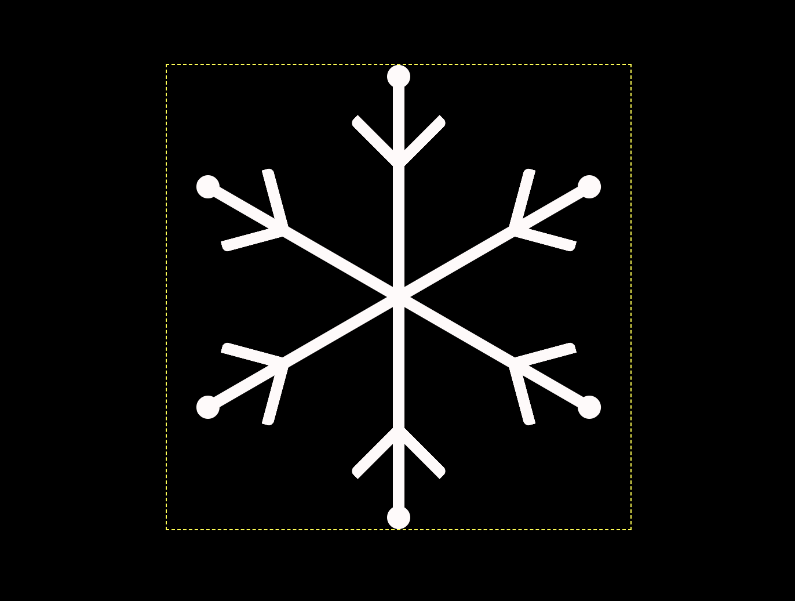

增加第2条折线，和上面的代码类似，只是正方形的边长从 `0.5em` 缩短到 `0.4em` 了：

```css
div span:nth-child(3) {
    width: 0.4em;
    height: 0.4em;
    border: 0.1em solid;
    border-width: 0.1em;
    border-style: none solid solid none;
    border-radius: 0.05em;
    transform: rotate(45deg);
}
```

效果如下图：

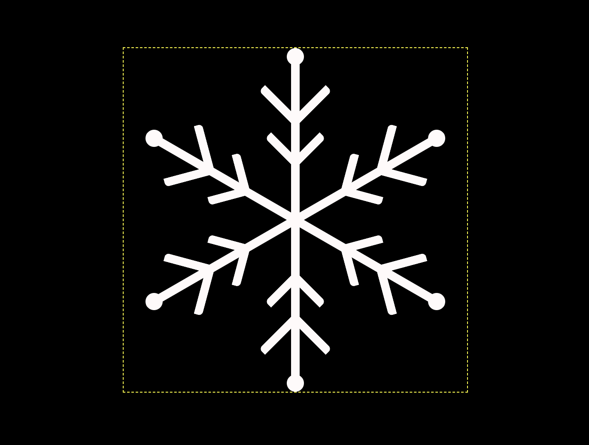

再增加第3条折线：

```css
div span:nth-child(4) {
    width: 0.3em;
    height: 0.3em;
    border: 0.1em solid;
    border-width: 0.1em;
    border-style: none solid solid none;
    border-radius: 0.05em;
    transform: rotate(45deg);
}
```

效果如下图：

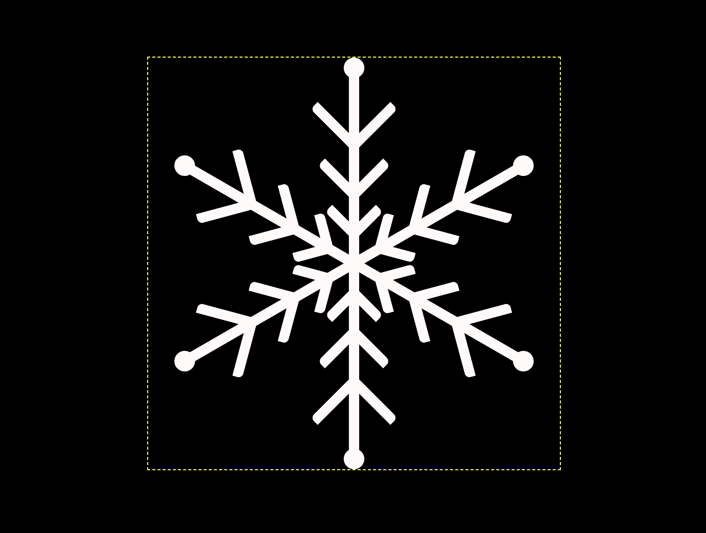

再增加第4条折线：

```css
div span:nth-child(4) {
    width: 0.3em;
    height: 0.3em;
    border: 0.1em solid;
    border-width: 0.1em;
    border-style: none solid solid none;
    border-radius: 0.05em;
    transform: rotate(45deg);
}
```

效果如下图：

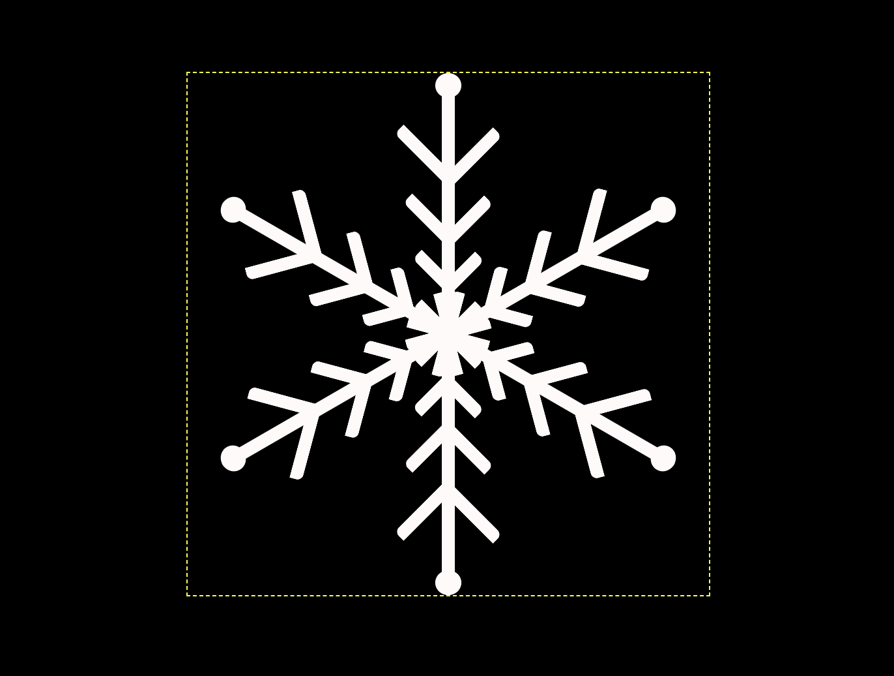

你已经发现上面 4 条折线的代码有很多重复的，坚决不能忍，来重构吧，把这 4 段代码合并起来：

```css
div span:nth-child(2),
div span:nth-child(3),
div span:nth-child(4),
div span:nth-child(5) {
    width: var(--side-length);
    height: var(--side-length);
    border: 0.1em solid;
    border-width: 0.1em;
    border-style: none solid solid none;
    border-radius: 0.05em;
    transform: rotate(45deg);
}

div span:nth-child(2) {--side-length: 0.5em;}
div span:nth-child(3) {--side-length: 0.4em;}
div span:nth-child(4) {--side-length: 0.3em;}
div span:nth-child(5) {--side-length: 0.3em;}
```

最后，让第1条折线离中心稍远点，这样还能让雪花中心更加漂亮：

```css
div span:nth-child(2) {
    margin-top: -0.2em;
}
```

效果如下图：

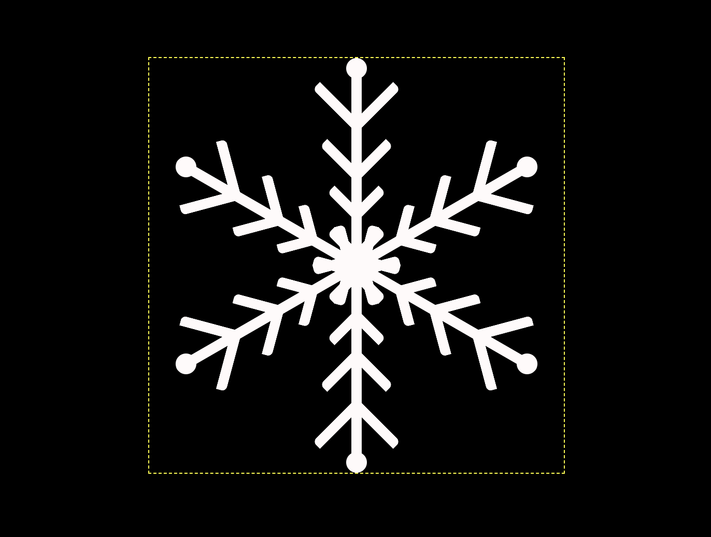

四、增加动画效果

动画效果很简单，就是转啊转地，让这片雪花用10秒时间转一圈：

```css
.snowflake {
    animation: round 10s linear infinite;
}

@keyframes round {
    to {
        transform: rotate(1turn);
    }
}
```

效果如下图：

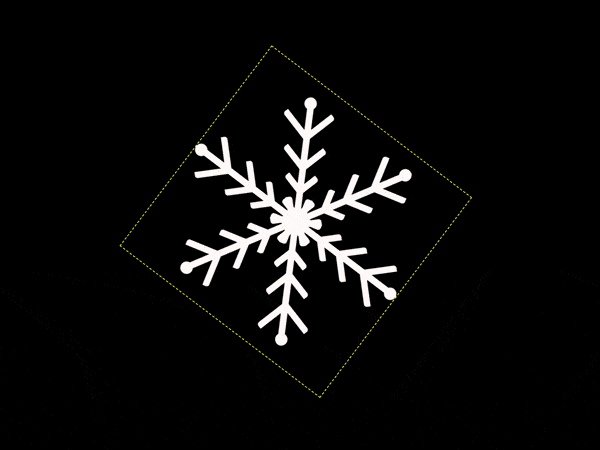

最后，删除掉辅助助线：

```css
.snowflake {
    /* outline: 1px dashed yellow; */
}
```

效果如下图：


大功告成！
