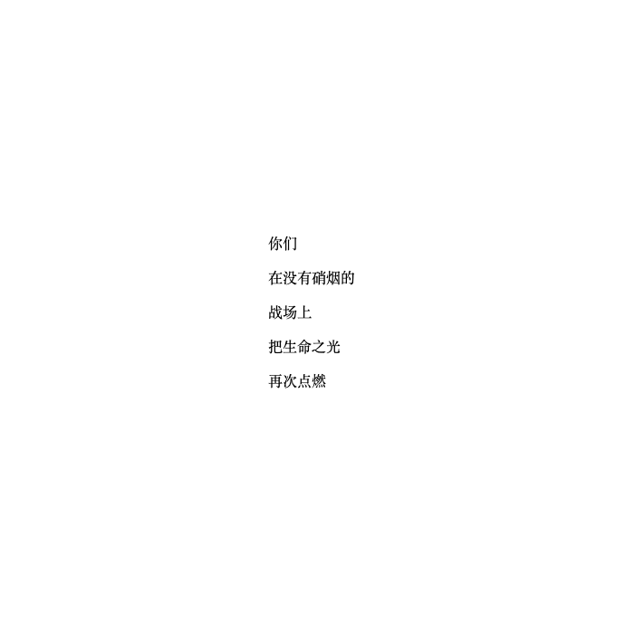

+++
title = '向医护人员致敬'
date = 2020-01-27T17:58:16+08:00
image = '/fe/img/thumbs/172.png'
summary = '#172'
+++


## 效果预览

点击链接可以在 Codepen 预览。

[https://codepen.io/comehope/pen/gObyOMQ](https://codepen.io/comehope/pen/gObyOMQ)

## 源代码下载

每日前端实战系列的全部源代码请从 github 下载：

[https://github.com/comehope/front-end-daily-challenges](https://github.com/comehope/front-end-daily-challenges)

## 代码解读

### 一、定义 DOM 结构

dom 结构是一个名为 `.words` 的容器，内含 5 个 `<p>` 标签，每个 `<p>` 标签中有一句话：

```html
<div class="words">
    <p>你们</p>
    <p>在没有硝烟的</p>
    <p>战场上</p>
    <p>把生命之光</p>
    <p>再次点燃</p>
</div>
```

令容器在页面居中：
```css
body {
    margin: 0;
    height: 100vh;
    display: flex;
    align-items: center;
    justify-content: center;
}
```

效果如下图：



### 二、布局文字

用 flex 布局，设置容器的宽度为 `5em`，因为有 5 个 `<p>` 标签，所以每句话占用 `1em`，形成文字竖排效果。文字的字号用 `vmin` 单位，即随页面大小自动调整字号的大小。

```css
.words {
    display: flex;
    font-size: 15vmin;
    width: 5em;
}

.words p {
    line-height: 1em;
    margin: 0;
}
```

效果如下图：


文字加粗，并加上阴影：

```css
.words {
    font-family: sans-serif;
    font-weight: bold;
}

.words p {
    text-shadow: 0.05em 0.05em 0.3em hsla(0, 0%, 0%, 0.4);
}
```

效果如下图：


设置页面的颜色为 `dodgerblue`，即宝石蓝色。因为 `color` 属性会被子元素继承，所以文字的颜色也变成宝石蓝色融入了背景中，实际上现在看到的仅仅是文字的阴影而已：

```css
body {
    color: dodgerblue;
    background-color: currentColor;
}
```

效果如下图：


### 三、动画效果

创建一个名为 `appear` 的关键帧，其中只有 1 帧，即在动画周期的 `50%` 为文字增加阴影，其实这行代码正是从 `.words p` 移过来的。动画效果是时长 6 秒的无限循环动画：

```css
.words p {
    /*text-shadow: 0.05em 0.05em 0.3em hsla(0, 0%, 0%, 0.4);*/
    animation: appear 6s ease-in-out infinite;
}

@keyframes appear {
    50% {
        text-shadow: 0.05em 0.05em 0.3em hsla(0, 0%, 0%, 0.4);
    }
}
```

效果如下图：


接下来令每一句话逐个浮现，实现方法是为每个 `<p>` 标签设置一个 `--n` 变量，然后为动画设置 `animation-delay` 属性，用表达式为所有 `<p>` 标签设置从 1 秒到 5 秒的延迟时长，令动画看起来是一句一句地依次浮现：

```css
.words p {
    animation-delay: calc(var(--n) * 1s);
}

.words p:nth-child(1) {--n: 1;}
.words p:nth-child(2) {--n: 2;}
.words p:nth-child(3) {--n: 3;}
.words p:nth-child(4) {--n: 4;}
.words p:nth-child(5) {--n: 5;}
```

效果如下图：


接下来，定义一个名为 `move` 的关键帧，令 `p` 元素从它原始位置稍偏左向稍偏右移动，使动画的动感更强烈。因为一共有 `appear` 和 `move` 2 组关键帧，所以需增加一个 `animation-name` 属性，专门用于定义多组关键帧：

```css
.words p {
    /*animation: appear 6s ease-in-out infinite;*/
    animation: 6s ease-in-out infinite;
    animation-name: appear, move;
}

@keyframes move {
    from {transform: translateX(-30%);}
    to {transform: translateX(30%);}
}
```

效果如下图：


大功告成！
