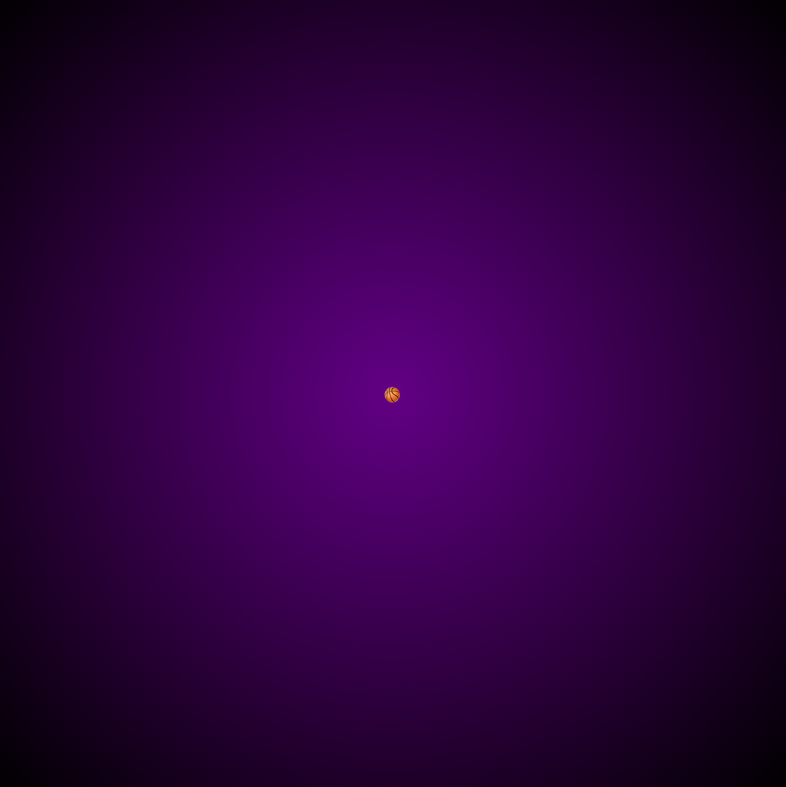
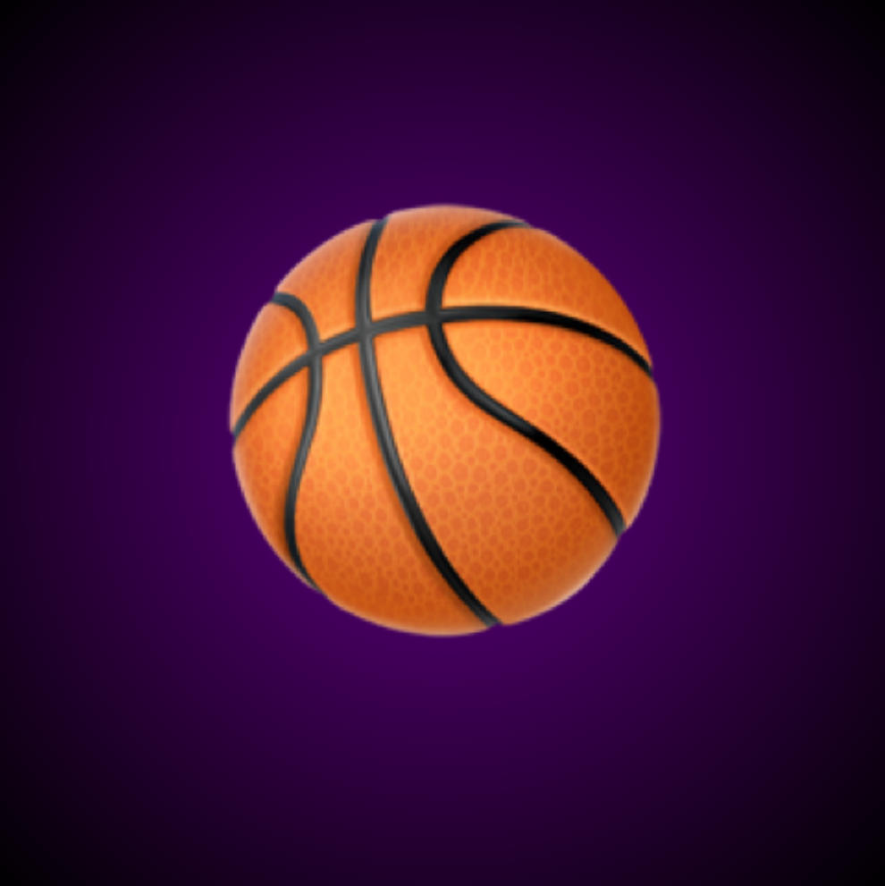
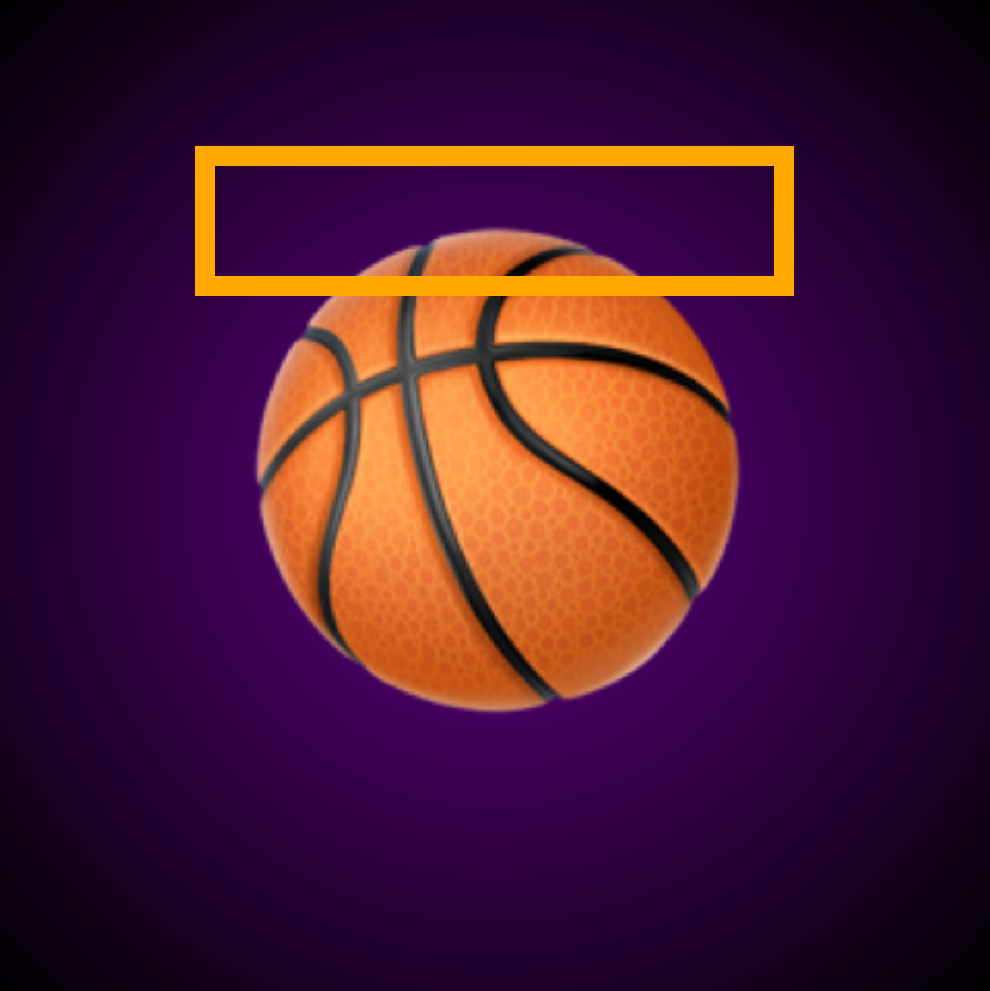
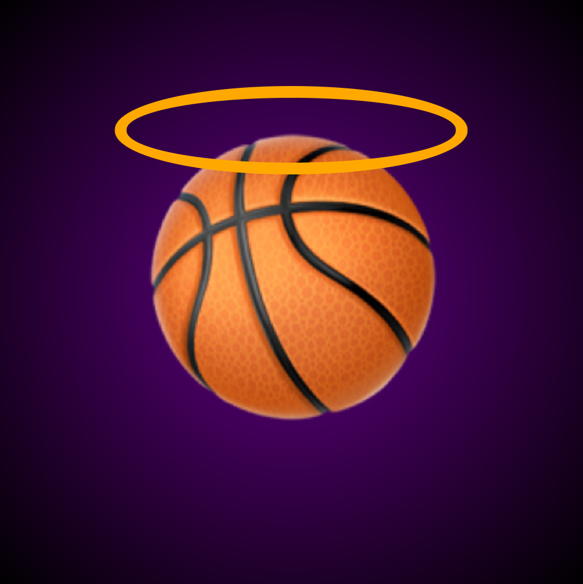

+++
title = '纪念科比·布莱恩特'
date = 2020-01-28T17:58:36+08:00
image = '/fe/img/thumbs/173.png'
summary = '#173'
+++


## 效果预览

点击链接可以在 Codepen 预览。

[https://codepen.io/comehope/pen/OJPGGmV](https://codepen.io/comehope/pen/OJPGGmV)

## 源代码下载

每日前端实战系列的全部源代码请从 github 下载：

[https://github.com/comehope/front-end-daily-challenges](https://github.com/comehope/front-end-daily-challenges)

## 代码解读

### 一、绘制篮球

定义 DOM 结构，只有一个名为 `.ball` 的 `<div>` 元素，内含一个篮球图案的 unicode 字符：

```html
<div class="ball">🏀</div>
```

令容器居中，设置页面背景色为由紫色到黑色的径向渐变：
```css
body {
    margin: 0;
    height: 100vh;
    display: flex;
    align-items: center;
    justify-content: center;
    background-image: radial-gradient(circle, #542482, black);
}
```

效果如下图：



设置容器尺寸、字号，放大篮球，这里用 `vmin` 单位，使图案占据窗口宽高的一半：

```css
.ball {
    width: 50vmin;
    height: 50vmin;
    font-size: 50vmin;
    line-height: 1em;
}
```

效果如下图：



### 二、绘制光环

用 `::before` 伪元素绘制光环容器，比主元素宽20%，但高度只有主元素的30%，形状为一个矩形，边框为橙色：

```css
.ball {
    position: relative;
}

.ball::before {
    content: '';
    position: absolute;
    width: 120%;
    height: 30%;
    left: -10%;
    top: -20%;
    border: 2vmin solid orange;
    box-sizing: border-box;
}
```

效果如下图：



为边框加圆角，使光环变圆：

```css
.ball::before {
    border-radius: 50%;
}
```

效果如下图：



为光环加上光晕，光晕的颜色是半透明的黄色：

```css
.ball::before {
    box-shadow: 0 0 0.1em hsla(60, 100%, 50%, 0.5);
}
```

效果如下图：


### 三、绘制光晕

接下来用 `::after` 伪元素绘制阴影，阴影与主元素等宽，但高只有主元素的20%，定位到主元素的底部，背景色为半透明的黑色：

```css
.ball::after {
    content: '';
    position: absolute;
    width: 100%;
    height: 20%;
    left: 0;
    bottom: 0;
    background-color: hsla(0, 0%, 0%, 0.6);
}
```

效果如下图：


为阴影容器加圆角属性使阴影变圆，并将阴影置于篮球后面：

```css
.ball::after {
    border-radius: 50%;
    z-index: -1;
}
```

效果如下图：


大功告成！
