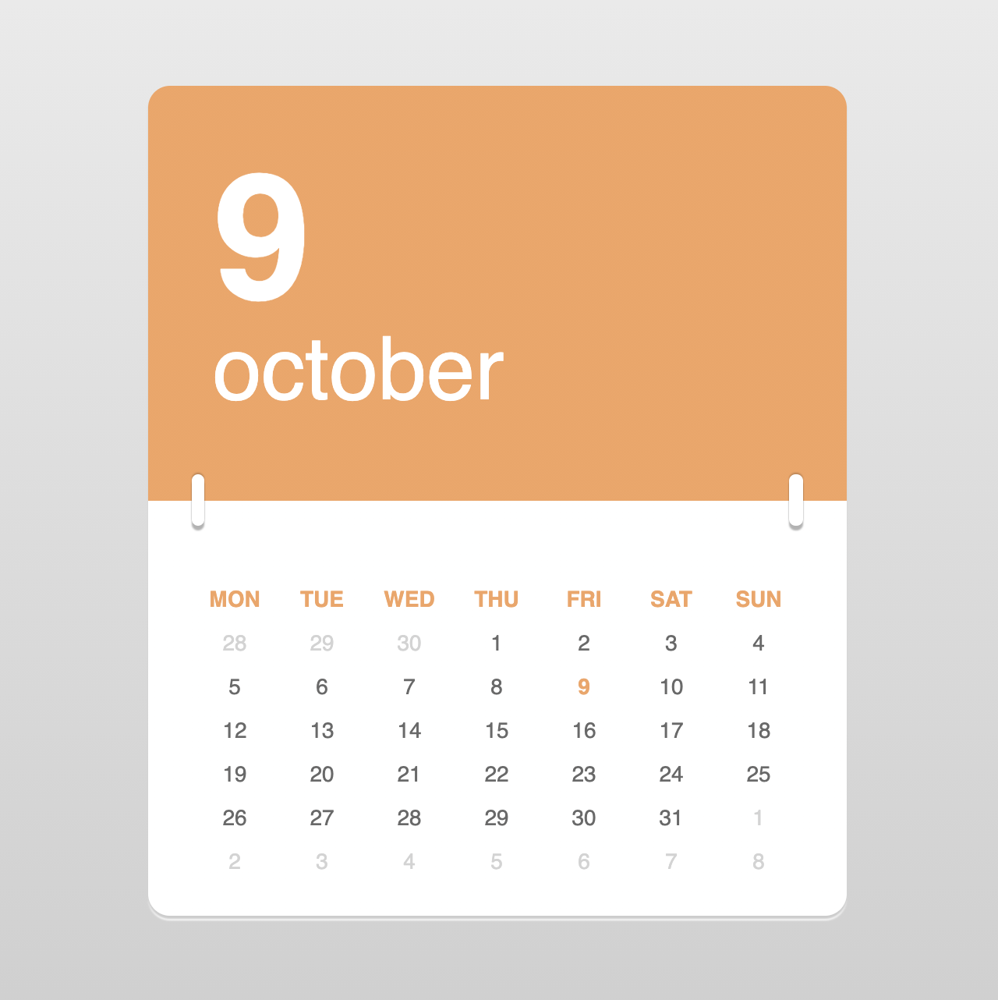
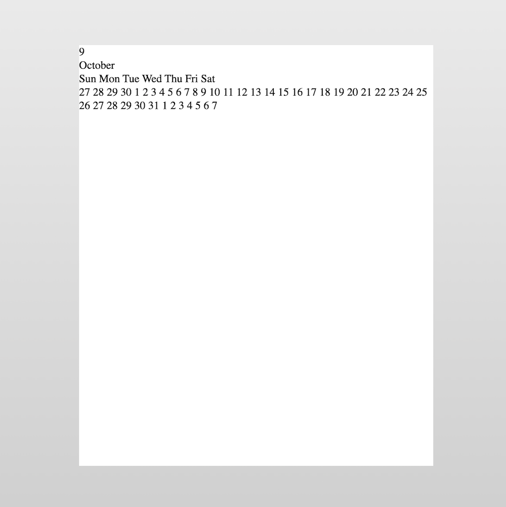
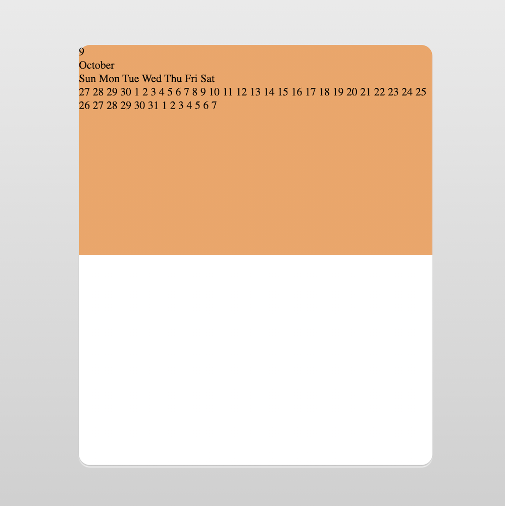
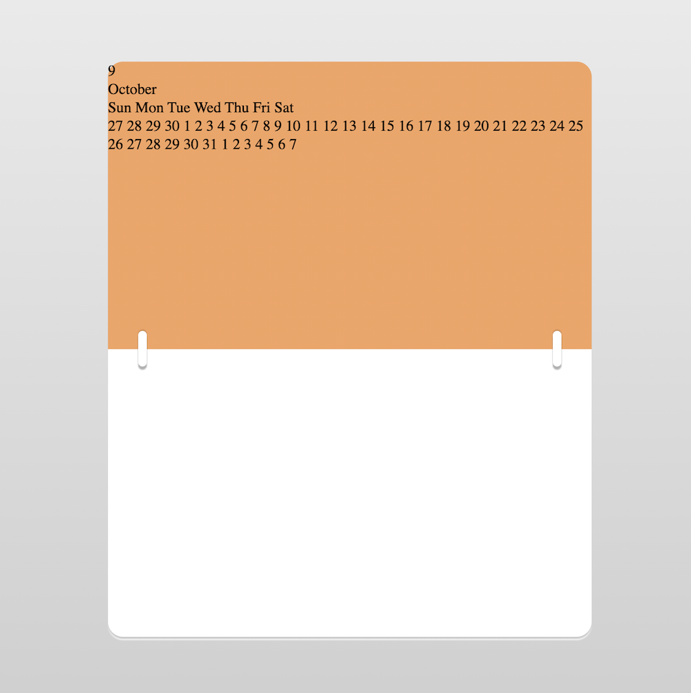
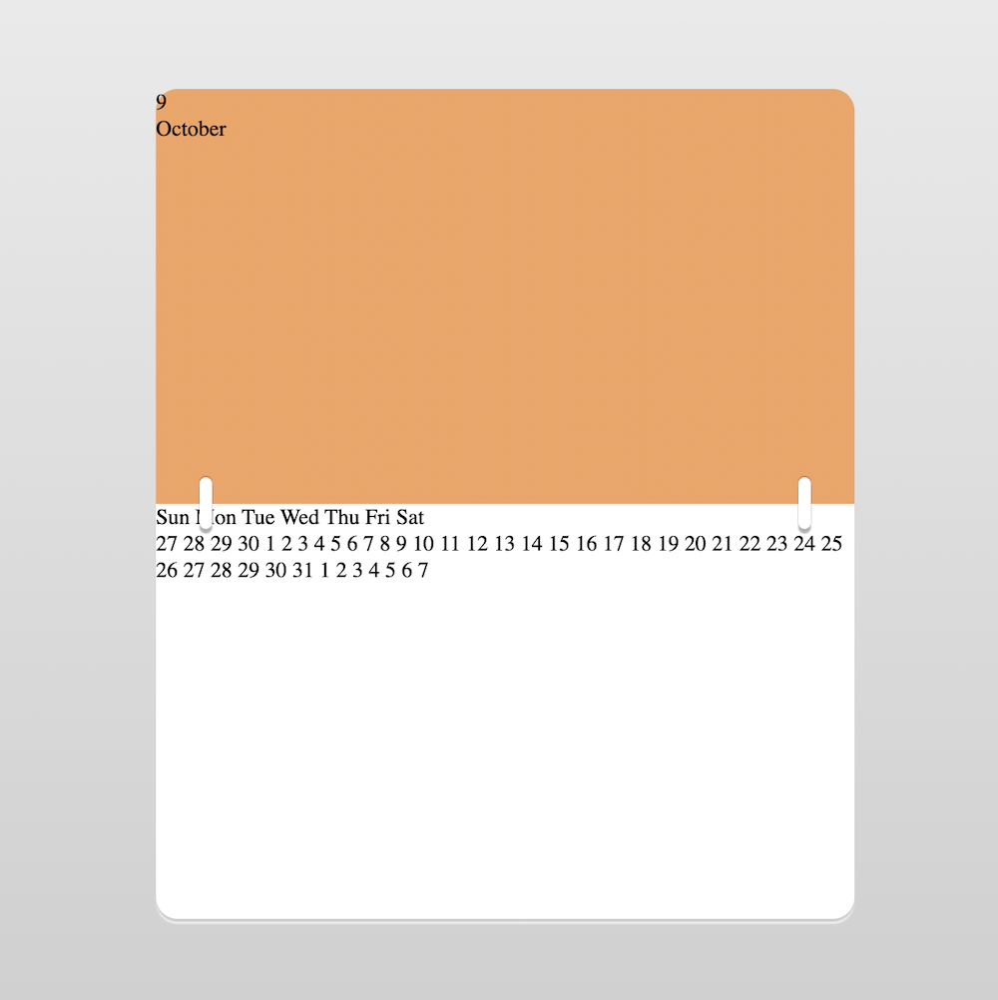
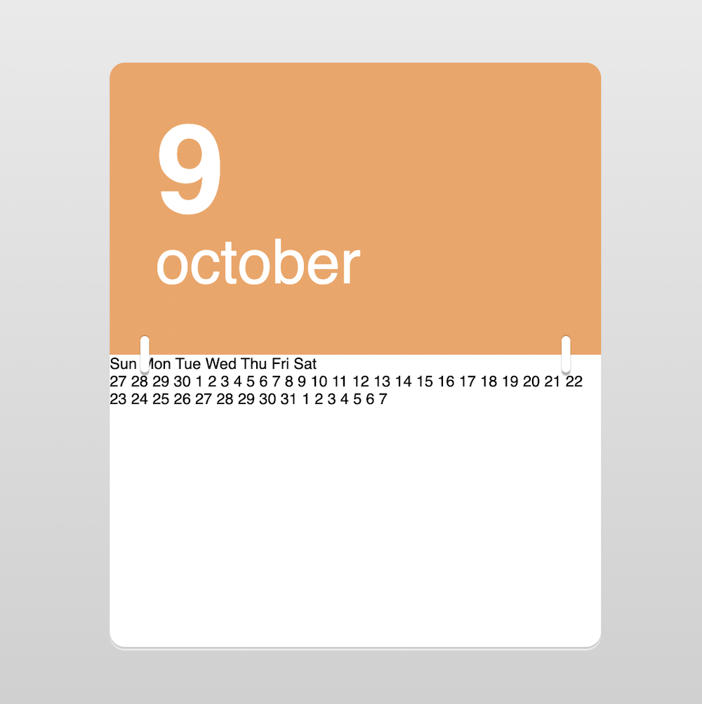
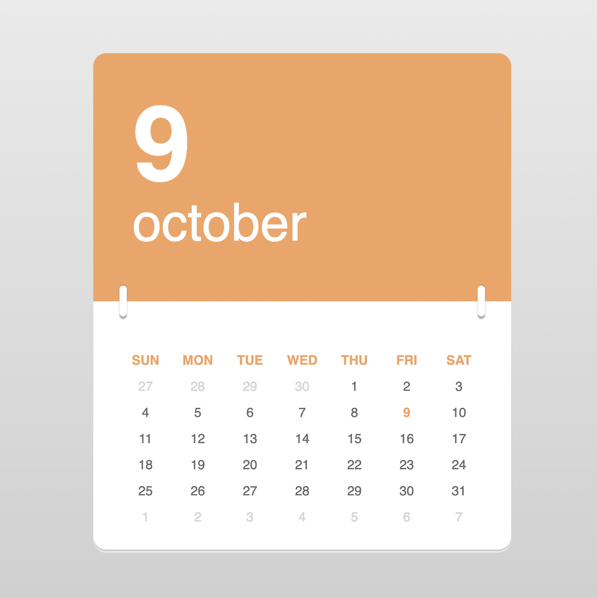
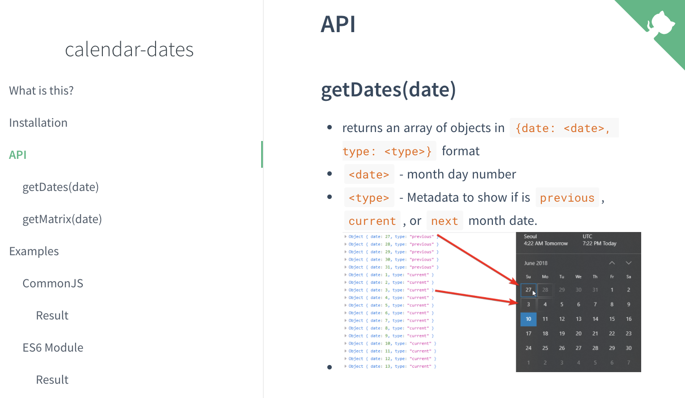

+++
title = '日历'
date = 2020-10-09T17:58:58+08:00
image = '/test-hugo-deploy/img/thumbs/174.png'
summary = '#174'
+++



## 效果预览

按下右侧的“点击预览”按钮可以在当前页面预览，点击链接可以全屏预览。

[https://codepen.io/comehope/pen/mdEyWEv](https://codepen.io/comehope/pen/mdEyWEv)

## 源代码下载

每日前端实战系列的全部源代码请从 github 下载：

[https://github.com/comehope/front-end-daily-challenges](https://github.com/comehope/front-end-daily-challenges)

## 代码解读

这个日历的开发流程是，定义 DOM 结构之后，进行页面整体布局，绘制出日历薄的模样，然后分别布局上部的当前日期和下部的日期表格。完成静态布局之后，再通过脚本来动态生成日期元素，实现一个显示实时日期的动态日历。

### 一、定义 DOM 结构

dom 的整体结构是一个名为 `.container` 的容器中包含2个元素，`.today` 是当前日期，`.calendar` 是日期表格。
```html
<div class="container">
    <header class="today">
    </header>
    <main class="calendar">
    </main>
</div>
```

`.today` 当前日期部分包含2个元素，`.month` 显示当前月，`.day`显示当前日。
```html
<header class="today">
    <div class="day">9</div>
    <div class="month">October</div>
</header>
```

`.calcendar` 日期表格部分包含一个表头行 `.days` 和一个表格 `.dates`。表头按英文习惯以周日为每周的第一天；表格共6行，一共显示42天，可以适应任何月份。
表格中的日期通过类名区分为上月日期 `previous-month`、当前日期 `current-day`、下月日期 `next-month`。
```html
<main class="calendar">
    <div class="days">
        <span>Sun</span>
        <span>Mon</span>
        <span>Tue</span>
        <span>Wed</span>
        <span>Thu</span>
        <span>Fri</span>
        <span>Sat</span>
    </div>
    <div class="dates">
        <span class="previous-month">27</span>
        <span class="previous-month">28</span>
        <span class="previous-month">29</span>
        <span class="previous-month">30</span>
        <span>1</span>
        <span>2</span>
        <span>3</span>
        <span>4</span>
        <span>5</span>
        <span>6</span>
        <span>7</span>
        <span>8</span>
        <span class="current-day">9</span>
        <span>10</span>
        <span>11</span>
        <span>12</span>
        <span>13</span>
        <span>14</span>
        <span>15</span>
        <span>16</span>
        <span>17</span>
        <span>18</span>
        <span>19</span>
        <span>20</span>
        <span>21</span>
        <span>22</span>
        <span>23</span>
        <span>24</span>
        <span>25</span>
        <span>26</span>
        <span>27</span>
        <span>28</span>
        <span>29</span>
        <span>30</span>
        <span>31</span>
        <span class="next-month">1</span>
        <span class="next-month">2</span>
        <span class="next-month">3</span>
        <span class="next-month">4</span>
        <span class="next-month">5</span>
        <span class="next-month">6</span>
        <span class="next-month">7</span>
    </div>
</main>
```

### 二、页面整体和日历容器布局
先用线性渐变设置页面背景色为灰白过渡色。
```css
body {
    margin: 0;
    height: 100vh;
    background-image: linear-gradient(to bottom, #eee, #ccc);
}
```

设置容器尺寸，用相对单位 em，并使容器居于页面正中。
为使容器可见，暂为容器填充白色背景。
```css
body {
    display: flex;
    align-items: center;
    justify-content: center;
}

.container {
    width: 32em;
    height: 38em;
    font-size: 14px;
    background-color: white;
}
```

效果如下图：


注释掉刚才临时定义的 `background-color` 属性，改为用锐利渐变填充，实现上部黄棕色、下部白色的效果。因为黄棕色 `sandybrown` 是日历主色，后面还会用到，所以把它定义成变量。
再把日历四周设为圆角，底部加双层阴影，模拟多张日历纸叠加的效果。
```css
.container {
    /* background-color: white; */
    --main-color: sandybrown;
    background-image: linear-gradient(to bottom, var(--main-color) 50%, white 50%);
    border-radius: 1em;
    box-shadow: 
        0 2px 1px rgba(0, 0, 0, 0.2),
        0 3px 1px white;
}
```

效果如下图：


接下来绘制一个细节：环扣，它用来连接日历的上、下两部分。使用2个伪元素来绘制，这样不用显式地增加 DOM 元素，纯用 CSS 实现装饰效果。两个环扣的样式相同，所以大部分代码是共享的，仅它们所处的位置不同，一个在日历左侧，一个在日历右侧。
```css
.container {
    position: relative;
}

.container::before,
.container::after {
    content: '';
    position: absolute;
    width: 0.6em;
    height: 2.3em;
    background-color: white;
    top: calc(50% - 2.3em / 2);
    border-radius: 0.3em;
    box-shadow: 
        0 3px 1px rgba(0, 0, 0, 0.3),
        0 -1px 1px rgba(0, 0, 0, 0.2);
}

.container::before {left: 2em;}
.container::after {right: 2em;}
```

效果如下图：


至此，一个接近真实场景中的日历的轮廓绘制完成了，接下来布局日历上显示的文字内容。

### 三、上部当前日期布局
因为整个日历分成上下两部分，所以先令当前日期 `.today` 占据上部的50%空间，这样表格 `.calendar` 自然就被挤到下部了。
```css
.today {
    height: 50%;
}
```

效果如下图：


因为整个日历都使用同一种字体，所以把字体样式定义在容器中，采用无衬线字体。
`.today` 的布局很简单，用的都是字号、颜色、行间距等基本属性。
```css
.container {
    font-family: sans-serif;
}

.today {
    padding: 3em;
    box-sizing: border-box;
    color: white;
}

.today .day {
    font-size: 8em;
    line-height: 1em;
    font-weight: bold;
}

.today .month {
    font-size: 4em;
    line-height: 1em;
    text-transform: lowercase;
}
```

效果如下图：


### 四、下部日期表格布局
表格包括表头和表体两部分，设置好它们的宽度，然后用 flex 布局令其垂直居中排列。
```css
.calendar {
    padding-top: 3.5em;
    display: flex;
    flex-direction: column;
    align-items: center;
}

.calendar .days,
.calendar .dates {
    width: 28em;
}
```

表头和表格都是一行7列，这里采用 grid 布局实现。
```css
.calendar .days,
.calendar .dates {
    display: grid;
    grid-template-columns: repeat(7, 1fr);
    line-height: 2em;
    text-align: center;
}
```

效果如下图：


表格已经成形，剩下的细节是为文字上色。
表格里一共有5种语义元素：表头、当前日期、本月日期、上月日期、下月日期，这些不同语义的元素都靠 CSS 类名来区分。表头和当前日期用主色，本月日期用深灰色，上月日期和下月日期用浅灰色。
```css
.calendar .days {
    color: var(--main-color);
    font-weight: bold;
    text-transform: uppercase;
}

.calendar .dates {
    color: dimgray;
}

.calendar .dates .previous-month,
.calendar .dates .next-month {
    color: lightgray;
}

.calendar .dates .current-day {
    color: var(--main-color);
    font-weight: bold;
}
```

效果如下图：


最后，再增加一个鼠标悬停特效，当在日期上悬停时令背景变灰、文字变白，并用 `transition` 实现平滑过渡。
```css
.calendar .dates span:hover {
    background-color: lightgray;
    color: white;
}

.calendar .dates span {
    transition: 0.3s;
}
```

至此，整个日历的静态布局全部完成了。

### 五、动态脚本
程序的入口是一个名为 `init` 的函数，其中声明了一个 `Calendar` 类的实例，再调用它的 `render()` 方法来渲染页面。
```js
function init() {
    let calendar = new Calendar(new Date())
    calendar.render()
}

window.onload = init
````

`Calendar` 类接收一个日期参数，以此来初始化年、月、日数据。`render()` 方法分别调用了 `renderDay()` 和 `renderMonth()` 来渲染当前日期和当前月份。因为 `Date` 对象返回的月份属性是数字，为了把它显示成英文月份名称，就定义了一个存放月份名称的数组。
```js
let Calendar = function(date) {
    let year = date.getFullYear()
    let month = date.getMonth()
    let day = date.getDate()

    function renderDay() {
        document.querySelector('.day').textContent = day
    }

    function renderMonth() {
        const MONTHS = ['January', 'February', 'March', 'April', 'May', 'June', 'July', 'August', 'September', 'October', 'November', 'December']
        document.querySelector('.month').textContent = MONTHS[month]
    }

    this.render = function() {
        renderDay()
        renderMonth()
    }
}
```

接下来要渲染日期表格了。
我们先引入一个日历库 calendar-dates（github 地址：[https://dance2die.github.io/calendar-dates/](https://dance2die.github.io/calendar-dates/)），它负责计算日期、星期、月份之间的关系，为给定的年月输出对应的日历数据。通过 `import` 语句导入该库文件。
```js
import CalendarDates from 'https://cdn.jsdelivr.net/npm/calendar-dates@2.6.1/dist/calendardates.esm.js'
```



注意，对于使用了 `import` 语句的脚本，在 `<script>` 标签中需增加 `type="module"` 属性。
```html
<script src="script.js" type="module"></script>
```

然后，在 `Calendar` 类中定义一个 `renderDates()` 函数来渲染日历列表。如何获得日历可以参考官方文档，这里就不多说了，我觉得有点别扭的是必须用 async/await 的方式来调用。每个日期有 `date` 和 `type` 属性，`date` 就是日期数值，`type` 有3个值：`previous`、`current`、`next`，分别代表上月、本月、下月，我们就用这2个属性来处理日期元素的样式。
最后，别忘了要在 `render()` 里调用一下 `renderDates()` 函数。

```js
async function renderDates() {
    const calendarDates = new CalendarDates();
    const domList = document.querySelector('.dates')
    domList.innerHTML = ''
    for (const meta of await calendarDates.getDates(new Date(year, month))) {
        let span = document.createElement('span')
        span.textContent = meta.date
        span.className = (meta.type == 'current')
            ? (meta.date == day)
                ? 'current-day'
                : ''
            : meta.type + '-month'
        domList.append(span)
    }
}

this.render = function() {
    renderDay()
    renderMonth()
    renderDates()
}
```

大功告成！
