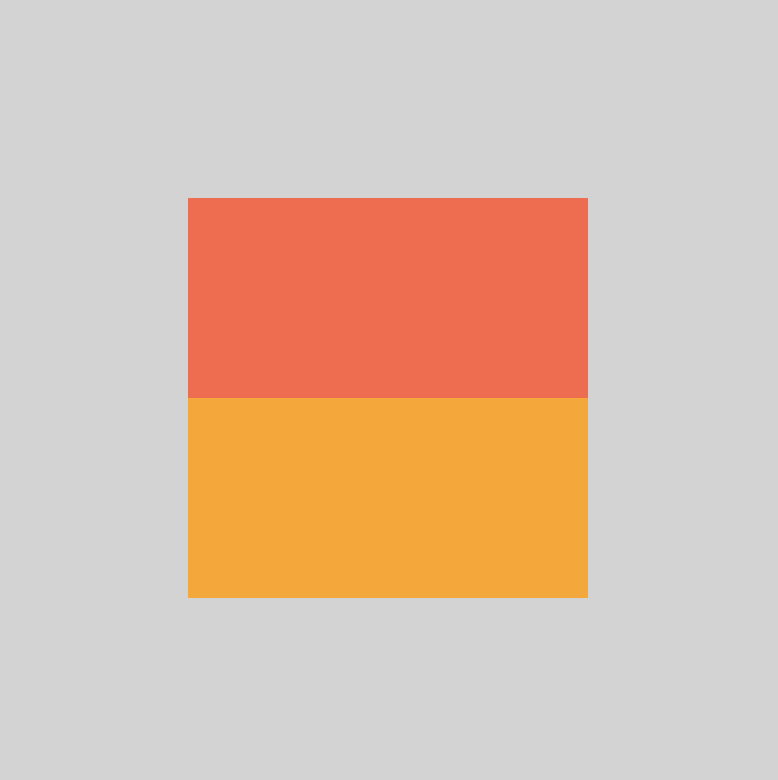

+++
title = '阴阳图案'
date = 2020-10-10T17:59:19+08:00
image = '/test-hugo-deploy/img/thumbs/175.png'
summary = '#175'
+++


## 效果预览

点击链接可以在 Codepen 预览。

[https://codepen.io/comehope/pen/RwRNdLj](https://codepen.io/comehope/pen/RwRNdLj)

## 源代码下载

每日前端实战系列的全部源代码请从 github 下载：

[https://github.com/comehope/front-end-daily-challenges](https://github.com/comehope/front-end-daily-challenges)

## 代码解读

### 一、定义 DOM 结构

这是一个单元素作品，DOM 结构很简单，只有一个类名为 `yin-yang` 的 `div` 元素。
```html
<div class="yin-yang"></div>
```

### 二、定义容器

把页面背景设置为浅灰色。
```css
body {
    margin: 0;
    height: 100vh;
    background-color: lightgrey;
}
```

定义容器尺寸为正方形，采用相对单位 `em`，为了能看到容器占据的空间，暂时为容器填充白色。
```css
body {
    display: flex;
    align-items: center;
    justify-content: center;
}

.yin-yang {
    width: 10em;
    height: 10em;
    font-size: 20px;
    background-color: white;
}
```

效果如下图：


### 三、阴阳图案构图

注释掉刚才临时设置的 `background-color` 属性，用锐利的线性渐变设置容器背景色，把容器背景用2种颜色平分。因为后面还会用到这2种颜色，所以用变量 `--color1` 和 `--color2` 来代表它们，便于复用。阴阳图案本来是黑白色的，在开发阶段为了便于观察，我们暂时用番茄色和橙色来代替。
```css
.yin-yang {
    /*background-color: white;*/
    --color1: tomato;
    --color2: orange;
    background-image: linear-gradient(var(--color1) 50%, var(--color2) 50%);
}
```

效果如下图：


接下来绘制中间的图案，先绘制左边的一个，用伪元素实现，它的背景色为变量 `--color1` 的颜色，通过 flex 布局令其垂直居中。`mix-blend-mode` 属性的作用是不让伪元素的颜色因和背景色完全一样而混在一起无法区分，这称为“混合模式”，有兴趣的同学可以参考 [MDN 文档](https://developer.mozilla.org/en-US/docs/Web/CSS/mix-blend-mode)并亲手实验一下各种模式值的效果。
```css
.yin-yang {
    display: flex;
    align-items: center;
}

.yin-yang::before {
    content: '';
    width: 50%;
    height: 50%;
    background-color: var(--color1);
    mix-blend-mode: screen;
}
```

效果如下图：


为伪元素设置一个厚厚的边框，边框用变量 `--color2` 的颜色。
```css
.yin-yang::before {
    box-sizing: border-box;
    border: 1.5em solid var(--color2);
}
```

效果如下图：


现在看着都是正方形元素，一会儿再变圆，如果着急，可以加上 `border-radius: 50%;` 属性看看效果。
接下来把 `::before` 伪元素的效果复制到 `::after` 伪元素上，直接在伪元素选择器里加上 `.yin-yang::after` 就可以了。
2个伪元素的区别仅在于它们的配色是相反的，所以我们把它们的配色属性值分别定义成 `--inner-color` 和 `--outer-color`，分别是指元素内部和外边框的颜色。
```css
.yin-yang::before,
.yin-yang::after {
    background-color: var(--inner-color);
    border: 1.5em solid var(--outer-color);
}

.yin-yang::before {
    --inner-color: var(--color1);
    --outer-color: var(--color2);
}

.yin-yang::after {
    --inner-color: var(--color2);
    --outer-color: var(--color1);
}
```

效果如下图：


### 四、撤销辅助属性、上色

好了，现在把它们都变为圆形。
```css
.yin-yang,
.yin-yang::before,
.yin-yang::after {
    border-radius: 50%;
}
```

效果如下图：


取消掉用于辅助开发的色彩混合模式属性 `mix-blend-mode`。

```css
.yin-yang::before,
.yin-yang::after {
    /*mix-blend-mode: screen;*/
}
```

效果如下图：


再把配色改成黑白的。至此，阴阳图的静态布局完成。
```css
.yin-yang {
    /*--color1: tomato;
    --color2: orange;*/
    --color1: white;
    --color2: black;
    box-shadow: 0 0 1em rgba(0, 0, 0, 0.3);
}
```

效果如下图：


### 五、增加动画效果

最后，加上旋转动画，以喻阴阳此消彼长相互转化动态平衡绵延无尽之意。
```css
.yin-yang {
    animation: rotating linear 5s infinite;
}

@keyframes rotating {
    to {
        transform: rotate(1turn);
    }
}
```

大功告成！
