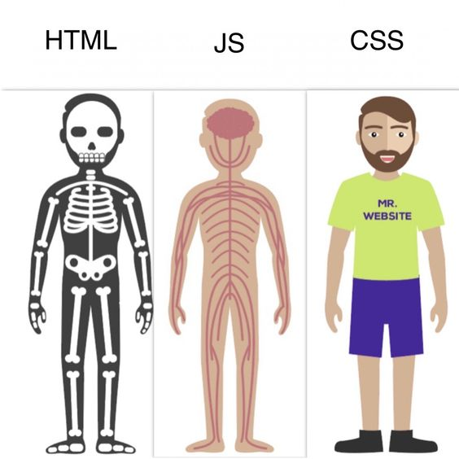
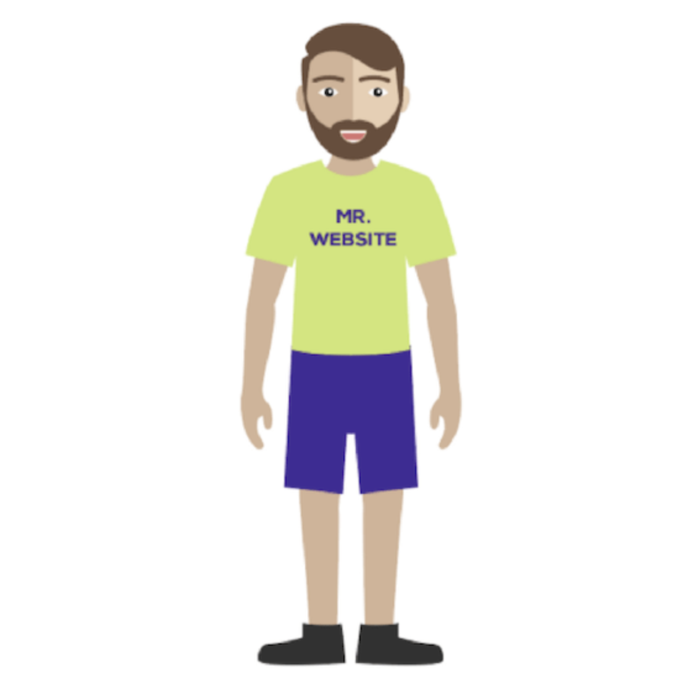
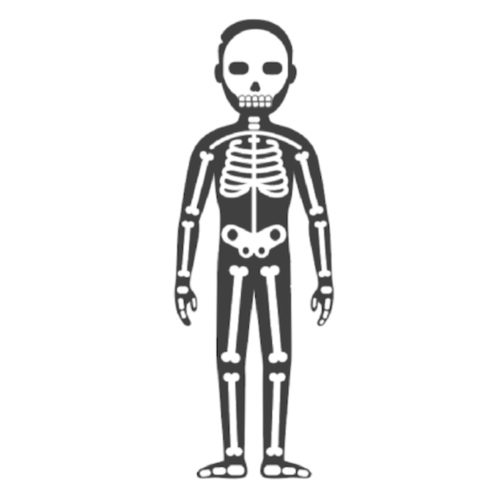
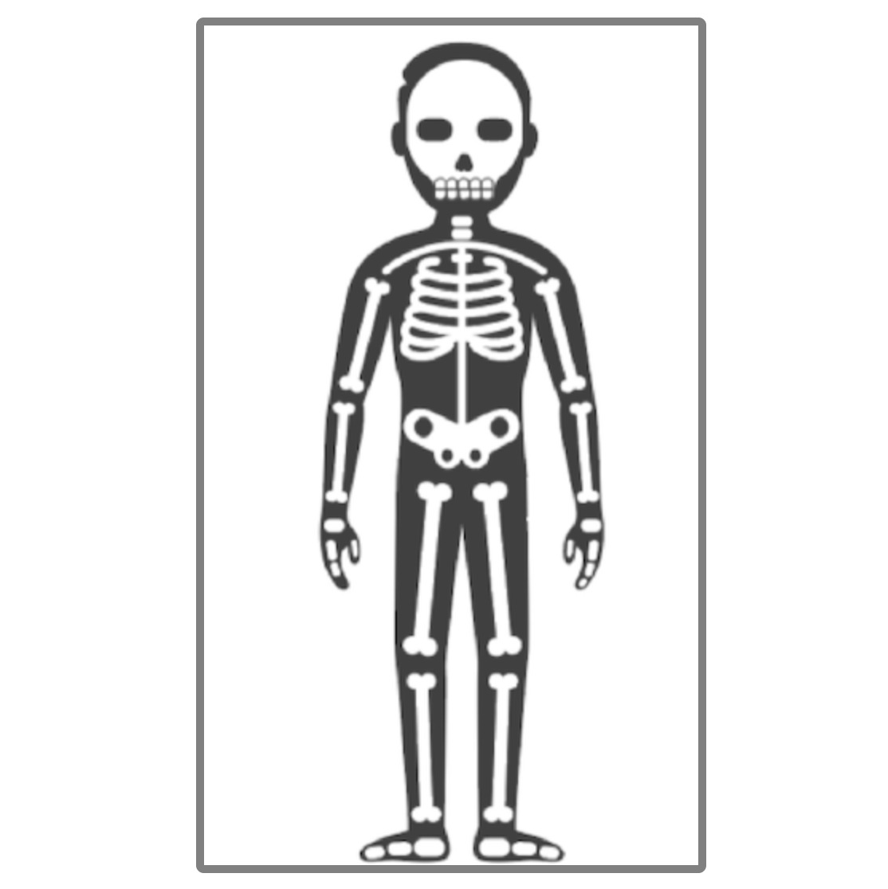
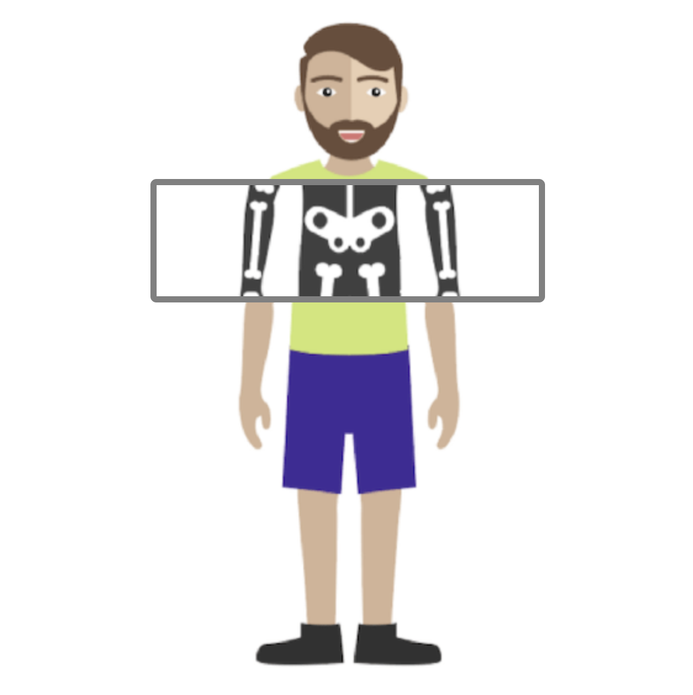
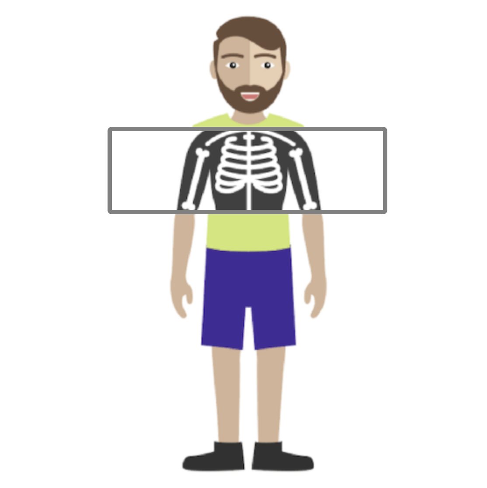
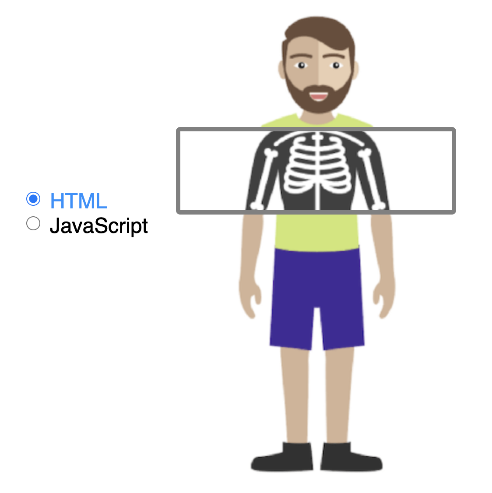
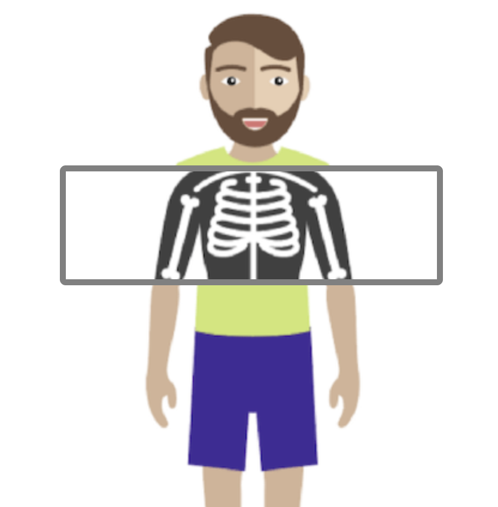

+++
title = '人体透视图'
date = 2020-10-14T17:37:49+08:00
categories = ['开发实战']
subtitle = '开发实战 第176号作品'
image = '/fe/img/thumbs/176.png'
summary = '#176 一个形象的比喻：HTML 像是人的骨架，JavaScript 像是人的大脑和神经系统，CSS 像是人的皮肤和外貌。'
+++

年初时我偶然看到了下面这张图片，近日抽时间把它们制作成了交互页面，本文记录了开发的过程。



## 效果预览

点击链接可以预览。

[https://codepen.io/comehope/pen/GRqpLGX](https://codepen.io/comehope/pen/GRqpLGX)

## 源代码下载

每日前端实战系列的全部源代码请从 github 下载：

[https://github.com/comehope/front-end-daily-challenges](https://github.com/comehope/front-end-daily-challenges)

## 代码解读

### 一、准备素材

先准备好开发用的3张图片，文件名分别为 `html.png`、`css.png`、`js.png`，html 类比于人的骨架，css 类比于人的外貌，js 类比于人的神经系统：
[https://assets.codepen.io/947795/html.png](https://assets.codepen.io/947795/html.png)
[https://assets.codepen.io/947795/css.png](https://assets.codepen.io/947795/css.png)
[https://assets.codepen.io/947795/js.png](https://assets.codepen.io/947795/js.png)

### 二、DOM 结构

容器名为 `.person`，表示一个人的外貌，它包含一个子元素 `.inside`，表示这个人被透视出的身体内部，就是骨骼、血管什么的啦。

```html
<div class="person">
    <div class="inside"></div>
</div>
```

### 三、呈现人的正常状态

令元素在页面居中显示：

```css
body {
    margin: 0;
    height: 100vh;
    display: flex;
    align-items: center;
    justify-content: center;
    overflow: hidden;
}
```

把图片 `css.png` 作为容器 `.person` 的背景图：

```css
.person {
    width: 320px;
    height: 537px;
    background-image: url(css.png);
}
```

效果如下图：


### 四、呈现人的骨骼

把图片 `html.png` 作为元素 `.person .inside` 的背景图。

```css
.person .inside {
    width: 100%;
    height: 100%;
    background-image: url(html.png);
    background-position: center;
}
```

效果如下图：


为图片加上 `5px` 的灰色边框。

```css
.person .inside {
    box-sizing: border-box;
    border: 5px solid gray;
    border-radius: 0.3em;
}
```

效果如下图：


缩小边框的高度为 `100px`，并定位在容器的中上位置，这是未来上下滑动的透视窗。

```css
.person {
    position: relative;
}

.person .inside {
    /*height: 100%;*/
    height: 100px;
    position: absolute;
    top: 25%;
}
```

效果如下图：


仔细看上图，是有错误的，透视窗处于人的胸部，但透视出的区域是人的腰部。所以需要用 `background-attachment: fixed;` 把图片锁定在固定位置。请留意，这个属性值是整个作品的核心，否则不会有透视窗滑动的效果。

```css
.person .inside {
    background-attachment: fixed;
}
```

效果如下图：


至此，静态布局完成。

### 五、透视窗滑动效果

接下来处理透视窗跟随鼠标的滑动效果。

程序入口是 `init` 函数，在其中声明2个变量 `person` 和 `inside`，分别代表它们对应的 DOM 元素。

```js
window.onload = init

function init() {
    var person = document.querySelector('.person')
    var inside = document.querySelector('.person .inside')
}
```

为 `person` 元素绑定 `mousemove` 事件，当事件被触发时，更新 `inside` 元素的 `top` 属性值，形成滑动效果。

```js
function init() {
    person.addEventListener('mousemove', function (e) {
        inside.style.top = getTopPosition(e.offsetY)
    });
}
````

`top` 的属性值通过 `getTopPosition()` 函数计算得来，其中 `offset` 值为透视窗高度的一半，意为透视窗在滑动时，鼠标指针位于透视窗的中间位置。在检测了滑动的位置没有跑到容器外面之后，返回位置，这里要加上单位 `px`。

```js
function getTopPosition(y) {
    const windowHeight = 100
    var offset = windowHeight / 2
    if(y < offset) return
    if(y > (Number.parseInt(window.getComputedStyle(person).height)) - offset) return
    return y - offset + 'px'
}
```

现在刷新页面，看到已经有滑动效果了，但是非常不流畅，这是因为子元素 `.inside` 位于容器 `.person` 之上，会先触发子元素的事件，为此，我们用 `pointer-events: none;` 禁止子元素响应鼠标事件。
另外，把鼠标指针显示为表示可移动的图标。

```css
.person {
    cursor: move;
}

.person .inside {
    pointer-events: none;
}
```

至此，本作品的核心功能开发完成了。

### 六、切换透视图

接下来增加切换透视内容的功能。

在 DOM 中增加 2 个复选框，用于选择是透视 html（人体骨骼），还是透视 js（人体神经）。

```html
<div class="selector">
    <input type="radio" name="options" value="html" id="html" checked>
    <label for="html">HTML</label>
    <input type="radio" name="options" value="js" id="js">
    <label for="js">JavaScript</label>
</div>
```

定义复选框的样式，这不是本作品的重点，用的也是普通的属性，就不作详细讲解了。

```css
.selector {
    position: absolute;
    width: 9em;
    top: calc(50% - 8em / 2);
    left: 3em;
    display: grid;
    grid-template-columns: repeat(2, 1fr);
}

.selector input {
    width: 1.2em;
    height: 1.2em;
}

.selector label {
    font-size: 1.5em;
    font-family: sans-serif;
    cursor: pointer;
}

.selector input:checked + label {
    color: dodgerblue;
}
```

效果如下图：


最后，为复选框绑定点击事件，当点击复选框时，更新 `.inside` 元素的背景图片。

```js
function init() {
    var options = document.getElementsByName('options')

    options.forEach((option) => {
        option.addEventListener('click', (e) => {
            inside.style.backgroundImage = getImageUrl(e.target.value)
        })
    })
    
    function getImageUrl(opt) {
        return 'url(' + opt + '.png' + ')'
    }
}
```

下面是透视神经图的效果：


大功告成！
