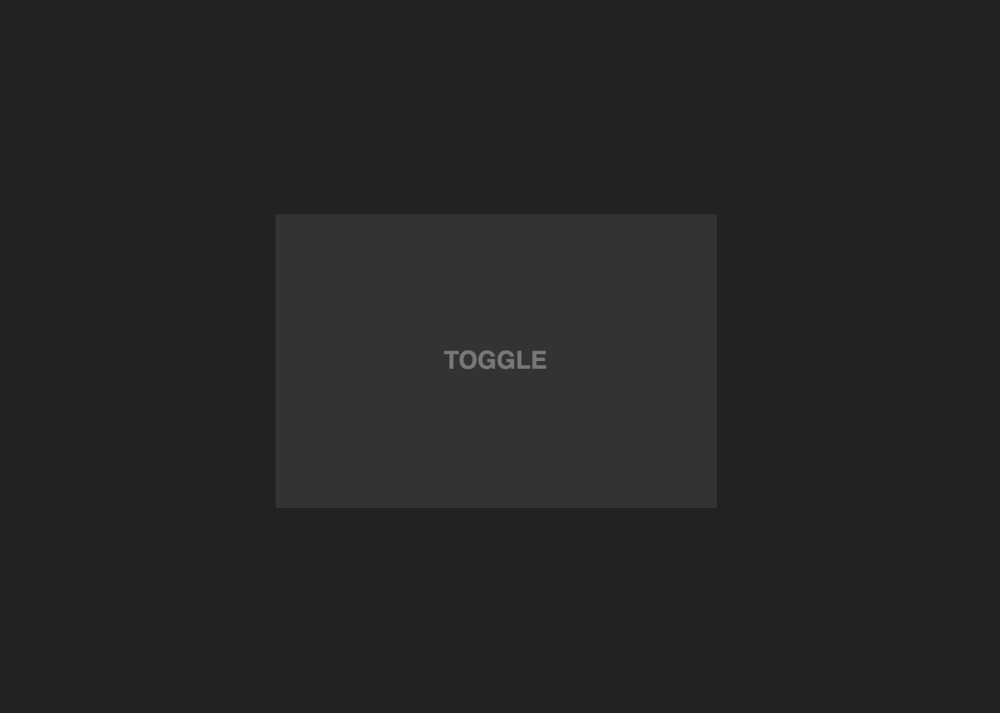

+++
title = '多张图片的鼠标悬停和滑动特效'
date = 2020-10-21T17:10:20+08:00
categories = ['开发实战']
subtitle = '开发实战 第177号作品'
image = '/test-hugo-deploy/img/thumbs/177.png'
summary = '#177'
+++


一种引起浏览者探索兴趣的方法是，页面打开之后并不马上把所有内容都呈现给用户，而是隐藏其中的一部分内容，其他内容则需要用户交互之后才展示出来。这种方式很合适那些小众的、要营造艺术氛围的网站，通过特效来展现后续内容，有一种与用户对话的感觉。本作品就是采用这样的方式，当页面加载之后先把图片遮住，然后当鼠标移动到元素之上时，图片才展现出来。

## 效果预览

点击链接可以预览。

[https://codepen.io/comehope/pen/MWejLqY](https://codepen.io/comehope/pen/MWejLqY)

## 源代码下载

每日前端实战系列的全部源代码请从 github 下载：

[https://github.com/comehope/front-end-daily-challenges](https://github.com/comehope/front-end-daily-challenges)

## 代码解读

### 一、DOM 结构
容器名为 `.container`，其中包含一个名为 `.item` 的元素。
`.item` 元素则包含 3 个子元素，`.picture` 表示图片本身，`.title` 是图片上的文字，`.mask` 是用来制作遮罩效果的元素。
作品完成时，会有多个 `.item` 元素，但此时我们先只展示 1 张图片，待效果完成之后，再增加其他图片。
```html
<div class="container">
    <div class="item">
        
        <span class="title">Toggle</span>
        <div class="mask"></div>
    </div>
</div>
```

本作品用到的4张图片可从下列地址下载。
https://assets.codepen.io/947795/mywork-toggle.png
https://assets.codepen.io/947795/mywork-signboard.png
https://assets.codepen.io/947795/mywork-brick.png
https://assets.codepen.io/947795/mywork-yin-yang.png

### 二、基础布局
设置页面背景色为深灰色，令容器居中。
```css
body {
    background-color: #222;
    margin: 0;
    height: 100vh;
    display: flex;
    align-items: center;
    justify-content: center;
}
```

设置图片尺寸，用相对单位 `em`。
```css
.item {
    width: 18em;
    height: 12em;
}

.item .picture {
    width: 100%;
}
```

效果如下图：


### 三、图片遮罩特效
因为先处理遮罩效果，所以把暂时用不到的文字隐藏起来，避免干扰。
```css
.item .title {
    display: none;
}
```

利用 `.mask` 元素为图片增加遮罩。遮罩大小是 20em * 20em 的一个大圆，背景色先暂用半透明的醒目的黄色，便于在开发过程中观察。
```css
.item {
    position: relative;
    display: flex;
    align-items: center;
    justify-content: center;
}

.item .mask {
    position: absolute;
    width: 20em;
    height: 20em;
    background-color: hsla(60, 100%, 50%, 0.7);
    border-radius: 50%;
}
```

效果如下图：


上面只是测试了遮罩的大小，把刚才的代码注释掉，改用 `box-shadow` 实现我们真正需要的遮罩效果。这个遮罩层尺寸是 `50em * 50em`，远远大于图片本身，但它的大部分区域是内阴影，在内阴影之内才透出遮罩下方的图片来。
内阴影的尺寸是 `15em`，这是内阴影的半径，所以内阴影的直径是 `30em`，用遮罩元素的宽高 `50em` 减去遮罩的 `30em`，剩下的就是 `20em`，和刚才测试的遮罩大小是一样的。

```css
.item .mask {
    /*width: 20em;*/
    /*height: 20em;*/
    /*background-color: hsla(60, 100%, 50%, 0.7);*/
    width: 50em;
    height: 50em;
    color: hsla(60, 100%, 50%, 0.7);
    box-shadow: inset 0 0 0 15em;
}
```

效果如下图：


加上鼠标悬停效果试一下。注意，这里元素上的内阴影尺寸设置为 `25em`，这是内阴影的半径尺寸，那么阴影的直径就是 `50em`，和遮罩本身的尺寸是一样大的，这表示在默认情况下，整张图片都被内阴影遮住了；而鼠标悬停时，内阴影变小，就显示出了遮罩下方的图片。另外为遮罩层增加了 `pointer-events: none` 属性，它的作用是避免遮罩层响应鼠标事件。
```css
.item .mask {
    box-shadow: inset 0 0 0 25em;
    transition: box-shadow 0.3s;
    pointer-events: none;
}

.item:hover .mask {
    box-shadow: inset 0 0 0 15em;
}
```

再下来制作鼠标滑动时遮罩跟随的效果。
先把遮罩移到图片的左上方。遮罩的高是 `50em`，`top: -25em` 就是令遮罩的水平中线与图片顶边对齐；同理，`left: -25em` 则是令遮罩的垂直中线与图片的左边对齐，两者叠加，就是遮罩的中心与图片的左上角对齐。
```css
.item .mask {
    top: -25em;
    left: -25em;
}
```

增加脚本，为 `.item` 元素绑定 `mousemove` 事件，令鼠标在 `.item` 元素上滑动时，带动 `.mask` 元素滑动。
```js
window.onload = init

function init() {
    let items = document.querySelectorAll('.item')
    items.forEach((item) => {
        item.addEventListener('mousemove', e => {
            let mask = item.querySelector('.mask')
            mask.style.transform = 'translate(' + e.offsetX + 'px, ' + e.offsetY + 'px)'
        })
    })
}
```

至此，主要的效果已经完成了，接下来再增强一下效果。
稍加大图片的原始尺寸，在鼠标悬停时恢复图片大小，这样的效果是在鼠标进入图片区域时，图片能“扭曲抖动”一下，加强互动的效果。
```css
.item .picture {
    transform: scale(1.1);
    transition: 0.3s;
}

.item:hover .picture {
    transform: scale(1);
}
```

鼠标悬停和滑动效果完成，下面这几行代码是一些收尾工作。
通过 `overflow: hidden` 属性隐藏掉图片之外的部分、容器加一点圆角、遮罩的颜色改用不透明的灰色。
```css
.container {
    border-radius: 0.3em;
}

.item {
    overflow: hidden;
}

.item .mask {
    /*color: hsla(60, 100%, 50%, 0.7);*/
    color: #333;
}
```

效果如下图：


### 四、文字布局和特效
接下来处理文字。
先把文字显示出来，除了注释掉 `display: none` 之外，还要设置它的 `z-index`，令它显示在遮罩层的上方，再有也要取消它的鼠标事件，防止它影响鼠标滑动效果。
```css
.item .title {
    /*display: none;*/
    position: absolute;
    color: #777;
    z-index: 1;
    pointer-events: none;
}
```

设置文字样式。
```css
.item .title {
    font-family: sans-serif;
    font-weight: bold;
    text-transform: uppercase;
}
```

增加文字特效，当鼠标滑入图片时，隐藏文字。
```css
.item .title {
    transition: 0.2s;
}

.item:hover .title {
    opacity: 0;
}
```

效果如下图：


至此，单图图片的效果都完成了。

### 五、将特效应用到多张图片
增加多个 `.item` 元素。
```html
<div class="container">
    <div class="item">
        
        <span class="title">Toggle</span>
        <div class="mask"></div>
    </div>
    <!-- 此处再增加3个 .item 元素，代码略 -->
</div>
```

用 `grid` 布局把图片排列成田字格形状。
```css
.container {
    display: grid;
    grid-template-columns: repeat(2, 1fr);
    grid-gap: 1em;
}
```

效果如下图：


大功告成！
