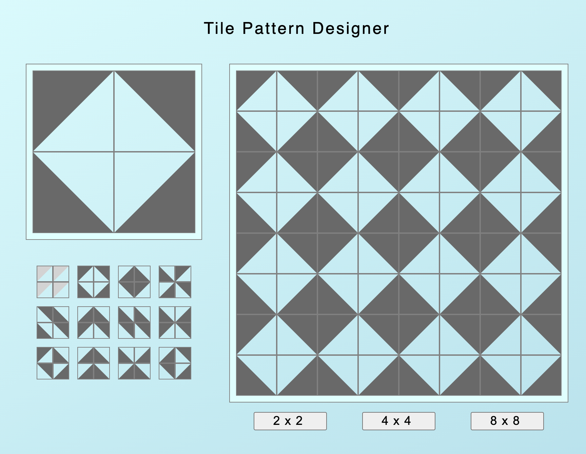
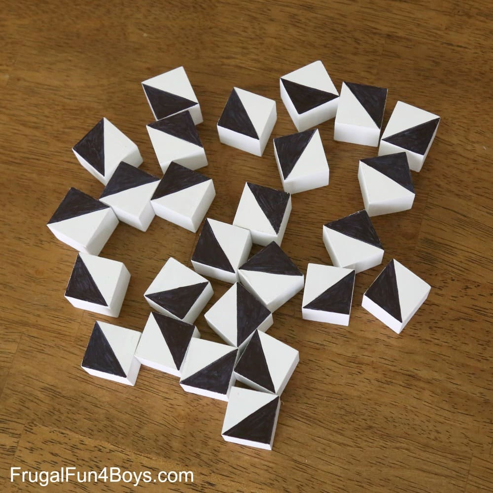
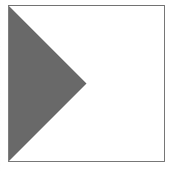
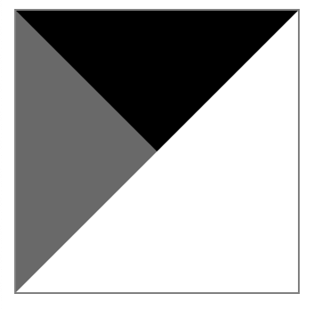
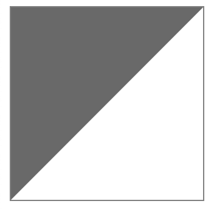
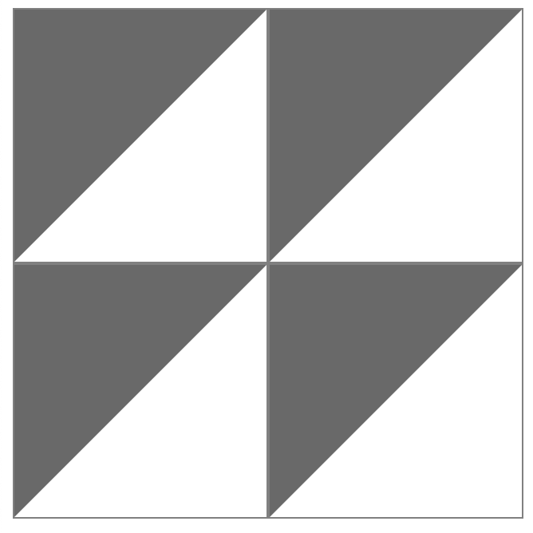
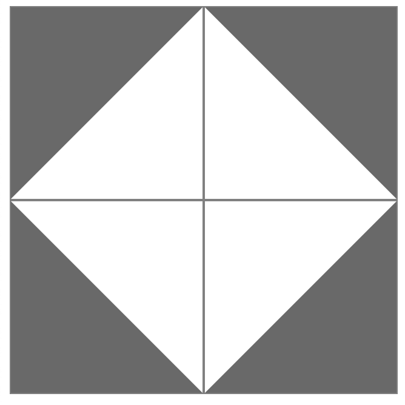
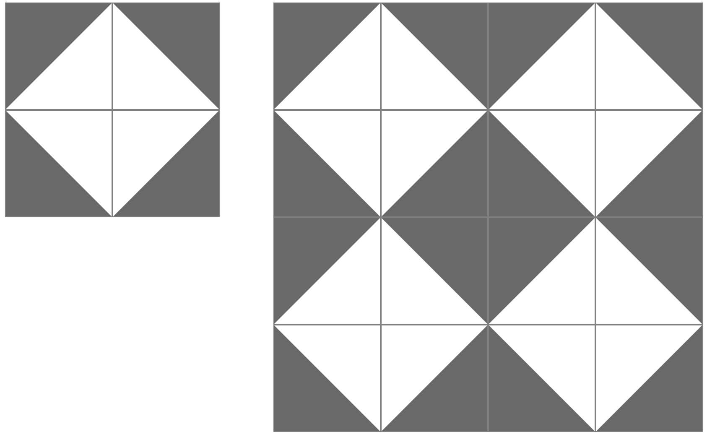
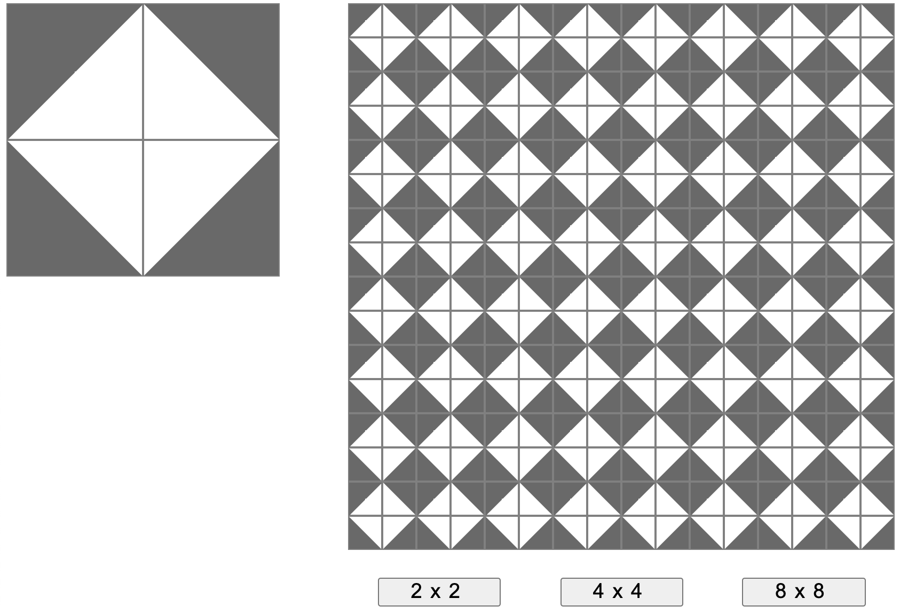
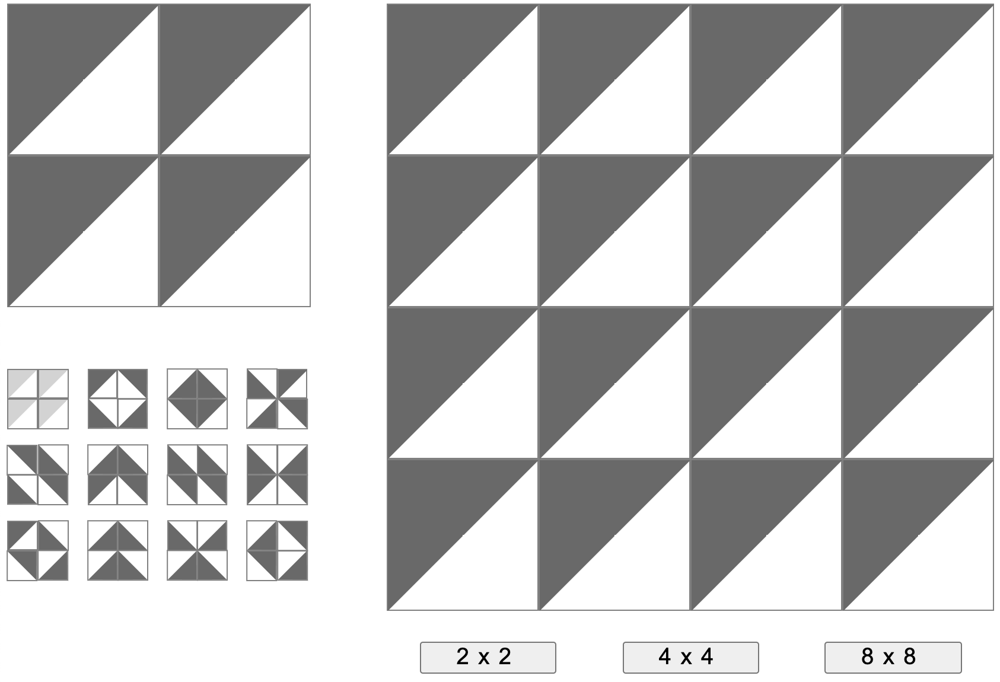

+++
title = '地砖图案设计器'
date = 2021-08-05T17:01:50+08:00
categories = ['开发实战']
subtitle = '开发实战 第178号作品'
image = '/fe/img/thumbs/178.png'
summary = '#178'
+++



## 效果预览

点击链接可以全屏预览。

[https://codepen.io/comehope/pen/QWvVBJq](https://codepen.io/comehope/pen/QWvVBJq)

## 源代码下载

每日前端实战系列的全部源代码请从 github 下载：

[https://github.com/comehope/front-end-daily-challenges](https://github.com/comehope/front-end-daily-challenges)

## 代码解读

### 功能和概念

这个项目的起源是我看到[一个网页](https://frugalfun4boys.com/pattern-building-blocks-stem-activity/)介绍把小方块涂上颜色拼成图案，正好我家里也有一些这样的小立方块，于是也拿来涂了色拼出了各种花样，在玩儿的过程中我产生了做一个设计器的想法。



设计器包括4个功能：
1. 自定义图案：在页面左侧上部；
2. 预览图案的平铺效果：在页面右侧；
3. 提供3种供预览的网格尺寸：在页面右侧下部；
4. 提供12种预设的图案：在页面左侧下部。

后面会提到一些业务概念，它们也是程序里的变量名：
地砖：tile。左上角地砖称为样品地砖。
地砖的四分之一：block。一块地砖由4个 block 组成，每个 block 的图案是1个内含三角形的小正方形。
网格状地板：floor。地板上铺满了地砖，地板尺寸有3种：2x2、4x4、8x8。
预设图案：pattern。每个预设图案就是一块地砖。

接下来就依次实现设计器的4个功能。

### 第1个功能：自定义图案
定义 dom 结构如下：

```html
<main>
    <div class="sample">
        <div class="tile">
            <div class="block"></div>
        </div>
    </div>
</main>
```

程序的所有元素都被包含在 `<main>` 元素里，`<main>` 元素会随着功能的扩充不断丰富。现在它里面有一个表示“样品区”的 `.sample` 子元素，其中再包含一个表示地砖的 `.tile` 元素。`.tile` 元素里面本应包含4个 `.block` 元素，不急，先用1个 `.block` 做做实验。

用 CSS 的伪元素在 `.block` 里画一个三角形：

```css
.tile .block {
    width: 10em;
    height: 10em;
    border: 1px solid grey;
    box-sizing: border-box;
    color: dimgray;
    position: relative;
}

.tile .block::before {
    content: '';
    position: absolute;
    border-width: calc(5em - 1px);
    border-style: solid;
    border-color: transparent;
    border-left-color: currentColor;
}
```

效果如下图：


这个三角形占据了正方形 `.blcok` 的四分之一空间，它是我们需要的三角形的一半。

接下来再画另一个三角形，为了和前一个三角形区别开，把它填充成黑色：
```css
.tile .block::before {
    border-top-color: black;
}
```

效果如下图：


两个小三角形拼成了一个大三角形。
为什么不直接画一个大三角形呢？因为 CSS 画直角三角形的方法，是以正方形的某一条边作为斜边，然后指定三角形的高，如果直接画大三角形，那就要先构造一个大正方形，这个大正方形的边长需是小正方形边长的根号2倍，画一个大三角形比画2个小三角形还要复杂呢。
每个小三角形的高理论上应该是边长的一半 `5em`，这里取 `5em-1px`，是因为 `box-sizing: border-box` 属性导致边框向容器内侵占了 `1px`。

随手重构一下，`::before` 伪元素的最后三行有关边框颜色的代码可以合并写成一行：
```css
.tile .block::before {
    /*border-color: transparent;
    border-left-color: currentColor;
    border-top-color: black;*/
    border-color: currentColor transparent transparent currentColor;
}
```

以上代码没有在伪元素的 `border-color` 属性中指定明确色值，使用的是 `currentColor`，这样就可以由主元素来控制颜色，便于后续修改地砖的颜色。
重构后效果如下图：



经过上面的实验，已经成功在一个 `.block` 里画出了三角形，现在把 `.tile` 的子元素增加到4个 `.block`：

```html
<main>
    <div class="sample">
        <div class="tile">
            <div class="block"></div>
            <div class="block"></div>
            <div class="block"></div>
            <div class="block"></div>
        </div>
    </div>
</main>
```

将4个 `.block` 组成一个田字格形状：
```css
.tile {
    width: 20em;
    display: grid;
    grid-template-columns: repeat(2, 1fr);
}

.sample > .tile .block {
    cursor: pointer;
}
```

效果如下图：



至此，一块地砖的布局已完成，接下来，要解决如何控制每个 `.block` 的问题。先定义 4 个 CSS 变量：

```css
:root {
    --block-angle-1: 0;
    --block-angle-2: 0;
    --block-angle-3: 0;
    --block-angle-4: 0;
}
```

这些变量用来表示 4 个 `.block` 中三角形顶点的位置，0 表示顶点在左上，90 表示顶点在右上，180 表示顶点在右下，270 表示顶点在左下。

把这 4 个变量分配给 4 个 `.block`，应用到 `transform: rotate()` 属性中，0/90/180/270 指的就是 `.block` 元素的旋转角度：

```css
.tile .block:nth-child(1) {transform: rotate(calc(var(--block-angle-1) * 1deg));}
.tile .block:nth-child(2) {transform: rotate(calc(var(--block-angle-2) * 1deg));}
.tile .block:nth-child(3) {transform: rotate(calc(var(--block-angle-3) * 1deg));}
.tile .block:nth-child(4) {transform: rotate(calc(var(--block-angle-4) * 1deg));}
```

现在，试一试修改这4个 CSS 变量值，地砖图案会跟着被调整。

接下来写 js 代码，实现通过点击来调整地砖图案的效果。

先定义一个 `dom` 变量，用于引用 dom 元素，`dom.root` 是指 CSS 的 `:root` 元素，`dom.sampleTile` 就是我们刚刚创建的样品地砖：
```js
const $ = (selector) => document.querySelector(selector)
let dom = {
    root: document.documentElement,
    sampleTile: $('.sample > .tile'),
}
```

在页面加载完成后调用一个初始化函数 `init()`，在其中完成对事件的绑定：

```js
window.onload = init()

function init() {
    initEvent()
}
```

`initEvent()` 函数将遍历样品地砖的每一个 `.block`，令其在被点击时执行 `rotateBlcok()` 函数，传入该函数的参数分别是1、2、3、4，是4个 `.block` 元素的序号。`rotateBlock()` 函数读取该 `.block` 对应的 CSS 变量，得到它的旋转角度，然后加上 90，意即让这个 `.block` 旋转 90 度：

```js
function initEvent() {
    Array.from(dom.sampleTile.children).forEach((block, i) => {
        block.addEventListener('click', () => {
            rotateBlock(i + 1)
        })
    })
}

function getCssVariableName(sequenceNumberOfBlcok) {
    return `--block-angle-${sequenceNumberOfBlcok}`
}

function rotateBlock(num) {
    let angle = +dom.root.style.getPropertyValue(getCssVariableName(num)) + 90
    setBlockAngle(num, angle)
}

function setBlockAngle(num, angle) {
    dom.root.style.setProperty(getCssVariableName(num), angle)
}
```

另外 2 个函数 `getCssVariableName()` 和 `setBlockAngle()` 不用解释，看名字就知道是什么意思了。这种简短的、甚至只有一条语句的细粒度函数，能让代码更加语义化，让阅读代码更流畅。

现在试一试，每点击一下任意一个 `.block`，它就会旋转90度。

这是一个经过设计的地砖图案：



为了加强动感，再给 `.block` 加一个过渡动画：

```css
.tile .block {
    transition: 0.2s;
}
```

### 第2个功能：平铺

接下来实现第2个功能，在地板上平铺地砖。

先扩充 dom，为 `<main>` 元素增加一个表示成品的 `.production` 元素，其中包含一个表示地板的子元素 `.floor`：

```html
<main>
    <div class="sample">
        <div class="tile">
            <div class="block"></div>
            <div class="block"></div>
            <div class="block"></div>
            <div class="block"></div>
        </div>
    </div>
    <div class="production">
        <div class="floor"></div>
    </div>
</main>
```

`.floor` 里面应该包含多个地砖元素，这些元素将通过程序自动创建。

扩充一下 `dom` 变量，增加对 `.floor` 的引用：

```js
let dom = {
    root: document.documentElement,
    sampleTile: $('.sample > .tile'),
    floor: $('.production .floor'),
}
```

再扩充一下初始化函数 `init()`，在其中调用 `initFloor()`：

```js
function init() {
    initEvent()
    initFloor()
}
```

`initFloor()` 函数再调用 `paveTiles` 函数，传入的参数表示地板网格每边的地砖数量，作为实验，传入数字 `2`，表示要填充一个 2x2 网格的地板。`paveTiles()` 函数实现在 `.floor` 中插入若干 `.tile` 元素的操作。`node.cloneNode(true)` 用于得到 `node` 元素的深拷贝，以便复制它所有的子元素。

```js
function initFloor() {
    paveTiles(2)
}

function paveTiles(countOfPerSide) {
    let count = Math.pow(countOfPerSide, 2)
    dom.floor.innerHTML = ''
    new Array(count).fill('').forEach(() => {
        dom.floor.append(dom.sampleTile.cloneNode(true))
    })
}
```

现在运行一下程序，能看到确实多了很多地砖，但它们都和样品地砖竖向排在一起。没关系，用 CSS 调整一下布局。

先把 `<main>` 元素整体设置为左右结构布局：
```css
main {
    display: flex;
    justify-content: space-between;
    width: 65em;
}

.sample {width: 20em;}
.production {width: 40em;}
```

然后把地板排列成网格状：
```css
.production .floor {
    --count-of-per-side: 2;
    display: grid;
    grid-template-columns: repeat(var(--count-of-per-side), 1fr);
    font-size: calc(2em / var(--count-of-per-side));
}
```

在这段 CSS 代码中，又定义了一个变量 `--count-of-per-side`，它和 `paveTile()` 函数的参数是同样的含义，都表示地板网格每边的地砖数量，而且值也保持一致，目前都是 2。注意这段代码中的 `font-size` 属性，它会根据每网格大小来调整，网格越密，字体就越小，以便在同样大小的容器内可以显示不同密度的网格。

现在试试调整左侧的样品地砖的图案，能看到右侧地板的所有地砖也跟着整齐划一地跟着变化。

效果如下图：



### 第3个功能：切换地板网格

接下来实现第3个功能，调整地板网格的尺寸。

先扩充 dom，在 `.production` 元素中增加 `grid-list` 元素，其中包含 3 个按钮，分别用于把地板网格切换为 2x2、4x4、8x8 的尺寸：

```html
<main>
    <div class="sample">
        <div class="tile">
            <div class="block"></div>
            <div class="block"></div>
            <div class="block"></div>
            <div class="block"></div>
        </div>
    </div>
    <div class="production">
        <div class="floor"></div>
        <div class="grid-list">
            <button>2x2</button>
            <button>4x4</button>
            <button>8x8</button>
        </div>
    </div>
</main>
```

调整一下这 3 个按钮的布局，让它们均匀地排列在地板下方：

```css
.production .grid-list {
    display: flex;
    justify-content: space-around;
    margin-top: 2em;
}

.production .grid-list button {
    font-size: 1.5em;
    width: 6em;
    letter-spacing: 0.4em;
    cursor: pointer;
}
```

接下来修改程序，让这 3 个按钮生效。
先扩充一下 `dom` 变量，增加一个表示切换按钮区 `dom.gridList` 的引用：

```js
let dom = {
    root: document.documentElement,
    sampleTile: $('.sample > .tile'),
    floor: $('.production .floor'),
    gridList: $('.production .grid-list'),
}
```

再扩充 `initEvent()` 函数，为按钮绑定点击事件，当按钮被点击时，调用 `paveTiles()` 函数重铺地板：

```js
function initEvent() {
    Array.from(dom.sampleTile.children).forEach((block, i) => {
        block.addEventListener('click', () => {
            rotateBlock(i + 1)
        })
    })

    Array.from(dom.gridList.children).forEach(button => {
        button.addEventListener('click', (e) => {
            paveTiles(parseInt(e.target.innerText))
        })
    })
}
```

现在刷新一下页面，发现点击 3 个按钮之后发出地板中的地砖确实增加了，但是地板容纳不下那么多地砖，只好向下排列。这是因为在前面的 CSS 代码中，`--count-of-per-side` 变量被赋值为 2，所以需要在 `paveTiles()` 函数中更新它，使网格密度随着按钮自动调整： 

```js
function paveTiles(countOfPerSide) {
    let count = Math.pow(countOfPerSide, 2)
    dom.floor.innerHTML = ''
    new Array(count).fill('').forEach(() => {
        dom.floor.append(dom.sampleTile.cloneNode(true))
    })

    dom.floor.style.setProperty('--count-of-per-side', countOfPerSide)
}
```

至此，切换地板网格的功能就完成了。

效果如下图：


回想一下之前写的 `initFloor()` 函数中有一条语句 `paveTiles(2)`，这里硬编码了一个数字 2，现在应该把它重构成读取第 1 个按钮的数值，避免使用魔法数字：

```js
function initFloor() {
    paveTiles(parseInt(dom.gridList.children[0].innerText))
}
```

### 第4个功能：预设图案

接下来开发第4个功能，展示若干预设图案供选择。

先扩充 dom，在 `.sample` 元素中增加 `.pattern-list` 元素：

```html
<main>
    <div class="sample">
        <div class="tile">
            <div class="block"></div>
            <div class="block"></div>
            <div class="block"></div>
            <div class="block"></div>
        </div>
        <div class="pattern-list"></div>
    </div>
    <div class="production">
        <div class="floor"></div>
        <div class="grid-list">
            <button>2x2</button>
            <button>4x4</button>
            <button>8x8</button>
        </div>
    </div>
</main>
```

`.pattern-list` 和前面的 `.grid-list` 类似，dom 中只定义了一个容器，其中的子元素都要由程序生成。

先定义一组预设图案数据，每个预设图案是一个含有4个数值的数组，存储着地砖的4个 block 的角度：

```js
let patterns = [
    [0, 0, 0, 0],
    [0, 90, 270, 180],
    [180, 270, 90, 0],
    [270, 0, 180, 90],
    [90, 270, 270, 90],
    [180, 270, 0, 90],
    [270, 270, 90, 90],
    [270, 180, 0, 90],
    [0, 270, 90, 180],
    [180, 270, 180, 270],
    [270, 180, 180, 270],
    [180, 90, 90, 180],
]
```

扩充 `dom` 变量，增加一个表示预设图案列表的引用 `dom.patternList`：

```js
let dom = {
    root: document.documentElement,
    sampleTile: $('.sample > .tile'),
    floor: $('.production .floor'),
    gridList: $('.production .grid-list'),
    patternList: $('.sample .pattern-list'),
}
```

初始化函数 `init()` 中增加一行语句，用于调用初始化预设图案列表的函数 `initPatternList()`：

```js
function init() {
    initEvent()
    initFloor()
    initPatternList()
}
```

`initPatternList()` 函数是为 `.pattern-list` 元素填
充子元素的具体实现。和 `paveTiles()` 函数类似，子元素也是对样品地砖进行了多次复制。在复制时，还把变量 `patterns` 的数据写到了新生成的地砖上：

```js
function initPatternList() {
    patterns.forEach((pattern) => {
        let $newTile = dom.sampleTile.cloneNode(true)
        Array.from($newTile.children).forEach((block, i) => {
            let property = `--block-angle-${i + 1}`
            block.style.setProperty(property, pattern[i])
        })
        dom.patternList.append($newTile)
    })
}
```

现在刷新一下页面，可以看到预设图案已经显示到页面左侧了，但是和样品地砖混在一起，所以要调整一下布局，让预设图案以缩略图的形式排列在样品地砖的下方。使预设图案缩小的方法和使地板上地砖缩小的方法一样，都是通过调整 `font-size` 属性实现的：

```css
.sample > .tile {
    margin-bottom: 4em;
}

.sample .pattern-list {
    font-size: 0.2em;
    display: grid;
    grid-template-columns: repeat(4, 1fr);
    gap: 5em;
}

.sample .pattern-list .tile {
    cursor: pointer;
}
```

再把第1个预设图案的颜色设置得浅一些，因为这个图案是默认的未经设计的图案，所以让它和其他预设图案有所区别：

```css
.sample .pattern-list .tile:first-child .block {
    color: lightgrey;
}
```

现在再刷新一下页面，看到效果如下图：



接下来为预设图案增加点击效果。
扩充 `initEvent()` 函数，为 `dom.patternList` 的子元素绑定点击事件，令点击任意一个预设图案时，把预设图案的角度数据复制到 `:root` 元素的同名变量中，这样就可以把预设图案应用到样品地砖和地板上：

```js
function initEvent() {
    Array.from(dom.sampleTile.children).forEach((block, i) => {
        block.addEventListener('click', () => {
            rotateBlock(i + 1)
        })
    })

    Array.from(dom.gridList.children).forEach(button => {
        button.addEventListener('click', (e) => {
            paveTiles(parseInt(e.target.innerText))
        })
    })

    Array.from(dom.patternList.children).forEach((tile, i) => {
        tile.addEventListener('click', () => {
            patterns[i].forEach((angle, j) => setBlockAngle(j + 1, angle))
        })
    })
}
```

还要调整一下初始化函数 `init()` 中语句的执行顺序，先渲染元素、再为元素绑定事件：

```js
function init() {
    initFloor()
    initPatternList()
    initEvent()
}
```

现在刷新一下页面，试试点击预设图案，点击事件已经生效了。

至此，全部功能开发完成。

### 界面美化

最后，美化一下界面。

先在 dom 中增加一个 `<h1>` 元素，写上标题：

```html
<h1>Tile Pattern Designer</h1>
<main>
<!-- 略 -->
</main>
```

设置页面整体样式，包括背景色、字体字号、居中对齐：

```css
body {
    margin: 0 auto;
    height: 100vh;
    display: flex;
    flex-direction: column;
    align-items: center;
    font-size: 0.75em;
    font-family: sans-serif;
    background: linear-gradient(to right bottom, lightcyan, lightblue);
}

h1 {
    font-weight: normal;
    margin: 2em;
    letter-spacing: 0.1em;
}
```

为样品图案和地板增加一个外边框，强调它们是独立的整体：

```css
.sample > .tile,
.production .floor {
    box-shadow: 
        0 0 0 9px lightcyan,
        0 0 0 10px grey;
}
```

效果如下图：


大功告成！

