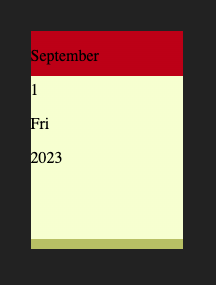

+++
title = '撕日历交互特效'
date = 2023-09-07T16:32:24+08:00
categories = ['开发实战']
subtitle = '开发实战 第179号作品'
image = '/fe/img/thumbs/179.png'
summary = '#179'
+++


## 效果预览

点击链接可以预览。

[https://codepen.io/comehope/pen/qBLRbBM](https://codepen.io/comehope/pen/qBLRbBM)

## 源代码下载

每日前端实战系列的全部源代码请从 github 下载：

[https://github.com/comehope/front-end-daily-challenges](https://github.com/comehope/front-end-daily-challenges)

## 代码解读

这个撕日历的项目虽然代码量不大，但里面有一些精妙的技巧，值得我们学习。

整个作品我们分成三个步骤开发，先进行静态布局，然后实现动态更换日历页，最后加入动画效果。

### 一、静态布局

DOM 结构是一个 `.calendar` 容器，其中包含一个表示日历页的 `.page` 元素，`.page` 里包括表示月份的 `.month` 元素，表示日期的 `.day` 元素，表示星期的 `.day-name` 元素，表示年的 `.year` 元素。

回想一下生活中的日历，一本日历是包含很多日历页的，在这里也是同样的，后面你会看到，当撕掉一个 `.page` 元素之后，就会增加一个新的 `.page` 元素。现在我们只处理布局，所以暂时 DOM 中只排版一页就够了：

```html
<div class="calendar">
    <div class="page">
        <p class="month">November</p>
        <p class="day">1</p>
        <p class="day-name">Monday</p>
        <p class="year">2021</p>
    </div>
</div>
```

设置 `body` 的子元素，也就是 `.calendar` 元素居中，同时设置深色背景：

```css
body {
    margin: 0;
    height: 100vh;
    display: flex;
    align-items: center;
    justify-content: center;
    background-color: #222;
}
```

画出日历的轮廓，用 `background-image` 的线性渐变函数，把 `.calendar` 容器分成上、中、下三部分，上部分是砖红色的日历顶部，中部是浅黄色的日历页，下部是深卡其色的日历底部：

```css
.calendar {
    width: 152px;
    height: 218px;
    background-image: 
        linear-gradient(
            firebrick 0,
            firebrick 45px,
            lightgoldenrodyellow 45px,
            lightgoldenrodyellow 208px,
            darkkhaki 208px,
            darkkhaki 218px
        );
    position: relative;
}
```

当前效果如下图所示：



然后，再用 `::before` 伪元素画2个圆点，作为日历顶部的2个铆钉。

```css
.calendar::before {
    content: '';
    position: absolute;
    height: 45px;
    width: 100%;
    background-color: firebrick;
    background-image: 
        radial-gradient(circle at 40px 20px, orange 5px, transparent 5px),
        radial-gradient(circle at 110px 20px, orange 5px, transparent 5px);
    z-index: 3;
}
```

当前效果如下图所示：


接下来布局文字：

```css
.page {
    margin-top: 45px;
    width: 100%;
    height: 163px;
    box-sizing: border-box;
    padding: 16px 0 10px 0;
    display: flex;
    flex-direction: column;
    justify-content: space-between;
    position: absolute;
    background-color: lightgoldenrodyellow;
}

.page p {
    color: darkslategray;
    margin: 0;
    line-height: 1em;
    text-align: center;
    text-transform: uppercase;
    letter-spacing: 1px;
    pointer-events: none;
    user-select: none;
}

.page p.month,
.page p.day-name {
    font-weight: bold;
    font-size: 1.1em;
}

.page p.day {
    font-weight: bold;
    font-size: 4em;
    margin-bottom: 10px;
}
```

整个日历的静态视觉效果已经完成了，如下图所示：


接下来研究如何绘制出撕纸时的锯齿效果。再回想一下实际生活中的日历，当撕日历时，日历页是从顶部的2颗铆钉下面被撕去的，所以锯齿的位置大约在日历顶部与中部结合的位置，但而且为了美观，要把锯齿隐藏在顶部下面，那为了绘制锯齿，就要先把日历顶部隐藏起来。

```css
.calendar::before {
    display: none;
}
```

锯齿绘制在伪元素 `.page::before` 中。锯齿是用 `background-image` 的线性渐变函数绘制的，原理是在 10px * 10px 的区域内用2个倾斜45度的三角组合成一个“齿”，在元素上平铺的多个“齿”相连就形成了锯齿效果。另外还有1个细节，用 `filter: drop-shadow()` 函数给锯齿加了阴影，使它更逼真。代码如下：

```css
.page::before {
    content: '';
    width: 100%;
    height: 10px;
    position: absolute;
    top: -5px;
    background-image: 
        linear-gradient(-45deg, lightgoldenrodyellow 50%, transparent 50%),
        linear-gradient(45deg, lightgoldenrodyellow 50%, transparent 50%);
    background-repeat: repeat-x;
    background-size: 10px 10px;
    filter: drop-shadow(0 -5px 1px rgba(0, 0, 0, 0.1));
    z-index: 2;
}
```

效果如下图所示：


别忘了再把刚才隐藏的日历顶部再显示出来，遮盖住锯齿。

```css
.calendar::before {
    display: block;
}
```

注意前面代码中使用的 `z-index` 属性，通过它设置锯齿的图层在日历顶部之下。这里使用了值 `2` 和 `3`，而值 `1` 提前预留给日历页 `.page` 使用，后面实现动画时会细说。

```css
.calendar::before {
    z-index: 3;
}

.page::before {
    z-index: 2;
}
```

至此，静态布局完成，接下来处理动态数据。

### 二、动态数据

JavaScript 原生的 `Date` 对象不易用，所以我们引入第三方的 `dayjs` 库，方便接下来做日期运算。

```html
<script src="https://cdnjs.cloudflare.com/ajax/libs/dayjs/1.11.9/dayjs.min.js"></script>
```

接下来写 JavaScript 代码。

定义变量 `calendar` 和 `date`，`calendar` 是对 DOM 元素 `.calendar` 的引用，`date` 存储日历上的当前日期。

创建页面初始化函数 `init()`，对 `calendar` 和 `date` 函数进行初始化，先清空 `calendar` 元素，再调用 `addPage()` 函数动态添加一个 `.page` 元素：

```js
let calendar, date;

function addPage(d) {
    //todo
}

function init() {
    calendar = document.querySelector('.calendar')
    calendar.innerHTML = ''
    date = dayjs()
    addPage(date)
}

window.onload = init
```

`addPage()` 函数的实现如下，注意，我们为 `.page` 增加了一个 `click` 事件的监听器，监听函数是 `tear()`，当点击时会把这张日历页撕下：

```js
function addPage(d) {
    let newPage = document.createElement('div')
    newPage.classList.add('page')
    newPage.innerHTML = `
        <p class="month">${d.format('MMMM')}</p>
        <p class="day">${d.format('D')}</p>
        <p class="day-name">${d.format('dddd')}</p>
        <p class="year">${d.format('YYYY')}</p>
    `
    newPage.addEventListener('click', tear)
    calendar.appendChild(newPage)
}

function tear(e) {
    //todo
}
```

`tear()` 函数的实现如下，它把当前日历页从 `.calendar` 容器中删除掉，
然后再添加一个新的 `.page` 元素：

```js
function tear(e) {
    let page = e.target
    calendar.removeChild(page)
    date = date.add(1, 'day')
    addPage(date);
}
```

至此，完成了点击更换日历页的功能。
此时，点击日历页时，当前的日历页会消失，替换为第二天的日历页。

### 三、动画效果

终于到最后制作动画效果了，这是本项目最复杂的地方。

我们把动画代码写在 `.page` 元素的 `tear` 类里面。首先看动画关键帧的代码，定义了3组关键帧：`tear-down` 用于使日历页向下方移动 `200px`，`tear-fade` 用于使日历页渐隐消失，`tear-shake` 模拟日历页被撕下时的稍稍倾斜。动画总时长1秒钟。

```css
.page.tear {
    position: absolute;
    z-index: 1;
    pointer-events: none;
    transform-origin: top left;
    animation: 1s linear forwards;
    animation-name: tear-down, tear-fade, tear-shake;
}

@keyframes tear-down {
    from, 20% {top: 0;}
    to {top: 200px;}
}

@keyframes tear-fade {
    from, 70% {filter: opacity(1);}
    to {filter: opacity(0);}
}

@keyframes tear-shake {
    from, to {transform: rotate(0deg);}
    20% {transform: rotate(10deg);}
}
```

然后，修改 JavaScript 的 `tear()` 函数，在删除当前日历页之前，先为当前日历页增加 `.tear` 的 CSS 属性，使它运行动画效果。同时，要在动画结束之后再删除日历页，所以定义一个 `waitMoment()` 函数，它是一个 Promise ，使删除操作延迟1秒执行。

```js
function tear(e) {
    let page = e.target
    page.classList.add('tear')
    waitMoment().then(() => {
        calendar.removeChild(page)
    })
    date = date.add(1, 'day')
    addPage(date);
}

function waitMoment() {
    const interval = 1000
    return new Promise(function(resolve, reject) {
        setTimeout(resolve, interval);
    })
}
```

至此，动画效果制作完成，效果如下图所示：


大功告成！

